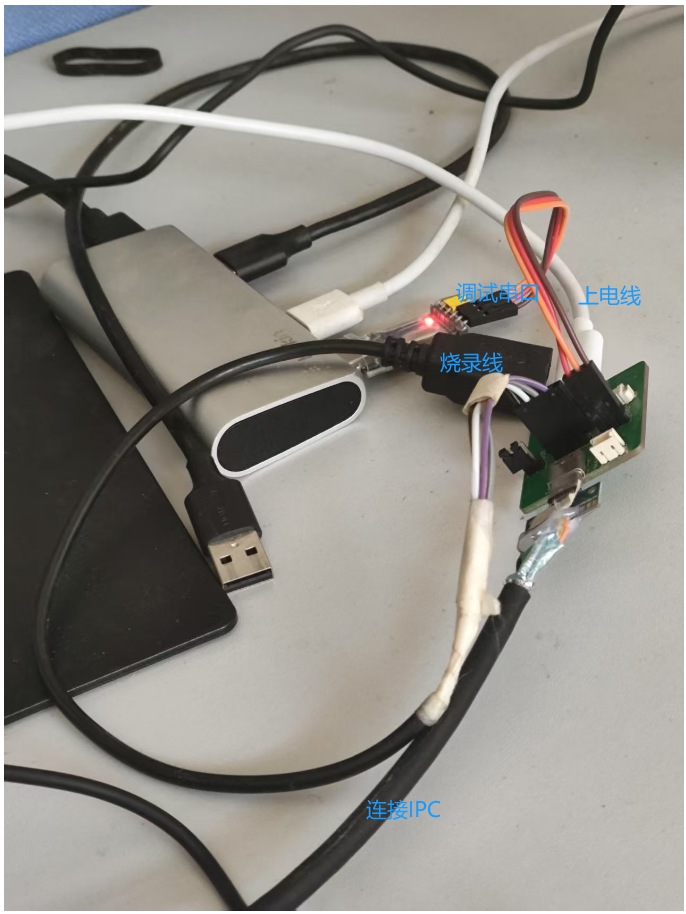

# 一、烧录固件步骤与实物图

> [!PDF|important] [[君正T23N芯片开发/【君正T23N_IPC】/BSP驱动开发/assets/USB烧录/file-20250810171420338.pdf#page=1&selection=17,0,18,4&color=important|样机调试板接线说明-20241220, p.1]]
> >  烧录固件
> 
> 

> [!烧录固件步骤]
> 烧录固件时
>        需要在上电前，使用跳线帽短接 BOOT 引脚；然后打开烧录程序，点击“开始”；对设备进行上电后，尽快把 USB 线插入电脑；等待 1s~10s 不等的时间，烧录就会开始；
> 
> 烧录完成后，关闭软件的烧录、切断电源、拔出 USB 线；拔出 BOOT 跳线帽后， 设备上电后就可以开始工作。

