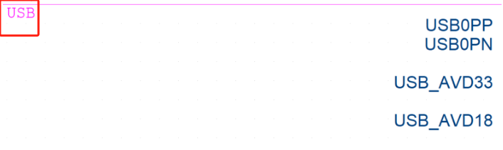

# 随记：


# 一、君正T23系列芯片（T23N和T23ZN）的片上外设资源

<span style="background:#b1ffff">硬件+协议</span>


## 1. POR（**Power-On Reset，上电复位**）

- **POR** 是单片机在上电时自动触发的复位机制，确保系统在电压稳定后正确初始化。

- 在电源电压（VCC）上升到指定阈值后，保持复位状态一段时间（滞后时间），直到电压稳定。
- 避免因电压波动导致系统初始化失败或异常运行。
- 当VCC稳定后，复位信号解除，CPU从复位向量地址（如0x0000）开始执行程序。

## 2.WDT（**Watchdog Timer，看门狗定时器**）

- **WDT** 是一种硬件定时器，用于检测系统是否“卡死”或“死循环”。

- 若主程序未能在 **超时周期** 内“喂狗”（重置WDT计数器），WDT将触发复位，强制系统重启。

- **应用场景**：
    - 在低功耗或电池供电设备（如君正T23的摄像机，知识库[4][6]）中，WDT可防止因程序错误导致的死机，而POR/BOR则应对电源故障。
## 3.AES-128 (128位加密算法)

- 使用 **AES-128** 加密视频流或存储数据，确保传输和存储的安全性。
## 4.DES (56位加密算法)

- **过时性**：由于安全性不足，即使速度稍快也不推荐使用。
- **避免使用DES**：
    - T23芯片若需兼容旧协议，可短期使用 **3DES**，但长期应全面迁移至AES。
## 5.OTP (**One Time Password（OTP动态密码）**)

- **OTP密码** 是一种动态生成的、仅在单次会话或交易中有效的密码，用于增强身份验证的安全性。
- **生成方式**：基于算法（如HMAC、时间戳或计数器）生成唯一且不可预测的代码。
- **有效性**：通常在 **30秒到2分钟** 内有效，或仅用于单次操作（知识库[9][10][12]）。

- **OTP存储器**：适用于需一次性固化程序或密钥的嵌入式系统，平衡成本与安全性。
- **OTP动态密码**：是多因素认证的核心，显著提升在线服务的安全性，但需根据场景选择TOTP、HOTP或SOTP。


## 6.MEMORY Integrated 512M bit DDR2（内存）

- **512Mbit** = **64MB**（1Mbit = 128KB，因此 512 × 1024 × 1024 / 8 = 64MB）。
- **带宽**：
    - 根据知识库[2][8]，DDR2 667（PC2-5300）的理论带宽为 **5.3GB/s**（数据频率667MHz × 64bit位宽 × 2预取）。
    - 若实际位宽为128bit（如部分显卡配置），带宽可达 **10.66GB/s**。

 - **与DDR3/LPDDR的对比**

| **特性**   | **DDR2**                                         | **DDR3**                  | **LPDDR2**（低功耗版） |
| -------- | ------------------------------------------------ | ------------------------- | ---------------- |
| **预取位数** | 4bit                                             | 8bit                      | 4bit（与DDR2相同）    |
| **工作电压** | 1.8V                                             | 1.5V                      | 1.2V（更省电，知识库[4]） |
| **带宽**   | 5.3~6.4GB/s（DDR2-667~800）                        | 8~12.8GB/s（DDR3-800~1600） | 与DDR2相近，但优化功耗    |
| **适用场景** | <span style="background:#affad1">低功耗嵌入式系统</span> | 高性能PC/服务器                 | 移动设备（手机、平板）      |
- **君正T31ZC案例**（知识库[6]）：
    - **集成内存**：512Mbit（64MB）DDR2，分为两部分：
        - **rmem（24MB）**：用于多媒体处理（音视频编码、OSD）。
        - **mem（40MB）**：分配给Linux系统。
    - **内存优化**：
        - 禁用不必要的服务，减少内核模块加载。
        - 精简根文件系统（rootfs），释放内存空间。
    - **优势**：低功耗、适合物联网设备（智能家居、工业控制）。

- **系统内存（40MB）**：
    - 运行精简版Linux（如BusyBox），减少内核占用。
    - 使用 **ramfs** 文件系统，提升读写速度（知识库[6]）。
- **多媒体内存（24MB）**：
    - 优化音视频编解码算法，避免内存溢出。
1. **带宽不足**：
    - 对比DDR3/4，DDR2在高性能计算中可能成为瓶颈（如4K视频处理）。
2. **淘汰趋势**：
    - 消费级市场已转向DDR4/DDR5，但嵌入式领域因成本和功耗仍保留DDR2。

## 7、XBurst®1 CPU (1.2GHZ. MIPS32 ISA FPU )(16K 1-Cache + 16K D-Cache 64KB L2 Cache)（CPU主核）

#### **1. 性能指标**

- **主频**：1.2GHz（基于知识库[3][6][7]，XBurst架构在先进制程下可实现更高频率）。
- **指令集**：MIPS32 ISA（兼容<span style="background:#affad1">MIPS架构</span>，支持RISC精简指令集特性）。
- - **位数**：<span style="background:#affad1">MIPS32是基于 **32位** 的处理器架构</span>，其寄存器、内存地址和指令均为32位宽。
- **浮点单元（FPU）**：集成硬件浮点运算单元，提升科学计算、图形处理等场景的性能（知识库[6][9]）。
#### **2. 缓存配置**

- **L1 Cache**：
    - **16KB 指令缓存（I-Cache）**：优化指令预取，减少处理器等待时间。
    - **16KB 数据缓存（D-Cache）**：加速数据读写，降低内存访问延迟。
- **L2 Cache**：64KB 二级缓存，进一步减少主存访问，提升整体性能（知识库[2][6]）。

- XBurst设计强调超低功耗（知识库[3][4]），功耗仅为同类产品的25-30%。

- **SIMD指令集**：支持单指令多数据（SIMD）加速，视频解码效率提升100%，编码效率提升150%（知识库[3][6][9]）。
- **浮点运算**：FPU支持浮点运算，适用于图像处理、传感器数据算法（如健康监测中的心率计算）。

#### **3. T23N芯片配置**

- **CPU核心**：<span style="background:#d3f8b6">XBurst®1（1.2-1.4GHz） + RISC-V协处理器（600MHz）。</span>
- **视频处理**：支持3MP@40fps H.264编码，12bit RAW输入（知识库[9]）。
- **安全特性**：内置AES、DES、RSA硬件加密模块，适合物联网安全需求。
- **混合架构设计**：
    - 与低功耗协处理器（如Cortex-M或RISC-V）配合，实现“高性能+低功耗”（知识库[8][9]）。

## 8、DTRNG **（随机数生成器）**

**TRNG（True Random Number Generator，真随机数生成器）**：
- 基于物理过程（如热噪声、量子效应）生成随机数，具有不可预测性和不可重复性（知识库[11]）。
- **DRNG（Deterministic Random Number Generator，确定性随机数生成器）**：
    - 基于算法（如伪<span style="background:#d3f8b6">随机数生成算法</span>）生成随机数，依赖种子（seed）初始化（知识库[6]）。
    - **缺点**：若种子泄露或算法缺陷，可能被预测。
#### **关键区别**

| **特性**    | **TRNG（真随机）**                                          | **DRNG（伪随机）**                                          |
| --------- | ------------------------------------------------------ | ------------------------------------------------------ |
| **随机性来源** | 物理噪声（如热噪声、光电效应）                                        | 确定性算法（如线性同余法）                                          |
| **可预测性**  | 完全不可预测                                                 | 可能被预测（依赖种子和算法）                                         |
| **生成速度**  | 可能较慢（依赖物理过程）                                           | 快速（算法计算）                                               |
| **应用场景**  | <span style="background:#d3f8b6">加密密钥生成、安全协议初</span>始化 | <span style="background:#d3f8b6">日常随机需求（如游戏、模</span>拟） |

## 9、RSA算法(加密)
- **安全性基础**：  
    RSA的安全性依赖于 **大整数分解的困难性**（知识库[1][7]）。例如，分解一个2048位的nn在传统计算机上几乎不可能。
- **量子计算的威胁**：  
    Shor算法可在多项式时间内分解大整数（知识库[1]），未来量子计算机可能使RSA失效。当前建议逐步迁移到后量子密码算法（如NIST标准）。

- **非对称加密**：传输数据（如<span style="background:#affad1">HTTPS中的密钥交换</span>）。
- **数字签名**：验证数据完整性（如软件更新签名）。
- **工业级SSD**：结合AES实现混合加密（知识库[12]）。


## 10、SHA **哈希算法**(加密)
#### **1. 基本概念**

- **SHA（Secure Hash Algorithm）**：  
    将任意长度数据映射为固定长度哈希值，具备 **单向性** 和 **抗碰撞性**（知识库[5][10]）。
- **版本演变**：
    - **SHA-1**：160位输出，已被破解（如知识库[2]中王小云团队的攻击，复杂度251251）。
    - **SHA-2**：包括SHA-256、SHA-512，目前主流（如<span style="background:#d3f8b6">比特币</span>、SSL/TLS）。
    - **SHA-3**：基于Sponge结构，抗碰撞更强（知识库[8]）。

### **五、总结**

- **DTRNG/TRNG**：提供真正的随机性，是加密系统的基础。
- **RSA**：经典非对称加密算法，但面临量子威胁，需逐步过渡。
- **SHA**：哈希函数家族，SHA-3为当前安全选择。


## 11、DVP **摄像头接口（Digital Video Port）**

- **定义与特点**：
    - 并行接口，用于摄像头传感器（如CMOS）输出数字视频数据（知识库[3][4]）。
    - **数据位宽**：8bit、10bit、12bit、16bit等。
    - **信号线**：包括PCLK（像素时钟）、VSYNC（帧同步）、HSYNC（行同步）、DATA（像素数据）等。


## 12、BT **视频标准（BT656/BT1120）协议标准**
- **定义**：  
    <span style="background:#affad1">模拟视频信号数字化的协议标准</span>，用于安防监控和专业音视频设备（知识库[2][3][4]）。
- **应用场景**：
    - **BT656**：标清视频（如720×576@25fps）。
    - **BT1120**：高清视频（如1080p）。
- **技术关联**：  
    与DVP接口协同工作，如在rv1126_rk3568平台中实现视频流传输（知识库[2]）。

#### **1. 视频监控系统**

- **DVP接口**：摄像头传感器输出视频数据。
- **BT656/BT1120**：<span style="background:#affad1">将模拟信号数字化，传输至主控芯片（如rk3568）。</span>
- **案例**：rv1126_rk3568驱动项目支持DVP/BT656/BT1120接口，提升安防监控的实时性和可靠性（知识库[2]）。


## 13、、MIPI CS1-2（摄像头接口的主流标准）

- **高速低功耗**：支持多通道（Lane）串行传输，数据速率可达 **Gbps级别**。

- **CSI-2**（2005年发布）：
    - 物理层支持 **D-PHY** 或 **C-PHY**。
    - 最大带宽：单通道 **1 Gbps**（4通道可达 **4 Gbps**）。
    - 支持 **RAW8/10/12/14、RGB888/666、YUV422/444** 等格式。

#### **1. 分层结构**

根据知识库[1][2][6][10]，CSI-2 分为以下层次：

| **层级**       | **功能描述**                                                                                                                  |
| ------------ | ------------------------------------------------------------------------------------------------------------------------- |
| **应用层**      | 处理原始图像数据的算法（如ISP处理、图像压缩），与 CSI-2 协议本身关系不大。                                                                                |
| **协议层**      | 包含三<span style="background:#b1ffff">层：像素打包层、LLP层、通道管理层</span>，<span style="background:#d3f8b6">负责数据封装、同步和通道管理</span>。     |
| **物理层（PHY）** | <span style="background:#b1ffff">定义信号传输方式（D-PHY/C-</span>PH<span style="background:#d3f8b6">Y），处理时钟同步、差分信号、低功耗</span>模式等。 |

#### **2. 协议层详解**

- **像素/字节打包层**：
    - **功能**：将像素数据（如RAW10、RGB888）转换为字节流（8bit），适配传输需求。

- **LLP（低级协议层）**：

	- **功能**：添加包头（SoT/Sync）、数据校验（ECC/CRC），确保传输同步和完整性。

- **通道管理层**：

	- **功能**：将数据分配到多个通道（1-4 Lane），并行传输以提升带宽。

#### **3. 物理层（D-PHY vs. C-PHY）**

| **特性**   | **D-PHY**                                                                                          | **C-PHY**                          |
| -------- | -------------------------------------------------------------------------------------------------- | ---------------------------------- |
| **时钟机制** | 专用时钟通道（Clock Lane），DDR模式（双沿采样）。                                                                    | 无专用时钟，时钟嵌入数据中，三相差分信号（TDM）。         |
| **速度**   | <span style="background:#b1ffff">单通道 **1 Gbps**（HS模式）</span>，总带宽 **4 Gbps**。                       | 单通道 **8 Gbps**（三通道可达 **24 Gbps**）。 |
| **功耗**   | <span style="background:#d3f8b6">低速时切换到 LP 模式（低</span><span style="background:#d3f8b6">功</span>耗）。 | 恒定高速，功耗较高。                         |
| **抗干扰**  | <span style="background:#d3f8b6">差分信号</span>，但需专用时钟通道。                                             | 三相信号，抗干扰更强。                        |
| **应用场景** | 移动设备（如手机）、成本敏感场景。                                                                                  | 高分辨率摄像头（如8K）、汽车电子。                 |
- **MIPI CSI-2** 是 **移动和嵌入式设备摄像头接口的主流标准**，通过灵活的分层架构和高速物理层（D-PHY/C-PHY），支持从手机到自动驾驶的多样化场景。


## 14、Smart LCD（**智能液晶显示屏**）
- 在传统LCD技术基础上，集成智能化功能的显示设备，能够实现<span style="background:#d3f8b6">交互、联网、自适应调节</span>等高级功能。
### **1、与传统LCD及其它技术的对比**

| **特性**   | **Smart LCD**                                      | **传统LCD**   | **OLED**     |
| -------- | -------------------------------------------------- | ----------- | ------------ |
| **交互能力** | <span style="background:#d3f8b6">支持触控、语音、</span>手势 | 无           | 可集成触控，但成本更高  |
| **功耗**   | 更低（智能调光+低功耗芯片）                                     | 较低（依赖背光）    | 更低（自发光，无需背光） |
| **对比度**  | 动态对比度（局部调光）                                        | 固定对比度       | 无限对比度（自发光）   |
| **成本**   | 较高（集成智能模块）                                         | 低           | 高（材料昂贵）      |
| **适用场景** | 智能家居、车载、工业控制                                       | 电视、笔记本、传统家电 | 高端手机、柔性显示    |


## 15、AUDIO CODEC（**音频编解码器**）

**音频编解码器** 是一种 **硬件或软件工具**，用于<span style="background:#affad1">将模拟音频信号转换为数字数据流（编码）或反之（解码）</span>。其核心目标是在 **压缩数据** 的同时尽量保持音质，以优化存储、传输和播放效率。

#### **1. 核心功能**

- **编码（Compression）**：  
    将模拟音频信号（如麦克风输入）或原始数字音频（如WAV文件）转换为压缩格式（如MP3、AAC），减少数据量。
- **解码（Decompression）**：  
    将压缩的音频数据流还原为可播放的数字或模拟信号（如通过DAC输出到扬声器）。

#### **2. 按压缩方式分类**

|**类型**|**特点**|**典型格式**|**适用场景**|
|---|---|---|---|
|**无损压缩**|保留全部原始数据，解码后与原信号完全一致。|FLAC、ALAC、WAV（LPCM）|音乐制作、专业录音、高保真回放|
|**有损压缩**|通过去除人耳不敏感的音频信息降低数据量，牺牲部分音质。|MP3、AAC、OGG、WMA|流媒体、手机存储、在线音乐|


## 16、lmage Signal Processor(3A, 3D denoise, Scaling, OSD.)(Anti-fog. RGB-IR)**(ISP图像信号处理)**

### **1、3A算法（3A Algorithm）**

**3A** 是 **ISP** 核心功能之一，包含 **自动对焦（AF）、自动曝光（AE）、自动白平衡（AWB）**，旨在优化图像质量并适应不同光照条件。
### **2、3D降噪（3D Denoise）**

**3D降噪** 是 **ISP** 的高级功能，通过 **时间域（帧间）与空间域（帧内）** 结合的算法降低噪声。
### **3、缩放（Scaling）**

**缩放** 是 **ISP** 的基础功能之一，用于调整图像分辨率以适应不同显示或传输需求。

- **显示适配**：将摄像头原始分辨率（如4K）适配至手机屏幕（如FHD）。
- **视频流传输**：降低分辨率以匹配网络带宽（如直播推流）。
- **多屏输出**：车载系统同时输出仪表盘和中控屏的差异化分辨率。
### **4、OSD（On-Screen Display）**

**OSD** 是在图像上叠加 **文字、图标或图形** 的功能，常用于交互或信息显示。

### **5、防雾（Anti-fog）**

**防雾** 通过 **硬件涂层** 或 **ISP算法** 减少雾气对成像的影响。

### **6、RGB-IR处理**

**RGB-IR** 是 **ISP** 在 **双光谱成像** 中的特殊功能，支持 **可见光（RGB）与红外（IR）** 的融合。

### **7、总结**

|**功能**|**核心作用**|**技术支撑**|**典型应用**|
|---|---|---|---|
|**3A算法**|自动优化对焦、曝光、白平衡，适应复杂光照条件。|3A统计分析、深度学习、传感器反馈。|手机摄像头、车载ADAS、医疗成像。|
|**3D降噪**|减少噪声，提升低光成像质量。|帧间对比、边缘保留滤波。|安防监控、手机夜景、车载夜视。|
|**缩放（Scaling）**|调整图像分辨率以适配显示或传输需求。|双线性/ Lanczos插值、动态分辨率调整。|多屏输出、视频流传输、显示适配。|
|**OSD**|在图像上叠加交互信息。|二进制掩码叠加、同步控制。|车载仪表、智能家居、医疗设备。|
|**防雾**|消除雾气对成像的影响。|防雾涂层、对比度增强算法。|车载摄像头、AR眼镜、安防监控。|
|**RGB-IR**|融合可见光与红外光谱，提升多场景成像能力。|双光谱传感器、色彩校准算法。|车载舱内监控、夜视安防、工业检测。|


## 17、Video Processor(H.264/MJPEG)`(型号2308*X)(支持3MP@40fps)(视频处理器)`

#### **1. 型号与性能**

- **型号**：2308*X（推测为某厂商的视频处理器芯片，如海思、安霸或瑞芯微等型号）。
- **分辨率与帧率**：支持 **3MP（300万像素，如2304×1296）@40fps**，适用于高清监控、行车记录仪或工业视觉场景。
- **编码格式**：同时支持 **H.264（AVC）** 和 **MJPEG**，满足不同场景需求。
#### **2. H.264适用场景**

- **监控与安防**：
    - <span style="background:#affad1">需要长时间录像时，H.264的低码率可显著节省存储空间</span>（知识库[3]提到H.264比MPEG-4节省50%码率）。
    - 支持动态场景（如车辆移动），通过 **B帧双向预测** 提升压缩效率。
- **流媒体传输**：
    - 低带宽网络下（如4G/5G或无线传输），H.264的高效压缩可保证流畅播放。
    - 
- 需支持 **硬件加速**（如专用编码引擎），否则40fps@3MP可能因CPU占用过高导致卡顿。
#### **3. MJPEG适用场景**

- **实时监控**：
    - <span style="background:#affad1">需要极低延迟的场景</span>（如工业质检、无人机图传），MJPEG的帧独立特性可减少处理延迟。
- **临时录像**：
    - 短时录制或本地存储，无需长期压缩存储。

### **4、总结**

- **H.264**：推荐用于 **长期监控、网络传输**，需确保硬件编码支持。
- **MJPEG**：适合 **低延迟、短时录制**，但需权衡存储与带宽成本。
- **处理器选型**：2308*X需确认是否支持 **H.264硬件加速** 和 **多流编码**（如同时输出H.264和MJPEG）。


## 18、I2Cx3
**双线通信**：仅需 **SDA（数据线）** 和 **SCL（时钟线）** 两根线

I2C总线凭借其 **双线制、多主从架构、灵活速率** 和 **低硬件成本**，成为嵌入式系统和物联网的核心通信协议。

## 19、UARTx3（**通用异步收发传输器**）

- **作用**：将数据在 **并行通信**（如微控制器内部总线）和 **串行通信**（如外设接口）之间转换，实现设备间异步数据传输。

#### **1. 核心特点**

- **异步通信**：无需共享时钟信号，通过 **起始位/停止位** 同步，依赖双方约定的波特率。
- **全双工**：支持同时发送（TXD）和接收（RXD）数据，使用独立信号线。
- **简单接口**：仅需 **3根线**（TXD、RXD、GND），低成本、低硬件复杂度。
- **灵活配置**：可调整波特率、数据位、校验位、停止位等参数（知识库[1][3][9][11]）。

UART凭借其 **简单性、低成本、全双工** 的特点，成为嵌入式系统中 **短距离、低速通信** 的主流选择。


## 20、SPI(**串行外设接口**)
#### **1. 核心特点**

- **同步通信**：通过 **SCLK（时钟线）** 同步数据传输，无需额外握手信号。
- **全双工**：支持 **同时双向传输**（MOSI发送数据，MISO接收数据）。
- **四线制**：标准接口需 **4根线**（<span style="background:#d3f8b6">SCLK、MOSI、MISO、CS）</span>，部分场景可简化为3线（如单向传输）。
- **高速高效**：传输速率可达 **几Mbps至数十Mbps**（受限于硬件和时钟频率）。
- **简单灵活**：协议简洁，无复杂握手协议，易于硬件实现（知识库[3][5][9][11][12]）。

#### **2. 四根核心信号线**

| **信号线**   | **方向**        | **功能描述**                                                                 |
| --------- | ------------- | ------------------------------------------------------------------------ |
| **SCLK**  | 主设备输出         | <span style="background:#affad1">提供时钟</span>信号，控制数据传输的节奏（上升/下降沿触发数据采样）。  |
| **MOSI**  | 主设备输出 → 从设备输入 | 主设备向从设备发送数据（Master Output, Slave Input）。                                 |
| **MISO**  | 主设备输入 ← 从设备输出 | 从设备向主设备发送数据（Master Input, Slave Output）。                                 |
| **CS/SS** | 主设备输出         | <span style="background:#affad1">片选信号</span>，低电平（或高电平）激活特定从设备，允许多设备共用总线。 |
#### **3. 主从架构**

- **主设备（Master）**：控制总线时钟和片选信号，发起通信。
- **从设备（Slave）**：被动响应，通过CS信号被选中后，通过MOSI/MISO传输数据。
- **多从机扩展**：
    - 每个从设备需独立的 **CS线**（如知识库[8][12]所述），通过拉低对应CS线选择目标设备。
    - 未被选中的从设备进入 **高阻态**，避免干扰总线信号。

#### **4. 典型应用场景**

- **存储设备**：Flash、EEPROM的高速读写（如知识库[5][11]）。
- **传感器接口**：连接加速度计、陀螺仪、温度传感器等（如MPU6050）。
- **显示模块**：控制OLED、TFT-LCD的显示数据传输（如ILI9341驱动）。
- **工业控制**：连接电机驱动器、ADC/DAC进行实时数据采集与控制。
- **数字信号处理**：连接DSP或解码器（如音频编解码芯片）。

#### **5. 配置参数**

- **波特率**：根据主设备时钟设置（如1MHz、8MHz）。
- **模式**：通过CPOL/CPHA配置（如Mode 0或Mode 3）。
- **数据位数**：通常为8位，部分设备支持16位或可变长度。

### **6、SPI与I2C/UART的对比**

| **特性**    | **SPI**                                         | **I2C**            | **UART**                                        |
| --------- | ----------------------------------------------- | ------------------ | ----------------------------------------------- |
| **信号线**   | <span style="background:#affad1">4线</span>（全双工） | 2线（半双工）            | <span style="background:#d3f8b6">2线（半</span>双工） |
| **速度**    | 高（Mbps级）                                        | 中（400kbps到3.4Mbps） | 低（kbps到Mbps，需硬件支持）                              |
| **地址机制**  | 无（依赖CS线物理选择）                                    | 7位/10位地址           | 无（点对点）                                          |
| **同步性**   | 同步（SCLK）                                        | 同步（SCL）            | 异步（波特率匹配）                                       |
| **多设备支持** | 通过CS线扩展                                         | 通过地址区分             | 需独立连接                                           |
SPI凭借其 **高速、全双工、简单灵活** 的特点，成为嵌入式系统中 **短距离、高带宽** 通信的首选协议。其四线制架构和多从机扩展能力，使其广泛应用于存储、传感器、显示等场景。
## 21、SDIOx2（**安全数字输入输出**）。
- **作用**：基于 **SD存储卡接口** 扩展的 **通用外设接口协议**，支持存储功能和外设扩展（如Wi-Fi、蓝牙、GPS等）。
- **兼容性**：兼容 **SD卡、MMC卡**，并支持 **SDIO专用设备**（如无线模块、摄像头）。
- **高速传输**：
- **SD模式**：1位、4位并行传输（最高25MHz时钟）。
- **SPI模式**：兼容 **SPI协议**，单线半双工，简化硬件设计（如DAT0为MISO，DAT3为片选）
- **UHS模式**（超高速）：如UHS-I（104MHz）、UHS-II（208MHz）。
- **低功耗设计**：支持休眠、空闲等省电模式，适合电池供电设备。
- **热插拔支持**：允许动态插入/移除设备，无需重启系统。
- **安全机制**：支持数据加密和校验（如CRC校验）。

SDIO接口基于 **9针脚设计**（兼容SD卡插槽），具体功能如下（知识库[4][6][10]）：

| **引脚号** | **名称** | **功能**                                                        |
| ------- | ------ | ------------------------------------------------------------- |
| 1       | DAT3   | 数据线3（SD模式）或 **片选信号（SPI模式）**。                                  |
| 2       | CMD    | <span style="background:#affad1">命令/响应信号线</span>，传输控制命令和状态响应。 |
| 3       | VSS    | 地线（GND）。                                                      |
| 4       | VDD    | 电源（3.3V或1.8V，UHS模式支持低压）。                                      |
| 5       | CLK    | <span style="background:#affad1">时钟信号线</span>，同步数据传输。         |
| 6       | VSS    | 地线（GND）。                                                      |
| 7       | DAT0   | 数据线0（SD模式）或 **主输入从输出（SPI模式，MISO）**。                           |
| 8       | DAT1   | 数据线1（SD模式）或 **保留/中断信号（SPI模式）**。                               |
| 9       | DAT2   | 数据线2（SD模式）或 **保留**。                                           |
|         |        |                                                               |
### **1、SDIO与SPI/UART的对比**

|**特性**|**SDIO**|**SPI**|**UART**|
|---|---|---|---|
|**信号线**|9针（并行/串行模式）|4线（全双工）|3线（半双工）|
|**速度**|高（UHS-II可达208MHz）|高（Mbps级）|低（kbps到Mbps）|
|**模式支持**|多模式（1位/4位/SD/SPI）|固定四线制|仅异步串行|
|**协议复杂度**|高（命令/响应机制）|简单（同步时钟）|简单（起始/停止位）|
|**外设扩展性**|支持多种外设（如无线模块）|专用外设接口（如传感器）|点对点通信|
|**功耗**|支持低功耗模式|中等|低|
SDIO凭借其 **多功能性、高速传输、低功耗** 和 **热插拔能力**，成为嵌入式系统中 **存储扩展和外设连接** 的核心接口。

## 22、USB 2.0 OTG
- **核心功能**：
    - **双角色设备（DRD）**：设备可动态切换为 **主机（Host）** 或 **外设（Device）**。
    - **无需PC中转**：例如手机直接连接U盘、打印机或键盘。
- **物理连接**：通过OTG线（如Micro-AB或Type-C接口）连接两台设备。
#### **3. 硬件支持**

- **OTG控制器**：集成在芯片中，管理角色切换和协议栈（如飞利浦ISP1761芯片，知识库[6]）。
- **接口类型**：
    - **Micro-AB**：支持插入Micro-B或Micro-A（主机）设备。
    - **Type-C**：无需区分方向，支持OTG功能（知识库[10]）。

### **1、USB 2.0 OTG与普通USB的对比**

| **特性**    | **USB 2.0 OTG**        | **普通USB 2.0**        |
| --------- | ---------------------- | -------------------- |
| **角色灵活性** | 支持动态切换主机/外设（双角色）       | 固定为主机或外设             |
| **协议扩展**  | 集成HNP和SRP协议            | 无                    |
| **应用场景**  | 移动设备直接通信（无需PC）         | 依赖主机（如PC）控制外设        |
| **线缆设计**  | 需OTG线（支持ID引脚）或Type-C接口 | 普通A-to-B/A-to-Micro线 |
| **速度上限**  | 480Mbps（与普通USB 2.0相同）  | 480Mbps              |
- **接口选择**：
    - **Micro-AB**：用于传统安卓设备（如旧款手机）。
    - **Type-C**：支持正反插，无需区分方向（知识库[10]）。

USB 2.0 OTG通过 **动态角色切换** 和 **协议扩展**，解决了传统USB依赖主机的局限性，成为移动设备和嵌入式系统中 **外设扩展和点对点通信** 的重要技术。

## 23、MAC 与 RMII(以太网)


**RMII（Reduced Media Independent Interface）** 是 **MII（Media Independent Interface）** 的简化版本，旨在减少信号线数量，降低硬件设计复杂度和成本，适用于 **10/100Mbps 以太网**。其核心特点包括：

- **信号线减少**：将 MII 的 16 根信号线减少到 **7-8 根**（具体取决于具体实现）。
- **公共时钟**：使用单一时钟（**REF_CLK**，50MHz）同步发送和接收，而 MII 需要独立的发送（TX_CLK）和接收（RX_CLK）时钟。
- **低功耗与低成本**：适合嵌入式系统、IoT 设备和低功耗场景（如知识库[4][8][11]）。

#### **1、RMII信号线定义**

|**信号名称**|**方向**|**功能**|
|---|---|---|
|**TXD[1:0]**|MAC → PHY|**发送数据线**，2位并行数据（100Mbps时每周期传输2bit，10Mbps时每10周期传输1bit）。|
|**RXD[1:0]**|PHY → MAC|**接收数据线**，2位并行数据。|
|**TX_EN**|MAC → PHY|**发送使能信号**，指示数据有效。|
|**RX_ER**|PHY → MAC|**接收错误信号**，指示接收帧错误（如CRC错误）。|
|**CRS_DV**|PHY → MAC|**复合信号**，合并了 MII 的 **CRS（载波检测）** 和 **RX_DV（接收数据有效）**。|
|**REF_CLK**|外部时钟源 → 双向|**50MHz 参考时钟**，由外部晶振提供，用于同步发送和接收。|
1. **发送流程（MAC → PHY）**：
    
    - MAC 将数据通过 **TXD[1:0]** 发送，同时 **TX_EN** 使能。
    - PHY 将并行数据转换为串行信号，通过物理介质（如网线）传输。
2. **接收流程（PHY → MAC）**：
    
    - PHY 接收物理信号，转换为并行数据通过 **RXD[1:0]** 发送。
    - **CRS_DV** 信号指示数据有效（RX_DV）和载波状态（CRS）。
    - **RX_ER** 标记接收错误（如冲突或CRC错误）。

#### **2、MAC与RMII的交互**

1. **数据帧处理**：
    
    - MAC 负责 **介质访问控制（MAC层协议）**，如 CSMA/CD、帧封装/解封装。
    - RMII 接口仅负责 **物理层数据传输**，MAC 通过 RMII 与 PHY 交换原始数据。
2. **配置与管理**：
    
    - **MDIO 接口**（MDC/MDIO 信号）用于配置 PHY 寄存器（如速率、双工模式）。
    - **典型配置步骤**（如知识库[6][11]）：
        1. 通过 MDIO 读取 PHY 状态寄存器（如 `0x00`）。
        2. 设置速率（10/100Mbps）和双工模式（全双工/半双工）。
        3. 启用自动协商或强制模式。

- RMII 通过 **简化信号线和公共时钟**，成为嵌入式系统中 **低成本以太网通信** 的主流接口。


## 24、RISC-V协处理器（主频600MHz）
- **指令集扩展**：
    - 支持 **双精度浮点运算（FPU）** 和 **DSP扩展指令**，满足复杂算法需求（如控制环路、信号处理）。
    - 符合 **RISC-V国际标准**（如 RV64IMAC、RV64FD等）。


## 25、Secure Boot（**安全启动**）
**Secure Boot** 是一种 **硬件级安全机制**，通过验证系统启动过程中加载的每一阶段固件和操作系统的 **数字签名**，确保其来源可信且未被篡改。其核心目标是：

- **防止恶意软件入侵**：阻止未经授权或被篡改的固件/操作系统启动。
- **保障系统完整性**：确保启动链中的每个组件均为制造商预设的合法版本（知识库[2][5][9][11]）。


## 26、ADCx1（**模拟数字转换器**）

- 将连续变化的模拟信号（如温度、电压、声音）转换为离散的数字信号，供数字系统（如MCU、DSP）处理。


## 27、PWMx4（**脉宽调制**）

- **PWM（Pulse Width Modulation）**：通过调整数字信号的占空比（脉冲宽度）和频率，实现对模拟电路的控制。
- **核心参数**：
    - **周期（T）**：信号完成一个完整高低电平变化所需的时间，单位为秒（s）。
    - **占空比（Duty Cycle）**：周期内高电平持续时间占总周期的百分比（0%~100%）。
    - **频率（f）**：单位时间内周期数，单位为赫兹（Hz），计算公式：f=1Tf=T1​。

#### **1. 数字芯片实现**

- **APC（Analog-to-PWM Converter）**：将模拟信号直接转换为 PWM 信号，简化信号链设计（知识库[10]）。
- **专用驱动芯片**：如英飞凌的 MOTIX 系列，集成 PWM 控制用于电机驱动。


## <span style="background:#fdbfff">后面的是其他的专业术语的学习</span>

## 28、 **SPK 接口（音频扬声器接口）

- 通常与 **MIC（麦克风）** 接口并排存在（知识库[7][11][12]）。

- **功能**：传输音频信号，部分设备通过 SPK 接口直接驱动音箱（无需额外功放）。

## 29、


## 30、


## 31、


## 32、


## 33、


# 二、 名词解释

## 1.缓存与内存区别
**概要**  
缓存（Cache）是一种位于<span style="background:#affad1"> CPU 与主存（内存）之间的小容量、高速存储器，用于存放 CPU 经常访问的指令和数据，从而减少主存访问延迟</span>；内存（RAM）则是计算机的主存储器，容量更大、速度相对较慢，用于存放操作系统、应用程序及其运行时数据。二者在位置、容量、速度、成本和技术实现等方面存在显著差异<span style="background:#d3f8b6">，且缓存通常进一步分为 L1、L2、L3 多级，以满足不同的性能需求。</span>

它通常采用静态 RAM（SRAM）技术实现，以换取更低的访问延迟
**内存**
- 内存，也称主存（RAM，Random Access Memory），是 CPU 可直接读写的大容量易失性存储器，用于<span style="background:#affad1">存放操作系统、正在运行的程序和数据</span> [GeeksforGeeks](https://www.geeksforgeeks.org/difference-between-ram-and-cache/?utm_source=chatgpt.com)[知乎专栏](https://zhuanlan.zhihu.com/p/371899790?utm_source=chatgpt.com)。
    
- 主存一般采用动态 RAM（DRAM）技术，容量大但访问速度低于 SRAM。

### 主要区别

|特性|缓存（Cache）|内存（Memory / RAM）|
|---|---|---|
|存储位置|集成在或靠近 CPU，位于主存之前|与 CPU 通过内存总线相连|
|容量|小，通常从几十 KB 到几 MB|大，从几 GB 到几十 GB|
|访问速度|极快，纳秒级|较慢，数十纳秒|
|技术类型|SRAM（静态 RAM），成本高|DRAM（动态 RAM），成本较低|
|成本|每位成本高|每位成本低|
|主要功能|缓存频繁访问的数据，减少访存延迟|存储所有当前运行的程序和数据|
|来源数据汇总见下文 [Tech Differences](https://techdifferences.com/difference-between-cache-memory-and-main-memory.html?utm_source=chatgpt.com)[differencebetween.info](https://www.differencebetween.info/difference-between-cache-memory-and-main-memory?utm_source=chatgpt.com)||
### 缓存层级

现代 CPU 缓存分为多级：

- **L1 缓存**：<span style="background:#d3f8b6">集成在 CPU 核心内部，</span>分为指令缓存与数据缓存，容量最小（通常 32–64 KB），速度最快 [知乎专栏](https://zhuanlan.zhihu.com/p/680193859?utm_source=chatgpt.com)。
    
- **L2 缓存**：通常也是<span style="background:#d3f8b6"> CPU 核心内部或核外共享</span>，容量中等（128 KB–1 MB），速度略低于 L1，但仍比主存快 [GeeksforGeeks](https://www.geeksforgeeks.org/cache-memory-in-computer-organization/?utm_source=chatgpt.com)。
    
- **L3 缓存**：<span style="background:#d3f8b6">多核共享，容量更大（</span>几 MB–几十 MB），用于填补 L2 与主存之间的性能空隙 [difference.wiki](https://www.difference.wiki/cache-memory-vs-main-memory/?utm_source=chatgpt.com)。
    

---

### 工作原理

#### 缓存命中与不命中

- **命中（Cache Hit）**：CPU 请求数据时，数据正好在缓存中，可快速返回，显著降低延迟 [GeeksforGeeks](https://www.geeksforgeeks.org/cache-memory/?utm_source=chatgpt.com)。
    
- **不命中（Cache Miss）**：<span style="background:#affad1">数据不在缓存中，CPU 需访问较慢的主存，再将数据加载至缓存后重试</span> [GeeksforGeeks](https://www.geeksforgeeks.org/cache-memory-design/?utm_source=chatgpt.com)。
### 总结

缓存与内存在计算机体系结构中各司其职：缓存以牺牲容量为代价，提供最快的访问速度，缓解 CPU 与主存速度差异带来的瓶颈；内存则以较低成本提供运行所需的海量存储空间。二者通过多级缓存层次与高效的映射策略，实现了性能与成本的平衡，共同支撑计算机系统的高效运行。


## 2.**SPI 与其他通信协议（I2C、UART、SDIO、PWM、ADC、USB）** 的对比
### **1、核心参数对比表**

| **协议**     | **SPI**                                                       | **I2C**                                             | **UART**                                          | **SDIO**                                                      | **PWM**                                             | **ADC**                                                 | **USB**                                                    |     |
| ---------- | ------------------------------------------------------------- | --------------------------------------------------- | ------------------------------------------------- | ------------------------------------------------------------- | --------------------------------------------------- | ------------------------------------------------------- | ---------------------------------------------------------- | --- |
| **类型**     | 同步、全双工                                                        | 同步、半双工                                              | 异步、半双工                                            | 同步、全双工                                                        | 调制技术（非通信）                                           | 模数转换（非通信）                                               | 同步、全双工                                                     |     |
| **线数**     | <span style="background:#b1ffff">4线</span>（SCLK/MOSI/MISO/CS） | <span style="background:#b1ffff">2线</span>（SDA/SCL） | <span style="background:#b1ffff">2线</span>（TX/RX） | <span style="background:#b1ffff">4-6线</span>（SD/CLK/ CMD/DAT） | <span style="background:#b1ffff">1-3线</span>（PWM信号） | <span style="background:#b1ffff">取决于接口（如SPI/I2C）</span> | <span style="background:#b1ffff">4线</span>（D+/D-/Vbus/GND） |     |
| **速度**     | 高（数十Mbps~100+Mbps）                                            | 中（100kbps~5Mbps）                                    | 低（<115kbps，RS485可更高）                              | 高（25Mbps~500Mbps）                                             | 无固定速度（占空比可调）                                        | 无通信功能                                                   | 高（USB 2.0: 480Mbps；USB 3.0: >1Gbps）                        |     |
| **多设备支持**  | 一主多从（需独立CS）                                                   | 多主多从（地址寻址）                                          | 点对点（需总线扩展）                                        | 多设备（SD卡及扩展设备）                                                 | 不适用                                                 | 不适用                                                     | 一主多从（热插拔）                                                  |     |
| **寻址方式**   | 硬件片选（CS）                                                      | 7/10位地址                                             | 无（需上层协议）                                          | CMD命令寻址                                                       | 不适用                                                 | 不适用                                                     | 设备描述符（软件）                                                  |     |
| **典型应用**   | 高速传感器、存储器、显示器                                                 | 低速传感器、EEPROM                                        | 点对点通信（串口、Modbus）                                  | SD卡及扩展设备（Wi-Fi/蓝牙）                                            | 电机控制、LED调光                                          | 模拟信号数字化                                                 | 外设连接（键盘、鼠标、存储）                                             |     |
| **是否硬件相关** | 硬件接口                                                          | 硬件接口                                                | 硬件接口                                              | 硬件接口                                                          | <span style="background:#d3f8b6">软件/硬件生成</span>信号   | 硬件模块                                                    | 硬件接口                                                       |     |

---
### **2、典型应用场景选择指南**

|**需求**|**推荐协议**|**理由**|
|---|---|---|
|高速数据传输（如传感器阵列）|**SPI**|全双工、高速、低延迟。|
|低速多设备共享总线（如传感器）|**I2C**|引脚少、支持多设备地址。|
|长距离通信（如工业设备）|**UART + RS-485**|异步但可通过总线扩展实现长距离。|
|SD卡及扩展设备（如Wi-Fi）|**SDIO**|支持存储和外设共存，高速。|
|外设连接（如键盘、鼠标）|**USB**|即插即用、高速、广泛兼容。|
|电机控制/LED调光|**PWM**|通过占空比调节功率。|
|模拟信号数字化|**ADC**|需配合SPI/I2C接口控制ADC芯片。|
### **3、总结**

- **SPI**：**高速、全双工**，适用于芯片间高速数据传输（如传感器、存储）。
- **I2C**：**低引脚、多设备**，适合低速多设备共享总线。
- **UART**：**异步、长距离**，用于简单点对点通信。
- **SDIO/USB**：**扩展性与通用性**，支持复杂外设和即插即用。
- **PWM/ADC**：**非通信协议**，但常与SPI/I2C协同工作（如PWM控制电机，ADC通过SPI读取数据）。


## 3.**IOMUX控制器**
<span style="background:#fdbfff">输入/输出复用器</span>

- **核心功能**：
    - **引脚复用**：允许单个物理引脚在不同模式下实现多种功能（如GPIO、UART、SPI、ADC等）。
    - **电气配置**：设置引脚的驱动强度、上拉/下拉电阻、电压电平、压摆率等电气特性。
    - **输入路径控制**：当多个外设信号需要输入到同一模块时，选择信号源。


# 三、原理图解析


## 1.MIPI-CSI/DVP


### **1.1、 核心摄像头接口信号**
#### **(1) DVP（并行数字视频接口）**
| 引脚名称          | 功能描述                                                                                  | 复用信号/备注          |         |
| ------------- | ------------------------------------------------------------------------------------- | ---------------- | ------- |
| **DVP D0-D7** | <span style="background:#affad1">8位数据线（D0为最低位，D7为最高位）                                 | 部分复用为MIPI差分信号    | </span> |
| **DVP PCLK**  | <span style="background:#affad1">像素时钟（Pixel Clock）                           </span>  | 复用为PWM0、MSC1 CLK |         |
| **DVP HSYNC** | <span style="background:#d3f8b6">行同步信号（Horizontal Sync）                     </span>   | 复用为SMB1 SDA      |         |
| **DVP VSYNC** | <span style="background:#d3f8b6">场同步信号（Vertical Sync）                         </span> | 复用为SMB1 SCK      |         |
| **DVP MCLK**  | <span style="background:#affad1">主时钟（Master Clock，输出给摄像头） </span>                     | 直接连接PA15         |         |
|               |                                                                                       |                  |         |

#### **(2) MIPI-CSI（串行摄像头接口）**
| 引脚名称               | 功能描述               | 对应DVP数据线复用关系 |
| ------------------ | ------------------ | ------------ |
| **MIPI DATAP1/N1** | MIPI数据通道1的差分对（正/负） | 复用自DVP D0/D1 |
| **MIPI CLKP/N**    | MIPI时钟差分对          | 复用自DVP D2/D3 |
| **MIPI DATAP0/N0** | MIPI数据通道0的差分对      | 复用自DVP D4/D5 |
| **MIPI SEL**       | MIPI模式选择信号         | 复用自DVP D7    |

<span style="background:#b1ffff">P/N--->差分对</span>
- **MIPI SEL**       <span style="background:#affad1">MIPI模式选择信号         </span>

### **1.2. 复用功能与GPIO配置**
#### **(1) 复用接口控制**
- **MIPI SEL（DVP D7）**：  
  该引脚用于切换DVP与MIPI模式：
  - **低电平**：启用DVP接口（D0-D7作为并行数据线）。
  - **高电平**：<span style="background:#affad1">启用MIPI-CSI接口</span>（D0-D5复用为MIPI差分信号，D7作为模式选择）。

#### **(2) 其他复用功能**
| 引脚名称             | 复用功能                                            | 对应GPIO    | 备注              |
| ---------------- | ----------------------------------------------- | --------- | --------------- |
| **DVP D6**       | UART1 TXD（串口发送）或MSC1 D1                         | PA06      | 需配置为UART或存储接口模式 |
| **DVP D7**       | MIPI SEL或UART1 RXD（串口接收）                        | PA07      | 模式选择优先级高于UART   |
| **DVP PCLK**     | PWM0（脉宽调制输出）或MSC1 CLK                           | PA14      | 时钟信号复用          |
| **DVP HSYNC**    | SMB1 SDA（I2C数据线）或MSC1 D0                        | PA16      | 需避免总线冲突         |
| **DVP VSYNC**    | SMB1 SCK（I2C时钟线）或MSC1 CMD                       | PA17      | 同上              |
| **SMB0_SDA/SCK** | <span style="background:#b1ffff">系统管理总线0（I2C兼容） | PA12/PA13 | 独立I2C接口，非摄像头相关  |


---
### **1.3. 电源与电平配置**
| 引脚/网络名称         | 功能描述          | 电压要求      |
| --------------- | ------------- | --------- |
| **VDDIO0**      | I/O电源（控制逻辑电平） | 1.8V      |
| **MIPI18V**     | MIPI物理层供电（可选） | 1.8V（需确认） |
| **MCLK/PCLK时钟** | 时钟输出电平        | 与VDDIO0一致 |

---

### **1.4. 关键设计注意事项**
1. **模式冲突规避**：
   - DVP与MIPI-CSI **不可同时启用**，需通过**MIPI SEL**引脚选择模式。
   - 使用MIPI时，D0-D5、CLKP/N需配置为差分信号线，避免作为GPIO或复用其他功能。

2. **电平匹配**：
   - 确保摄像头模组的I/O电压与**VDDIO0（1.8V）** 一致，必要时添加电平转换电路。

3. **信号完整性**：
   - MIPI差分对（DATAP/N、CLKP/N）需严格等长布线，阻抗控制为100Ω±10%。
   - DVP接口的PCLK/HSYNC/VSYNC建议远离高频噪声源。

4. **固件配置**：
   - 在设备树（DTS）中明确引脚复用功能，例如：
     ```dts
     &iomux {
         pinctrl_csi: csi_grp {
             fsl,pins = <
                 /* 配置PA06为UART1 TXD，禁用DVP D6 */
                 IMX6QDL_PAD_GPIO_6__UART1_TX_DATA 0x1b0b0
                 /* 配置PA07为MIPI SEL，禁用UART1 RXD */
                 IMX6QDL_PAD_GPIO_7__GPIO1_IO07    0x4001b0b0
             >;
         };
     };
     ```

---

### **1.5. 典型应用场景**
- **DVP模式**：连接低分辨率摄像头（如OV2640），适合成本敏感型设计。
- **MIPI模式**：支持高帧率、高分辨率摄像头（如IMX415），需搭配MIPI转接芯片（如TC358743）适配不同传感器。

如需进一步分析具体硬件连接或软件配置，请提供更完整的原理图片段！


### 1.6、MSC1 多功能存储卡接口复用
分结合了以下通用 SD/MMC 规范来源，仅供参考。

| 信号名          | SoC 引脚 | 描述                                                                                                                                                                                                                                                                                   |
| ------------ | ------ | ------------------------------------------------------------------------------------------------------------------------------------------------------------------------------------------------------------------------------------------------------------------------------------ |
| **MSC1 D0**  | PA16   | SD/MMC 数据线 0（DAT0），一位/四位模式中传输最低位数据 [Zero Alpha Data Recovery](https://www.zeroalpha.com.au/services/data-recovery-blog/sd/sd-and-micro-sd-pinout-description-including-spi-protocol?utm_source=chatgpt.com)[Wikipedia](https://en.wikipedia.org/wiki/SD_card?utm_source=chatgpt.com) |
| **MSC1 CMD** | PA17   | SD/MMC 命令线（CMD），用于主机与卡片之间双向命令和响应传输 [德州仪器](https://www.ti.com/lit/pdf/spru593?utm_source=chatgpt.com)[Wikipedia](https://en.wikipedia.org/wiki/SD_card?utm_source=chatgpt.com)                                                                                                        |
| **MSC1 D1**  | PA06   | SD/MMC 数据线 1（DAT1），四位模式中传输第二位数据 [Zero Alpha Data Recovery](https://www.zeroalpha.com.au/services/data-recovery-blog/sd/sd-and-micro-sd-pinout-description-including-spi-protocol?utm_source=chatgpt.com)[Wikipedia](https://en.wikipedia.org/wiki/SD_card?utm_source=chatgpt.com)    |
| **MSC1 D2**  | PA07   | SD/MMC 数据线 2（DAT2），四位模式中传输第三位数据 [Zero Alpha Data Recovery](https://www.zeroalpha.com.au/services/data-recovery-blog/sd/sd-and-micro-sd-pinout-description-including-spi-protocol?utm_source=chatgpt.com)[Wikipedia](https://en.wikipedia.org/wiki/SD_card?utm_source=chatgpt.com)    |
| **MSC1 D3**  | PA18   | SD/MMC 数据线 3（DAT3），四位模式中传输第四位数据 [德州仪器](https://www.ti.com/lit/pdf/sprug32?utm_source=chatgpt.com)[Wikipedia](https://en.wikipedia.org/wiki/SD_card?utm_source=chatgpt.com)                                                                                                           |
| **MSC1 CLK** | PA14   | SD/MMC 时钟线（CLK），主机提供同步时钟以驱动数据/命令传输 [德州仪器](https://www.ti.com/lit/pdf/spru593?utm_source=chatgpt.com)[Wikipedia](https://en.wikipedia.org/wiki/SD_card?utm_source=chatgpt.com)                                                                                                        |

## 2.SFC


<span style="background:#b1ffff">外部SPI Flash闪存通信引脚</span>

### 引脚复用一览表

| 信号名         | SoC 引脚 | 复用功能                       | 描述                                                                                                                                                                                                                                                                                                              |
| ----------- | ------ | -------------------------- | --------------------------------------------------------------------------------------------------------------------------------------------------------------------------------------------------------------------------------------------------------------------------------------------------------------- |
| **SFC_DT**  | PA23   | MOSI (Master Out Slave In) | <span style="background:#affad1">主机到闪存的数据输出线</span>；在 4‑wire 模式下对应 IO1 [Wikipedia](https://en.wikipedia.org/wiki/Serial_Peripheral_Interface?utm_source=chatgpt.com)                                                                                                                                            |
| **SFC_DR**  | PA24   | MISO (Master In Slave Out) | 闪存到主机的<span style="background:#affad1">数据输入线</span>；在 4‑wire 模式下对应 IO0 [Wikipedia](https://en.wikipedia.org/wiki/Serial_Peripheral_Interface?utm_source=chatgpt.com)                                                                                                                                            |
| **SFC_CLK** | PA27   | SCLK (Serial Clock)        | <span style="background:#d3f8b6">同步时钟，由主机提供</span>，沿触发数据采样 [Wikipedia](https://en.wikipedia.org/wiki/Serial_Peripheral_Interface?utm_source=chatgpt.com)                                                                                                                                                        |
| **SFC_CE0** | PA28   | CS0 (Chip Select 0)        | <span style="background:#d3f8b6">低电平选中闪存设备；多片选场景可用 CE1/CE2 </span>[Raspberry Pi Stack Exchange](https://raspberrypi.stackexchange.com/questions/87115/what-is-the-mode-supposed-to-be-for-ce0-and-ce1-when-spi-is-enabled?utm_source=chatgpt.com)[Pinout](https://pinout.xyz/pinout/spi?utm_source=chatgpt.com) |
| **VDDIO1**  | —      | 3.3 V I/O 电压域              | <span style="background:#d3f8b6">提供外部 SPI Flash 工作电压域，需按时序上电</span> [Lumissil](https://www.lumissil.com/assets/pdf/core/X2600%20Hardware%20Design%20Guide.pdf?utm_source=chatgpt.com)                                                                                                                           |
|             |        |                            |                                                                                                                                                                                                                                                                                                                 |
### 相关配置要点

1. **IOMUX 复用**
    
    - 在 **IOMUXC**（或类似）寄存器中，将 PA23/PA24/PA27/PA28 的功能由默认 GPIO 切换到 SFC_DT、SFC_DR、SFC_CLK、SFC_CE0。
        
2. **驱动层面**
    
    - Linux 内核的 `drivers/spi/spi-ingenic-sfc.c` 已提供对 T23 SFC 控制器的支持，使用标准 `spi-mem` 接口完成对 SPI Flash 的读写 [IUPUI Linux Kernel Mailing List](https://lkml.iu.edu/2207.2/09301.html?utm_source=chatgpt.com)。
        
3. **时序与电压**
    
    - SFC_CLK 在初始化时需先输出足够的空闲时钟（如 SD 卡的 74 周期原则类似，但 Flash 不同，仍需满足 Flash 时序规范） [Wikipedia](https://en.wikipedia.org/wiki/Serial_Peripheral_Interface?utm_source=chatgpt.com)。
        
    - VDDIO1 上电顺序应先于 IOMUX 和 SFC 外设复位释放，以确保信号电平正确 [Lumissil](https://www.lumissil.com/assets/pdf/core/X2600%20Hardware%20Design%20Guide.pdf?utm_source=chatgpt.com)。


## 3.UART


<span style="background:#b1ffff">UART0/1、SMBus2、SLCD、MIPI SEL 等信号的多路复用关系</span>
### (1) UART0 接口

|引脚名称|主要功能|复用功能|对应 GPIO|电压域|
|---|---|---|---|---|
|**UART0 CTS**|清除发送（输入）|SMBus2 SDA（数据线）、SLCD CS（片选）|PB20|VDDIO1 (3.3 V) [Wikipedia](https://en.wikipedia.org/wiki/System_Management_Bus?utm_source=chatgpt.com)|
|**UART0 RTS**|请求发送（输出）|SMBus2 SCK（时钟线）、SLCD DC（命令/数据选）|PB21|VDDIO1 (3.3 V) [Lammert Bies](https://www.lammertbies.nl/comm/info/rs-232-flow-control?utm_source=chatgpt.com)[Wikipedia](https://en.wikipedia.org/wiki/System_Management_Bus?utm_source=chatgpt.com)|
|**UART0 TXD**|串口发送（输出）|MIPI SEL（模式选择）、SLCD RDY（就绪/忙标志）|PB22|VDDIO1 (3.3 V) [Microchip 文档](https://onlinedocs.microchip.com/oxy/GUID-167CA20A-2C0F-4CBC-A693-9FD032B9B193-en-US-1/GUID-C8B83E54-0F62-4205-98DD-B1560AACDBB4.html?utm_source=chatgpt.com)[德州仪器](https://www.ti.com/lit/gpn/TS5MP646?utm_source=chatgpt.com)|
|**UART0 RXD**|串口接收（输入）|无|PB19|VDDIO1 (3.3 V) [Microchip 文档](https://onlinedocs.microchip.com/oxy/GUID-167CA20A-2C0F-4CBC-A693-9FD032B9B193-en-US-1/GUID-C8B83E54-0F62-4205-98DD-B1560AACDBB4.html?utm_source=chatgpt.com)[Arduino Forum](https://forum.arduino.cc/t/difference-between-vdd-and-vddio/601847?utm_source=chatgpt.com)|

### (2) UART1 接口

|引脚名称|功能描述|复用功能|对应 GPIO|电压域|
|---|---|---|---|---|
|**UART1 TXD**|串口发送（输出）|无|PB23|VDDIO1 (3.3 V) [Microchip 文档](https://onlinedocs.microchip.com/oxy/GUID-167CA20A-2C0F-4CBC-A693-9FD032B9B193-en-US-1/GUID-C8B83E54-0F62-4205-98DD-B1560AACDBB4.html?utm_source=chatgpt.com)|
|**UART1 RXD**|串口接收（输入）|无|PB24|VDDIO1 (3.3 V) [Microchip 文档](https://onlinedocs.microchip.com/oxy/GUID-167CA20A-2C0F-4CBC-A693-9FD032B9B193-en-US-1/GUID-C8B83E54-0F62-4205-98DD-B1560AACDBB4.html?utm_source=chatgpt.com)|
### (3) 典型配置场景

| 应用场景          | 需配置的功能引脚                      | 禁用功能                                                                                                                                                                                                                                                   |
| ------------- | ----------------------------- | ------------------------------------------------------------------------------------------------------------------------------------------------------------------------------------------------------------------------------------------------------ |
| **UART0 全功能** | CTS(PB20)、RTS(PB21)、TXD(PB22) | 禁用 SMBus2、SLCD、MIPI SEL [Digi](https://www.digi.com/resources/documentation/digidocs/90001547/reference/yocto/r_pin_multiplex_iomux.htm?utm_source=chatgpt.com)[Wikipedia](https://en.wikipedia.org/wiki/System_Management_Bus?utm_source=chatgpt.com) |
| **SMBus2 总线** | SDA(PB20)、SCK(PB21)           | 禁用 UART0、SLCD                                                                                                                                                                                                                                          |
| **SLCD 控制**   | CS(PB20)、DC(PB21)、RDY(PB22)   | 禁用 UART0、SMBus2                                                                                                                                                                                                                                        |
|               |                               |                                                                                                                                                                                                                                                        |
SMBus 是一种 **两线制总线**，包含 **SCL（时钟线）** 和 **SDA（数据线）**。
**SMBus（系统管理总线）**

### (4). 电源与电平设计

|网络名称|功能描述|电压要求|设计注意事项|
|---|---|---|---|
|**VDDIO1**|UART0/1、SMBus2、SLCD 及 PB19–PB24 I/O 电源|3.3 V|与所有外设电压匹配；应在 IOMUX 配置前上电，并避免高于规格电压|


## 4、PWM/SSI/GPIO

<span style="background:#b1ffff">**PWM、SSI、UART、SMBus、MIPI SEL、DRV VBUS、GPIO**</span>
### 4.1. **PWM（脉宽调制）**

|功能名称|对应 GPIO|电压域|功能描述|
|---|---|---|---|
|PWM0|PB17|VDDIO1 (3.3 V)|提供脉宽调制输出，用于控制设备如电机或 LED 的亮度。|
|PWM1|PB18|VDDIO1 (3.3 V)|提供脉宽调制输出。|
|PWM2|PB27|VDDIO1 (3.3 V)|提供脉宽调制输出。|
|PWM3|PB28|VDDIO1 (3.3 V)|提供脉宽调制输出。|

### 4.2. **SSI（同步串行接口）**

| 功能名称     | 对应 GPIO    | 电压域            | 功能描述            |
| -------- | ---------- | -------------- | --------------- |
| SSI0 DT  | PB17, PB27 | VDDIO1 (3.3 V) | 数据传输线，用于同步串行通信。 |
| SSI0 DR  | PB18, PB28 | VDDIO1 (3.3 V) | 数据接收线，用于同步串行通信。 |
| SSI0 CLK | PB29       | VDDIO1 (3.3 V) | 时钟线，用于同步串行通信。   |
| SSI0 CE0 | PB30       | VDDIO1 (3.3 V) | 片选线，用于选择外设。     |
- **核心特点**：
    - **同步通信**：通过主设备（Master）提供的时钟信号（CLK）同步数据传输。
    - **点对点通信**：仅支持单主设备（Master）与单从设备（Slave）的直接通信，无地址机制。
    - **差分信号传输**：基于 **RS-422 标准**，使用差分线对（Clock+/- 和 Data+/-），抗电磁干扰能力强。
    - **高精度与长距离**：支持 **1200米** 传输距离（取决于波特率），适用于工业环境。
    - **数据稳定性**：通过时钟边沿（通常为上升沿）采样数据，确保同步性。
### 4.3. **UART（通用异步收发传输器）**

| 功能名称                                         | 对应 GPIO     | 电压域            | 功能描述          |
| -------------------------------------------- | ----------- | -------------- | ------------- |
| UART2 TXD                                    | PB17        | VDDIO1 (3.3 V) | 串口发送线，用于数据传输。 |
| UART2 RXD                                    | PB18        | VDDIO1 (3.3 V) | 串口接收线，用于数据接收。 |
| <span style="background:#b1ffff">UART2 CTS清除 | PB25        | VDDIO1 (3.3 V) | 清除发送线，用于流控。   |
| <span style="background:#b1ffff">UART2 RTS请求 | PB26</span> | VDDIO1 (3.3 V) | 请求发送线，用于流控。   |

### 4.4. **SMBus（系统管理总线）**

| 功能名称     | 对应 GPIO | 电压域            | 功能描述          |
| -------- | ------- | -------------- | ------------- |
| SMB1 SDA | PB25    | VDDIO1 (3.3 V) | 数据线，用于系统管理通信。 |
| SMB1 SCK | PB26    | VDDIO1 (3.3 V) | 时钟线，用于系统管理通信。 |
| SMB2 SDA | PB27    | VDDIO1 (3.3 V) | 数据线，用于系统管理通信。 |
| SMB2 SCK | PB28    | VDDIO1 (3.3 V) | 时钟线，用于系统管理通信。 |
|          |         |                |               |
- **全称**：**System Management Bus（系统管理总线）**，由 Intel 和 Duracell 于 **1995年** 提出。
- **核心目标**：
    - **低速率通信**：用于系统管理任务（如电源管理、温度监控、电池状态监测）。
    - **简化硬件设计**：通过两线制（SCL 和 SDA）减少引脚数量，支持多设备互联。
    - **高可靠性**：通过协议层的错误检测机制（如 PEC 校验）确保数据传输的准确性。

### 4.5. **MIPI SEL（MIPI 接口选择）**

|功能名称|对应 GPIO|电压域|功能描述|
|---|---|---|---|
|MIPI SEL|PB30|VDDIO1 (3.3 V)|用于选择 MIPI 接口模式。|

### 4.6. **DRV VBUS（驱动 VBUS）**

| 功能名称     | 对应 GPIO | 电压域            | 功能描述              |
| -------- | ------- | -------------- | ----------------- |
| DRV VBUS | PB27    | VDDIO1 (3.3 V) | 用于控制 USB VBUS 电源。 |
- **DRV VBUS** 是指 **驱动 USB VBUS 电源线的电路或组件**，用于控制 USB 接口的电源输出、状态监测和保护功能。
- **关键作用**：
    - **电源开关控制**：通过使能/禁用 VBUS 电源输出（如充电启停）。
    - **过流保护（OCP）**：防止 VBUS 过载或短路。
    - **电压调节**：在某些场景中动态调整 VBUS 电压（如 USB PD 协议）。
    - **状态检测**：监测 VBUS 的连接状态（如设备插入/拔出、过压/欠压）。

### 4.7. **GPIO（通用输入输出）**

|功能名称|对应 GPIO|电压域|功能描述|
|---|---|---|---|
|GPIO|PB31|VDDIO1 (3.3 V)|通用输入输出引脚，可配置为输入或输出。|

请注意，以上引脚的功能可能存在复用关系，具体配置需根据系统设计需求，通过 IOMUX 控制器或设备树 `pinctrl` 节点进行设置。

如果您有更多引脚信息需要整理，或需要进一步的帮助，请随时提供详细信息。


## 5、BOOTSEL（引导模式选择）


| 复用功能                | 对应 GPIO | 电压域            | 描述                                                                                                                                                                                                                                                                                           |
| ------------------- | ------- | -------------- | -------------------------------------------------------------------------------------------------------------------------------------------------------------------------------------------------------------------------------------------------------------------------------------------- |
| **BOOTSEL（引导模式选择）** | PC00    | VDDIO1 (3.3 V) | <span style="background:#affad1">上电复位时对该引脚电平做采样，决定从 SPI/USB/MSC 等哪种介质启动</span>；复位结束后该脚可作为普通 GPIO 使用 [AMD 文档](https://docs.amd.com/r/en-US/ug585-zynq-7000-SoC-TRM/Boot-Mode-Pin-Settings?utm_source=chatgpt.com)[ESP32 Forum](https://esp32.com/viewtopic.php?t=5970&utm_source=chatgpt.com) |
| **I/O 电源域 VDDIO1**  | —       | **3.3 V**      | PC00（及同属该 bank 的所有引脚）所工作在的 I/O 电压域，为其提供稳定的 3.3 V 电平 [Digi](https://www.digi.com/resources/documentation/digidocs/embedded/dey/3.0/cc8x/bsp_r_gpio_8x?utm_source=chatgpt.com)                                                                                                                 |


## 6、PPRST(系统复位功能)


### 6.1. **系统复位功能（PPRST_N）**

|功能名称|对应 GPIO|电压域|功能描述|
|---|---|---|---|
|PPRST_N|—|VDDIO0 (1.8 V)|系统复位引脚，用于触发处理器的复位操作，确保系统在异常情况下能够重新启动。​|
请注意，PPRST_N 引脚通常用于<span style="background:#affad1">系统的硬件复位操作</span>，其电压域为 VDDIO0（1.8 V）。​在设计时，应确保该引脚的电压与系统的其他部分兼容，以避免电压不匹配导致的故障。
### 6.2. **I/O 电压域（VDDIO0）**

|功能名称|关联引脚|电压值|功能描述|
|---|---|---|---|
|VDDIO0|多个 GPIO|1.8 V|为所属 GPIO 提供 I/O 电源，确保这些引脚的电压与外设兼容。|


## 7、MAC  RMII


### 7.1. **GMAC（千兆以太网控制器）**

|功能名称|对应 GPIO|电压域|功能描述|
|---|---|---|---|
|GMAC_TXEN|PB08|VDDIO1 (3.3 V)|以太网发送使能信号。|
|GMAC_TXD1|PB14|VDDIO1 (3.3 V)|以太网发送数据位1。|
|GMAC_TXD0|PB13|VDDIO1 (3.3 V)|以太网发送数据位0。|
|GMAC_PHY_CLK|PB07|VDDIO1 (3.3 V)|以太网物理层时钟信号。|
|GMAC_TXCLK|PB06|VDDIO1 (3.3 V)|以太网发送时钟信号。|
|GMAC_RXD1|PB16|VDDIO1 (3.3 V)|以太网接收数据位1。|
|GMAC_RXD0|PB15|VDDIO1 (3.3 V)|以太网接收数据位0。|
|GMAC_RXDV|PB09|VDDIO1 (3.3 V)|以太网接收数据有效指示信号。|
|GMAC_MDCK|PB10|VDDIO1 (3.3 V)|以太网管理数据时钟信号。|
|GMAC_MDIO|PB11|VDDIO1 (3.3 V)|以太网管理数据输入/输出信号。|

### 7.2. **MSC1（多媒体卡接口1）**

| 功能名称     | 对应 GPIO | 电压域            | 功能描述       |
| -------- | ------- | -------------- | ---------- |
| MSC1_CLK | PB08    | VDDIO1 (3.3 V) | 多媒体卡时钟信号。  |
| MSC1_D3  | PB14    | VDDIO1 (3.3 V) | 多媒体卡数据位3。  |
| MSC1_D2  | PB13    | VDDIO1 (3.3 V) | 多媒体卡数据位2。  |
| MSC1_CMD | PB09    | VDDIO1 (3.3 V) | 多媒体卡命令信号。  |
| MSC1_D0  | PB10    | VDDIO1 (3.3 V) | 多媒体卡数据位0。  |
| MSC1_D1  | PB11    | VDDIO1 (3.3 V) | 多媒体卡数据位1。 |

### 7.3. **SLCD（串行液晶显示器）**

|功能名称|对应 GPIO|电压域|功能描述|
|---|---|---|---|
|SLCD_D2|PB08|VDDIO1 (3.3 V)|液晶显示器数据位2。|
|SLCD_D7|PB14|VDDIO1 (3.3 V)|液晶显示器数据位7。|
|SLCD_D6|PB13|VDDIO1 (3.3 V)|液晶显示器数据位6。|
|SLCD_D1|PB07|VDDIO1 (3.3 V)|液晶显示器数据位1。|
|SLCD_D0|PB06|VDDIO1 (3.3 V)|液晶显示器数据位0。|
|SLCD_TE|PB16|VDDIO1 (3.3 V)|液晶显示器TE信号。|
|SLCD_WR|PB15|VDDIO1 (3.3 V)|液晶显示器写使能信号。|
|SLCD_D3|PB09|VDDIO1 (3.3 V)|液晶显示器数据位3。|
|SLCD_D4|PB10|VDDIO1 (3.3 V)|液晶显示器数据位4。|
|SLCD_D5|PB11|VDDIO1 (3.3 V)|液晶显示器数据位5。|

### 7.4. **其他功能**

|功能名称|对应 GPIO|电压域|功能描述|
|---|---|---|---|
|SSI0_CE0|PB16|VDDIO1 (3.3 V)|同步串行接口0片选信号。|
|SSI0_CLK|PB15|VDDIO1 (3.3 V)|同步串行接口0时钟信号。|
|SFC_GPC|PB16|VDDIO1 (3.3 V)|串行闪存控制器通用目的控制信号。|
|SFC_CE1|PB15|VDDIO1 (3.3 V)|串行闪存控制器片选信号1。|

请注意，以上引脚的功能可能存在复用关系，具体配置需根据系统设计需求，通过 IOMUX 控制器或设备树 `pinctrl` 节点进行设置。


## 8、MSC0

### 🧩 MSC0（多媒体卡接口 0）

|功能名称|对应 GPIO|电压域|功能描述|
|---|---|---|---|
|MSC0_D0|PB00|VDDIO1 (3.3 V)|数据线 D0，主要用于单线或 4 线模式传输。|
|MSC0_D1|PB01|VDDIO1 (3.3 V)|数据线 D1，4 线模式下使用。|
|MSC0_D2|PB02|VDDIO1 (3.3 V)|数据线 D2，4 线模式下使用。|
|MSC0_D3|PB03|VDDIO1 (3.3 V)|数据线 D3，4 线模式下使用。|
|MSC0_CLK|PB04|VDDIO1 (3.3 V)|时钟线，为存储卡提供时钟信号。|
|MSC0_CMD|PB05|VDDIO1 (3.3 V)|命令线，用于发送控制命令。|
### ⚙️ 典型应用场景

- **单线模式**：​仅使用 `MSC0_D0`、`MSC0_CLK` 和 `MSC0_CMD`，适用于低速或简化设计。
    
- **4 线模式**：​使用 `MSC0_D0` 至 `MSC0_D3`、`MSC0_CLK` 和 `MSC0_CMD`，提供更高的数据传输速率。​[img.quarktwin.com+1Mouser+1](https://img.quarktwin.com/product/pdf/65468e295381542c294721b9067ed64d.pdf?utm_source=chatgpt.com)

### 🔌 电源与电平设计

- **VDDIO1（3.3 V）**：​为上述所有引脚提供 I/O 电源，确保与外设电压兼容。
## 9、ADC

###  **SADC（模拟数字转换器）相关引脚**

|功能名称|对应引脚|电压域|功能描述|
|---|---|---|---|
|SADC_VIN0|—|AVDD|模拟输入通道0，用于接收外部模拟信号。|
|SADC_VREFP|—|AVDD|正参考电压输入，为ADC提供参考电压的正端。|
|SADC_AVDD|—|—|ADC模拟电源输入，为ADC的模拟部分供电。​[Electrical Engineering Stack Exchange+1microchip.my.site.com+1](https://electronics.stackexchange.com/questions/279841/what-is-the-function-of-avdd-avss-and-vref-of-adc-in-microcontoller?utm_source=chatgpt.com)|


## 10、USB


### 10.1. **USB 差分信号对**

|功能名称|对应引脚|电压域|功能描述|
|---|---|---|---|
|USBOPP|—|VDDIO1 (3.3 V)|USB 差分信号正端（D+），用于数据传输。|
|USBOPN|—|VDDIO1 (3.3 V)|USB 差分信号负端（D-），用于数据传输。|

### 10.2. **USB 模拟电源**

|功能名称|对应引脚|电压域|功能描述|
|---|---|---|---|
|USB_AVD33|—|3.3 V|USB 模拟电源输入，为 USB 模拟电路提供 3.3 V 电源。|
|USB_AVD18|—|1.8 V|USB 模拟电源输入，为 USB 模拟电路提供 1.8 V 电源。|


## 11、AUDIO  CODEC

### **音频编解码器（Audio Codec）相关引脚**

|功能名称|对应引脚|电压域|功能描述|
|---|---|---|---|
|MICLP|—|CODEC_AVDD|麦克风左声道输入，用于接收外部模拟音频信号。|
|HPOUTL|—|CODEC_AVDD|耳机左声道输出，用于输出模拟音频信号至耳机。|
|VCM|—|CODEC_AVDD|共模电压参考，为模拟音频信号提供稳定的参考电压。|
|CODEC_AVDD|—|—|音频编解码器模拟电源输入，为音频编解码器的模拟部分供电。|


## 12、CLK


### 12.1. **外部时钟引脚（EXCLK）**

|功能名称|引脚编号|电压域|功能描述|
|---|---|---|---|
|EXCLK_I|M9|VDDIO (1.8 V)|外部时钟输入，用于接收外部晶振或时钟源信号。|
|EXCLK_O|L9|VDDIO (1.8 V)|外部时钟输出，用于输出内部时钟信号至外部设备。|

### 12.2. **电源引脚**

| 功能名称  | 电压域   | 功能描述                                     |
| ----- | ----- | ---------------------------------------- |
| VDDIO | 1.8 V | 通用数字 I/O 电源，为 EXCLK_I 和 EXCLK_O 等引脚提供电源。 |


## 13、POWER


### 13.1. **主电源引脚**

|功能名称|电压域|功能描述|
|---|---|---|
|VDD1|—|主电源输入，引脚编号为102。|
|VDD2|—|主电源输入，引脚编号为22。|
|VDD3|—|主电源输入。|
|VDD4|—|主电源输入。|
|VDD5|—|主电源输入。|
|VDD6|—|主电源输入。|

### 13.2. **PLL（锁相环）相关电源引脚**

|功能名称|电压域|功能描述|
|---|---|---|
|PLL_VDDHV|—|为高电压锁相环（PLL）提供电源。|
|DDR_PLLVCCD|—|为DDR相关的PLL提供电源。|
|DDR_PLLVCCA|—|为DDR相关的PLL提供模拟电源。|

### 13.3. **DDR（双倍数据速率）内存相关电源引脚**

|功能名称|电压域|功能描述|
|---|---|---|
|VDDMEM1|—|为DDR内存提供电源。|
|VDDMEM2|—|为DDR内存提供电源。|
|DDR_VREF|—|DDR参考电压输入。|

### 13.4. **其他电源引脚**

|功能名称|电压域|功能描述|
|---|---|---|
|EFUSE_AVD|—|为电子熔丝（eFuse）提供模拟电源。|
|E-PAD_VSS|—|接地引脚，用于提供芯片的地参考。|


## 14、NC_PIN


###  **NC（No Connect）引脚**

|功能名称|引脚编号|电压域|功能描述|
|---|---|---|---|
|NC_1|—|—|无连接引脚，内部未连接，外部无需连接。|
|NC_2|—|—|无连接引脚，内部未连接，外部无需连接。|
|NC_3|—|—|无连接引脚，内部未连接，外部无需连接。|
|NC_4|—|—|无连接引脚，内部未连接，外部无需连接。|
|NC_5|—|—|无连接引脚，内部未连接，外部无需连接。|
**注意事项：**​[Cadence Community](https://community.cadence.com/cadence_technology_forums/pcb-design/f/pcb-design/11534/no-connect-pins-in-cis?utm_source=chatgpt.com)

- NC 引脚通常用于占位或满足封装需求，内部未连接，外部应保持未连接状态。
    
- 在某些情况下，NC 引脚可能用于机械支撑或热传导，但仍不应连接至电路。
    
- 请始终参考具体芯片的数据手册，确保正确处理 NC 引脚。​[blog.snapeda.com](https://blog.snapeda.com/2020/10/05/nc-pins-in-integrated-circuits/?utm_source=chatgpt.com)


# 四、

## 1.

## 2.


## 3.
 


# 五、


## 1.


## 2.


## 3.


# 六、


## 1.

## 2.

## 3.


