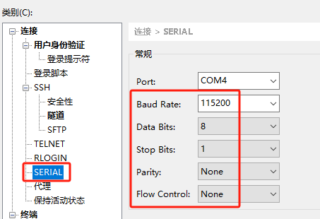

# 随记：

# 一、烧录与串口终端的连接

## 1.烧录固件

、 烧录固件时需要在上电前，使用跳线帽短接BOOT 引脚；然后打开烧录程序，点击“开
始”；对设备进行上电后，尽快把USB 线插入电脑；等待1s~10s 不等的时间，烧录就会
开始；烧录完成后，关闭软件的烧录、切断电源、拔出USB 线；拔出BOOT 跳线帽后，
设备上电后就可以开始工作。
5、 最近使用烧录软件时发现的注意

注意贴胶带的两端朝上
## 2.串口终端

## 3.

# 二、WiFi的资料

## 1.wifi型号与规格

atbm6031-x   使用sdio总线

## 2. [[君正T23N芯片开发/【君正T23N_IPC】/wifi开发记录/assets/1.wifi环镜配置/file-20250810171420834.pdf]]
系统启动后调试wifi

## 3.wifi开发环境

# 三、成功的样机

## 1.脚本
rcS没改

## 2.程序与驱动

## 3.

# 四、

## 1.

## 2.

## 3.
 

