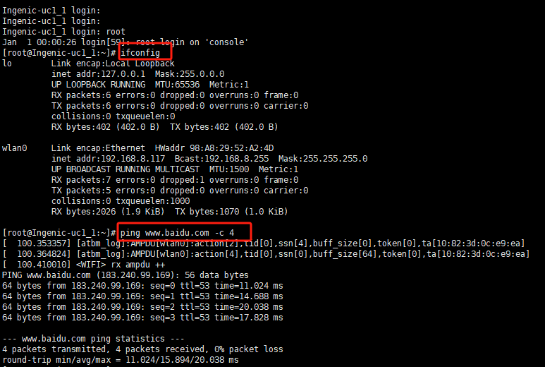

6441驱动交叉编译记录

# 随记：

<span style="background:#fdbfff">第一步：先看soc芯片厂商是否有配好驱动源码，一般都是有的。</span>

<span style="background:#fdbfff">君正官方的， WiFi驱动移植没有蓝牙低功耗功能，还是用WiFi原厂的吧</span>


<span style="background:#affad1">编译驱动，一定要原配的内核。之前加载驱动无报错但无法检测到新的SDIO卡，多半是这个原因。</span>[[成功加载的wifi驱动的打印信息]]

有一些平台刚上电 sdio 不稳定就需要复位一下 sdio wifi，那么就<span style="background:#affad1">需要增加复位扫卡的动作。</span>
# 报错：加载成功，但是没有生成设备节点，没有识别到mmc1进行配置


<span style="background:#b1ffff">主要修改这两个</span>

- <span style="background:#affad1"> 报"Unknown symbol ingenic_sdio_wlan_atbm_power_onoff (err 0)" 的主要原因。</span>


-
- 

还要修改一些文档没提到的地方：主要是去掉一些调试信息，修改一些重要常数，等其他地方。


# 一、资料

> [!PDF|important] [[ATBM WIFI4 驱动配置说明_FAQ_V4.4.pdf#page=4&selection=18,0,20,11&color=important|ATBM WIFI4 驱动配置说明_FAQ_V4.4, p.4]]
> > 1 单独编译驱动的编译方法
> 
> 

 > [!PDF|important] [[T23 BSP开发参考V1.1.pdf#page=39&selection=60,0,62,4&color=important|T23 BSP开发参考V1.1, p.39]]
> > 6.11 Wifi
> 
> 

> [!PDF|note] [[T23 BSP开发参考V1.1.pdf#page=31&selection=280,0,336,2&color=note|T23 BSP开发参考V1.1, p.31]]
> > gpio_num 即 GPIO 号。计算公式为： PA(n) = 0 * 32 + n PB(n) = 1 * 32 + n ... 例如：申请 PB(10) = 1 * 32 + 10 = 42
> 
> 

PB28---》32+28=60
## 原理图
[[君正T23芯片开发/sdk_资料库/资料库/wifi_资料库/WebRTC_Rotatable_Camera_v1_0 SCH 20241125.dsn|WebRTC_Rotatable_Camera_v1_0 SCH 20241125]]

[[wifi引脚接口(原理图分析)]]

# 二、wifi驱动源码配置

## 1.调整makefile指定编译器和内核目录

在makefile前面添加platform的定义，后面添加编译器路径：
```
#def of platform 
platform ?=PLATFORM_INGENICT31        
```

```
// 重点，直接导出环境，防止出错。

KERDIR:=/home/ming/workspace/ISVP-T23-1.1.2-20240204/software/zh/Ingenic-SDK-T23-1.1.2-20240204-zh/opensource/kernel/
CROSS_COMPILE:=/home/ming/workspace/ISVP-T23-1.1.2-20240204/software/zh/Ingenic-SDK-T23-1.1.2-20240204-zh/resource/toolchain/gcc_540/mips-gcc540-glibc222-64bit-r3.3.0.smaller/bin/mips-linux-gnu-
ATBM_WIFI__EXT_CCFLAGS = -DATBM_WIFI_PLATFORM=24
```

```#Linuxx
sys?= Linux
#arch:arm or arm64 or mips(NVT98517)
arch ?= mips

#cross compile path
ifeq ($(platform),PLATFORM_INGENICT31)
KERDIR:=/home/ming/workspace/ISVP-T23-1.1.2-20240204/software/zh/Ingenic-SDK-T23-1.1.2-20240204-zh/opensource/kernel/
CROSS_COMPILE:=/home/ming/workspace/ISVP-T23-1.1.2-20240204/software/zh/Ingenic-SDK-T23-1.1.2-20240204-zh/resource/toolchain/gcc_540/mips-gcc540-glibc222-64bit-r3.3.0.smaller/bin/mips-linux-gnu-
ATBM_WIFI__EXT_CCFLAGS = -DATBM_WIFI_PLATFORM=24
arch = mips
endif
```


// 重点，直接导出环境，防止出错。


<span style="background:#b1ffff">交叉编译器仅量用完整路经</span>

<span style="background:#b1ffff"> SDIO 中断方式</span>
## 2、menuconfig选择一些基本配置项
选择 ATBM603x-x/y && ATBM6012B-x/y 型号
wifi型号根据实际为 CONFIG_ATBM6012B_y

选择 sdio 总线
2.4G channel : 只支持 2.4G
 使用.h wifi固件
不用驱动一些扩展功能

频段选择为 CONFIG_ATBM_WITHBAND_2_4G_ONLY_HT20
打开ble功能 CONFIG_ATBM_BLE=y

修改 wifi 接口名称（没必要）

选择 ATBM6012B-y chip ：
vid = 0x007a
pid = 0x6011

<span style="background:#b1ffff">解决文件无权限报错</span>


<span style="background:#b1ffff">图形化界面配置(.config文件)</span>
```
#
# Automatically generated file; DO NOT EDIT.
# Atbm Wifi Driver Configuration
#
CONFIG_ATBM_MENUCONFIG=y
CONFIG_ATBM_WIRELESS=y
# CONFIG_ATBM_WEXT is not set

#
# select which atbm Wi-Fi chip type
#
# CONFIG_ATBM603x is not set
CONFIG_ATBM6012B_y=y
# CONFIG_ATBM6132 is not set
# CONFIG_ATBM_USB_BUS is not set
CONFIG_ATBM_SDIO_BUS=y
# CONFIG_ATBM_SPI_BUS is not set
# CONFIG_ATBM_USE_FIRMWARE_BIN is not set
CONFIG_ATBM_USE_FIRMWARE_H=y
CONFIG_ATBM_SUPPORT_BAN_24G=y
# CONFIG_ATBM_SUPPORT_BAN_5G_PRETEND_24 is not set

#
# Driver Extern Function Select
#

#
# Select WIFI bandwidth configuration 
#
CONFIG_ATBM_WITHBAND_2_4G_ONLY_HT20=y
CONFIG_ATBM_SUPPORT_BRIDGE=y
CONFIG_ATBM_FUNC_NOTXCONFIRM=y
# CONFIG_ATBM_FUNC_EARLYSUSPEND is not set
CONFIG_ATBM_FUNC_MONITOR=y
# CONFIG_ATBM_FUNC_MONITOR_HDR_PRISM is not set
# CONFIG_ATBM_FUNC_SKB_DEBUG is not set
# CONFIG_ATBM_FUNC_MEM_DEBUG is not set
# CONFIG_ATBM_FUNC_P2P_ENABLE is not set
# CONFIG_ATBM_FUNC_SW_ENC is not set
CONFIG_ATBM_FUNC_DEV_CTRL_API=y
CONFIG_ATBM_FUNC_MODULE_FS=y
CONFIG_ATBM_FUNC_PRIVE_IE=y
CONFIG_ATBM_FUNC_SAE_AUTHEN=y

#
# Driver debug features
#
# CONFIG_ATBM_APOLLO_DEBUGFS is not set
# CONFIG_ATBM_APOLLO_DEBUG_ON_BOOT is not set
# CONFIG_ATBM_APOLLO_BH_DEBUG is not set
# CONFIG_ATBM_APOLLO_WSM_DEBUG is not set
# CONFIG_ATBM_APOLLO_WSM_DUMPS is not set
# CONFIG_ATBM_APOLLO_WSM_DUMPS_SHORT is not set
# CONFIG_ATBM_APOLLO_TXRX_DEBUG is not set
# CONFIG_ATBM_APOLLO_TX_POLICY_DEBUG is not set
# CONFIG_ATBM_APOLLO_STA_DEBUG is not set
# CONFIG_ATBM_APOLLO_DUMP_ON_ERROR is not set
# CONFIG_CERT_FIRMWARE is not set
# CONFIG_BLUEDROID is not set
CONFIG_ATBM_SDIO_MMCx="mmc1"
# CONFIG_ATBM_APOLLO_USE_GPIO_IRQ is not set
CONFIG_ATBM_APOLLO_SUPPORT_SGI=y
CONFIG_ATBM_WIFIIF1_NAME="wlan%d"
CONFIG_NEED_P2P0_INTERFACE=y
CONFIG_ATBM_WIFIIF2_NAME="p2p%d"
CONFIG_ATBM_MODULE_PM_STAYAWK="pm_stayawake"
CONFIG_ATBM_MODULE_DRIVER_NAME="atbm_wlan"
CONFIG_ATBM_PLATFORM_DEVICE_NAME="atbm_dev_wifi"
CONFIG_ATBM_SDIO_VID=0x007a
CONFIG_ATBM_SDIO_PID=0x6011
CONFIG_ATBM_MODULE_NAME="atbm6x3x_wifi_usb"
CONFIG_MAC80211_ATBM_RC_DEFAULT=""
CONFIG_ATBM_BLE=y
CONFIG_ATBM_BLE_WIFI_PLATFORM=y
# CONFIG_ATBM_ONLY_BLE_WIFI_PLATFORM is not set

```


 > [!PDF|note] [[ATBM WIFI4 驱动配置说明_FAQ_V4.4.pdf#page=15&selection=20,0,20,8&color=note|ATBM WIFI4 驱动配置说明_FAQ_V4.4, p.15]]
> > 驱动一些扩展功能
> 
> 不用管


## 3、调整firmware文件
按照文档，需要把firmware文件夹下的头文件复制到hal_apollo下面

只支持 BLE+WIFI，不支持纯 WIFI
此时只需要放置 BLE+WIFI 共存的 firmware 即可，不支持切换到纯 WIFI 固件，是为了编译出来的减小体积。
`cp ./firmware/Asmlite/ASMLITE_SDIO_24M_svn19040_WiFiBLECombIPC.h  ./hal_apollo/firmware_sdio.h`

## 4、驱动数据结构解析
根据原理图和platform的宏定义，指定对应的power管脚
```
struct atbm_platform_data {
    const char *mmc_id;
    const int irq_gpio;
    const int power_gpio;
    const int reset_gpio;
    int (*power_ctrl)(const struct atbm_platform_data *pdata,
              bool enable);
    int (*clk_ctrl)(const struct atbm_platform_data *pdata,
              bool enable);
    int (*insert_ctrl)(const struct atbm_platform_data *pdata,
              bool enable);
};

struct atbm_platform_data platform_data = {
#ifdef SDIO_BUS
    .mmc_id       = CONFIG_ATBM_SDIO_MMC_ID,
    .clk_ctrl     = NULL,
    .power_ctrl   = atbm_power_ctrl,
    .insert_ctrl  = atbm_insert_crtl,
#if(ATBM_WIFI_PLATFORM == PLATFORM_XUNWEI)
    .irq_gpio    = EXYNOS4_GPX2(4),
    .power_gpio    = EXYNOS4_GPC1(1),
#endif
#if(ATBM_WIFI_PLATFORM == PLATFORM_AMLOGIC_S805)
    .irq_gpio    = INT_GPIO_4,
    .power_gpio    = 0,
#endif
#if(ATBM_WIFI_PLATFORM == PLATFORM_AMLOGIC_905)
    .irq_gpio    = 100,
    .power_gpio    = 0,
#endif
#if(ATBM_WIFI_PLATFORM == PLATFORM_FRIENDLY)
    .power_gpio    = EXYNOS4_GPK3(2),
#endif
#if(ATBM_WIFI_PLATFORM == PLATFORM_GK7202V330)
    .power_gpio = GK7202V330_WIFI_RESET_GPIO,
#endif
#if(ATBM_WIFI_PLATFORM == PLATFORM_INGENICT31)
    .power_gpio = 0*32+6,
#endif
    .reset_gpio = 0,
#else
    .clk_ctrl     = NULL,
    .power_ctrl   = NULL,
    .insert_ctrl  = NULL,
#endif
};
```


## 5、修改外部调用（复位&扫卡动作）
<span style="background:#b1ffff">增加复位&扫卡动作，直接套用君正T31的模板即可</span>

修改atbm_platform.c文件的atbm_platform_power_ctrl、atbm_platform_insert_crtl两个static函数
当ATBM_WIFI_PLATFORM == PLATFORM_INGENICT31的时候，申明外部函数和一个外部io定义
```
#if (ATBM_WIFI_PLATFORM == PLATFORM_INGENICT31)
extern int jzmmc_manual_detect(int index,int on);
static int WL_REG_EN = 32+26 ;
#endif
```


这些定义具体用在这些地方：
在atbm_platform_power_ctrl中，对于宏定义为t31平台时，这么处理
```
#if (ATBM_WIFI_PLATFORM == PLATFORM_INGENICT31)
    if(enabled)
    {
        atbm_printk_platform("[%s]:reset altobeam platform wifi...\n",__func__);
        gpio_request(WL_REG_EN,"sdio_wifi_power_on");

        atbm_printk_platform("[%s]:reset altobeam platform wifi to 0\n",__func__);
        gpio_direction_output(WL_REG_EN,0);
        msleep(300);

        atbm_printk_platform("[%s]:reset altobeam platform wifi to 1\n",__func__);
        gpio_direction_output(WL_REG_EN,1);
        msleep(100);
    }

#endif
```

在atbm_platform_insert_crtl中，对于宏定义为t31平台时，这么处理
```
#if (ATBM_WIFI_PLATFORM == PLATFORM_INGENICT31)
    mdelay(100);
    jzmmc_manual_detect(1,enabled);
    atbm_printk_platform("=========platform insert ctrl = %d====================\n",enabled);

#endif
```

## 6.其他：

[[wifi驱动调试记录-高拓讯达#报错：加载成功，但是没有生成设备节点，没有识别到mmc1进行配置]]

### hal_apollo/apollo_plat.h
/home/ming/workspace/ATBM_LINUX_WIFI4_BLE_SVN3407_AsmLite19040_ARESM18826_Meru19963_V1.1_20241023/hal_apollo/apollo_plat.h
```
#ifndef  ATBM_WIFI_PLATFORM
#define ATBM_WIFI_PLATFORM			PLATFORM_INGENICT31
#endif

```
### hal_apollo/Makefile
/home/ming/workspace/ATBM_LINUX_WIFI4_BLE_SVN3407_AsmLite19040_ARESM18826_Meru19963_V1.1_20241023/hal_apollo/Makefile
```
ifeq ($(SDIO_BUS),y)
ccflags-y += -DATBM_WIFI_PLATFORM=24
ccflags-y += -DATBM_SDIO_PATCH
ccflags-y += -DCONFIG_TX_NO_CONFIRM
endif

```


# 二、内核配置
## 调整君正sdk内核配置

> [!PDF|note] [[T23 BSP开发参考V1.1.pdf#page=39&selection=163,1,168,2&color=note|T23 BSP开发参考V1.1, p.39]]
> > .11.1 Wifi 内核配置
> 
> 

<span style="background:#b1ffff">内核的make menuconfig</span>

<span style="background:#b1ffff">唐工的内核图形化配置（直接用）</span>
<span style="background:#d3f8b6">D:\obsidian\ming\ming\君正T23芯片开发\sdk_资料库\wifi开发资料库\.config</span>


<span style="background:#b1ffff">根据原理图，调整如下文件的io定义</span>
/home/ming/workspace/ISVP-T23-1.1.2-20240204/software/zh/Ingenic-SDK-T23-1.1.2-20240204-zh/opensource/kernel/arch/mips/xburst/soc-t23/chip-t23<span style="background:#b1ffff">/isvp/common/mmc.c</span>
原来是这么写的
```
#ifdef CONFIG_JZMMC_V12_MMC1
#ifdef CONFIG_BCM_PM_CORE
 extern int bcm_wlan_init(void);
#endif
 struct jzmmc_platform_data sdio_pdata = {
     .removal              = MANUAL,
     .sdio_clk            = 1,
     .ocr_avail            = MMC_VDD_29_30 | MMC_VDD_30_31,
     .capacity              = MMC_CAP_4_BIT_DATA | MMC_CAP_SDIO_IRQ,
     .max_freq                       = CONFIG_MMC1_MAX_FREQ,
     .recovery_info            = NULL,
     .gpio                = NULL,  <--这里调整，指向新增的结构体&wifi_gpio
 #ifdef CONFIG_MMC1_PIO_MODE
     .pio_mode            = 1,
 #else
     .pio_mode            = 0,
 #endif
#ifdef CONFIG_BCM_PM_CORE
     .private_init            = bcm_wlan_init,
#else
     .private_init            = NULL,
#endif
 };
 #endif

具体定义如下
static struct card_gpio wifi_gpio = {
    .wp            = {GPIO_WLAN_WP,    GPIO_MMC_WIFI_RST_N_LEVEL},
    .cd            = {GPIO_WLAN_CD,    GPIO_MMC_WIFI_RST_N_LEVEL},
    .pwr        = {WLAN_PWR_EN,    GPIO_MMC_WIFI_POWER_LEVEL},
    .rst        = {WL_REG_EN,    GPIO_MMC_WIFI_RST_N_LEVEL},
};

```

根据原理图，调整对应io定义的头文件：
wl_reg_en<span style="background:#b1ffff">这些管脚的定义需要在board.h里面维护</span>，他的路径在
/home/ming/workspace/ISVP-T23-1.1.2-20240204/software/zh/Ingenic-SDK-T23-1.1.2-20240204-zh/opensource/kernel/arch/mips/xburst/soc-t23/chip-t23/isvp/Pike/board.h
根据原理图的实际定义修改了这些地方

#define WL_WAKE_HOST 焕醒引脚
#define WL_REG_EN     复位
#define WLAN_PWR_EN   电源始能

```
/* ****************************GPIO WIFI START******************************* */
#define WL_WAKE_HOST    GPIO_PB(28)//GPIO_PC(8) i change
#define WL_REG_EN    GPIO_PB(26)//GPIO_PC(9)
#define WL_MMC_NUM    1 //sdio use MMC1

#define WLAN_PWR_EN    GPIO_PA(6)//(-1) i change
#define BCM_PWR_EN    (-1)
#define PWM_32K_OUTPUT 1//1:enable 32k output -1:disable 32k

#define GPIO_MMC_WIFI_POWER_LEVEL        HIGH_ENABLE
#define GPIO_MMC_WIFI_RST_N_LEVEL       LOW_ENABLE
#define GPIO_WLAN_WP -1
#define GPIO_WLAN_CD -1
/* ****************************GPIO WIFI END********************************* */
```

# 三、编译装载ko

## 方法一：直接编译 
```
make;
make strip;
```


## 方法二：带参数编译
```
make platform=PLATFORM_INGENICT31 KERDIR=/home/ming/workspace/ISVP-T23-1.1.2-20240204/software/zh/Ingenic-SDK-T23-1.1.2-20240204-zh/opensource/kernel/ CROSS_COMPILE=/home/ming/workspace/ISVP-T23-1.1.2-20240204/software/zh/Ingenic-SDK-T23-1.1.2-20240204-zh/resource/toolchain/gcc_540/mips-gcc540-glibc222-64bit-r3.3.0.smaller/bin/mips-linux-gnu- sys=Linux arch=mips 

make platform=PLATFORM_INGENICT31 KERDIR=/home/ming/workspace/ISVP-T23-1.1.2-20240204/software/zh/Ingenic-SDK-T23-1.1.2-20240204-zh/opensource/kernel/ CROSS_COMPILE=/home/ming/workspace/ISVP-T23-1.1.2-20240204/software/zh/Ingenic-SDK-T23-1.1.2-20240204-zh/resource/toolchain/gcc_540/mips-gcc540-glibc222-64bit-r3.3.0.smaller/bin/mips-linux-gnu- sys=Linux arch=mips strip

```


## 加载驱动

```
insmod atbm6x3x_wifi_usb.ko wifi_bt_comb=1
```


```
[root@Ingenic-uc1_1:modules]# ifconfig -a
lo        Link encap:Local Loopback  
          inet addr:127.0.0.1  Mask:255.0.0.0
          UP LOOPBACK RUNNING  MTU:65536  Metric:1
          RX packets:0 errors:0 dropped:0 overruns:0 frame:0
          TX packets:0 errors:0 dropped:0 overruns:0 carrier:0
          collisions:0 txqueuelen:0 
          RX bytes:0 (0.0 B)  TX bytes:0 (0.0 B)

p2p0      Link encap:Ethernet  HWaddr 9A:A8:29:52:A2:4D  
          BROADCAST MULTICAST  MTU:1500  Metric:1
          RX packets:0 errors:0 dropped:0 overruns:0 frame:0
          TX packets:0 errors:0 dropped:0 overruns:0 carrier:0
          collisions:0 txqueuelen:1000 
          RX bytes:0 (0.0 B)  TX bytes:0 (0.0 B)

wlan0     Link encap:Ethernet  HWaddr 98:A8:29:52:A2:4D  
          BROADCAST MULTICAST  MTU:1500  Metric:1
          RX packets:0 errors:0 dropped:0 overruns:0 frame:0
          TX packets:0 errors:0 dropped:0 overruns:0 carrier:0
          collisions:0 txqueuelen:1000 
          RX bytes:0 (0.0 B)  TX bytes:0 (0.0 B)

[root@Ingenic-uc1_1:modules]# ifconfig wlan0 up
[  149.504873] [atbm_log]:atbm_setup_mac:addr(98a82952a24d)
[  149.510777] [atbm_log]:3 !!! atbm_vif_setup_params: enabling priv
[  149.543358] [atbm_log]:[STA] Interface ID:0 of type:2 added
[  149.549484] [atbm_log]:atbm_set_uapsd_param:uapsdFlags(0)
[  149.556195] [atbm_log]:br0_netdev_open()-1201: dev_get_by_name(br0)
[  149.563369] [atbm_log]:atbm_set_uapsd_param:uapsdFlags(0)
[  149.569974] [atbm_log]:atbm_set_uapsd_param:uapsdFlags(0)
[  149.576668] [atbm_log]:atbm_set_uapsd_param:uapsdFlags(0)
[  149.583257] [atbm_log]:atbm_set_uapsd_param:uapsdFlags(0)
[root@Ingenic-uc1_1:modules]# ifconfig 
lo        Link encap:Local Loopback  
          inet addr:127.0.0.1  Mask:255.0.0.0
          UP LOOPBACK RUNNING  MTU:65536  Metric:1
          RX packets:0 errors:0 dropped:0 overruns:0 frame:0
          TX packets:0 errors:0 dropped:0 overruns:0 carrier:0
          collisions:0 txqueuelen:0 
          RX bytes:0 (0.0 B)  TX bytes:0 (0.0 B)

wlan0     Link encap:Ethernet  HWaddr 98:A8:29:52:A2:4D  
          UP BROADCAST MULTICAST  MTU:1500  Metric:1
          RX packets:0 errors:0 dropped:0 overruns:0 frame:0
          TX packets:0 errors:0 dropped:0 overruns:0 carrier:0
          collisions:0 txqueuelen:1000 
          RX bytes:0 (0.0 B)  TX bytes:0 (0.0 B)

[root@Ingenic-uc1_1:modules]# 

```


# 四、wifi配网

### 用wpa_cli和wpa_supplicant配置Liunx开发板的wlan0无线网

D:\obsidian\ming\ming\君正T23芯片开发\sdk_资料库\wifi开发资料库\wpa_cli
D:\obsidian\ming\ming\君正T23芯片开发\sdk_资料库\wifi开发资料库\wpa_supplicant
### 法一(不行)：
[使用wpa\_cli和wpa\_supplicant配置Liunx开发板的wlan0无线网-CSDN博客](https://blog.csdn.net/u013171226/article/details/147210210)
add_network
set_network 0 ssid "gznscy"       #这是无线网的名字
set_network 0 psk "maileizhi716"    #这是无线网的密码
set_network 0 key_mgmt NONE
enable_network 0

### 法二：用脚本


`ifconfig wlan0 up`
`/system/scripts/connect_ap.sh gznscy  maileizhi716`
 


`ping [www.baidu.com](http://www.baidu.com) -c 4`


