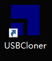
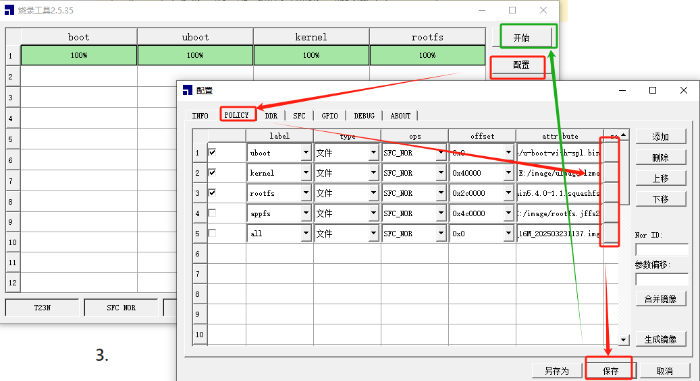
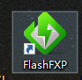
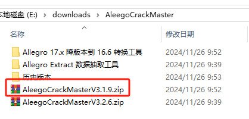

[【君正T31开发记录】1.开发环境准备-CSDN博客](https://blog.csdn.net/qq_42425882/article/details/143638010?spm=1001.2014.3001.5502)
# 随记：

# 一、 1.准备Linux开发环境

## 1.ubuntu22.04

## 2.sdk+文档
 
E:\sdk\ISVP-T23-1.1.2-20240204\ISVP-T23-1.1.2-20240204\software\zh

## 3.原理图PCB

E:\sdk\Ingenic-HDK-T23-V1.2-20240322\Document_cn

# 二、2.安装交叉编译链

## 1.安装 Toolchain
> [!PDF|important] [[T23 SDK安装及使用指南.pdf#page=6&selection=95,0,98,9&color=important|T23 SDK安装及使用指南, p.6]]
> > 如何安装 Toolchain
> 
> 

### 源码位置
E:\sdk\ISVP-T23-1.1.2-20240204\ISVP-T23-1.1.2-20240204\software\zh\Ingenic-SDK-T23-1.1.2-20240204-zh\resource\toolchain\gcc_540

## 2.  配置环境变量

> [!PDF|note] [[T23 SDK安装及使用指南.pdf#page=6&selection=149,0,182,1&color=note|T23 SDK安装及使用指南, p.6]]
> > 第三步：通过 export PATH=xxxx:$PATH 命令，将 toolchain 下的 bin 目录添加到 PATH 环境变量中或者在~/.bashrc 中加上下面一句永久改变。
> 
> 

export PATH=/home/ming/workspace/ISVP-T23-1.1.2-20240204/software/zh/Ingenic-SDK-T23-1.1.2-20240204-zh/resource/toolchain/gcc_540/mips-gcc540-glibc222-64bit-r3.3.0.smaller/bin:$PATH

# 三、烧录

## 1.密码

> [!PDF|yellow] [[USBCloner烧录工具指南V2.pdf#page=35&selection=48,0,55,1&color=yellow|USBCloner烧录工具指南V2, p.35]]
> > 防止工厂人员修改烧录配置操作。如需修改需要输入密码“！@#”，
> 
> 

## 2.USBCloner工具

- 点击“开始”及进入烧录状态。
- 开发板常按住boot键（sd卡槽旁）并点按一下reset键，使开发板也进入烧录模式。

	烧录完后。重启

4.1 基本操作 
1. 打开“配置”窗口，选择与设备对应的“平台”和“板级”配置。 
2. 选择烧录镜像路径，如需修改默认策略配置，请参阅“界面介绍”章节。
3. 点击“保存”按钮，保存配置。
4. 点击“开始”按钮，设备进入 USB BOOT 模式后开始烧录

> [!PDF|important] [[USBCloner烧录工具指南V2.pdf#page=34&selection=100,0,100,4&color=important|USBCloner烧录工具指南V2, p.34]]
> > 烧录基本操作
> 
> 

# 四、开发软件

## 1.shh软件

## 2.串口终端

## 3.PCB看图

# 五、sdk的使用

> [!PDF|important] [[T23 SDK安装及使用指南.pdf#page=8&selection=44,0,46,4&color=important|T23 SDK安装及使用指南, p.8]]
> > SDK 目录介绍
> 
> 

