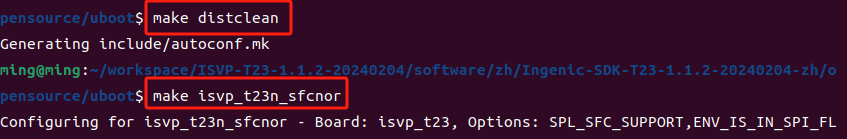
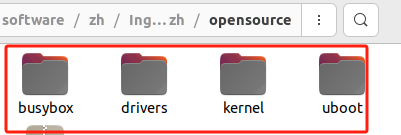
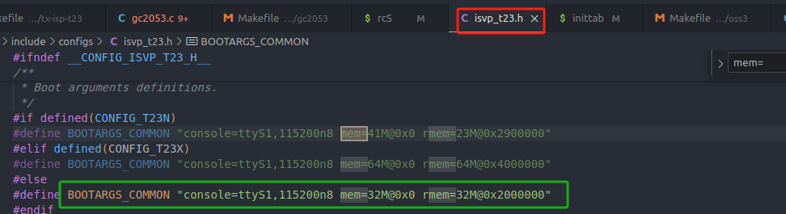
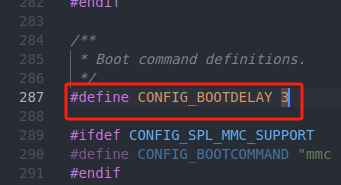
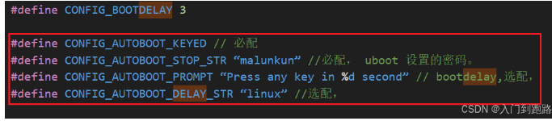
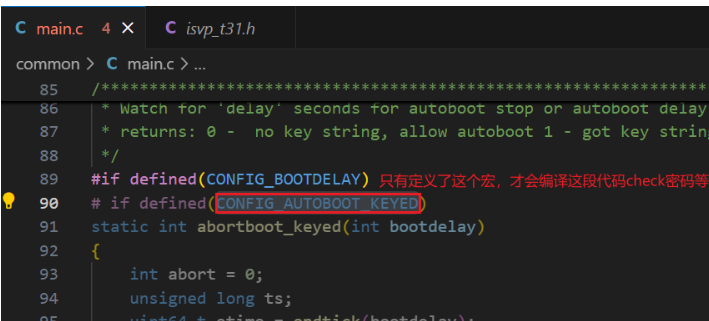

[【君正T31开发记录】2.uboot配置及交叉编译\_君正 编译库-CSDN博客](https://blog.csdn.net/qq_42425882/article/details/143644523?spm=1001.2014.3001.5502)
# 随记：

# 一、单独编译

## 1.编译流程
> [!PDF|important] [[T23 BSP开发参考V1.1.pdf#page=12&selection=42,0,47,2&color=important|T23 BSP开发参考V1.1, p.12]]
> > 3.1 Uboot 编译
> 
> 

> [!PDF|important] [[T23 软件资源编译指南.pdf#page=7&selection=197,0,201,2&color=important|T23 软件资源编译指南, p.7]]
> 1.2 Uboot 编译

T23 u-boot 的板机配置文件位于 include/configs/isvp_t23.h。

第一步: $ make distclean 清除旧配置。
第二步 : $ make isvp_t23x_xxx 根据对应芯片类型编译 uboot ， 生成对应的 u-boot-with-spl.bin。
（make isvp_t23x_sfcnor）

## 2.位置
 /home/ming/workspace/ISVP-T23-1.1.2-20240204/software/zh/Ingenic-SDK-T23-1.1.2-20240204-zh/opensource

# 二、修改uboot配置

> [!PDF|important] [[T23 软件资源编译指南.pdf#page=5&selection=40,0,42,2&color=important|T23 软件资源编译指南, p.5]]
> > Uboot 配置
> 
> 

## 1.修改内核启动后的内存配置
首先了解我们现在这个模组的参数：200W sensor、板载64M DDR，16M flash（这些外围器件和官网不同，卖家有更改）
T31zl支持H.264 H.265 MPEG硬编码，这个具体在sdk api用到的时候再细说，先暂时选H.264编码，方便兼容播放器。
根据君正提供的rmem计算文档，填写具体参数后：
[“图片库”页上的图片](onenote:https://d.docs.live.net/52D4B76BB0FFCF51/문서/嵌入式音视频开发/T23%20PIKE开发板/T23%20PIKE开发板使用指南.pdf.one#图片库&section-id={F4EC957E-6029-46FD-BAE8-8DD402BF0FDF}&page-id={2A156D52-A63D-4711-99EC-86066BB061E5}&object-id={5AC85B8E-1B60-43D1-8D53-641003057BB1}&14)  ([Web 视图](https://onedrive.live.com/view.aspx?resid=52D4B76BB0FFCF51%21s4c6b736f859f421fb694e7a3fd2f659b&id=documents&wd=target%28T23%20PIKE%E5%BC%80%E5%8F%91%E6%9D%BF%2FT23%20PIKE%E5%BC%80%E5%8F%91%E6%9D%BF%E4%BD%BF%E7%94%A8%E6%8C%87%E5%8D%97.pdf.one%7CF4EC957E-6029-46FD-BAE8-8DD402BF0FDF%2F%E5%9B%BE%E7%89%87%E5%BA%93%7C2A156D52-A63D-4711-99EC-86066BB061E5%2F%29&wdpartid=%7bE22066EF-B3AD-448F-9065-664ED27DC922%7d%7b1%7d&wdsectionfileid=52D4B76BB0FFCF51!sbdbbc49b33bd45ec908aa85a8657b86f))

根据生成的cmdline修改板卡uboot配置项：

mem表示内核启动后的保留内存，rmem是预留给SDK的内存，总大小64M

rmem计算表格

## 2.修改uboot等待时间
 为了调试方便，先暂时停留3s有足够时间进入uboot，后续内核、驱动啥的没问题不需要进uboot的时候我们再把参数改小减少上电等待时间：

## 3.添加uboot配置密码

# 三、

## 1.

## 2.

## 3.

