[【君正T31开发记录】4.busybox工具集编译及根文件系统制作\_t31文件系统制作-CSDN博客](https://blog.csdn.net/qq_42425882/article/details/143688764)

# 随记：
前边，已经完成kernel启动，最后panic，因为VFS加载不到根文件系统，现在我们来打包一个根文件系统并将常用工具一起打包在根文件系统镜像中。
根文件系统，其实就是Linux kernel起来以后的 / 路径，里边包含/etc/ /proc/ /tmp/ /lib/等一系列文件夹及常用命令行程序如ls cd等，还有运行环境包括glibc等一系列动态库文件，还有环境初始化脚本如/etc/init.d/rcS。Linux kernel起来以后，根目录会挂载到根目录上。

这里用到busybox，只是因为busybox集合了linux常用的一系列应用程序，不需要我们一个一个找源码去交叉编译，生成的产物提供到根文件系统去打包而已。

后边还有记得拷贝官方驱动文件，配置开机挂载驱动这个，放到后边简单开机测试的时候说
[[君正T23N芯片开发/【君正T32N-PIKE开发板】/5.T31驱动移植及加载、测试]]

# 一、官方的Squashfs 、Jffs2文件系统

squashfs 和 yaffs2 文件系统可直接烧录

同时烧俩个有段错误(Segmentation fault)，- 能登录但shell功能异常。
只烧squashfs，只能只读。
只烧Jffs2，系统启动不了。

## 1.Squashfs 文件系统（用这个）

> [!PDF|important] [[T23 文件系统制作指南.pdf#page=8&selection=37,0,40,8&color=important|T23 文件系统制作指南, p.8]]
> >  Squashfs 文件系统制作方法
> 
> 

> [!PDF|note] [[T23 文件系统制作指南.pdf#page=8&selection=100,0,113,32&color=note|T23 文件系统制作指南, p.8]]
> > 1．解压 squashfs.tar.bz2 压缩包命令：tar -jxvf root-uclibc-toolchain540.tar.bz2
> 
> 

解压 squashfs.tar.bz2 压缩包命令：tar -jxvf root-uclibc-toolchain540.tar.bz2

制作 squashfs 文件系统命令：
mksquashfs root-uclibc-toolchain540 root-uclibc-toolchain5.4.0-1.1.squashfs -comp xz
mksquashfs root-uclibc-toolchain540 root-uclibc-toolchain5.4.0-1.1.squashfs -comp xz

mksquashfs root-uclibc-toolchain540 rootfs.squashfs -comp xz
- 在这条命令中，`root-uclibc-toolchain540` 是源目录，`root-uclibc-toolchain5.4.0-1.1.squashfs` 是生成的目标文件系统名称。
- `-comp xz` 参数指定了使用 XZ 算法进行压缩。XZ 提供了较高的压缩比，但可能会增加压缩时间。
### 其他参数

- `-b BLOCK_SIZE` 可以指定块大小，默认为 128KB。如果需要指定不同的块大小，可以添加此选项，例如 `-b 256K` 来设置块大小为 256KB。
- 如果不指定 `-comp` 参数，将会默认使用 gzip 压缩算法。

mksquashfs root-uclibc-toolchain540 rootfs.squashfs -comp xz
mksquashfs root-uclibc-toolchain540 rootfs.squashfs -comp xz

 rm -rf rootfs.squashfs  

###  注意！ 
mksquashfs工具制作的时候，有修改记得删除之前生成的文件系统文件，实测重复生成是基于之前的生成文件附加后边的修改，如果在之前生成的文件系统修改生成，会附加一堆重复文件及文件夹，导致附加出来一堆带后缀的文件夹，导致生成自己不想要的文件系统。
## 2.Jffs2文件系统
 
> [!PDF|important] [[T23 文件系统制作指南.pdf#page=9&selection=0,3,34,8&color=important|T23 文件系统制作指南, p.9]]
> > T23 文件系统制作指南 T23 文件系统制作指南 Copyright® 2005-2022 Ingenic Semiconductor Co., Ltd. All rights reserved. 5 2.2 Jffs2 文件系统制作方法
> 
> 

mkfs.jffs2 -r ./appfs/ -o appfs.jffs2 -e 0x8000 -n -l -X zlib
mkfs.jffs2 -r ./appfs/ -o appfs.jffs2 -e 0x8000 -n -l -X zlib

命令: mkfs.jffs2 -o root-uclibc-toolchain5.4.0-1.1.jffs2 -r root-uclibc-toolchain540 -e 0x10000 -s 0x1000 -n -l -X zlib --pad=0x10000

- `-o root-uclibc-toolchain5.4.0-1.1.jffs2`:
    
    - **含义**: 指定输出文件名。这里，生成的 JFFS2 文件系统镜像将被命名为 `root-uclibc-toolchain5.4.0-1.1.jffs2`。
- `-r root-uclibc-toolchain540
    
    - **含义**: 指定要转换为 JFFS2 文件系统的根目录路径。所有位于 `root-uclibc-toolchain5.4.0-1.1` 目录下的文件和子目录都会被包含在生成的文件系统镜像中。

mkfs.jffs2 -r ./appfs/ -o appfs.jffs2 -e 0x8000 -n -l -X zlib

`-e` 或 `--eraseblock=SIZE` 是 `mkfs.jffs2` 工具中用于指定 **擦除块大小（Erase Block Size）** 的关键参数。

- **默认值**：64KB（即 `0x10000` 字节）。
- **核心功能**：定义 JFFS2 文件系统镜像在 Flash 存储设备上的最小擦除单元。这是由 Flash 硬件的物理特性决定的，必须与目标设备的 Flash 芯片规格严格匹配。

## 3.补充

> [!PDF|important] [[T23 文件系统制作指南.pdf#page=7&selection=52,0,54,6&color=important|T23 文件系统制作指南, p.7]]
> > 1.3.2 文件系统搭建
> 
> 
> > 直接使用君正提供的基本文件系统压缩包开发，用户可以把 Busybox 生成的相关文件替换到压缩包，然后制作成文件系统就可以使用这些工具。

# 二、SDK sample 编译及使用

## 1.sample文档讲解

> [!PDF|important] [[T23 软件资源编译指南.pdf#page=15&selection=36,0,42,2&color=important|T23 软件资源编译指南, p.15]]
> > 5.1 SDK sample 编译
> 
> 

SDK Sample 是厂商提供的 **“功能演示模板”**，像乐高说明书一样，教你如何用SDK快速实现某个功能（比如人脸识别、联网控制）。

---
### **3个核心作用**

1. **快速验证**：
    
    - 5分钟跑通一个功能（如调用摄像头拍照），确认SDK是否满足需求。
        
2. **学习参考**：
    
    - 提供标准代码写法，避免自己瞎摸索（比如“如何发送HTTP请求”）。
        
3. **二次开发基础**：
    
    - 在其上修改代码，变成你的实际项目（如把人脸识别改成车牌识别）

## 2.
 

## 3.

# 三、配置编译busybox

[[君正T23N芯片开发/【君正T32N-PIKE开发板】/4.busybox工具集编译及根文件系统制作#1.方案]]
## 1.编译busybox

与 kernel 的编译方法类似，需要先 make defconfig 再 make，之后 make install 会默认把安装文件生成”“ busybox/_install ”目录下。

> [!PDF|important] [[T23 BSP开发参考V1.1.pdf#page=15&selection=155,0,161,2&color=important|T23 BSP开发参考V1.1, p.15]]
> > 3.3 Busybox 编译
> 
> 

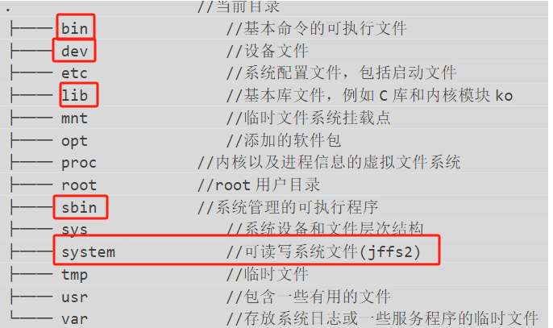

## 2.配置busybox（csdn）

没必要，用君正官方的基本都配好了

后期需要在根文件系统/etc/passwd添加用户密码配置，格式参考自己主机的格式。这里配置密码通配的话，还需要添加shadow文件用于存储本机密码，格式还是参考主机。

然后制作根文件系统的时候添加passwd文件设置默认密码或者空密码

在这里边去选自己需要的工具带上，不需要的裁剪掉减小根文件系统镜像大小。
现在调试阶段,暂时如下选：（总体思想：配网相关必须带上，权限设置的带上，磁盘挂载相关的必选，有动态加载卸载驱动的，驱动相关的也要带上，自己常用的指令编进去，能不在开发板上做的尽量都不要选，如果没有设置用户组管理的用户组配置的也全裁掉）
(只多不少)

make编译，make install安装

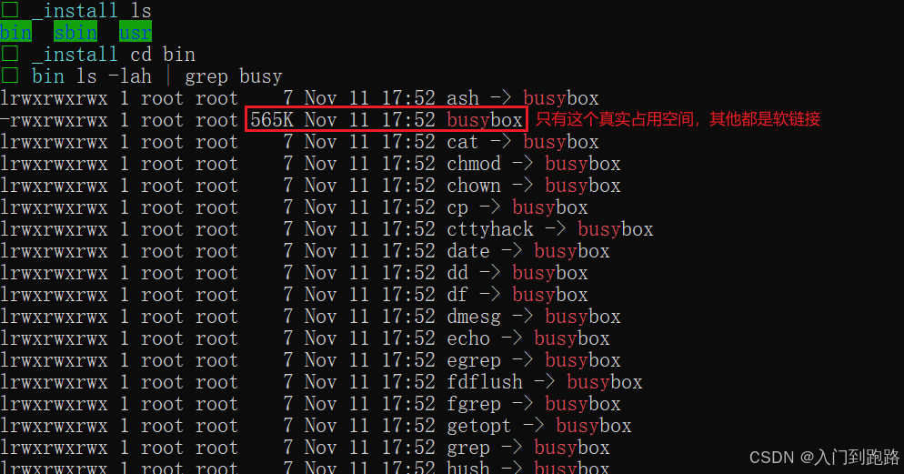
检查下目录下是否完整有自己需要的命令，若没有就`make menuconfig`选上重新编译，同理，发现有多的不必要的应用程序，就裁掉。

## 3.根据君正提供的配置文件配置busybox
> [!PDF|important] [[T23 文件系统制作指南.pdf#page=5&selection=50,0,52,6&color=important|T23 文件系统制作指南, p.5]]
> > 1.1 配置文件介绍
> 
> 

/home/ming/workspace/ISVP-T23-1.1.2-20240204/software/zh/Ingenic-SDK-T23-1.1.2-20240204-zh/opensource/busybox/configs

如果编译 glibc 的上面的工具可以不用配置flag。
> [!PDF|yellow] [[T23 文件系统制作指南.pdf#page=5&selection=109,0,113,4&color=yellow|T23 文件系统制作指南, p.5]]
> > 1.2.1 配置 flag
> 
> 

Lib/下面是相关的 C 库和工具库，都是从工具链下复制过来的，建议用户不要修改， 可以去对应的工具链下复制需要的库放到这里。其他的文件一般都是脚本和配置文件，可以直接延续使用之前的，用户可根据需求添加用户目录和脚本。目前的启动脚本存放在/etc/init.d/rcS。

 isvp_uclibc_defconfig 、isvp_glibc_defconfig 对文件系统下的工具支持比较完全 ， 但是整体文件大小会比较大 ； isvp_uclibc_mini_defconfig 、isvp_glibc_mini_defconfig 是君正根据上面完全的配置文件裁剪出比较常用的命令。

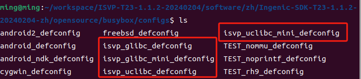

> [!PDF|note] [[T23 文件系统制作指南.pdf#page=6&selection=52,0,56,4&color=note|T23 文件系统制作指南, p.6]]
> > (1) uclibc 工具编译
> 
> 

# 四、最终方案

> [!PDF|important] [[T23 BSP开发参考V1.1.pdf#page=18&selection=180,0,186,4&color=important|T23 BSP开发参考V1.1, p.18]]
> > 4.4 Demo rootfs 简单说明
> 
> 
## 1.使用君正提供的基本文件系统(squashfs)+appfs文件夹(jffs2)

使用官方的Squashfs 文件系统，把busybox编译得到的bin、sbin、usr下文件拷呗补充过来

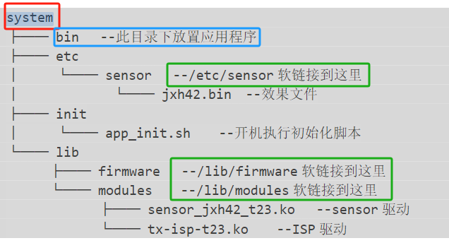

文件系统搭建直接使用君正提供的基本文件系统压缩包开发，用户可以把 Busybox 生成的相关文件替换到压缩包，然后制作成文件系统就可以使用这些工具。

注意  /lib 库下的内容，用户可以根据需求去添加，建议不要随意减少，以免导致应用程序不能运行。  建议替换之前先删除里面同名的文件，以避免制作的文件系统存在工具冲突
> [!PDF|note] [[T23 文件系统制作指南.pdf#page=7&selection=53,1,54,6&color=note|T23 文件系统制作指南, p.7]]
> > 文件系统搭建
> 
> 

推荐的系统搭建的方案是----系统 rootfs 以及不需要经常修改的系统分区采用 squashfs 文件系统，而配置分区 system 等需要经常读写的分区采用 jffs2 文件系统在system目录中

### .位置

/home/ming/workspace/ISVP-T23-1.1.2-20240204/software/zh/Ingenic-SDK-T23-1.1.2-20240204-zh/resource/rootfs_540/root-uclibc-toolchain540

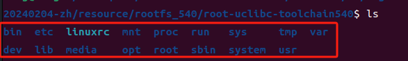

## 2.appfs(=/system目录)的使用

mkfs.jffs2 -r ./appfs/ -o appfs.jffs2 -e 0x8000 -n -l -X zlib
mkfs.jffs2 -r ./appfs/ -o appfs.jffs2 -e 0x8000 -n -l -X zlib

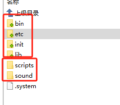

# 五、做根文件系统（csdn/官方有配好的）（无用）

## 1.包装一个根文件系统
[“图片库”页上的图片](onenote:https://d.docs.live.net/52D4B76BB0FFCF51/문서/嵌入式音视频开发/T23%20PIKE开发板/T23%20PIKE开发板使用指南.pdf.one#图片库&section-id={F4EC957E-6029-46FD-BAE8-8DD402BF0FDF}&page-id={2A156D52-A63D-4711-99EC-86066BB061E5}&object-id={04F3A94D-D5B1-4F82-8566-F2C279C25924}&17)  ([Web 视图](https://onedrive.live.com/view.aspx?resid=52D4B76BB0FFCF51%21s4c6b736f859f421fb694e7a3fd2f659b&id=documents&wd=target%28T23%20PIKE%E5%BC%80%E5%8F%91%E6%9D%BF%2FT23%20PIKE%E5%BC%80%E5%8F%91%E6%9D%BF%E4%BD%BF%E7%94%A8%E6%8C%87%E5%8D%97.pdf.one%7CF4EC957E-6029-46FD-BAE8-8DD402BF0FDF%2F%E5%9B%BE%E7%89%87%E5%BA%93%7C2A156D52-A63D-4711-99EC-86066BB061E5%2F%29&wdpartid=%7bE22066EF-B3AD-448F-9065-664ED27DC922%7d%7b1%7d&wdsectionfileid=52D4B76BB0FFCF51!sbdbbc49b33bd45ec908aa85a8657b86f))

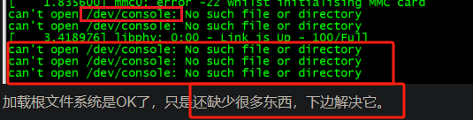

## 3.扩展
### init需要做的(/etc/inittab)：
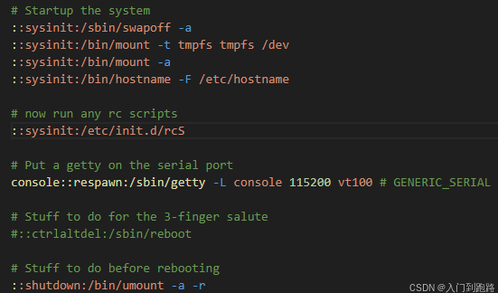
### 主机名设置(/etc/hostname):
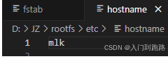

### 挂载点设置(/etc/fstab)：
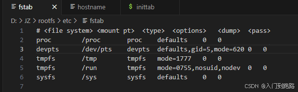

# 六、实践

## 1.把 Busybox 生成的相关文件替换到基本文件系统(squashfs)

制作成文件系统就可以使用这些工具
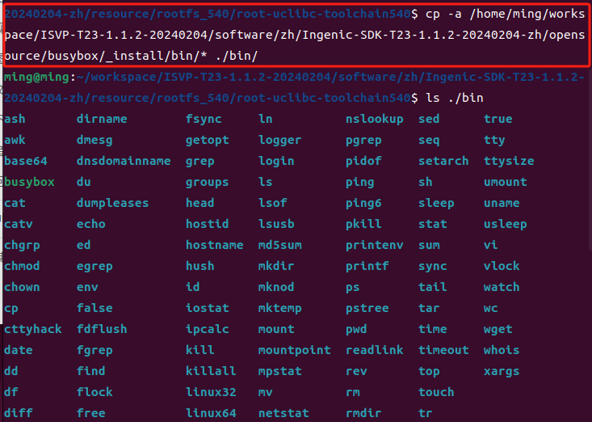

cp -a
cp -a /home/ming/workspace/ISVP-T23-1.1.2-20240204/software/zh/Ingenic-SDK-T23-1.1.2-20240204-zh/opensource/busybox/_install/bin/* ./bin/

## 2.编写脚本

/etc/init.d/rcS

appfs/init/appa_init.sh
appfs/init/start.sh

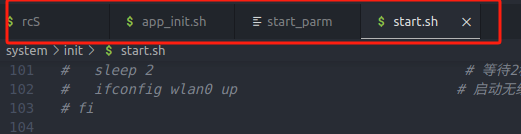

## 3.加载驱动
appfs/lib/modules/

appfs/etc/sensor/gc2053-t23.bin

## 4.应用程序
appfs/bin/

## 5.其他

