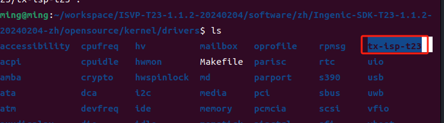
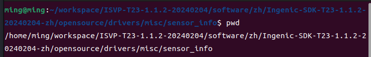
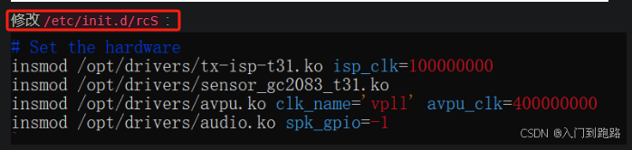
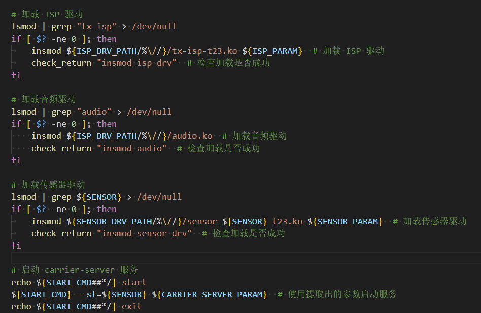
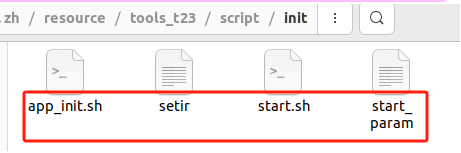
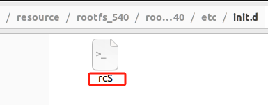
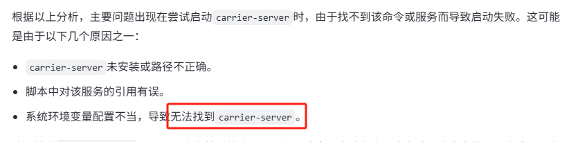
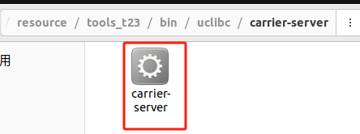
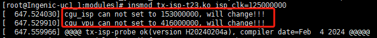

# 随记：

前边，已经完成uboot、kernel、rootfs的移植，现在系统已经可以完整启动了，下边，我们需要完成一些对一些设备的驱动，包括ISP 驱动 、Sensor 驱动 、 Sinfo 探测驱动、 音频驱动

export kenel
export ISVP_ENV_KERNEL_DIR=/home/ming/workspace/ISVP-T23-1.1.2-20240204/software/zh/Ingenic-SDK-T23-1.1.2-20240204-zh/opensource/kernel

> [!PDF|important] [[T23 软件资源编译指南.pdf#page=12&selection=36,0,40,6&color=important|T23 软件资源编译指南, p.12]]
> > 3.1 T23 需要加载驱动

> [!PDF|important] [[T23 BSP开发参考V1.1.pdf#page=26&selection=0,3,39,5&color=important|T23 BSP开发参考V1.1, p.26]]
> > T23 BSP T23 BSP 开发参考 V1.1 Copyright® 2021-2023 Ingenic Semiconductor Co., Ltd. All rights reserved. 23 6 系统资源使用与调试
> 
> 

# 一、 ISP驱动（tx-isp-t23.ko ）
ISP（Image Signal Process）是对sensor光学信号处理的第一步，是光学信号处理的后期处理单元。主要包括3A、坏点校正、去噪、强光抑制、背光补偿、色彩增强、色彩增强、镜头阴影校正等处理。

## 1.编译驱动
> [!PDF|note] [[T23 BSP开发参考V1.1.pdf#page=26&selection=63,0,65,2&color=note|T23 BSP开发参考V1.1, p.26]]
> > ISP 驱动
> 
> 

## 2.驱动注册时提供的参数。
 > [!PDF|note] [[T23 BSP开发参考V1.1.pdf#page=26&selection=126,0,137,2&color=note|T23 BSP开发参考V1.1, p.26]]
> >  ISP 驱动注册时提供多个 module_param 参数
> 
> 

## 3.补全内核下的驱动

拷贝驱动文件夹到`kernel/drivers`目录下：

# 二、sensor驱动（sensor_xxxx_t23.ko）

## 1.编译驱动
在编译sensor 驱动之前kernel 和ISP
驱动必须已经编译完成。
> [!PDF|note] [[T23 BSP开发参考V1.1.pdf#page=26&selection=293,0,298,2&color=note|T23 BSP开发参考V1.1, p.26]]
> > 6.1.2 Sensor 驱动
> 
> 

## 2..驱动注册时提供的参数。
> [!PDF|note] [[T23 BSP开发参考V1.1.pdf#page=27&selection=110,0,116,5&color=note|T23 BSP开发参考V1.1, p.27]]
> > sensor 驱动注册时提供了多个 module_param 可配置参数
> 
> 

 A. reset，power_down 的配置 $ insmod sensor_xx_t23.ko reset_gpio=18 pwdn_gpio=20 其中，gpio 的值为 GPIO 编号，规则为：num = 32 * n + bit，例如：PA18 的 GPIO 编号为 18。

如果产品硬件遵循参考设计 insmod 时无需跟参数，使用默认值即可
## 3.图像效果文件
> [!PDF|note] [[T23 BSP开发参考V1.1.pdf#page=28&selection=36,0,39,2&color=note|T23 BSP开发参考V1.1, p.28]]
> > 6.1.4 图像效果文件
> 
> 

文件名为gc2053-t23.bin，/etc/sensor 目录需要有读写权限。可供参考的方法之一是将/etc/sensor 目录做成一个软链接，链接到一个 rw 的分区中，这样就可以在版本更新时单独更新 bin 文件。

需要在`/etc/sensor/`下放一个效果`.bin`文件

# 三、Sinfo 探测驱动（sinfo.ko ）

使用同一个开发平台支持多个sensor 的情况
## 1.编译驱动

> [!PDF|note] [[T23 BSP开发参考V1.1.pdf#page=27&selection=342,0,346,6&color=note|T23 BSP开发参考V1.1, p.27]]
> > 6.1.3 Sensor 探测识别驱动
> 
> 

## 2.驱动注册时提供的参数。
Two ways to get sensor info 
1. open /dev/sinfo; ioctl TOCTL_SINFO_GET
2. echo 1 >/proc/jz/sinfo/info; cat /proc/jz/sinfo/info

## 3.

# 四、音频驱动（audio.ko）

## 1.编译驱动
> [!PDF|note] [[T23 BSP开发参考V1.1.pdf#page=37&selection=297,0,297,4&color=note|T23 BSP开发参考V1.1, p.37]]
> > 内核配置
> 
> 

> [!PDF|note] [[T23 BSP开发参考V1.1.pdf#page=38&selection=109,0,111,2&color=note|T23 BSP开发参考V1.1, p.38]]
> > Audio 驱动
> 
> 

## 2.驱动注册时提供的参数。
如果不需要驱动控制该引脚，配置该参数为 spk_gpio=-1。

## 3.
 

# 五、配置驱动并加入根文件系统

[[君正T23N芯片开发/【君正T32N-PIKE开发板】/4.busybox工具集编译及根文件系统制作#3.加载驱动]]

start.sh

# 六、sample测试

> [!PDF|important] [[T23 BSP开发参考V1.1.pdf#page=28&selection=104,0,110,2&color=important|T23 BSP开发参考V1.1, p.28]]
> > 6.1.5 Sample 的使用
> 
> 

/zh/Ingenic-SDK-T23-1.1.2-20240204-zh/sdk/samples/libimp-samples/

## 1.应用程序编译
> [!PDF|note] [[T23 BSP开发参考V1.1.pdf#page=16&selection=36,0,39,4&color=note|T23 BSP开发参考V1.1, p.16]]
> > 3.4 应用程序编译

## 2.VLC 浏览视频
> [!PDF|note] [[T23 PIKE开发板使用指南.pdf#page=7&selection=109,0,113,4&color=note|T23 PIKE开发板使用指南, p.7]]
> > 2.2 VLC 浏览视频
> 
> 

E:\sdk\ISVP-T23-1.1.2-20240204\ISVP-T23-1.1.2-20240204\software\zh\Ingenic-SDK-T23-1.1.2-20240204-zh\resource\tools_t23\bin\uclibc\carrier-server

开发板上电后 ， 系统会自动运行启动脚本 ， 脚本默认执行主进程./carrier-server --st=jxf23，其中 jxf23 为 sensor 型号。如果主进程被 kill 以后，想再次运行主进程，需要进入 /system/bin 目录， 然后执行./carrier-server --st=jxf23。运行结束会出现如下打印： Play this video stream using the URL: rtsp://193.169.4.228:8554/main Play this video stream using the URL: rtsp://193.169.4.228:8554/second

## 3.carrier-server的加载测试

用官方的脚本就可以了，注意不要在要用的程序中加中文注释。

还是把这个文件放在appfs/bin下才行

## 报错与解决(用双文件系统)
### 3.1自定义的加载驱动的脚本没有起作用，驱动没有下载进去
需要自己又重新加载Isp和sensor驱动

insmod tx-isp-t23.ko isp_clk=125000000
1. **`tx-isp-t23.ko` 成功加载**
    - 当你尝试加载 `tx-isp-t23.ko` 模块时，虽然有一些警告（如 CGU ISP 和 VPU 无法设置为特定频率），但模块最终还是成功初始化并显示了版本信息 (`version H20240204a`)。

 insmod sensor_gc2053_t23.ko sensor_max_fps=25 data_interface=1

### 3.2启动服务的时候发现ISP vpu的参数不对，启动不了出问题的

 ./carrier-server --st=gc2053

##### 错误
ample-RTSPServer: An RTSP server for Ingenic libimp[  797.986534] cgu_isp can not set to 125000000, will change!!!

Built using "LIVE555 Streaming Media": <http://www.live555.com[  797.995954] cgu_vpu can not set to 416000000, will change!!!
/liveMedia/>
Built time: Feb  4 2024, 19:49:20
Sensor Type : gc2053

Argument print:
    Main EncType = h264 = 1
    Second EncType = h264 = 1
    Main VideoWidth = 1920
    Main VideoHeight = 1080
    Second VideoWidth = 704
    Second VideoHeight = 576
    FPSNum = 25
    FPSDen = 1
    Audio = 0
    RC = SMART
    cli = 1

Function usage:
	showfps: Show FPS and bitrate infomation
	osd: Switch on/off timestamp OSD
	snap: Snapshot a JPEG picture
	display: Display on LCD
Initializing...
[  798.082887] gc2053 chip found @ 0x37 (i2c0) version H20230921a
[  798.410535] Err [VIC_INT] : hor err ch0 !!!!! 0x3a8 = 0x00000000
[  798.416757] Err [VIC_INT] : ver err ch0 !!!!!
[  798.421264] Err [VIC_INT] : ver err ch1 !!!!!
[  798.425770] Err [VIC_INT] : ver err ch2 !!!!!
[  798.430276] error handler!!!
[  798.433253] addr ctl is 0x0
chn : 0, direct_mode: 0
i264e[info]: profile High, level 4.0
i264e[info]: profile High, level 3.0
> ...done initializing
Play this video stream using the URL:
	rtsp://0.0.0.0:8554/main
Play this video stream using the URL:
	rtsp://0.0.0.0:8554/second

Unkown command , enter 'help' to see usage

#### 错误与警告

- **频率设置错误**:
    
    - 尝试将 `cgu_isp` 设置为 125MHz 失败。
    - 尝试将 `cgu_vpu` 设置为 416MHz 失败。
    
    这些消息表明系统尝试设置某些硬件组件的工作频率但失败了，然后自动选择了另一个频率。这可能是由于硬件限制或配置问题。
    
- **VIC_INT 错误**:
    
    - 显示了几条关于水平和垂直同步错误的信息 (`hor err ch0`, `ver err ch0`, `ver err ch1`, `ver err ch2`)，并触发了一个错误处理器。

这些错误提示可能存在硬件兼容性问题或驱动程序未正确配置的问题，特别是涉及到 ISP（图像信号处理器）和 VPU（视频处理单元）的配置。

#### 后续步骤建议

1. **检查硬件兼容性**: 确认所使用的硬件平台是否完全支持 GC2053 传感器以及相关的 ISP 和 VPU 频率设置。如果存在不兼容的情况，考虑更新硬件或寻找适合当前硬件配置的固件版本。
    
2. **调整驱动/固件设置**: 如果确定硬件是兼容的，尝试调整相关模块的驱动或固件设置，以避免上述频率设置失败的情况。可能需要查看内核源代码或设备制造商提供的文档来找到正确的设置。

## 4.音频测试
> [!PDF|note] [[T23 BSP开发参考V1.1.pdf#page=38&selection=167,0,174,2&color=note|T23 BSP开发参考V1.1, p.38]]
> > 6.10.3 Sample 使用
> 
> 
