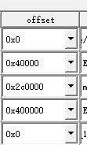

# 一.文件系统上不来
## 1.报错

## 2.报错原因

加载 insmod /opt/drivers/tx-isp-t32.ko isp_clk=200000000   # 加载ISP驱动（设置200MHz时钟）有误。
ISP驱动频率不对

shh更新不准确，要断开重连

## 3.解决方法

把别人的镜像加载进去，看别人怎么写的

解析传感器信息和其他参数

SENSOR=${SENSOR_INFO#*:}  # 提取传感器类型

ISP_PARAM="isp_clk=125000000"  # 设置 ISP 参数

# 二.文件无权限
## 1.报错
[root@Ingenic-uc1_1:app]# chmod 777 ./*
chmod: ./sample-Ai: Read-only file system
chmod: ./sample-Ai-AEC: Read-only file system

## 2.报错原因

## 3.解决方法

[[君正T23N芯片开发/【君正T32N-PIKE开发板】/4.busybox工具集编译及根文件系统制作#1.使用君正提供的基本文件系统(squashfs)+appfs文件夹(jffs2)]]

# 三.不改变文件的属性和链接

## 1.报错

## 2.报错原因

## 3.解决方法

用cp -a 复制

rm ；来删除

或者直接在他的文件管理软件那里直接操作

# 四.文件丢失

## 1.报错

## 2.报错原因

改起始地址就会出现

rootfs必须从0x2c0000以上起步，且站空间大小不小于200000

所以才说在官方的里面直接更改，会导致文件大小超过范围，引起文件丢失
应该是他这个软件本身的保护机制，但如果用其他方式又不便于后面的工业化生产

- 1 是这里配置的问题，规定了每个分区的最大大小。修改这里的参数就可。

16M flash

## 3.解决方法

[[rootfs.squashfs 的烧录位置和大小必须严格匹配 MTD 的 root分区定义]]

[[君正T23 MTD 分区布局解析]]

[[MTD分区的定义]]

算了，不用再深究下去了，就直接在appfs上面改或者压缩就行了。一般情况下都不会超过他的空间大小的

# 五.`./carrier-server --st=gc2053`时遇到的“Video Input init failed”错误

## 1.报错
`./carrier-server --st=gc2053`时遇到的“Video Input init failed”错误

## 2.报错原因

## 3.解决方法

 启动 carrier-server 服务
echo ${START_CMD##*/} start
${START_CMD} --st=${SENSOR} ${CARRIER_SERVER_PARAM}  # 使用提取出的参数启动服务
echo ${START_CMD##*/} exit

