# 随记：

# 一、单独编译wifi驱动

## 1.
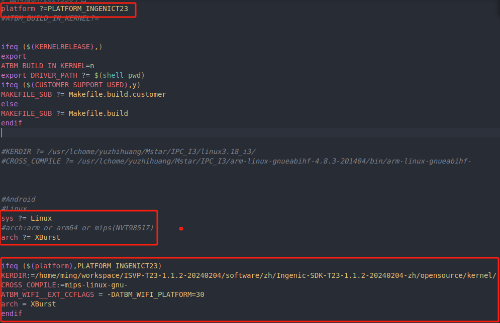

## 2.

## 3.

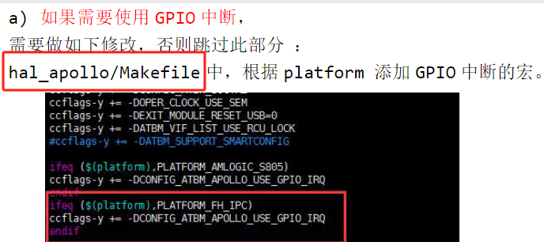

> [!PDF|yellow] [[ATBM WIFI4 驱动配置说明_FAQ_V4.4.pdf#page=9&selection=57,0,63,5&color=yellow|ATBM WIFI4 驱动配置说明_FAQ_V4.4, p.9]]
> > hal_apollo/atbm_platform.c 添加 GPIO 中断引脚号
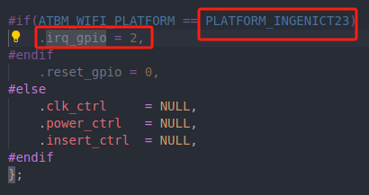

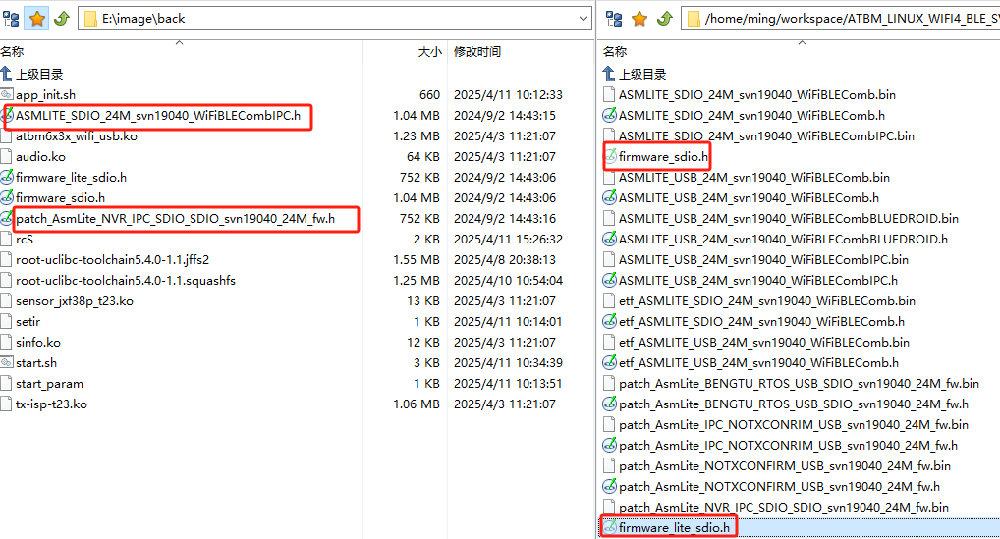
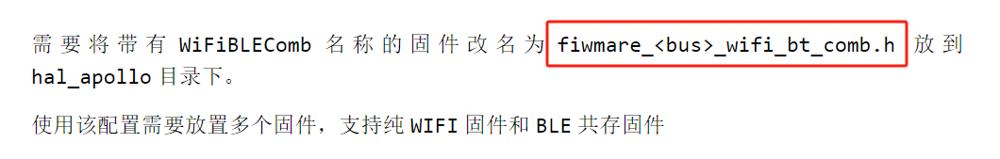
# 二、

## 1.

 sdio 总线

ATBM603x&ATBM6012B chip： vid = 0x007a pid = 0x8

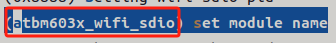
## 2.
> [!PDF|note] [[ATBM WIFI4 驱动配置说明_FAQ_V4.4.pdf#page=21&selection=67,0,75,9&color=note|ATBM WIFI4 驱动配置说明_FAQ_V4.4, p.21]]
> > 注意这里需要注意下如果 mmc host 进行了如下配置了：
> 
>  

## 3.

# 三、

## 1.
arch ?= mips

## 2.

## 3.

# 四、新

## 1.
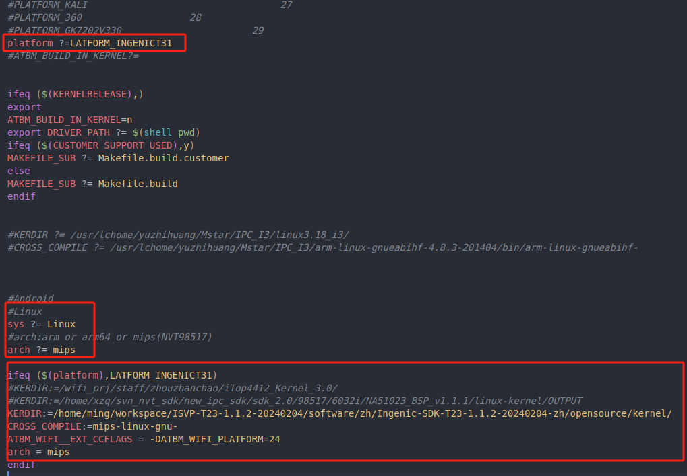

## 2.

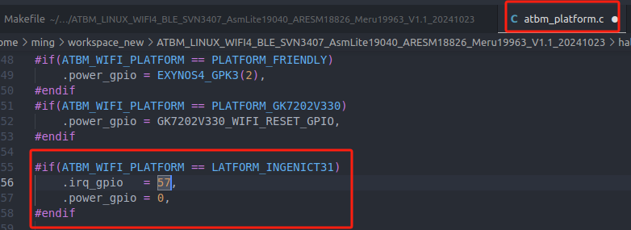

iFiBLEComb 的名称的固件为 WIFI+BLE 连接共存的固件。带 AsmLite 的名称的固件为纯 WIFI 的固件。例如： 1) 使用的是 usb 总线纯 WIFI 的功能，需要放一个固件 a. 带 AsmLite 的名称的固件改名为 firmware_lite_usb.h 放到 hal_apollo/目录下 2) 使用的是 usb 总线+WIFI_BLE 共存的功能，需要放两个固件： a. 带 AsmLite 的名称的固件改名为 firmware_lite_usb.h 放到 hal_apollo/目录下 b. 带 WiFiBLEComb 的名称的固件改名为 firmware_usb_wifi_bt_comb.h 放到 hal_apollo/目录下 3) 使用的是 usb 总线+WIFI4 双频+WIFI_BLE 共存的功能，需要放两个固件： a. 带 MERCURIUS 的名称的固件改名为 firmware_mercurius_usb.h 放到 hal_apollo/目录下 b. 带 WiFiBLEComb 的名称的固件改名为 firmware_usb_mercurius_wifi_bt_comb.h 放到 hal_apollo/目录下

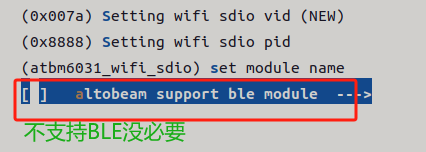

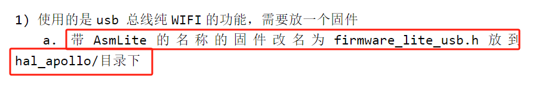

[[ATBM WIFI4 驱动配置说明_FAQ_V4.4.pdf#page=25&offset=125,693,0|ATBM WIFI4 驱动配置说明_FAQ_V4.4, (3)GPIO中断方式]]
还没搞

# 五、

是用usb总线的吧，感觉不是sdio总线

- `[ 6.101864] atbm6031_wifi_sdio: Unknown symbol ingenic_sdio_wlan_atbm_power_onoff (err 0)`
    
     
    
    尝试加载`atbm6031_wifi_sdio.ko`模块时失败，因为找不到符号`ingenic_sdio_wlan_atbm_power_onoff`。这通常意味着该符号在内核中未定义或与模块不兼容。
    
- `insmod: can't insert '/lib/modules/atbm6031_wifi_sdio.ko': unknown symbol in module or invalid parameter`
    
     
    
    确认了上述问题，指出无法插入模块，原因可能是未知符号或无效参数。
    
- `err: insmod atbm6031_wifi_sdio`
    
     
    
    加载`atbm6031_wifi_sdio`模块时发生错误。
    
- `exit`
    
     
    
    结束脚本或进程执行。
## 1.

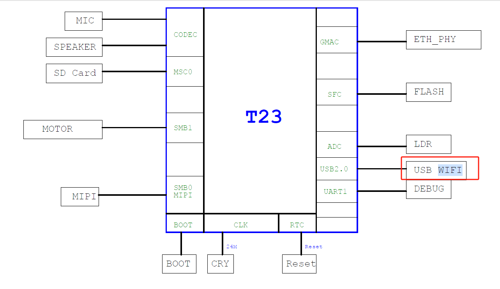

你君正的芯片有sdio接口吗？没有吧，他这个是usb接口控制那个WiFi的吧。

## 2.

## 3.

# 六、

## 1.

## 2.

## 3.

