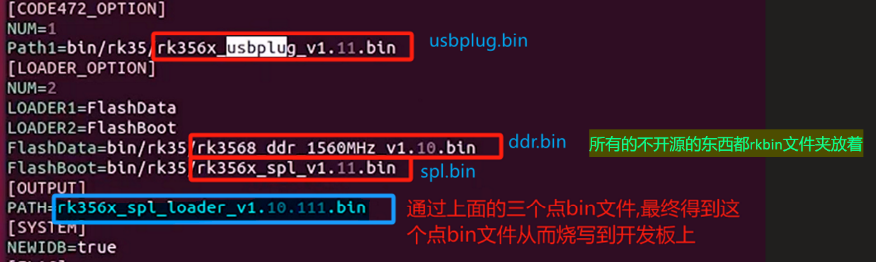

# 备注(声明)：
对瑞芯微原厂的Android11源码进行本地化适配到迅为的RK3568开发板上

[[Android11系统大纲框架图]]

## Android 底层开发入门篇手册（一到五）
> [!PDF|important] [[【北京迅为】itop-rk3568开发板官方android11移植教程.pdf#page=20&selection=14,0,18,7&color=important|【北京迅为】itop-rk3568开发板官方android11移植教程, p.20]]
> > 第二篇 Android 底层开发入门篇
> 
> 

# 补充：
[[嵌入式linux(rk3568)/linux开发资料库/rk3568迅为开发pdf/移植Android11配套资料/【北京迅为】itop-rk3568开发板官方android11移植教程.pdf|【北京迅为】itop-rk3568开发板官方android11移植教程]]

[[Rockchip Android 11.0 SDK开发指南.pdf]]

[11_uboot启动打印信息讲解](onenote:https://d.docs.live.net/52d4b76bb0ffcf51/Documents/\(RK3568\)Linux驱动开发/Android11系统移植.one#11_uboot启动打印信息讲解&section-id={168DFA21-8560-4CC5-8059-6E043AA24EB4}&page-id={E720CD82-EBFE-4D69-889A-82F20F9ECDED}&end)  ([Web 视图](https://onedrive.live.com/view.aspx?resid=52D4B76BB0FFCF51%21se8c325913f784bf694d429e5ee2ab2be&id=documents&wd=target%28Android11%E7%B3%BB%E7%BB%9F%E7%A7%BB%E6%A4%8D.one%7C168DFA21-8560-4CC5-8059-6E043AA24EB4%2F11_uboot%E5%90%AF%E5%8A%A8%E6%89%93%E5%8D%B0%E4%BF%A1%E6%81%AF%E8%AE%B2%E8%A7%A3%7CE720CD82-EBFE-4D69-889A-82F20F9ECDED%2F%29))

## ARMv8启动流程
[9_通过ARMv8启动流程了解RK3568的引导流程](onenote:https://d.docs.live.net/52d4b76bb0ffcf51/Documents/\(RK3568\)Linux驱动开发/Android11系统移植.one#9_通过ARMv8启动流程了解RK3568的引导流程&section-id={168DFA21-8560-4CC5-8059-6E043AA24EB4}&page-id={A7C052A6-1151-4A73-9E70-1328CA04FC03}&end)  ([Web 视图](https://onedrive.live.com/view.aspx?resid=52D4B76BB0FFCF51%21se8c325913f784bf694d429e5ee2ab2be&id=documents&wd=target%28Android11%E7%B3%BB%E7%BB%9F%E7%A7%BB%E6%A4%8D.one%7C168DFA21-8560-4CC5-8059-6E043AA24EB4%2F9_%E9%80%9A%E8%BF%87ARMv8%E5%90%AF%E5%8A%A8%E6%B5%81%E7%A8%8B%E4%BA%86%E8%A7%A3RK3568%E7%9A%84%E5%BC%95%E5%AF%BC%E6%B5%81%E7%A8%8B%7CA7C052A6-1151-4A73-9E70-1328CA04FC03%2F%29))

# 一、Android源码的获取
## 简介:

## 补充：

## 1.谷歌AOSP源码
[3_下载谷歌AOSP源码](onenote:https://d.docs.live.net/52d4b76bb0ffcf51/Documents/\(RK3568\)Linux驱动开发/Android11系统移植.one#3_下载谷歌AOSP源码&section-id={168DFA21-8560-4CC5-8059-6E043AA24EB4}&page-id={68EB6F67-4EB2-4BFF-B683-17122CEF6EC8}&end)  ([Web 视图](https://onedrive.live.com/view.aspx?resid=52D4B76BB0FFCF51%21se8c325913f784bf694d429e5ee2ab2be&id=documents&wd=target%28Android11%E7%B3%BB%E7%BB%9F%E7%A7%BB%E6%A4%8D.one%7C168DFA21-8560-4CC5-8059-6E043AA24EB4%2F3_%E4%B8%8B%E8%BD%BD%E8%B0%B7%E6%AD%8CAOSP%E6%BA%90%E7%A0%81%7C68EB6F67-4EB2-4BFF-B683-17122CEF6EC8%2F%29))

## 2.瑞芯微Android11原厂BSP
 [00_瑞芯微官方Android11源码](file:///E:%5CExercise_files%5CAndroid11系统移植%5C05_移植Android11配套资料%5C00_瑞芯微官方Android11源码)

[6_认识瑞芯微Android11原厂BSP](onenote:https://d.docs.live.net/52d4b76bb0ffcf51/Documents/\(RK3568\)Linux驱动开发/Android11系统移植.one#6_认识瑞芯微Android11原厂BSP&section-id={168DFA21-8560-4CC5-8059-6E043AA24EB4}&page-id={46FF2B27-26C4-4CC7-B730-74D77D2A582F}&end)  ([Web 视图](https://onedrive.live.com/view.aspx?resid=52D4B76BB0FFCF51%21se8c325913f784bf694d429e5ee2ab2be&id=documents&wd=target%28Android11%E7%B3%BB%E7%BB%9F%E7%A7%BB%E6%A4%8D.one%7C168DFA21-8560-4CC5-8059-6E043AA24EB4%2F6_%E8%AE%A4%E8%AF%86%E7%91%9E%E8%8A%AF%E5%BE%AEAndroid11%E5%8E%9F%E5%8E%82BSP%7C46FF2B27-26C4-4CC7-B730-74D77D2A582F%2F%29))

# 二、编译Android11源码
## 简介:

## 补充：

## 1.编译谷歌AOSP源码

[4_编译谷歌AOSP源码](onenote:https://d.docs.live.net/52d4b76bb0ffcf51/Documents/\(RK3568\)Linux驱动开发/Android11系统移植.one#4_编译谷歌AOSP源码&section-id={168DFA21-8560-4CC5-8059-6E043AA24EB4}&page-id={C0E41057-4B2E-4315-883E-610279B48546}&end)  ([Web 视图](https://onedrive.live.com/view.aspx?resid=52D4B76BB0FFCF51%21se8c325913f784bf694d429e5ee2ab2be&id=documents&wd=target%28Android11%E7%B3%BB%E7%BB%9F%E7%A7%BB%E6%A4%8D.one%7C168DFA21-8560-4CC5-8059-6E043AA24EB4%2F4_%E7%BC%96%E8%AF%91%E8%B0%B7%E6%AD%8CAOSP%E6%BA%90%E7%A0%81%7CC0E41057-4B2E-4315-883E-610279B48546%2F%29))

[5_通过模拟器启动AOSP系统](onenote:https://d.docs.live.net/52d4b76bb0ffcf51/Documents/\(RK3568\)Linux驱动开发/Android11系统移植.one#5_通过模拟器启动AOSP系统&section-id={168DFA21-8560-4CC5-8059-6E043AA24EB4}&page-id={0FB24E99-4402-4215-928B-C735A308A1FD}&end)  ([Web 视图](https://onedrive.live.com/view.aspx?resid=52D4B76BB0FFCF51%21se8c325913f784bf694d429e5ee2ab2be&id=documents&wd=target%28Android11%E7%B3%BB%E7%BB%9F%E7%A7%BB%E6%A4%8D.one%7C168DFA21-8560-4CC5-8059-6E043AA24EB4%2F5_%E9%80%9A%E8%BF%87%E6%A8%A1%E6%8B%9F%E5%99%A8%E5%90%AF%E5%8A%A8AOSP%E7%B3%BB%E7%BB%9F%7C0FB24E99-4402-4215-928B-C735A308A1FD%2F%29))

## 2.原厂Android11源码整体编译通过

[Android 11源码目录结构](onenote:https://d.docs.live.net/52d4b76bb0ffcf51/Documents/\(RK3568\)Linux驱动开发/Android11系统移植.one#6_认识瑞芯微Android11原厂BSP&section-id={168DFA21-8560-4CC5-8059-6E043AA24EB4}&page-id={46FF2B27-26C4-4CC7-B730-74D77D2A582F}&object-id={879061E1-CDD0-45A8-8E25-ABB0E082D918}&A)  ([Web 视图](https://onedrive.live.com/view.aspx?resid=52D4B76BB0FFCF51%21se8c325913f784bf694d429e5ee2ab2be&id=documents&wd=target%28Android11%E7%B3%BB%E7%BB%9F%E7%A7%BB%E6%A4%8D.one%7C168DFA21-8560-4CC5-8059-6E043AA24EB4%2F6_%E8%AE%A4%E8%AF%86%E7%91%9E%E8%8A%AF%E5%BE%AEAndroid11%E5%8E%9F%E5%8E%82BSP%7C46FF2B27-26C4-4CC7-B730-74D77D2A582F%2F%29))

[7_将原厂Android11源码整体编译通过](onenote:https://d.docs.live.net/52d4b76bb0ffcf51/Documents/\(RK3568\)Linux驱动开发/Android11系统移植.one#7_将原厂Android11源码整体编译通过&section-id={168DFA21-8560-4CC5-8059-6E043AA24EB4}&page-id={82FC7029-7B95-4D9E-8980-7C05179C172C}&end)  ([Web 视图](https://onedrive.live.com/view.aspx?resid=52D4B76BB0FFCF51%21se8c325913f784bf694d429e5ee2ab2be&id=documents&wd=target%28Android11%E7%B3%BB%E7%BB%9F%E7%A7%BB%E6%A4%8D.one%7C168DFA21-8560-4CC5-8059-6E043AA24EB4%2F7_%E5%B0%86%E5%8E%9F%E5%8E%82Android11%E6%BA%90%E7%A0%81%E6%95%B4%E4%BD%93%E7%BC%96%E8%AF%91%E9%80%9A%E8%BF%87%7C82FC7029-7B95-4D9E-8980-7C05179C172C%2F%29))

# 三、uboot本地化(原厂)
## 简介:

## 补充：

## 1.uboot讲解
### 1.1uboot目录讲解
 [8_原厂uboot源码顶层目录讲解](onenote:https://d.docs.live.net/52d4b76bb0ffcf51/Documents/\(RK3568\)Linux驱动开发/Android11系统移植.one#8_原厂uboot源码顶层目录讲解&section-id={168DFA21-8560-4CC5-8059-6E043AA24EB4}&page-id={23989D59-6694-4F52-AB75-1711AA5A919A}&end)  ([Web 视图](https://onedrive.live.com/view.aspx?resid=52D4B76BB0FFCF51%21se8c325913f784bf694d429e5ee2ab2be&id=documents&wd=target%28Android11%E7%B3%BB%E7%BB%9F%E7%A7%BB%E6%A4%8D.one%7C168DFA21-8560-4CC5-8059-6E043AA24EB4%2F8_%E5%8E%9F%E5%8E%82uboot%E6%BA%90%E7%A0%81%E9%A1%B6%E5%B1%82%E7%9B%AE%E5%BD%95%E8%AE%B2%E8%A7%A3%7C23989D59-6694-4F52-AB75-1711AA5A919A%2F%29))
 
### 1.2 loader

[10_使用ddrbin_tool工具修改ddr.bin的波特率](onenote:https://d.docs.live.net/52d4b76bb0ffcf51/Documents/\(RK3568\)Linux驱动开发/Android11系统移植.one#10_使用ddrbin_tool工具修改ddr.bin的波特率&section-id={168DFA21-8560-4CC5-8059-6E043AA24EB4}&page-id={744DB0CE-C0AB-462F-9210-3350C06CA61D}&end)  ([Web 视图](https://onedrive.live.com/view.aspx?resid=52D4B76BB0FFCF51%21se8c325913f784bf694d429e5ee2ab2be&id=documents&wd=target%28Android11%E7%B3%BB%E7%BB%9F%E7%A7%BB%E6%A4%8D.one%7C168DFA21-8560-4CC5-8059-6E043AA24EB4%2F10_%E4%BD%BF%E7%94%A8ddrbin_tool%E5%B7%A5%E5%85%B7%E4%BF%AE%E6%94%B9ddr.bin%E7%9A%84%E6%B3%A2%E7%89%B9%E7%8E%87%7C744DB0CE-C0AB-462F-9210-3350C06CA61D%2F%29))
实现烧写了这个.bin文件到开发板上发现打印都正常的没有乱码

### 1.3 :修改Uboot镜像中的波特率
[修改Uboot镜像中的波特率](onenote:https://d.docs.live.net/52d4b76bb0ffcf51/Documents/\(RK3568\)Linux驱动开发/Android11系统移植.one#10_使用ddrbin_tool工具修改ddr.bin的波特率&section-id={168DFA21-8560-4CC5-8059-6E043AA24EB4}&page-id={744DB0CE-C0AB-462F-9210-3350C06CA61D}&object-id={0DF5BEEE-28CD-4A28-8AD3-338220469E97}&12)  ([Web 视图](https://onedrive.live.com/view.aspx?resid=52D4B76BB0FFCF51%21se8c325913f784bf694d429e5ee2ab2be&id=documents&wd=target%28Android11%E7%B3%BB%E7%BB%9F%E7%A7%BB%E6%A4%8D.one%7C168DFA21-8560-4CC5-8059-6E043AA24EB4%2F10_%E4%BD%BF%E7%94%A8ddrbin_tool%E5%B7%A5%E5%85%B7%E4%BF%AE%E6%94%B9ddr.bin%E7%9A%84%E6%B3%A2%E7%89%B9%E7%8E%87%7C744DB0CE-C0AB-462F-9210-3350C06CA61D%2F%29))

### 1.4 bootargs和cmdline参数讲解
[12_uboot的bootargs和cmdline参数讲解](onenote:https://d.docs.live.net/52d4b76bb0ffcf51/Documents/\(RK3568\)Linux驱动开发/Android11系统移植.one#12_uboot的bootargs和cmdline参数讲解&section-id={168DFA21-8560-4CC5-8059-6E043AA24EB4}&page-id={33805BF3-BA4A-4C85-ABF0-699BEDEB7103}&end)  ([Web 视图](https://onedrive.live.com/view.aspx?resid=52D4B76BB0FFCF51%21se8c325913f784bf694d429e5ee2ab2be&id=documents&wd=target%28Android11%E7%B3%BB%E7%BB%9F%E7%A7%BB%E6%A4%8D.one%7C168DFA21-8560-4CC5-8059-6E043AA24EB4%2F12_uboot%E7%9A%84bootargs%E5%92%8Ccmdline%E5%8F%82%E6%95%B0%E8%AE%B2%E8%A7%A3%7C33805BF3-BA4A-4C85-ABF0-699BEDEB7103%2F%29))

## 2.对uboot进行本地化
这几处都修改好了以后，我们在源码中需要做的本地化的工作实际上就都完成了。
后面如果我们要再修改的话，就是一些移植适配的操作。

### 2.1 本地化config 文件
[本地化config 文件](onenote:https://d.docs.live.net/52d4b76bb0ffcf51/Documents/\(RK3568\)Linux驱动开发/Android11系统移植.one#13_对uboot进行本地化（一\)&section-id={168DFA21-8560-4CC5-8059-6E043AA24EB4}&page-id={EDCAD312-67CC-41C3-8484-FDA5A9B76F39}&object-id={D5955483-6AB4-47E9-858A-E936E0ACDE44}&A)  ([Web 视图](https://onedrive.live.com/view.aspx?resid=52D4B76BB0FFCF51%21se8c325913f784bf694d429e5ee2ab2be&id=documents&wd=target%28Android11%E7%B3%BB%E7%BB%9F%E7%A7%BB%E6%A4%8D.one%7C168DFA21-8560-4CC5-8059-6E043AA24EB4%2F13_%E5%AF%B9uboot%E8%BF%9B%E8%A1%8C%E6%9C%AC%E5%9C%B0%E5%8C%96%EF%BC%88%E4%B8%80%5C%29%7CEDCAD312-67CC-41C3-8484-FDA5A9B76F39%2F%29))
### 2.2 使用本地化的config 文件
[使用本地化的config 文件](onenote:https://d.docs.live.net/52d4b76bb0ffcf51/Documents/\(RK3568\)Linux驱动开发/Android11系统移植.one#13_对uboot进行本地化（一\)&section-id={168DFA21-8560-4CC5-8059-6E043AA24EB4}&page-id={EDCAD312-67CC-41C3-8484-FDA5A9B76F39}&object-id={D5955483-6AB4-47E9-858A-E936E0ACDE44}&1A)  ([Web 视图](https://onedrive.live.com/view.aspx?resid=52D4B76BB0FFCF51%21se8c325913f784bf694d429e5ee2ab2be&id=documents&wd=target%28Android11%E7%B3%BB%E7%BB%9F%E7%A7%BB%E6%A4%8D.one%7C168DFA21-8560-4CC5-8059-6E043AA24EB4%2F13_%E5%AF%B9uboot%E8%BF%9B%E8%A1%8C%E6%9C%AC%E5%9C%B0%E5%8C%96%EF%BC%88%E4%B8%80%5C%29%7CEDCAD312-67CC-41C3-8484-FDA5A9B76F39%2F%29))
### 2.3 本地化设备树文件
[本地化设备树文件](onenote:https://d.docs.live.net/52d4b76bb0ffcf51/Documents/\(RK3568\)Linux驱动开发/Android11系统移植.one#13_对uboot进行本地化（一\)&section-id={168DFA21-8560-4CC5-8059-6E043AA24EB4}&page-id={EDCAD312-67CC-41C3-8484-FDA5A9B76F39}&object-id={D5955483-6AB4-47E9-858A-E936E0ACDE44}&24)  ([Web 视图](https://onedrive.live.com/view.aspx?resid=52D4B76BB0FFCF51%21se8c325913f784bf694d429e5ee2ab2be&id=documents&wd=target%28Android11%E7%B3%BB%E7%BB%9F%E7%A7%BB%E6%A4%8D.one%7C168DFA21-8560-4CC5-8059-6E043AA24EB4%2F13_%E5%AF%B9uboot%E8%BF%9B%E8%A1%8C%E6%9C%AC%E5%9C%B0%E5%8C%96%EF%BC%88%E4%B8%80%5C%29%7CEDCAD312-67CC-41C3-8484-FDA5A9B76F39%2F%29))
### 2.4 添加设备树的编译规则
[添加设备树的编译规则](onenote:https://d.docs.live.net/52d4b76bb0ffcf51/Documents/\(RK3568\)Linux驱动开发/Android11系统移植.one#13_对uboot进行本地化（一\)&section-id={168DFA21-8560-4CC5-8059-6E043AA24EB4}&page-id={EDCAD312-67CC-41C3-8484-FDA5A9B76F39}&object-id={D5955483-6AB4-47E9-858A-E936E0ACDE44}&2C)  ([Web 视图](https://onedrive.live.com/view.aspx?resid=52D4B76BB0FFCF51%21se8c325913f784bf694d429e5ee2ab2be&id=documents&wd=target%28Android11%E7%B3%BB%E7%BB%9F%E7%A7%BB%E6%A4%8D.one%7C168DFA21-8560-4CC5-8059-6E043AA24EB4%2F13_%E5%AF%B9uboot%E8%BF%9B%E8%A1%8C%E6%9C%AC%E5%9C%B0%E5%8C%96%EF%BC%88%E4%B8%80%5C%29%7CEDCAD312-67CC-41C3-8484-FDA5A9B76F39%2F%29))
### 2.5 修改uboot启动参数
[14_对uboot进行本地化（二)](onenote:https://d.docs.live.net/52d4b76bb0ffcf51/Documents/\(RK3568\)Linux驱动开发/Android11系统移植.one#14_对uboot进行本地化（二\)&section-id={168DFA21-8560-4CC5-8059-6E043AA24EB4}&page-id={E8354427-49D3-4598-8B23-3ECE07086F95}&end)  ([Web 视图](https://onedrive.live.com/view.aspx?resid=52D4B76BB0FFCF51%21se8c325913f784bf694d429e5ee2ab2be&id=documents&wd=target%28Android11%E7%B3%BB%E7%BB%9F%E7%A7%BB%E6%A4%8D.one%7C168DFA21-8560-4CC5-8059-6E043AA24EB4%2F14_%E5%AF%B9uboot%E8%BF%9B%E8%A1%8C%E6%9C%AC%E5%9C%B0%E5%8C%96%EF%BC%88%E4%BA%8C%5C%29%7CE8354427-49D3-4598-8B23-3ECE07086F95%2F%29))
Model，bootdelay

## 3.uboot内核机制讲解
[15_瑞芯微uboot的特殊机制讲解](onenote:https://d.docs.live.net/52d4b76bb0ffcf51/Documents/\(RK3568\)Linux驱动开发/Android11系统移植.one#15_瑞芯微uboot的特殊机制讲解&section-id={168DFA21-8560-4CC5-8059-6E043AA24EB4}&page-id={95B5FA9B-8598-452C-A77C-838A57621616}&end)  ([Web 视图](https://onedrive.live.com/view.aspx?resid=52D4B76BB0FFCF51%21se8c325913f784bf694d429e5ee2ab2be&id=documents&wd=target%28Android11%E7%B3%BB%E7%BB%9F%E7%A7%BB%E6%A4%8D.one%7C168DFA21-8560-4CC5-8059-6E043AA24EB4%2F15_%E7%91%9E%E8%8A%AF%E5%BE%AEuboot%E7%9A%84%E7%89%B9%E6%AE%8A%E6%9C%BA%E5%88%B6%E8%AE%B2%E8%A7%A3%7C95B5FA9B-8598-452C-A77C-838A57621616%2F%29))

uboot下的设备树只用来初始化关键的外比如串口，存储设备等等，内核中的设备树用来初始化其他外设，比如网口。
# 四、内核本地化(原厂)
## 简介:

## 补充：

## 1.编译原厂Android11内核
### 1.1 单独编译安卓内核的方法
[这节课的重点也是要学会第二种单独编译安卓内核的方法](onenote:https://d.docs.live.net/52d4b76bb0ffcf51/Documents/\(RK3568\)Linux驱动开发/Android11系统移植.one#16_编译原厂Android11内核&section-id={168DFA21-8560-4CC5-8059-6E043AA24EB4}&page-id={5E695D99-4109-4273-83C1-9BA30C7D00A1}&object-id={E2AD5449-435F-4C83-AB30-E97F47648C5C}&42)  ([Web 视图](https://onedrive.live.com/view.aspx?resid=52D4B76BB0FFCF51%21se8c325913f784bf694d429e5ee2ab2be&id=documents&wd=target%28Android11%E7%B3%BB%E7%BB%9F%E7%A7%BB%E6%A4%8D.one%7C168DFA21-8560-4CC5-8059-6E043AA24EB4%2F16_%E7%BC%96%E8%AF%91%E5%8E%9F%E5%8E%82Android11%E5%86%85%E6%A0%B8%7C5E695D99-4109-4273-83C1-9BA30C7D00A1%2F%29))

### 1.2 编译内核的一个通用步骤
[编译内核的一个通用步骤](onenote:https://d.docs.live.net/52d4b76bb0ffcf51/Documents/\(RK3568\)Linux驱动开发/Android11系统移植.one#16_编译原厂Android11内核&section-id={168DFA21-8560-4CC5-8059-6E043AA24EB4}&page-id={5E695D99-4109-4273-83C1-9BA30C7D00A1}&object-id={C3818F3D-CE78-4574-B6B7-E89915A5A9D7}&E)  ([Web 视图](https://onedrive.live.com/view.aspx?resid=52D4B76BB0FFCF51%21se8c325913f784bf694d429e5ee2ab2be&id=documents&wd=target%28Android11%E7%B3%BB%E7%BB%9F%E7%A7%BB%E6%A4%8D.one%7C168DFA21-8560-4CC5-8059-6E043AA24EB4%2F16_%E7%BC%96%E8%AF%91%E5%8E%9F%E5%8E%82Android11%E5%86%85%E6%A0%B8%7C5E695D99-4109-4273-83C1-9BA30C7D00A1%2F%29))

## 2.对Android11内核进行本地化
### 2.1 本地化config
[本地化config](onenote:https://d.docs.live.net/52d4b76bb0ffcf51/Documents/\(RK3568\)Linux驱动开发/Android11系统移植.one#17_对Android11内核进行本地化&section-id={168DFA21-8560-4CC5-8059-6E043AA24EB4}&page-id={E8DE06A6-7B8A-470C-8926-295E7F669AF6}&object-id={4A582692-F4D3-40CF-B3C7-08736EE54228}&27)  ([Web 视图](https://onedrive.live.com/view.aspx?resid=52D4B76BB0FFCF51%21se8c325913f784bf694d429e5ee2ab2be&id=documents&wd=target%28Android11%E7%B3%BB%E7%BB%9F%E7%A7%BB%E6%A4%8D.one%7C168DFA21-8560-4CC5-8059-6E043AA24EB4%2F17_%E5%AF%B9Android11%E5%86%85%E6%A0%B8%E8%BF%9B%E8%A1%8C%E6%9C%AC%E5%9C%B0%E5%8C%96%7CE8DE06A6-7B8A-470C-8926-295E7F669AF6%2F%29))

### 2.2 配置config编译规则
[配置编译规则](onenote:https://d.docs.live.net/52d4b76bb0ffcf51/Documents/\(RK3568\)Linux驱动开发/Android11系统移植.one#17_对Android11内核进行本地化&section-id={168DFA21-8560-4CC5-8059-6E043AA24EB4}&page-id={E8DE06A6-7B8A-470C-8926-295E7F669AF6}&object-id={4A582692-F4D3-40CF-B3C7-08736EE54228}&E)  ([Web 视图](https://onedrive.live.com/view.aspx?resid=52D4B76BB0FFCF51%21se8c325913f784bf694d429e5ee2ab2be&id=documents&wd=target%28Android11%E7%B3%BB%E7%BB%9F%E7%A7%BB%E6%A4%8D.one%7C168DFA21-8560-4CC5-8059-6E043AA24EB4%2F17_%E5%AF%B9Android11%E5%86%85%E6%A0%B8%E8%BF%9B%E8%A1%8C%E6%9C%AC%E5%9C%B0%E5%8C%96%7CE8DE06A6-7B8A-470C-8926-295E7F669AF6%2F%29))

### 2.3 本地化设备树文件
[本地化设备树文件](onenote:https://d.docs.live.net/52d4b76bb0ffcf51/Documents/\(RK3568\)Linux驱动开发/Android11系统移植.one#17_对Android11内核进行本地化&section-id={168DFA21-8560-4CC5-8059-6E043AA24EB4}&page-id={E8DE06A6-7B8A-470C-8926-295E7F669AF6}&object-id={4A582692-F4D3-40CF-B3C7-08736EE54228}&17)  ([Web 视图](https://onedrive.live.com/view.aspx?resid=52D4B76BB0FFCF51%21se8c325913f784bf694d429e5ee2ab2be&id=documents&wd=target%28Android11%E7%B3%BB%E7%BB%9F%E7%A7%BB%E6%A4%8D.one%7C168DFA21-8560-4CC5-8059-6E043AA24EB4%2F17_%E5%AF%B9Android11%E5%86%85%E6%A0%B8%E8%BF%9B%E8%A1%8C%E6%9C%AC%E5%9C%B0%E5%8C%96%7CE8DE06A6-7B8A-470C-8926-295E7F669AF6%2F%29))

### 2.4 添加设备树的编译规则
[添加设备树的编译规则](onenote:https://d.docs.live.net/52d4b76bb0ffcf51/Documents/\(RK3568\)Linux驱动开发/Android11系统移植.one#17_对Android11内核进行本地化&section-id={168DFA21-8560-4CC5-8059-6E043AA24EB4}&page-id={E8DE06A6-7B8A-470C-8926-295E7F669AF6}&object-id={4A582692-F4D3-40CF-B3C7-08736EE54228}&1F)  ([Web 视图](https://onedrive.live.com/view.aspx?resid=52D4B76BB0FFCF51%21se8c325913f784bf694d429e5ee2ab2be&id=documents&wd=target%28Android11%E7%B3%BB%E7%BB%9F%E7%A7%BB%E6%A4%8D.one%7C168DFA21-8560-4CC5-8059-6E043AA24EB4%2F17_%E5%AF%B9Android11%E5%86%85%E6%A0%B8%E8%BF%9B%E8%A1%8C%E6%9C%AC%E5%9C%B0%E5%8C%96%7CE8DE06A6-7B8A-470C-8926-295E7F669AF6%2F%29))

# 五、让Android11在开发板上跑起来
## 简介:

## 补充：

## 1.配置3568的IO电压域
### 1.1 RK809电源管理芯片讲解
[18_RK809电源管理芯片讲解](onenote:https://d.docs.live.net/52d4b76bb0ffcf51/Documents/\(RK3568\)Linux驱动开发/Android11系统移植.one#18_RK809电源管理芯片讲解&section-id={168DFA21-8560-4CC5-8059-6E043AA24EB4}&page-id={17F01F2F-7F5A-48D3-8363-1616DACE6ED2}&end)  ([Web 视图](https://onedrive.live.com/view.aspx?resid=52D4B76BB0FFCF51%21se8c325913f784bf694d429e5ee2ab2be&id=documents&wd=target%28Android11%E7%B3%BB%E7%BB%9F%E7%A7%BB%E6%A4%8D.one%7C168DFA21-8560-4CC5-8059-6E043AA24EB4%2F18_RK809%E7%94%B5%E6%BA%90%E7%AE%A1%E7%90%86%E8%8A%AF%E7%89%87%E8%AE%B2%E8%A7%A3%7C17F01F2F-7F5A-48D3-8363-1616DACE6ED2%2F%29))

### 1.2 IO电压域讲解
[19_IO电压域讲解](onenote:https://d.docs.live.net/52d4b76bb0ffcf51/Documents/\(RK3568\)Linux驱动开发/Android11系统移植.one#19_IO电压域讲解&section-id={168DFA21-8560-4CC5-8059-6E043AA24EB4}&page-id={D9A86AD6-59D1-4F06-B598-20FEDDA96FA9}&end)  ([Web 视图](https://onedrive.live.com/view.aspx?resid=52D4B76BB0FFCF51%21se8c325913f784bf694d429e5ee2ab2be&id=documents&wd=target%28Android11%E7%B3%BB%E7%BB%9F%E7%A7%BB%E6%A4%8D.one%7C168DFA21-8560-4CC5-8059-6E043AA24EB4%2F19_IO%E7%94%B5%E5%8E%8B%E5%9F%9F%E8%AE%B2%E8%A7%A3%7CD9A86AD6-59D1-4F06-B598-20FEDDA96FA9%2F%29))

### 1.3 配置3568的IO电压域
[20_配置3568的IO电压域](onenote:https://d.docs.live.net/52d4b76bb0ffcf51/Documents/\(RK3568\)Linux驱动开发/Android11系统移植.one#20_配置3568的IO电压域&section-id={168DFA21-8560-4CC5-8059-6E043AA24EB4}&page-id={52C7A404-0A12-4040-A269-249F08A30D64}&end)  ([Web 视图](https://onedrive.live.com/view.aspx?resid=52D4B76BB0FFCF51%21se8c325913f784bf694d429e5ee2ab2be&id=documents&wd=target%28Android11%E7%B3%BB%E7%BB%9F%E7%A7%BB%E6%A4%8D.one%7C168DFA21-8560-4CC5-8059-6E043AA24EB4%2F20_%E9%85%8D%E7%BD%AE3568%E7%9A%84IO%E7%94%B5%E5%8E%8B%E5%9F%9F%7C52C7A404-0A12-4040-A269-249F08A30D64%2F%29))

## 2.配置Android11的调试串口
[21_配置Android11的调试串口](onenote:https://d.docs.live.net/52d4b76bb0ffcf51/Documents/\(RK3568\)Linux驱动开发/Android11系统移植.one#21_配置Android11的调试串口&section-id={168DFA21-8560-4CC5-8059-6E043AA24EB4}&page-id={B94C296D-D5EE-4657-B61B-FBA448D04332}&end)  ([Web 视图](https://onedrive.live.com/view.aspx?resid=52D4B76BB0FFCF51%21se8c325913f784bf694d429e5ee2ab2be&id=documents&wd=target%28Android11%E7%B3%BB%E7%BB%9F%E7%A7%BB%E6%A4%8D.one%7C168DFA21-8560-4CC5-8059-6E043AA24EB4%2F21_%E9%85%8D%E7%BD%AEAndroid11%E7%9A%84%E8%B0%83%E8%AF%95%E4%B8%B2%E5%8F%A3%7CB94C296D-D5EE-4657-B61B-FBA448D04332%2F%29))

在设备树通过fiq-debugger节点配置，同时要设置好pinctrl。
## 3.对Android源码本地化添加自己的产品
[24_对Android源码本地化添加自己的产品](onenote:https://d.docs.live.net/52d4b76bb0ffcf51/Documents/\(RK3568\)Linux驱动开发/Android11系统移植.one#24_对Android源码本地化添加自己的产品&section-id={168DFA21-8560-4CC5-8059-6E043AA24EB4}&page-id={4A3A693D-A735-4B1D-8191-9EE613119D66}&end)  ([Web 视图](https://onedrive.live.com/view.aspx?resid=52D4B76BB0FFCF51%21se8c325913f784bf694d429e5ee2ab2be&id=documents&wd=target%28Android11%E7%B3%BB%E7%BB%9F%E7%A7%BB%E6%A4%8D.one%7C168DFA21-8560-4CC5-8059-6E043AA24EB4%2F24_%E5%AF%B9Android%E6%BA%90%E7%A0%81%E6%9C%AC%E5%9C%B0%E5%8C%96%E6%B7%BB%E5%8A%A0%E8%87%AA%E5%B7%B1%E7%9A%84%E4%BA%A7%E5%93%81%7C4A3A693D-A735-4B1D-8191-9EE613119D66%2F%29))

## 4.让Android11在开发板上跑起来
[25_让Android11在开发板上跑起来](onenote:https://d.docs.live.net/52d4b76bb0ffcf51/Documents/\(RK3568\)Linux驱动开发/Android11系统移植.one#25_让Android11在开发板上跑起来&section-id={168DFA21-8560-4CC5-8059-6E043AA24EB4}&page-id={4EC77F31-C031-4ACE-A58F-DD9F24B4491F}&end)  ([Web 视图](https://onedrive.live.com/view.aspx?resid=52D4B76BB0FFCF51%21se8c325913f784bf694d429e5ee2ab2be&id=documents&wd=target%28Android11%E7%B3%BB%E7%BB%9F%E7%A7%BB%E6%A4%8D.one%7C168DFA21-8560-4CC5-8059-6E043AA24EB4%2F25_%E8%AE%A9Android11%E5%9C%A8%E5%BC%80%E5%8F%91%E6%9D%BF%E4%B8%8A%E8%B7%91%E8%B5%B7%E6%9D%A5%7C4EC77F31-C031-4ACE-A58F-DD9F24B4491F%2F%29))
# 六、底板外设适配篇（未）
> [!PDF|important] [[【北京迅为】itop-rk3568开发板官方android11移植教程.pdf#page=183&selection=14,0,16,7&color=important|【北京迅为】itop-rk3568开发板官方android11移植教程, p.183]]
> > 第三篇底板外设适配篇
> 
> 

## 简介:
[第三篇 底板外设适配篇](onenote:https://d.docs.live.net/52d4b76bb0ffcf51/Documents/\(RK3568\)Linux驱动开发/Android11系统移植.one#第三篇%20底板外设适配篇&section-id={168DFA21-8560-4CC5-8059-6E043AA24EB4}&page-id={12276E94-45AB-44AD-8E7B-1BB4BDD8BB28}&end)   ([Web 视图](https://onedrive.live.com/view.aspx?resid=52D4B76BB0FFCF51%21se8c325913f784bf694d429e5ee2ab2be&id=documents&wd=target%28Android11%E7%B3%BB%E7%BB%9F%E7%A7%BB%E6%A4%8D.one%7C168DFA21-8560-4CC5-8059-6E043AA24EB4%2F%E7%AC%AC%E4%B8%89%E7%AF%87%20%E5%BA%95%E6%9D%BF%E5%A4%96%E8%AE%BE%E9%80%82%E9%85%8D%E7%AF%87%7C12276E94-45AB-44AD-8E7B-1BB4BDD8BB28%2F%29))

## 补充：

## 1.
### 1.1 

### 1.2 

### 1.3 

### 1.4 

## 2.
### 2.1 

### 2.2 

### 2.3 

### 2.4 

## 3.
### 3.1 

### 3.2 

### 3.3 

### 3.4 

