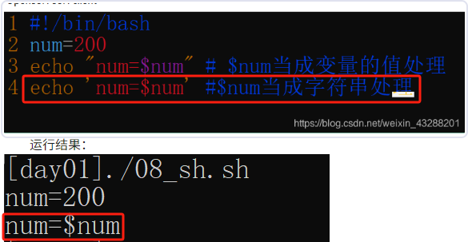
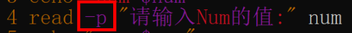
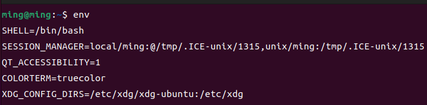
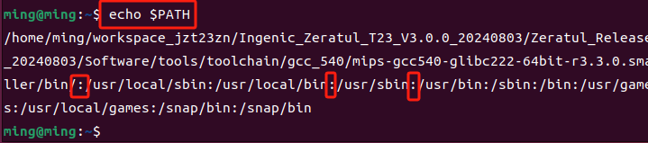

# 备注(声明)：


shell就是一个用户和计算机交流的窗口，类似于windows系统的控制台！
# 补充：


# 一、shell入门:

## 1.shell的解析器
系统提供 shell命令解析器：<span style="background:#d3f8b6"> sh ash bash  </span>
查看自己 linux 系统的默认解析：<span style="background:#b1ffff">echo $SHELL  </span>
shell脚本可在<span style="background:#d3f8b6">安装shell命令解释器的环境下执行</span>


## 2.终端中脚本的调用形式
<span style="background:#b1ffff">/etc/profile  </span>
此文件为系统的每个用户设置环境信息,当用户第一次登录时,该文件被执行，系统的<span style="background:#d3f8b6">公共环境变量</span>在这里设置  
<span style="background:#d3f8b6">开机自启动的程序</span>，一般也在这里设置  
<span style="background:#b1ffff">~/.bashrc  </span>
用户自己的家目录中的.bashrc  
<span style="background:#affad1">登录时会自动调用，打开任意终端时也会自动调用  </span>
这个文件一般<span style="background:#affad1">设置与个人用户有关的环境变量</span>，如交叉编译器的路径等等  

## 3.shell语法入门
### 3.1 定义以开头：#!/bin/bash

<span style="background:#affad1">#!用来声明脚本由什么shell解释</span>，否则使用默认shell**  

### 3.2 <span style="background:#d3f8b6">单个"#"号代表注释当前行</span>


### 3.3 运行

 <span style="background:#b1ffff"> ./xxx.sh</span>:<span style="background:#d3f8b6">先按照 文件中#!指定的解析器解析</span>
 如果#！指定指定的解析器不存在 才会使用系统默认的解析器

### 3.4 

# 二、shell 变量相关

## 1、变量定义规则
- 定义shell变量时，如果没有赋值，则这个变量值为空。
- 变量名由数字、字母和下划线组成，且<span style="background:#affad1">不允许使用数字开头</span>，一般采用蛇形命名法。
- <span style="background:#affad1">等号两边不能有空格</span>。

**例如：**

```bash
# 有空格，不合法
AGE = 18

# 存在非数字、字母和下划线字符，不合法
chunk-name=fdfasfas.js

# 数字开头，不合法
8Name=tom
12345678
```

## 2、三种变量类型

- **普通变量 ：**
只对当前 Shell 或脚本有效，<span style="background:#d3f8b6">不会自动被子进程继承。</span>
- **全局变量 ：***
使用 export 申明的变量，又叫作环境变量，<span style="background:#affad1">能被当前Shell创建的子进程继承</span>。
- **局部变量 ：**
在函数内部使用 local 申明的变量，只在<span style="background:#d3f8b6">函数内部生效。</span>

**例如：**

```bash
# 普通变量，当前 Shell 或脚本有效
age=18

# 全局变量，，能被当前Shell创建的子进程继承。
export age=18

# 局部变量，函数内生效
get_name()
{
    local name=tom
}
1234567891011
```

## 3、变量的赋值

- **空格严格** ：变量赋值时<span style="background:#affad1"> `=` 号两边不能存在任何空格</span>，否则报错
- **引号保护** ：通过赋值符号( `=` )进行赋值时，如果变量值<span style="background:#d3f8b6">存在空格或其他特殊字符，需要使用引号保护，表示是一个整体。</span>

**例如：**

```bash
NAME=TOM

# 存在空格，需要使用引号让其成为整体
NAME="John Wilson"

# 存在特殊字符，需要转义或用单引号
PRICE='$18'
1234567
```

<span style="background:#d3f8b6">双引号：可以解析变量的值  </span>
<span style="background:#d3f8b6">单引号：不能解析变量的值  </span>



## 4、变量展开规则

### 4.1 变量的引用

通过 反引号 \`\` 或 <span style="background:#affad1">`$` 符号可以对变量进行引用</span>，如果变量后面紧跟着其他字母或数字，需要<span style="background:#affad1">使用花括号 `{ }` 可以明确界定变量名</span>。否则shell 可能会将其误认为是变量名的一部分。

**例如** ：

```bash
file="test"

# 通过大括号来界定变量名
echo "${file}.txt" 
1234
```

### 4.2 变量展开规则

- **不加双引号保护时** ：因为变量展开时，原始值中可能包含换行符等特殊字符，shell会根据 IFS ` （空格、换行符、Tab）` 分隔变量为多个单词。如果还含有其他一些特殊字符，例如通配符，则展开之后的结果可能还会被进一步处理。
- **加了双引号保护时** ：展开后的内容<span style="background:#d3f8b6">原样输出</span>，不再做分词处理。

**例如：变量不加引号的情况**

```bash
file=$(ls -1d /home/ehigh/test/*)
echo $file

# 输出结果
/home/ehigh/test/1 /home/ehigh/test/2 /home/ehigh/test/3
12345
```

`echo $filename` ：

1<span style="background:#d3f8b6">. 先将变量展开，替换为具体的变量值</span>，因为ls命令的输出是多行内容，所以原始值中包含换行符。
1.<span style="background:#d3f8b6"> shell会根据 IFS（空格、换行符、Tab） 将展开后的变量分隔为为多个单词</span>
1. shell 会<span style="background:#d3f8b6">将分隔后的单词作为参数传给 echo，echo命令再逐个以空格间隔打印这些单词</span>

**例如：变量加双引号的情况**

```bash
file=$(ls -1d /home/ehigh/test/*)
echo "$file"

# 输出结果
/home/ehigh/test/1
/home/ehigh/test/2
/home/ehigh/test/3
1234567
```

`echo "$file"`

1. 先将变量展开，替换为具体的变量值，因为ls命令的输出是多行内容，所以原始值中包含换行符。
2. 因为存在双引号，所以shell不会根据IFS来对变量值中的换行符、空格进行分词操作
3. shell 会将整个字符串传输给echo，所以echo就实现了原样输出。

## 5、变量销毁

- **自动销毁** ：脚本执行完毕后，运行该脚本的 Shell 进程也会结束，所有在该进程中定义的变量都会自动释放，不会再保留在系统中。
- **手动销毁** ：手动使用 `unset` <span style="background:#affad1">删除变量</span>。在交互式 Shell 中手动定义的变量会一直存在，此时就需要手动销毁。

**例如** ：销毁变量

```bash
name=tom

# 销毁变量
unset name
1234
```


# 三、shell变量
## 简介:


## 补充：


## 1.符号字符变量

### 1.1 特殊赋值变量
####  `:-`

如果<span style="background:#affad1">指定的变量未设置或为空，则使用指定的默认值</span>。

- **语法**: `${variable:-default_value}`
- **作用**: 如果`variable`未设置或为空，则返回`default_value`；否则返回`variable`的实际值。
#### `:=`

**含义：赋默认值并设置变量**

与`:-`类似，但如果<span style="background:#affad1">变量未设置或为空，不仅会返回默认值，还会将变量设置为这个默认值</span>。

- **语法**: `${variable:=default_value}`
- **作用**: 如果`variable`未设置或为空，则将其设置为`default_value`并返回该值；否则返回`variable`的实际值。
####  `:?`

**含义：检查变量是否已设置**

用于<span style="background:#affad1">确保某个变量必须存在</span>，并可以在它未设置时给出错误消息。

- **语法**: `${variable:?error_message}`
- **作用**: 如果`variable`未设置或为空，则输出`error_message`并退出当前的shell。

#### =（廷迟赋值）
[“makefile文件makefile基本语法（上）”页上的图片](onenote:https://d.docs.live.net/52d4b76bb0ffcf51/Documents/\(RK3568\)Linux驱动开发/Linux入门篇.one#makefile文件makefile基本语法（上）&section-id={A6E83B73-B662-46C8-97A8-EEA249D06C37}&page-id={08D3A8E5-F58B-40C1-83DC-31B33772FA34}&object-id={F3679777-A7D3-45C0-BD07-A8E75A946A2B}&5D)  ([Web 视图](https://onedrive.live.com/view.aspx?resid=52D4B76BB0FFCF51%21se8c325913f784bf694d429e5ee2ab2be&id=documents&wd=target%28Linux%E5%85%A5%E9%97%A8%E7%AF%87.one%7CA6E83B73-B662-46C8-97A8-EEA249D06C37%2Fmakefile%E6%96%87%E4%BB%B6makefile%E5%9F%BA%E6%9C%AC%E8%AF%AD%E6%B3%95%EF%BC%88%E4%B8%8A%EF%BC%89%7C08D3A8E5-F58B-40C1-83DC-31B33772FA34%2F%29&wdpartid=%7b95A5C6D4-F097-45B6-8F03-2A5BAFC8B68D%7d%7b1%7d&wdsectionfileid=52D4B76BB0FFCF51!sa9a91d2a66d74178a12e2e5ebf58d0b7))

- 1 赋值makfile里面最后被指定的值

#### ?=（给没被赋值的变量赋值）
[“makefile文件makefile基本语法（上）”页上的图片](onenote:https://d.docs.live.net/52d4b76bb0ffcf51/Documents/\(RK3568\)Linux驱动开发/Linux入门篇.one#makefile文件makefile基本语法（上）&section-id={A6E83B73-B662-46C8-97A8-EEA249D06C37}&page-id={08D3A8E5-F58B-40C1-83DC-31B33772FA34}&object-id={F3679777-A7D3-45C0-BD07-A8E75A946A2B}&6F)  ([Web 视图](https://onedrive.live.com/view.aspx?resid=52D4B76BB0FFCF51%21se8c325913f784bf694d429e5ee2ab2be&id=documents&wd=target%28Linux%E5%85%A5%E9%97%A8%E7%AF%87.one%7CA6E83B73-B662-46C8-97A8-EEA249D06C37%2Fmakefile%E6%96%87%E4%BB%B6makefile%E5%9F%BA%E6%9C%AC%E8%AF%AD%E6%B3%95%EF%BC%88%E4%B8%8A%EF%BC%89%7C08D3A8E5-F58B-40C1-83DC-31B33772FA34%2F%29&wdpartid=%7b95A5C6D4-F097-45B6-8F03-2A5BAFC8B68D%7d%7b1%7d&wdsectionfileid=52D4B76BB0FFCF51!sa9a91d2a66d74178a12e2e5ebf58d0b7))


#### +=（追加赋值，中间加空格）
[“makefile文件makefile基本语法（上）”页上的图片](onenote:https://d.docs.live.net/52d4b76bb0ffcf51/Documents/\(RK3568\)Linux驱动开发/Linux入门篇.one#makefile文件makefile基本语法（上）&section-id={A6E83B73-B662-46C8-97A8-EEA249D06C37}&page-id={08D3A8E5-F58B-40C1-83DC-31B33772FA34}&object-id={F3679777-A7D3-45C0-BD07-A8E75A946A2B}&78)  ([Web 视图](https://onedrive.live.com/view.aspx?resid=52D4B76BB0FFCF51%21se8c325913f784bf694d429e5ee2ab2be&id=documents&wd=target%28Linux%E5%85%A5%E9%97%A8%E7%AF%87.one%7CA6E83B73-B662-46C8-97A8-EEA249D06C37%2Fmakefile%E6%96%87%E4%BB%B6makefile%E5%9F%BA%E6%9C%AC%E8%AF%AD%E6%B3%95%EF%BC%88%E4%B8%8A%EF%BC%89%7C08D3A8E5-F58B-40C1-83DC-31B33772FA34%2F%29&wdpartid=%7b95A5C6D4-F097-45B6-8F03-2A5BAFC8B68D%7d%7b1%7d&wdsectionfileid=52D4B76BB0FFCF51!sa9a91d2a66d74178a12e2e5ebf58d0b7))

- 1 /   换行符


### 1.2 指代特殊内容  `$类


### 1.3 特殊作用

#### 数字键1左面的反引号
<span style="background:#affad1">反引号中的内容作为系统命令,并执行其内容</span>

$ echo "today is date"
可以替换输出为一个变量
todayis2012年07月29日星期日 12:55:21 CST

反引号的作用和 `$` 一样，是 ==变量引用== 的作用。反引号内的字符当作一个命令执行，将 `commnd` 替换为命令的输出。


#### 特殊变量（` _ `）

- `_` 变量：变量名为 `_` 时，<span style="background:#d3f8b6">表示“不关心这个变量的值”</span>。如果用户有多个输入，就可以可以利用这一约定来丢弃不需要的输入字段。

### 1.4 字符串的操作 `${str:3:6}`


### 1.5 会被 shell 解释的特殊字符
当然，下面我将为每个类别提供具体的例子来说明这些符号在嵌入式系统开发中的使用方式。

####  通配符类 -- `*   ?   [] `

- `*`：列出当前目录下所有以`.txt`结尾的文件。
- 表示匹配任意多个字符
  ```bash
  ls *.txt
  ```
- `？`：查找名字中只有两个字符，且第二个字符是'a'的所有文件。
- 表示<span style="background:#d3f8b6">匹配单个任意字符</span>
  ```bash
  ls ?a*
  ```
- `[]`：查找名字中包含数字0到9之间任意一个数字的文件。
- 表示<span style="background:#affad1">匹配范围内的单个字符</span>
  ```bash
  ls *[0-9]*
  ```

####  重定向符和管道符 --   `>  >>  <  |`

- `>`：<span style="background:#affad1">将`ls`命令的结果输出覆盖写入到`filelist.txt`文件中</span>。
- <span style="background:#affad1">输出重定向</span>，覆盖原文件。
  ```bash
  ls > filelist.txt
  ```
- `>>`：将新的日志信息追加到现有日志文件中。
- 追加<span style="background:#affad1">输出重定向，</span><span style="background:#d3f8b6">内容追加到文件尾部。</span>
  ```bash
  echo "System rebooted at $(date)" >> system.log
  ```
- `<`：<span style="background:#affad1">从`input.txt`文件读取输入，作为`sort`命令的输入。</span>
- 输入重定向。
  ```bash
  sort < input.txt
  ```
- `|`：查看当前目录下最大的三个文件。
- <span style="background:#affad1">管道符，连接两个命令，左边命令的输出作为右边命令的输入。</span>
  ```bash
  ls -l | sort -nr -k5 | head -n 3
  ```

####  命令控制符 -- `;  &  &&  ||`

- `;`：首先显示当前目录内容，然后显示当前工作目录路径。
- 在一行内执行多个命令时，<span style="background:#d3f8b6">分隔多个命令，让多个命令顺序执行</span>，如 `ls; pwd` 。
  ```bash
  ls; pwd
  ```
- `&`：让程序在后台运行。
- <span style="background:#d3f8b6">命令后台执行</span>，如 `sleep 60 &` 。
  ```bash
  sleep 60 &
  ```
- `&&`：如果上一个命令成功执行，则继续执行下一个命令。
- <span style="background:#d3f8b6">前面的命令执行成功后再执行后面的命令。</span>
  ```bash
  mkdir newdir && cd newdir
  ```
- `||`：如果上一个命令失败，则执行下一个命令。
<span style="background:#d3f8b6">- 前面的命令执行失败时再执行后面的命令。</span>
  ```bash
  rm file.txt || echo "Failed to delete the file."
  ```

####  变量与命令控制换类 -- `$和${}  command和$()  ~`

- `$` 和 `${}`：打印环境变量`PATH`的内容。
- 变量引用或命令替换，如 `$HOME` 或 `$(ls)` 。
  ```bash
  echo $PATH
  echo ${PATH}
  ```
- `command` 或 `$()`：获取当前日期并将其赋值给变量。
- 命令替换，<span style="background:#affad1">执行命令后替换为结果。</span>
  ```bash
  today=$(date)
  echo $today
  ```
- `~`：切换到用户主目录。
- <span style="background:#d3f8b6">代表用户家目录路径。</span>
  ```bash
  cd ~
  ```

####  引号和转义符 -- `'  "  \`

- `'`（单引号）：打印文本而不解析任何特殊字符。
- 使引号内所有内容保持字面量，<span style="background:#d3f8b6">不解析变量</span>。
  ```bash
  echo 'Hello, World! Today is a good day.'
  ```
- `"`（双引号）：<span style="background:#affad1">允许解析变量，但不解析大部分特殊字符。</span>
- 解析变量，但不解析大部分特殊字符。
  ```bash
  echo "Today's date is: $today"
  ```
- `\`（转义符）：在字符串中插入一个实际的美元符号。
- 转义符，<span style="background:#affad1">去除后面特殊字符本身的特殊含义</span>。

  ```bash
  echo "Price is \$20"
  ```
同C语言，\n  \t  \r  \a 等 echo 命令  要加-e 转义
<span style="background:#affad1">加-e转义 才起换行作用  </span>


### 1.6 大括号的作用  `{}`

#### **格式** ： `{ command1; command2; }`
**命令块（匿名函数）** ：用大括号 `{ }` 将多条命令组合在一起时，这些命令会在当前 Shell 中<span style="background:#affad1">依次执行</span>，整个命令块的退出状态码就是最后一条命令的退出状态码。

- 要求<span style="background:#d3f8b6">括号两边必须有空格</span>
- <span style="background:#d3f8b6">每个指令都需要以分号`;`结尾</span>，包括最后一个指令。


#### **格式** ： `{ str1,str2,str3 }`
**花括号扩展** ：用于生成一组字符串。将若干字符串用逗号分隔放在大括号中，Shell 会将其<span style="background:#affad1">扩展为多个独立的字符串</span>。

```bash
echo {a,b,c,d,e}.txt

# a.txt b.txt c.txt d.txt e.txt
123
```

#### **格式** ： `{ start..end }
**范围扩展** ：用于生成有序的数字或字母序列。通过指定起始和结束值，Shell <span style="background:#affad1">会生成从起始值到结束值的序列。</span>

**例如** ：删除指定后缀的日志文件

```bash
sudo rm -f  mysql-bin.0018{37..79}
1
```


#### **格式** ： `${command}`
- **作用** ：<span style="background:#d3f8b6">变量定界符</span>，表示变量的起始位置。 防止shell将变量后面紧跟着其他字母或数字认为是变量的一部分。

#### {命令序列}
<span style="background:#affad1">{}由当前的shell执行</span>
会影响当前变量


### 1.7  中括号的作用  `[]`

- **作用一** ：是<span style="background:#d3f8b6">test 命令的别名</span>。用于实现条件测试，返回值是命令的退出状态码
- **作用二** ：是shell 的<span style="background:#d3f8b6">通配符</span>。匹配特定的字符集或字符范围

### 1.8小括号的作用 `()`

#### **格式** ： `( cd /some/dir && ls )` 
- 实现命令组合。在当前进程下<span style="background:#affad1">开启一个子进程</span>来执行括号内的指令，当前进程的环境信息会被子进程继承，但是<span style="background:#d3f8b6">子进程的变量和更改不会影响当前进程</span>，整个的退出状态码是最后一个命令的退出状态码。


####  **格式** ：`((  ))`
- 是shell中的一个内置命令，一般是用来<span style="background:#affad1">进行整数的逻辑判断</span>的。例如比较两个整数的大小等。

```bash
if (( 3 > 2 )) ;then
    echo "3 > 2"
fi
123
```


####  **格式** ：`<(command) `
- 当 ( ) 和 < 组合时，叫作<span style="background:#b1ffff">进程替换</span>。这种语法会将小括号里面命令的输出存储到一个文件描述符（通常是一个命名管道或临时文件）中，然后其他命令可以像读取普通文件一样读取命令的输出。
可以<span style="background:#affad1">假想这就是一个匿名文件，某些命令可以像读取普通文件一样读取该文件的内容</span>。

```bash
# 相当于cat 直接读取 ‘<(ls)’ 这个匿名文件做为其标准输入
cat <(ls)
12
```


### 1.9自动化变量（$类）
[“makefile文件makefile基本语法（上）”页上的图片](onenote:https://d.docs.live.net/52d4b76bb0ffcf51/Documents/\(RK3568\)Linux驱动开发/Linux入门篇.one#makefile文件makefile基本语法（上）&section-id={A6E83B73-B662-46C8-97A8-EEA249D06C37}&page-id={08D3A8E5-F58B-40C1-83DC-31B33772FA34}&object-id={F3679777-A7D3-45C0-BD07-A8E75A946A2B}&8A)  ([Web 视图](https://onedrive.live.com/view.aspx?resid=52D4B76BB0FFCF51%21se8c325913f784bf694d429e5ee2ab2be&id=documents&wd=target%28Linux%E5%85%A5%E9%97%A8%E7%AF%87.one%7CA6E83B73-B662-46C8-97A8-EEA249D06C37%2Fmakefile%E6%96%87%E4%BB%B6makefile%E5%9F%BA%E6%9C%AC%E8%AF%AD%E6%B3%95%EF%BC%88%E4%B8%8A%EF%BC%89%7C08D3A8E5-F58B-40C1-83DC-31B33772FA34%2F%29&wdpartid=%7b95A5C6D4-F097-45B6-8F03-2A5BAFC8B68D%7d%7b1%7d&wdsectionfileid=52D4B76BB0FFCF51!sa9a91d2a66d74178a12e2e5ebf58d0b7))

- 1 $@    表示所有目标
- 1 $<     表示第一依赖文件，如果依赖模式是%,那么它就表示一系列文件。        （ %为通配符类似 linux 上的*)
- 1 $^      表示所有依赖


### 1.10.


## 2.环境变量
环境变量是定义在当前环境（进程）中、并<span style="background:#b1ffff">可以被当前进程及其所有子进程访问和继承的特殊变量</span>。

```bash
操作系统
   └── Shell进程(终端)（当前）  ← env查看的是这一层
        └── 子进程（脚本、程序）← 继承上面环境变量
123
```


### 2.1 `EDITOR`  ----用户相关

打开某个文件时，<span style="background:#d3f8b6">默认文本编辑器</span>

### 2.2 `SHELL

当前用户使用的默认<span style="background:#d3f8b6">shell路径</span>。例如：SHELL=/bin/bash
### 2.3 `USER

<span style="background:#affad1">当前登录的用户名</span>。例如：USER=root、
### 2.4 `HOME

当前用户的<span style="background:#d3f8b6">家目录路径</span>。例如：HOME=/root


### 2.5 `PATH`  ----系统配置相关
[[shell脚本语言（未整理）#1.**PATH 环境变量**]]


### 2.6 LANG

<span style="background:#affad1">指定系统使用的语言环境</span>。格式为：“语言代码\_国家或地区.字符集”，LANG变量常用的两种语言环境。中文环境： `zh_CN.UTF-8` ，英文环境： `en_US.UTF-8` 。


```bash
export LANG=en_US.UTF-8
1
```

### 2.7 IFS
内部字段分隔符（Internal Field Separator）的缩写，<span style="background:#affad1">定义Shell在进行分词或字段拆分时使用的字符</span>。当shell在处理命令或变量展开时，会依据 `IFS` 中的字符来确定如何将一个字符串拆分为多个字段。IFS 默认指定的分隔符是空格、制表符（tab）和换行符的组合。

```bash
printf "%q\n" "$IFS"

# 输出信息
    # 空格表示空格字符
    # \`\t\`表示Tab字符
    # \`\n\`表示换行字符
123456
```


### 2.8 


### 2.9 


### 2.10 


## 3.命令变量

### 3.1 `test` 条件测试--命令
[[shell脚本语言（未整理）#四、`test` 条件测试--命令变量]]


### 3.2 `read` --从键盘获取值
<span style="background:#affad1">在一行上显示和添加提示 需要加上-p  </span>



### 3.3 `readonly`--只读变量

`readonly num=10

### 3.4 `env`  `export`--查看当前终端环境



### 3.5 `source`--导出环境变量
<span style="background:#b1ffff"> 作用：（让其他shell脚本识别该变量，设为全局变量）</span>
<span style="background:#affad1">只对当前终端生效。</span>


### 3.6 `echo` --打印
<span style="background:#d3f8b6">可在终端运行。</span>


`echo $filename` ：

1<span style="background:#d3f8b6">. 先将变量展开，替换为具体的变量值</span>，因为ls命令的输出是多行内容，所以原始值中包含换行符。
1.<span style="background:#d3f8b6"> shell会根据 IFS（空格、换行符、Tab） 将展开后的变量分隔为为多个单词</span>
1. shell 会<span style="background:#d3f8b6">将分隔后的单词作为参数传给 echo，echo命令再逐个以空格间隔打印这些单词</span>

### 3.7


### 3.8


### 3.9


### 3.10


# 四、`test` 条件测试--命令变量
## 简介:
`test`命令被用来检查文件类型、比较字符串、数值比较等。其主要功能是根据给定的条件返回布尔值（真或假），从而控制程序流程。

## 补充：


## 1.语法格式

1. **`test condition`**
    直接使用`test`加上条件表达式，<span style="background:#affad1">如果条件为真，则命令退出状态为0</span>；否则，非零。
2. **`[ condition ]`**
    使用方括号的形式实际上是对`test`命令的一种替代写法。注意，这里的<span style="background:#d3f8b6">方括号和条件之间必须有空格分隔</span>。最后一个方括号后也可以跟一个命令分隔符或者换行符。

## 2.字符串比较 - 字符串操作符

### 1. **=（等于）**  
检查两个字符串是否`相等`。如果字符串A和字符串B的内容完全相同，则`返回真。

```
    if [ "string1" = "string2" ]
    then
        echo "Strings are equal."
    fi
```

### 2. **!=（不等于）**  
检查两个字符串是否`不相等`。如果字符串A和字符串B的内容不同，`则返回真。

```
    if [ "string1" != "string2" ]
    then
        echo "Strings are not equal."
    fi
```

### 3. **-z（空串）**  
判断给定字符串是否为空（长度为0）。如果`字符串是空的，则返回真。


```
    str=""
    if [ -z "$str" ]
    then
        echo "The string is empty."
    fi
  ```

### 4. **-n（非空串）**  
判断给定字符串是否为非空。如果`字符串不是空的，则返回真。

```
    str="non-empty"
    if [ -n "$str" ]
    then
        echo "The string is not empty."
    fi
 ```


## 3.文件状态 - 测试选项及其含义：
这些测试通常与 `test` 命令或其方括号 `[ ]` 形式一起使用，以<span style="background:#affad1">判断文件是否存在、类型是什么、权限如何等</span>

### 1. **-e**：
判断文件是否存在。<span style="background:#d3f8b6">如果文件存在，则返回真。</span>

```
    if [ -e /path/to/file ]; then
        echo "File exists."
    fi
 ```

### 2. **-d**：
判断路径是否为目录。如果是目录，则返回真。
用于检查给定的路径是否是一个目录（directory）。<span style="background:#d3f8b6">如果路径指向一个存在的目录，则表达式的计算结果为真（true），</span>即返回退出状态码0；否则，返回非零值表示假（false）。
```
    if [ -d /path/to/directory ]; then
        echo "It is a directory."
    fi
 ```

### 3. **-f**：
<span style="background:#d3f8b6">判断路径是否为普通文件（非目录）</span>。如果是普通文件，则返回真。

```
    if [ -f /path/to/file ]; then
        echo "It is a regular file."
    fi
```

### 4. **-r**：
判断文件是否可读。如果<span style="background:#d3f8b6">文件对当前用户可读，则返回真</span>。

```
    if [ -r /path/to/file ]; then
        echo "File is readable."
    fi
 ```

### 5.**-h 或 -L**：
判断文件是否为符号链接（软链接）。如<span style="background:#d3f8b6">果是符号链接，则返回真。</span>

```
    if [ -h /path/to/symlink ]; then
        echo "It is a symbolic link."
    fi
```

### 6. **-w**：
判断文件是否可写。如果<span style="background:#d3f8b6">文件对当前用户可写，则返回真</span>。

```
    if [ -w /path/to/file ]; then
        echo "File is writable."
    fi
```

### 7. **-c**：
判断文件是否为字符特殊文件（通常是设备文件）。如果<span style="background:#d3f8b6">是字符设备文件，则返回真。</span>


```
    if [ -c /path/to/chardev ]; then
        echo "It is a character special file."
    fi
```

### 8. **-x**：
判断文件是否可执行。如果<span style="background:#d3f8b6">文件对当前用户可执行，则返回真</span>。

```
    if [ -x /path/to/executable ]; then
        echo "File is executable."
    fi
```

### 9. **-b**：
判断文件是否为块特殊文件（如硬盘分区）。如果<span style="background:#d3f8b6">是块设备文件，则返回真</span>。

```
    if [ -b /path/to/blockdev ]; then
        echo "It is a block special file."
    fi
 ```

### 10. **-s**：
判断文件是否非空（大小大于0字节）。如果<span style="background:#d3f8b6">文件非空，则返回真</span>。

```
    if [ -s /path/to/file ]; then
        echo "File is not empty."
    fi
```


## 4.数值比较 - 数值比较操作符

### 1. **-eq（等于）**
   - 检查两个数值是否相等。
   
   ```bash
   if [ $num1 -eq $num2 ]
   then
       echo "Numbers are equal."
   fi
   ```

### 2. **-ne（不等于）**
   - 检查两个数值是否不相等。
   
   ```bash
   if [ $num1 -ne $num2 ]
   then
       echo "Numbers are not equal."
   fi
   ```

### 3. **-gt（大于）**
   - 检查第一个数值是否大于第二个数值。
   
   ```bash
   if [ $num1 -gt $num2 ]
   then
       echo "$num1 is greater than $num2."
   fi
   ```

### 4. **-ge（大于等于）**
   - 检查第一个数值是否大于或等于第二个数值。
   
   ```bash
   if [ $num1 -ge $num2 ]
   then
       echo "$num1 is greater than or equal to $num2."
   fi
   ```

### 5. **-lt（小于）**
   - 检查第一个数值是否小于第二个数值。
   
   ```bash
   if [ $num1 -lt $num2 ]
   then
       echo "$num1 is less than $num2."
   fi
   ```

### 6. **-le（小于等于）**
   - 检查第一个数值是否小于或等于第二个数值。
   
   ```bash
   if [ $num1 -le $num2 ]
   then
       echo "$num1 is less than or equal to $num2."
   fi
   ```


## 5、符合语句测试 - 命令执行控制(运算符)

### 1. **`&&`（AND操作符）**
   - 当<span style="background:#affad1">左侧命令成功执行（返回状态码0），才会执行右侧的命令</span>。
   
   ```bash
   command1 && command2
   ```
   示例：
   ```bash
   test -e /home && echo "Home directory exists."
   ```


### 2. **`||`（OR操作符）**
   - 当<span style="background:#affad1">左侧命令执行失败（返回非0状态码），才会执行右侧的命令。</span>
   
   ```bash
   command1 || command2
   ```
   示例：
   ```bash
   test -e /nonexistent && echo "This will not be printed." || echo "File does not exist."
   ```

（注意：在现代Shell中推荐使用`[[ ]]`语法来替代`test`命令中的`-a`和`-o`，因为它们可能导致逻辑错误）

### 3. **`(and)` 两个状况同时成立**
   - 使用 `-a` 操作符表示<span style="background:#b1ffff">“与”逻辑</span>，即两个条件都必须为真。
   - <span style="background:#affad1">有0为0</span>
   
   ```bash
   test -r file -a -x file
   ```
   推荐使用`[[ ]]`语法：
   ```bash
   [[ -r file && -x file ]]
   ```

### 4. **`(or)` 两个状况任何一个成立**
   - 使用 `-o` 操作符表示<span style="background:#b1ffff">“或”逻辑</span>，即任意一个条件为真即可。
   - <span style="background:#affad1">有1为1</span>
   
   ```bash
   test -r file -o -x file
   ```
   推荐使用`[[ ]]`语法：
   ```bash
   [[ -r file || -x file ]]
   ```


### 5.使 `!` 表示逻辑非，
即<span style="background:#b1ffff">条件为假时返回真。</span>
   
   ```bash
   test ! -x file
   ```
   或者更推荐的方式：
   ```bash
   [[ ! -x file ]]
   ```
   


# 五、特殊例子举例

## 简介:


## 补充：

## 1、单引号和双引号嵌套

```bash
NAME=TOM

# My Name is 'TOM'
echo "My Name is '${NAME}'"
1234
```

> **说明** ：上面说了单引号中的任何内容都会原样输出，但是这里的<span style="background:#affad1">单引号在双引号内，双引号内的单引号就是一个普通字符，双引号内的$会被shell解释，所以能展开变量</span>。


## 2.
### 2.2 


### 2.3 


### 2.4 


## 3.
### 3.1 


### 3.2 


### 3.3 


### 3.4 


# 六、控制语句
## 1.if控制语句

### 1.1 `if  ; then  --else  --fi
```
if [条件1]; then
    执行第一段程序
else
    执行第二段程序
fi

```


### 1.2 `if  ; then  --elif  ; then  --else  --fi
```
if [条件1]; then
    执行第一段程序
elif [条件2]；then
执行第二段程序
else
    执行第三段程序
fi

```

### 1.3 


### 1.4 


## 2. case 结构   `case  in  --esac`
**格式** ：
```bash
case 变量 in  
    模式1)
        # 当变量匹配模式1时执行的代码
        break
        ;;
    模式2)
        # 当变量匹配模式2时执行的代码
        break
        ;;
    *)
        # 以上模式都不匹配时执行的代码
        break
        ;;
esac
```

## 3. for 循环

### 3.1 `for  in ;do  --done`

```bash
for 变量  in 一个列表（使用IFS定义的分隔符分隔） ;do
    command；
done
123
```

**例如** ：

```bash
#!/bin/bash

for name in tom bob alice ;do
    echo $name
done
```

### 3.2 `for ((   )) ;do  --done`
这种方式一般用于处理算术表达式和整数运算

```bash
for ((表达式)) ;do
    command；
done
```


### 3.3 


## 4.while 循环

### 4.1`while  ;do  --done`

```bash
while 条件 ;do
    # command
done
123
```


### 4.1


### 4.3

### 4.4


### 4.5


## 5.select 循环
通过 select 可以在shell中用于生成简单交互式菜单的命令，<span style="background:#d3f8b6">让用户通过输入选项编号来选择其中之一</span>。select 一般结合 PS3变量使用，通过PS3变量可以指定 select 命令的提示符，让用户知道该输入选项编号。

### 5.1 `select  in  ;do  --done`

```bash
select 变量 in 一个列表 ;do
    # command
done
123
```

**例如** ：实现一个选择菜单

```bash
PS3="请选择指定序号:"
select  opt in "MySQL" "Redis" "Mqtt1884" "Mqtt1883" ;do
    case $opt in
        "MySQL")
            set_mysql
            break  # 这里的break用于退出select循环
            ;;
        "Redis")
            set_redis
            break
            ;;
        "Mqtt1884")
            set_mqtt1884
            break
            ;;
        "Mqtt1883")
            set_mqtt1883
            break
            ;;
        *)
            echo "无效的选择，请重试"
            ;;
    esac
done
123456789101112131415161718192021222324
```


### 5.2


### 5.3


## 6. break 和 continule

- **break 命令** ：终止整个循环。当执行到 `break` 命令时，循环立即结束，程序控制流跳出循环体，继续执行循环后面的代码。
- **continue 命令** ：跳过当前循环中余下的命令，立即进入下一次循环迭代。当执行到 `continue` 命令时，当前迭代剩下的命令不会执行，循环直接进入下一次迭代的判断。

## 7.
### 


### 


### 


### 


## 8.
### 


### 


### 


### 


## 9.
### 


### 


### 


### 


## 10.

### 


### 


### 


### 


# 七、函数
## 1.定义函数


**完整格式** ：

```bash
function fun_name()
{
    command;
}
1234
```

**简写格式** ：

```bash
# 省略小括号：
function fun_name
{
    command;
    command;
}

# 省略function 关键字：
fun_name() 
{
    command;
    command;
}
12345678910111213
```


## 2.调用函数

> **说明** ：shell 脚本是从上到下依次执行的，如果在调用函数之前没有定义，shell 会提示“未找到命令”或类似的错误。所以需要先定义函数才能调用函数。

- 无参调用：直接通过函数名即可调用函数
- 传参调用：<span style="background:#affad1">函数名后面跟参数，参数一般使用空格分隔。函数内通过 `$1` 、 `$2` 等来引用这些参数</span>

## 3.函数返回值
调用函数后，<span style="background:#d3f8b6">命令状态退出码（$?） 就是函数的返回值</span>，<span style="background:#d3f8b6">默认情况下函数的返回值就是最后一条命令执行状态的退出码</span>，也可以退出return 命令来指定函数的退出状态码。

### 3.1 return 命令
**格式** ：return \[0-255\]


- **函数退出状态码** ：在函数的末尾可以<span style="background:#affad1">通过return 来定义函数的退出状态码</span>。
- \*\*退出函数执行：\*\*如果在函数的其他位置使用，则当函数执行到 `return` 时，会立即退出函数并返回控制权给调用者，函数后续的指令不会被执行。
> **说明** ：return 命令一般在函数内部使用。


### 3.2 


### 3.3 


### 3.4 


# 九、其他补充
## 简介:


## 补充：


## 1.**PATH 环境变量**
### 1.1 PATH 环境变量的作用

- **定义**：PATH 是一个用冒号（`:`）分隔的目录列表，系统在执行命令时，会按照这些目录的顺序依次查找可执行文件。

### 1.2 查看当前 PATH

```
echo $PATH
```

- **输出示例**：  
    `/usr/local/sbin:/usr/local/bin:/usr/sbin:/usr/bin:/sbin:/bin:/usr/games:/usr/local/games:/snap/bin`
- **解释**：  
    每个目录用 `:` 分隔，系统按从左到右的顺序查找命令

### 1.3  **修改 PATH 环境变量**
#### **(1) 临时修改（仅当前终端会话生效）**

```
export PATH=$PATH:/new/directory
```
- 若需优先搜索新目录，可将新路径放在前面：  
    `export PATH=/new/directory:$PATH`

#### **(2) 永久修改（当前用户生效）**

- **方法1：修改 `~/.bashrc` 或 `~/.bash_profile`**
    
    ```
    # 打开文件（如使用 vi 或 nano）
    vi ~/.bashrc
    # 在文件末尾添加：
    export PATH=$PATH:/new/directory
    # 保存后执行以下命令使修改生效：
    source ~/.bashrc
    ```

<span style="background:#affad1">source ~/.bashrc</span>
- **方法2：修改 `~/.profile`**
    ```
    # 打开文件
    vi ~/.profile
    # 添加 PATH 配置，保存后执行：
    source ~/.profile
    ```
#### **(3) 永久修改（系统全局生效）**

- **修改 `/etc/profile`**

    ```
    # 需 root 权限
    sudo vi /etc/profile
    # 添加：
    export PATH=$PATH:/new/directory
    # 保存后执行：
    source /etc/profile
    # 或重启系统
    ```
- **修改 `/etc/environment`（部分系统支持）**

    ```
    sudo vi /etc/environment
    # 直接修改 PATH 行，添加新路径：
    PATH="/usr/local/sbin:/usr/local/bin:...:/new/directory"
    # 保存后重启系统生效
    ```


### 1.4 注意
#### **路径格式**
- **绝对路径**：必须使用<span style="background:#affad1">绝对路径</span>（如 `/usr/local/bin`），而非相对路径。
- **避免空格**：路径中若有空格，需用引号包裹（如 `"/path with space"`）。

#### **使用软链接**：  
若需全局访问某个可执行文件，可创建软链接到 `/usr/local/bin`：

```
  sudo ln -s /path/to/your_program /usr/local/bin/
 ```

### 1.5  **总结**
通过临时或永久修改 PATH，可以灵活<span style="background:#affad1">控制命令搜索路径</span>

<span style="background:#affad1">命令也就是可执行文件。</span>

## 2.
### 2.1 


### 2.2 


### 2.3 


### 2.4 


## 3.
### 3.1 


### 3.2 


### 3.3 


### 3.4 


