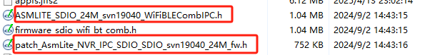
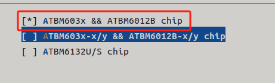

# 一、  资源收集

## 1.
> [!PDF|important] [[ATBM WIFI4 驱动配置说明_FAQ_V4.4.pdf#page=4&selection=19,1,20,11&color=important|ATBM WIFI4 驱动配置说明_FAQ_V4.4, p.4]]
> > 单独编译驱动的编译方法
> 
> 

## 2.君正官方有配好的驱动源码
 > [!PDF|important] [[T23 BSP开发参考V1.1.pdf#page=39&selection=60,0,62,4&color=important|T23 BSP开发参考V1.1, p.39]]
> > 6.11 Wifi
> 
> 

## 3.

# 二、内核配置

## 1.

## 2.
 

## 3.

# 三、驱动源码
[[回收站/assets/wifi驱动移植适配/file-20250810171406301.pdf]]

[[回收站/assets/wifi驱动移植适配/file-20250810171406318.pdf]]

1.3 编译
再配置

## 1.
4) 编译编译有两种方式： 1. 只修改 3.1)&3.2)，然后在驱动根目录直接 make 即可

## 2.

> [!PDF|note] [[T23 BSP开发参考V1.1.pdf#page=31&selection=280,0,336,2&color=note|T23 BSP开发参考V1.1, p.31]]
> > gpio_num 即 GPIO 号。计算公式为： PA(n) = 0 * 32 + n PB(n) = 1 * 32 + n ... 例如：申请 PB(10) = 1 * 32 + 10 = 42
> 
> 

PB28---》32+28=60

## 3.

）最终的固件只能放在内核预定义的路径 2.1）该路径定义于：kernel/drivers/base/firmware_class.c 2.2）在运行系统里面添加存放固件的路径例如固件放的路径为/mnt/sdcard/firmware/添加路径的方法如下： echo /mnt/sdcard/firmware/ > /sys/module/firmware_class/parameters/path

> [!PDF|note] [[回收站/assets/wifi驱动移植适配/file-20250810171406301.pdf#page=10&selection=13,1,13,18&color=note|ATBM驱动配置说明_FAQ_V1.2, p.10]]
> 最终的固件只能放在内核预定义的路径

# 四、求助网上寻找资源

## 1.
[踩坑记录 君正T23移植RTL8189FTV\_君正t23 内核gpio配置-CSDN博客](https://blog.csdn.net/weixin_65043441/article/details/146583344)

[101.33.252.162/2024/ingenic/docs/zh/doc/BSP/T41 WiFi驱动移植指南.pdf](http://101.33.252.162/2024/ingenic/docs/zh/doc/BSP/T41%20WiFi%E9%A9%B1%E5%8A%A8%E7%A7%BB%E6%A4%8D%E6%8C%87%E5%8D%97.pdf)

[在君正T31平台上移植RTL8188 WiFi模块时，如何确保通过修改Makefile正确编译驱动，并让系统识别wlan0网卡？ - CSDN文库](https://wenku.csdn.net/answer/3mtj6avcz0)

[移植rtl8192 / 君正Ingenic/X1000/X2000/T10/T20/T30 / WhyCan Forum(哇酷开发者社区)](https://whycan.com/t_11015.html)

## 2.君正官方的， WiFi驱动移植没有蓝牙低功耗功能，还是用WiFi原厂的吧

## 3.
 

# 五、

## 1.备份
ifeq ($(platform),PLATFORM_INGENICT23)
ccflags-y += -DCONFIG_ATBM_APOLLO_USE_GPIO_IRQ
endif

#define PLATFORM_INGENICT23			(23)

#if(ATBM_WIFI_PLATFORM == PLATFORM_INGENICT23)
	.power_ctrl = NULL,
	.power_gpio	= GPIO_PB(9),
	.irq_gpio	= 60,
#endif

ifeq ($(platform),PLATFORM_INGENICT23)
ifeq ($(sys),linux)
KERDIR=/home/ming/workspace/ISVP-T23-1.1.2-20240204/software/zh/Ingenic-SDK-T23-1.1.2-20240204-zh/opensource/kernel
CROSS_COMPILE:=mips-linux-gnu-
endif
export
arch = mips
ATBM_WIFI__EXT_CCFLAGS = -DATBM_WIFI_PLATFORM=23

EXTRA_CFLAGS += -DCONFIG_PLATFORM_OPS
PLATFORM_FILES += platform/platform_ingenic_sdio.o
endif

export
platform ?= PLATFORM_INGENICT23
#Android
#Linux
sys ?= linux
#arch:arm or arm64 or mips(NVT98517)
arch ?= mips
#export 
#ATBM_WIFI__EXT_CCFLAGS = -DATBM_WIFI_PLATFORM=$(platform)

## 2.
mmc1

#if(ATBM_WIFI_PLATFORM == PLATFORM_INGENICT23)
	.power_ctrl = NULL,
	.power_gpio	= NULL,
	.irq_gpio	= 60,
#endif
	.reset_gpio = 0,
#else
	.clk_ctrl     = NULL,
	.power_ctrl   = NULL,
	.insert_ctrl  = NULL,
#endif
};

1.2.10.2 只支持 BLE+WIFI，不支持纯 WIFI
## 3.
2) 使用的是 usb 总线+WIFI_BLE 共存的功能，需要放两个固件： a. 带 AsmLite 的名称的固件改名为 firmware_lite_usb.h 放到 hal_apollo/目录下 b. 带 WiFiBLEComb 的名称的固件改名为 firmware_usb_wifi_bt_comb.h 放到 hal_apollo/目录下

# 六、

> [!PDF|important] [[ATBM WIFI4 驱动配置说明_FAQ_V4.4.pdf#page=27&selection=18,0,22,26&color=important|ATBM WIFI4 驱动配置说明_FAQ_V4.4, p.27]]
> > 1.3.3.5 修改 hal_apollo/atbm_platform.c
> 
> 

????

## 1.

## 2.

## 3.

如何再内核源码目录下查看内核版本

ming@ming:~/workspace/ISVP-T23-1.1.2-20240204/software/zh/Ingenic-SDK-T23-1.1.2-20240204-zh/opensource/kernel$ cat include/config/kernel.release
3.10.14__isvp_pike_1.0__

内核版本

> [!PDF|note] [[ATBM WIFI4 驱动配置说明_FAQ_V4.4.pdf#page=27&selection=26,0,26,22&color=note|ATBM WIFI4 驱动配置说明_FAQ_V4.4, p.27]]
> > 如果有不同版本的内核并且有较差异需要增加进来
> 
> 没

复位函数的写

