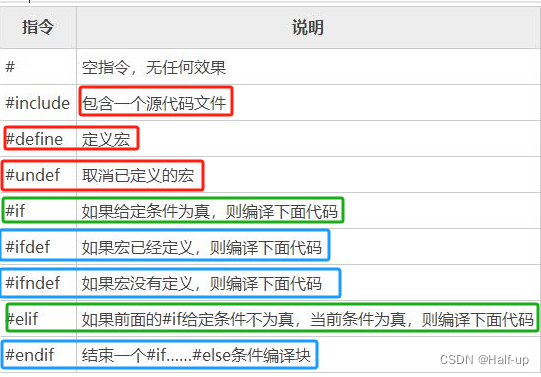

##### 预处理命令使用详解----#if、#endif、#undef、#ifdef、#else、#elif

- [预处理命令](https://blog.csdn.net/qq_35629971/article/details/129278557?ops_request_misc=%257B%2522request%255Fid%2522%253A%25222ce663576f7faf671a00adb368b0d259%2522%252C%2522scm%2522%253A%252220140713.130102334..%2522%257D&request_id=2ce663576f7faf671a00adb368b0d259&biz_id=0&utm_medium=distribute.pc_search_result.none-task-blog-2~blog~top_positive~default-1-129278557-null-null.nonecase&utm_term=%23if&spm=1018.2226.3001.4450#_4 "预处理命令")
- [#include（文件包含命令）](https://blog.csdn.net/qq_35629971/article/details/129278557?ops_request_misc=%257B%2522request%255Fid%2522%253A%25222ce663576f7faf671a00adb368b0d259%2522%252C%2522scm%2522%253A%252220140713.130102334..%2522%257D&request_id=2ce663576f7faf671a00adb368b0d259&biz_id=0&utm_medium=distribute.pc_search_result.none-task-blog-2~blog~top_positive~default-1-129278557-null-null.nonecase&utm_term=%23if&spm=1018.2226.3001.4450#include_20 "#include（文件包含命令）")
- [#define（宏定义命令）](https://blog.csdn.net/qq_35629971/article/details/129278557?ops_request_misc=%257B%2522request%255Fid%2522%253A%25222ce663576f7faf671a00adb368b0d259%2522%252C%2522scm%2522%253A%252220140713.130102334..%2522%257D&request_id=2ce663576f7faf671a00adb368b0d259&biz_id=0&utm_medium=distribute.pc_search_result.none-task-blog-2~blog~top_positive~default-1-129278557-null-null.nonecase&utm_term=%23if&spm=1018.2226.3001.4450#define_56 "#define（宏定义命令）")
- [#undef](https://blog.csdn.net/qq_35629971/article/details/129278557?ops_request_misc=%257B%2522request%255Fid%2522%253A%25222ce663576f7faf671a00adb368b0d259%2522%252C%2522scm%2522%253A%252220140713.130102334..%2522%257D&request_id=2ce663576f7faf671a00adb368b0d259&biz_id=0&utm_medium=distribute.pc_search_result.none-task-blog-2~blog~top_positive~default-1-129278557-null-null.nonecase&utm_term=%23if&spm=1018.2226.3001.4450#undef_124 "#undef")
- [#if（条件编译）](https://blog.csdn.net/qq_35629971/article/details/129278557?ops_request_misc=%257B%2522request%255Fid%2522%253A%25222ce663576f7faf671a00adb368b0d259%2522%252C%2522scm%2522%253A%252220140713.130102334..%2522%257D&request_id=2ce663576f7faf671a00adb368b0d259&biz_id=0&utm_medium=distribute.pc_search_result.none-task-blog-2~blog~top_positive~default-1-129278557-null-null.nonecase&utm_term=%23if&spm=1018.2226.3001.4450#if_148 "#if（条件编译）")
- [#ifdef](https://blog.csdn.net/qq_35629971/article/details/129278557?ops_request_misc=%257B%2522request%255Fid%2522%253A%25222ce663576f7faf671a00adb368b0d259%2522%252C%2522scm%2522%253A%252220140713.130102334..%2522%257D&request_id=2ce663576f7faf671a00adb368b0d259&biz_id=0&utm_medium=distribute.pc_search_result.none-task-blog-2~blog~top_positive~default-1-129278557-null-null.nonecase&utm_term=%23if&spm=1018.2226.3001.4450#ifdef_222 "#ifdef")
- [#ifndef](https://blog.csdn.net/qq_35629971/article/details/129278557?ops_request_misc=%257B%2522request%255Fid%2522%253A%25222ce663576f7faf671a00adb368b0d259%2522%252C%2522scm%2522%253A%252220140713.130102334..%2522%257D&request_id=2ce663576f7faf671a00adb368b0d259&biz_id=0&utm_medium=distribute.pc_search_result.none-task-blog-2~blog~top_positive~default-1-129278557-null-null.nonecase&utm_term=%23if&spm=1018.2226.3001.4450#ifndef_263 "#ifndef")
- [#elif](https://blog.csdn.net/qq_35629971/article/details/129278557?ops_request_misc=%257B%2522request%255Fid%2522%253A%25222ce663576f7faf671a00adb368b0d259%2522%252C%2522scm%2522%253A%252220140713.130102334..%2522%257D&request_id=2ce663576f7faf671a00adb368b0d259&biz_id=0&utm_medium=distribute.pc_search_result.none-task-blog-2~blog~top_positive~default-1-129278557-null-null.nonecase&utm_term=%23if&spm=1018.2226.3001.4450#elif_301 "#elif")
- [#endif](https://blog.csdn.net/qq_35629971/article/details/129278557?ops_request_misc=%257B%2522request%255Fid%2522%253A%25222ce663576f7faf671a00adb368b0d259%2522%252C%2522scm%2522%253A%252220140713.130102334..%2522%257D&request_id=2ce663576f7faf671a00adb368b0d259&biz_id=0&utm_medium=distribute.pc_search_result.none-task-blog-2~blog~top_positive~default-1-129278557-null-null.nonecase&utm_term=%23if&spm=1018.2226.3001.4450#endif_325 "#endif")
- [defined函数（与if等结合使用）](https://blog.csdn.net/qq_35629971/article/details/129278557?ops_request_misc=%257B%2522request%255Fid%2522%253A%25222ce663576f7faf671a00adb368b0d259%2522%252C%2522scm%2522%253A%252220140713.130102334..%2522%257D&request_id=2ce663576f7faf671a00adb368b0d259&biz_id=0&utm_medium=distribute.pc_search_result.none-task-blog-2~blog~top_positive~default-1-129278557-null-null.nonecase&utm_term=%23if&spm=1018.2226.3001.4450#definedif_332 "defined函数（与if等结合使用）")

### 预处理命令

在接触#if、#undef这类 [预处理指令](https://so.csdn.net/so/search?q=%E9%A2%84%E5%A4%84%E7%90%86%E6%8C%87%E4%BB%A4&spm=1001.2101.3001.7020) 前，大部分都都接触过#define、#include等预处理命令，通俗来讲预处理命令的作用就是<span style="background:#b1ffff">在编译和链接之前，对源文件进行一些文本方面的操作，</span>比如文本替换、文件包含、删除部分代码等，这个过程叫做预处理（在编译之前对源文件进行简单加工）

（#define是一种 [宏定义](https://so.csdn.net/so/search?q=%E5%AE%8F%E5%AE%9A%E4%B9%89&spm=1001.2101.3001.7020 "宏定义") 命令，是预处理命令的一种）




### #include（文件包含命令）

#include的用法有两种，尖括号<>和双引号""

第一种----尖括号

```cpp
#include <stdio.h>
```

第二种----双引号

```cpp
#include "stdio.h"
```

使用尖括号和双引号的区别在于头文件的搜索路径

**尖括号** ：编译器会到系统路径下查找头文件

**双引号** ：编译器会<span style="background:#affad1">先在当前目录下查找头文件，如果没有找到，再到系统路径下查找</span>

注意事项：

1、一个 #include 命令只能包含一个头文件

2、同一个头文件可以被多次引入，多次引入的效果和一次引入的效果相同，因为头文件在代码层面有防止重复引入的机制

3、<span style="background:#d3f8b6">头文件包含允许嵌套</span>

**（<span style="background:#b1ffff">头文件只能包含变量和函数的声明，不能包含定义</span>，否则在多次引入时会引起重复定义错误）**

---

### #define（宏定义命令）

格式：#define 标识符 字符串

并不是所有情况下#define所定义的字符串都会被替换，有一种特殊情况： **被替换的字符串在""内**

代码示例：

```cpp
#include <stdio.h>

 

#define MAX 10

 

int main()

{

    printf("MAX");

}
```

还有需要注意的一点是，不管是在某个函数内，还是在所有函数之外（不太建议把#define写在函数内），<span style="background:#b1ffff">#define作用域都是从定义开始直到整个文件结尾</span>（这一点和typedef就区别很大）

`#define（宏定义）----由预处理器来处理`

`typedef----在编译阶段由编译器处理`

代码举例：

```kotlin
#include <stdio.h>

 

void fun();

int main()

{

    #define MAX int

 

    MAX a = 10;

    printf("%d", a);

    fun();

}

 

void fun()

{

    MAX b = 10;

    printf("%d", b);

}
```

define与typedef作用域的的区别：

**typedef：**

如果放在所有函数之外，它的作用域就是 **从它定义开始直到文件尾**

<span style="background:#affad1">如果放在某个函数内，它的作用域就是 从它定义开始直到该函数结尾</span>

**#define：**

不管是在某个函数内，还是在所有函数之外，作用域都是从定义开始直到整个文件结尾 **（不管是<span style="background:#b1ffff">typedef还是define，其作用域都不会扩展到别的文件</span>，即使是同一个程序的不同文件，也不能互相使用）**

> 这里说下题外话#define叫宏定义，但是在笔者的认识里对声明和定义的理解是：声明不分配内存，定义才分配内存，所以#define虽然名字里面有“定义”两个字，但并<span style="background:rgba(240, 200, 0, 0.2)">不占存储空间</span>（为什么不叫宏声明···）

总结： **#define和声明、定义都不同，宏定义不占内存空间，因为宏在预处理阶段就会被替换掉，到了编译的阶段是没有宏存在的，它在预编译阶段就被处理了**

---


### #undef

上文提到#define的作用域是从它声明开始到文件结尾，#undef就是<span style="background:#b1ffff">取消之前的宏定义</span>（也就是#define的标识符）

格式：#undef 标识符（注意：如果标识符当前没有被定义成一个宏名称，那么就会忽略该指令）
<span style="background:#affad1">#undef MAX</span>

<span style="background:#affad1">#define    MAX 20</span>


```cpp
#include <stdio.h>

 

#define MAX 10

int main()

{

    printf("%d", MAX);

#undef MAX

#define    MAX 20

    printf("%d", MAX);

}
```

---

### #if（条件编译）

#if的使用和if else的使用非常相似，一般使用格式如下

**#if 整型常量表达式1  
程序段1  
#elif 整型常量表达式2  
程序段2  
#else  
程序段3  
#endif**

执行起来就是，如果整形常量表达式为真，则执行程序段1，否则继续往后判断依次类推（注意是整形常量表达式），最后#endif是#if的结束标志

代码示例：

```cpp
#include "stdio.h"

 

#define MAX 10

int main()

{

    printf("MAX = %d\n", MAX);

 

#if    MAX == 10

    printf("MAX已被定义\n");

#else

    printf("MAX未被定义\n");

    #undef MAX

    #define    MAX 20

#endif

 

 

    printf("MAX = %d\n", MAX);

 

    return 0;

}
```

运行结果：  
  
代码稍加修改：

```cpp
#include "stdio.h"

 

#define MAX 10

int main()

{

#if    MAX == 1

    printf("MAX已被定义\n");

#else

    printf("MAX未被定义\n");

    #undef MAX

    #define    MAX 20

#endif

 

 

    printf("MAX = %d\n", MAX);

 

    return 0;

}
```


- **#if命令要求<span style="background:#b1ffff">判断条件为整型常量表达式</span>，也就是说表达式中不能包含变量，而且结果必须是整数；而if后面的表达式没有限制，只要符合语法就行,这是#if和if的一个重要区别**

---

### #ifdef

#ifdef的作用是判断某个宏是否定义，如果该宏已经定义则执行后面的代码，一般使用格式如下

**#ifdef 宏名  
程序段1  
#else  
程序段2  
#endif**

它的意思是，如果该宏已被定义过，则对程序段1进行编译，否则对程序段2进行编译（这个和上面的#if一样最后都需要#endif），上述格式也可以不用#else，这一点上和if else相同

代码示例：

```cpp
#include <stdio.h>

 

#define MAX 10

int main()

{

#ifdef MAX

    printf("MAX已被定义\n");

#else

    printf("MAX未被定义\n");

    #undef MAX

    #define    MAX 20

#endif

 

 

    printf("MAX = %d\n", MAX);

 

    return 0;

}
```

---

### #ifndef

#ifndef恰好和#ifdef相反

#ifndef 宏名  
程序段1  
#else  
程序段2  
#endif

如果该宏未被定义，则对“程序段1”进行编译，否则对“程序段2”进行编译

```cpp
#include <stdio.h>

 

#define MAX 10

int main()

{

#ifndef MAX

    printf("MAX未被定义\n");

#else

    printf("MAX已被定义\n");

    #undef MAX

    #define    MAX 20

#endif

 

 

    printf("MAX = %d\n", MAX);

 

    return 0;

}
```

---

### #elif

#elif相当于if else语句中的else if()语句，需要注意的是该语句是#elif，而不是#elseif

```cpp
#include <stdio.h>

 

#define MAX 10

int main()

{

#if MAX==0

    printf("MAX=0");

#elif MAX==10

    printf("MAX=10\n");

#endif

 

    return 0;

}
```

---

### #endif

#endif上面已经用过多次了，需要知道的就是#endif<span style="background:#b1ffff">是#if, #ifdef, #ifndef这些条件命令的结束标志</span>.这里就不再赘述了

上面说了8种预处理命令，下面再补充一个预处理函数（注意是函数且该函数有返回值）

### defined函数（与if等结合使用）

defined函数的作用是<span style="background:#b1ffff">判断某个宏是否被定义,若该宏被定义则返回1，否则返回0</span>，该函数经常与#if #elif #else配合使用，一般使用格式为：

**defined 宏名  
或  
<span style="background:#b1ffff">defined (宏名)</span>----（个人建议，还是加上括号比较好）**

上文提到有#ifdef、#ifndef来判断宏名是否被定义，乍一看defined有点多余，其实不然，#ifdef和#ifndef仅能一次判断一个宏名， 而<span style="background:#affad1">defined能做到一次判断多个宏名</span>`

<span style="background:#d3f8b6">#if defined (MAX) && defined (MIN) && defined (AVE)</span>
代码示例：

```cpp
#include <stdio.h>

 

#define MAX 10

#define MIN 2

#define AVE 6

int main()

{

#if defined (MAX) && defined (MIN) && defined (AVE)

    printf("三个宏已全部定义\n");

#elif MAX==10

    printf("三个宏未全部定义\n");

#endif

 

    return 0;

}
```


内容来源：csdn.net

作者昵称：YOYO--小天

原文链接：https://blog.csdn.net/tianpu2320959696/article/details/145093299

作者主页：https://blog.csdn.net/tianpu2320959696

实付 元

[使用余额支付](https://blog.csdn.net/tianpu2320959696/article/details/)

点击重新获取

扫码支付

钱包余额 0

抵扣说明：

1.余额是钱包充值的虚拟货币，按照1:1的比例进行支付金额的抵扣。  
2.余额无法直接购买下载，可以购买VIP、付费专栏及课程。

[余额充值](https://i.csdn.net/#/wallet/balance/recharge)

举报

 [ 点击体验  
DeepSeekR1满血版](https://ai.csdn.net/?utm_source=cknow_pc_blogdetail&spm=1001.2101.3001.10583) 隐藏侧栏 

程序员都在用的中文IT技术交流社区


专业的中文 IT 技术社区，与千万技术人共成长


关注【CSDN】视频号，行业资讯、技术分享精彩不断，直播好礼送不停！

客服 返回顶部

   