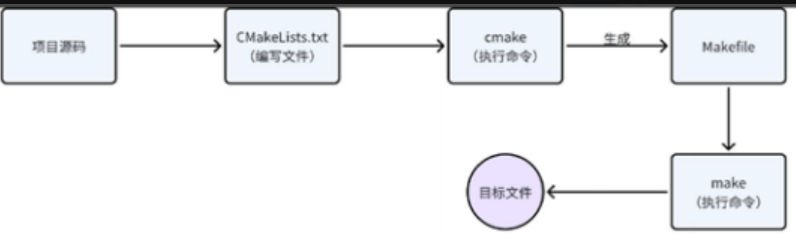
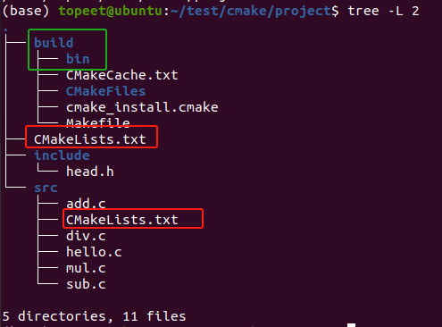
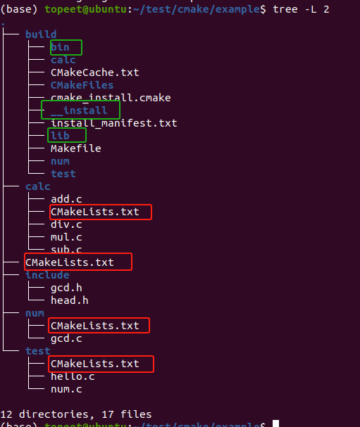

# 备注(声明)：
- 1 默认路经为CMakeLists.txt所在路经


# 一、Cmake基础知识

## Cmake介绍
### 1 、Cmake的特点
- 1 开源、跨平台的构建系统，主要⽤于软件的构建、测试和打包。
- 1 配置⽂件 CMakeLists.txt 来控制软件的编译过程
- 2 可以⽣成 Unix 系统的 Makefile 、 Windows 下的 Visual Studio 项⽬⽂件或 Mac 的 Xcode ⼯程⽂件，从⽽简化了跨平台和交叉编译的⼯作流程


### 2 、 使用流程
[[嵌入式知识学习（通用扩展）/linux基础知识/assets/CMake工具学习/file-20250810171617012.png|Open: Pasted image 20250724204204.png]]



### 3 、安装命令
```bash
sudo apt update
sudo apt install cmake
```


### 4 、 看 cmake 版本
> (base) topeet@ubuntu:~/test/cmake$ `cmake -version`
> cmake version 3.16.3
> 
> CMake suite maintained and supported by Kitware (kitware.com/cmake).
> 


### 5、 #   进行行注释 


### 6、CMakeLists.txt（必须为这个名字）


### 7、


### 8、


## 入门样例 - Hello-world工程
### 1 、准备工程文件
- 1 main.cpp 源文件只是做一个简单的 hello world 打印
```
#include <iostream>

 

int main()

{

    std::cout << "Hello world!" << std::endl;

    return 0;

}
cpp
```

- 1 CMakeLists.txt 文件如下：
- 2 CMakeLists.txt 是 CMake 构建系统的核心配置文件，其文件名​**​严格区分大小写​**​
```
cmake_minimum_required(VERSION 3.0)

project(HELLO)

add_executable(hello main.cpp)
bash
```


### 2 、 cmake 构建⼯程（外部构建）
> (base) topeet@ubuntu:~/test/cmake/hello-word$ `mkdir build
(base) topeet@ubuntu:~/test/cmake/hello-word$ `cd build/
(base) topeet@ubuntu:~/test/cmake/hello-word/build$ `cmake ..
-- The C compiler identification is GNU 9.4.0
-- The CXX compiler identification is GNU 9.4.0
-- Check for working C compiler: /usr/bin/cc
-- Check for working C compiler: /usr/bin/cc -- works
-- Detecting C compiler ABI info
-- Detecting C compiler ABI info - done
-- Detecting C compile features
-- Detecting C compile features - done
-- Check for working CXX compiler: /usr/bin/c++
-- Check for working CXX compiler: /usr/bin/c++ -- works
-- Detecting CXX compiler ABI info
-- Detecting CXX compiler ABI info - done
-- Detecting CXX compile features
-- Detecting CXX compile features - done
-- Configuring done
-- Generating done
-- Build files have been written to: /home/topeet/test/cmake/hello-word/build


### 3 、


## cmake命令参数讲解（大小写随便）
### 1 、`cmake_minimum_required` - 指定 CMake 最低版本​
```
cmake_minimum_required(VERSION <min>[...<max>] [FATAL_ERROR])
```

> - ​**​`VERSION <min>`​**​  
>     必填参数，指定项目要求的<span style="background:#d3f8b6">最低 CMake 版本</span>（如 `3.0`）。若当前环境版本低于此值，CMake 会报错终止
> - ​**​`[...<max>]`​**​（可选）  
>     <span style="background:#d3f8b6">指定兼容的最高版本</span>（如 `3.0...3.15`）。此参数主要用于控制 CMake 的策略行为（Policy），确保高版本 CMake 不启用破坏兼容性的新特性
> - ​**​`FATAL_ERROR`​**​（可选）  
>     在现代 CMake 中已废弃，默认版本不匹配时即报错，无需显式声明
> 

#### 举例
> cmake_minimum_required(`VERSION 3.10...3.15`)  # 要求 CMake 在 3.10~3.15 之间


### 2 、`project` - 定义项目基本信息​
```
project(<PROJECT_NAME>
    [VERSION <version>] 
    [DESCRIPTION <text>] 
    [HOMEPAGE_URL <url>]
    [LANGUAGES <lang1> <lang2>...]
)
```
- 1 <PROJECT_NAME>  工程名字

> - ​**​`VERSION`​**​（可选）  
>     设置项目版本号（如 `1.0.0`），自动生成变量 `PROJECT_VERSION`、`PROJECT_VERSION_MAJOR` 等
> - ​**​`DESCRIPTION`​**​（可选）  
>     项目描述文本，用于文档或打包元数据
> - ​**​`HOMEPAGE_URL`​**​（可选）  
>     项目主页 URL（如 GitHub 地址）
> - ​**​`LANGUAGES`​**​（可选）  
>     指定项目编程语言（如 `C CXX`）。​**​默认启用 C 和 C++​**​，若需禁用需显式指定 `NONE`
> 


### 3 、`add_executable` - 创建可执行文件目标​
```
add_executable(可执行程序名 源文件名)
```
- 2 可执行程序名和 project 中的项目名没有任何关系
- 1 源文件名可以是一个也可以是多个，如有多个可用空格或;间隔

#### 举例
```
# 样式 1 
add_executable(app test1.c test2.c test3.c)

# 样式 2 
add_executable(app test1.c;test2.c;test3.c)

```

### 4 、`set`（定义变量）
```
SET(VAR [VALUE] [CACHE TYPE DOCSTRING [FORCE]])
```
> - ​**​`VAR`​**​：<span style="background:#affad1">变量名</span>（大小写敏感）
> - ​**​`VALUE`​**​：<span style="background:#d3f8b6">变量值</span>（字符串、列表或路径），​**​可省略​**​（此时变量值为空）
> - ​**​`CACHE` 相关参数​**​（可选）：
>     - `TYPE`：变量类型，支持 `STRING`、`BOOL`、`FILEPATH`、`PATH`、`INTERNAL`
>     - `DOCSTRING`：变量描述文本（显示在 CMake GUI 中）
>     - `FORCE`：强制覆盖缓存中已存在的值


#### 举例
```
set(SRC_LIST test1.c test2.c test3.c)
set(CMAKE_CXX_STANDARD 17) #设置 C++特性标准

add_executable(app ${SRC_LIST})
```
- 1 变量使⽤ ${} ⽅式取值，但是在 if 控制语句中是直接使⽤变量名

### 5、`aux_source_directory`（简化源文件收集​）
- 1 自动收集指定目录下的 C/C++ 源文件（如 `.c`、`.cpp`、`.cc`），存储到变量中
```
aux_source_directory(src SRC_LIST)
```

- 1 ./ 表示CMakeLists.txt所在目录

#### ​**​局限性​**​：
>     - ❌ ​**​不递归子目录​**​：仅搜索指定目录，不包含子目录
>     - ❌ ​**​可能包含冗余文件​**​：会收集目录下所有匹配文件（如测试文件、临时文件）
>     - ❌ ​**​缓存问题​**​：新增文件需手动重新运行 CMake 更新构建系统

### 6、`file(GLOB)`：灵活匹配文件​
```
file(GLOB/GLOB_RECURSE 变量名 要搜索的文件路径和文件类型)
```
- 1 GLOB                      非递归匹配
- 1 GLOB_RECURSE     递归匹配子目录

#### 举例
```bash
# 非递归搜索 .cpp 文件
file(GLOB SRC_FILES "src/*.c")
# 递归搜索所有子目录的 .cpp 文件
file(GLOB_RECURSE ALL_SRCS "src/**/*.c")


add_executable(hello ${SRC_FILES})

```


#### ⚠️ ​**​局限性​**​

> - ​**​缓存问题​**​：<span style="background:#d3f8b6">新增文件需手动重新运行 CMake</span>
> - ​**​性能风险​**​：大型项目中递归搜索可能影响性能


### 7、`include_directories`（包含头文件）
```
include_directories(inc)
```

- 1 ./ 表示CMakeLists.txt所在目录
- 2 将源文件对应的头文件路径指定出来，这样才能保证在编译过程中编译器能够找到这些头文件，并顺利通过编译

### 8、`add_library` （⽣成动态库/静态库）（同时会暴露库的路经给后面的命令）

- 1 ⽣成静态库
```
add_library(库名称 STATIC 源文件 1 [源文件 2] ...)
```
- 2 静态库名字分为三部分：lib+ 库名字 +.a ，所以库名称只需要指定出库的名字就可以了


- 1 ⽣成动态库
```
add_library(库名称 SHARED 源文件 1 [源文件 2] ...)
```
- 2 动态库名字分为三部分： lib+ 库名字 +.so ，所以库名称也只需要指定出库的名字就可以了


#### 举例 - 可执行文件依赖于动态库
> 
> # 非递归搜索 .cpp 文件
> file(GLOB SRC_FILES "src/* .c")
> # 递归搜索所有子目录的 .cpp 文件
> file(GLOB_RECURSE ALL_SRCS "src/** /* . c")
> 
> include_directories(inc)
> 
> `add_library(man SHARED ${SRC_FILES})
> set(LIBRARY_OUTPUT_PATH ${PROJECT_SOURCE_DIR}/build/lib)
> 
> 
> `add_executable(hello src/hello.c)
> `target_link_libraries(hello man) 
> 


### 9、link_libraries（链接库）（不推荐）
```
link_libraries(<static lib> [<static lib>...])
```

- 1 参数为指定要链接的库的名字，可以是全名， 也可以是去掉 lib 和.a或.so 之后的名字


#### 举例
```makefile
# 直接链接库
link_libraries(man)
link_directories(${PROJECT_BINARY_DIR}/build/lib/)# 指定库的搜索路径
```


### 10、target_link_libraries（链接库）
```
target_link_libraries(<target> 
    [PRIVATE|PUBLIC|INTERFACE] <item1> <item2> ...
    [<PRIVATE|PUBLIC|INTERFACE> <item3> ...]...
)
```

> - ​**​`<target>`​**​：由 `add_executable()` 或 `add_library()` 创建的目标名称（如可执行文件或库）
> - ​**​`<item>`​**​：支持以下类型：
>     - CMake 目标名（如 `math_lib`）
>     - <span style="background:#d3f8b6">库文件全路径</span>（如 `/usr/lib/libboost_system.so`）
>     - 链接器标志（如 `-pthread`）
>     - 生成器表达式（如 `$<BUILD_INTERFACE:...>`）

#### ​​三种作用域的区别​​

|​**​关键字​**​|​**​当前目标​**​|​**​依赖目标​**​|​**​典型场景​**​|
|---|---|---|---|
|`PRIVATE`|✅|❌|内部实现依赖（如日志库）|
|`PUBLIC`|✅|✅|接口依赖（如标准库）|
|`INTERFACE`|❌|✅|头文件库（纯接口定义）|

> - `PUBLIC`：库被链接到目标，且<span style="background:#affad1">依赖目标可访问（传递性）</span>；
> - `PRIVATE`：仅当前目标使用，<span style="background:#d3f8b6">不传递</span>；
> - `INTERFACE`：不链接到当前目标，但依赖目标需此库（如头文件库）


#### 传递性示例​​

```
# 动态库A链接B和C（PUBLIC传递）
target_link_libraries(A PUBLIC B C)  

# 可执行文件D链接A，自动获得B和C
target_link_libraries(D PRIVATE A)  
```
- 2 若B/C设为`PRIVATE`，则D无法访问它们


#### 举例 - 可执⾏⽂件链接动态库
```
add_executable(hello src/hello.c)
target_link_libraries(hello man) 
```

- 1 在 cmake 中指定要链接的动态库的时候，应该将命令写到⽣成了可执⾏⽂ 件之后：
- 2 因为当可执⾏程序被启动并且调⽤了动态库中的函数的时候，动态库才会被加载到内存。

### 11、link_directories（指定链接库的路径）
```
link_directories(<lib path>)
```


### 12、install （定义安装规则）（make install命令来源）
```cmake
install(TARGETS <targets...>
    [ARCHIVE DESTINATION <dir>]   # 静态库(.a/.lib)
    [LIBRARY DESTINATION <dir>]   # 动态库(.so/.dll)
    [RUNTIME DESTINATION <dir>]   # 可执行文件(及Windows的.dll)
    [INCLUDES DESTINATION <dir>]  # 头文件搜索路径
)
```
- 2 安装的内容可以包括⽬标⼆进制、动态库、静态库以及⽂件、⽬录、脚本等。
- 1 targets ： 安装的内容        dir ： 安装的路经

- 1 make install 命令的来源
- 2 CMake 的 `install(TARGETS …)` 的作用，并不涉及网络下载——它主要用于将项目内已构建的可执行文件、共享库或静态库复制到指定的安装目录，以便进行发布、打包或系统安装。

#### ​路径优先级规则​​
- ​**​绝对路径​**​：以`/`开头时直接使用（覆盖`CMAKE_INSTALL_PREFIX`）
- ​**​相对路径​**​：自动拼接`${CMAKE_INSTALL_PREFIX}/<dir>`
```
install(TARGETS myapp
    RUNTIME DESTINATION /opt/myproject/bin  # 绝对路径 → /opt/myproject/bin
    LIBRARY DESTINATION lib                # 相对路径 → ${prefix}/lib
)
```

#### 安装可执行文件和库
```
INSTALL(TARGETS targets... [[ARCHIVE|LIBRARY|RUNTIME] 

[DESTINATION ] [PERMISSIONS permissions...] [CONFIGURATIONS 

[Debug|Release|...]] [COMPONENT ] [OPTIONAL] ] [...])

```

> - 参数中的 TARGETS 后⾯跟的就是我们通过 ADD\_EXECUTABLE 或者ADD\_LIBRARY 定义的<span style="background:#d3f8b6">⽬标⽂件</span>， 可能是<span style="background:#affad1">可执⾏⼆进制、动态库、静态库</span>。
> - ⽬标类型也就相对应的有三种， ARCHIVE 特指静态库， LIBRARY 特指动态库，<span style="background:#d3f8b6">RUNTIME 特指可执⾏⽬标⼆进制。</span>
> - <span style="background:#b1ffff">DESTINATION </span>定义了<span style="background:#d3f8b6">安装的路径</span>，如果路径以 / 开头，那么指的是绝对路径，这时候 CMAKE\_INSTALL\_PREFIX 其实就⽆效了。如果你希望使⽤CMAKE\_INSTALL\_PREFIX 来 定义安装路径，就要写成相对路径，即不要以 / 开头，那么安装后的路径就是 ${CMAKE\_INSTALL\_PREFIX}/...

##### 举例
```
# 安装可执行文件和库
set(CMAKE_INSTALL_PREFIX /home/topeet/test/cmake/hello-word/build/__install)
INSTALL(TARGETS hello man RUNTIME DESTINATION bin LIBRARY DESTINATION lib)
```
> (base) topeet@ubuntu:~/test/cmake/hello-word/build$ `make
> [ 75%] Built target man
> [100%] Built target hello
> (base) topeet@ubuntu:~/test/cmake/hello-word/build$ `make install
> [ 75%] Built target man
> [100%] Built target hello
> Install the project...
> -- Install configuration: ""
> -- Installing: /home/topeet/test/cmake/hello-word/build/b/hello
> -- Set runtime path of "/home/topeet/test/cmake/hello-word/build/b/hello" to ""
> -- Installing: /home/topeet/test/cmake/hello-word/build/c/libman.so
> 
> - `可执⾏⼆进制 hello 安装到 ${CMAKE\_INSTALL\_PREFIX}/bin 目录
> - `动态库 man 安装到 ${CMAKE\_INSTALL\_PREFIX}/lib目录


#### 安装普通文件 (`FILES`)​
```
install(FILES <file1> <file2>... 
    DESTINATION <dir>              # 必选：安装目标路径
    [PERMISSIONS permissions...]   # 可选：自定义权限
    [CONFIGURATIONS [Debug|Release...]]
)
```
> - ​**​默认权限​**​：  
>     若不指定 `PERMISSIONS`，文件权限为 ​**​`644`​**​（`OWNER_READ|OWNER_WRITE|GROUP_READ|WORLD_READ`）
> - ​**​典型用途​**​：  
>     配置文件（如 `config.yaml`）、数据文件、头文件（`.h`）、文档（`.md`）等。

##### 示例​
```
# 安装头文件到 include 目录（默认 644 权限）
INSTALL(FILES inc/hello.h DESTINATION include)

# 安装配置文件并自定义权限（600：仅所有者读写）
install(FILES app.conf DESTINATION etc 
    PERMISSIONS OWNER_READ OWNER_WRITE
)
```
> (base) topeet@ubuntu:~/test/cmake/hello-word$ `touch app.conf
> (base) topeet@ubuntu:~/test/cmake/hello-word$ 
> (base) topeet@ubuntu:~/test/cmake/hello-word/build$ `make install
> [ 75%] Built target man
> [100%] Built target hello
> Install the project...
> -- Install configuration: ""
> -- Up-to-date: /home/topeet/test/cmake/hello-word/build/__ install/bin/hello
> -- Up-to-date: /home/topeet/test/cmake/hello-word/build/__ install/lib/libman.so
> -- Installing: /home/topeet/test/cmake/hello-word/build/__ install/include/head.h
> -- Installing: /home/topeet/test/cmake/hello-word/build/__ install/etc/app.conf

- 1 默认路经为CMakeLists.txt所在路经

#### 安装非目标文件的可执行程序 (`PROGRAMS`)​
```
install(PROGRAMS <script1> <script2>...
    DESTINATION <dir>              # 必选：安装目标路径
    [PERMISSIONS permissions...]   # 可选：自定义权限
    [CONFIGURATIONS [Debug|Release...]]
)
```
> - **默认权限​**​：  
    若不指定 `PERMISSIONS`，权限为 ​**​`755`​**​（`OWNER_EXECUTE|GROUP_EXECUTE|WORLD_EXECUTE`）
> - ​**​典型用途​**​：  
>     Shell 脚本（`.sh`）、Python 脚本（`.py`）或其他需执行权限的非编译型程序。

##### 示例：
```bash
# 安装启动脚本到 bin 目录（默认 755 权限）
install(PROGRAMS run_app.sh DESTINATION bin)

# 安装维护脚本并限制权限（700：仅所有者可执行）
install(PROGRAMS cleanup.py DESTINATION scripts 
    PERMISSIONS OWNER_EXECUTE OWNER_READ OWNER_WRITE
)
```
> (base) topeet@ubuntu:~/test/cmake/hello-word$ `touch run_app.sh
(base) topeet@ubuntu:~/test/cmake/hello-word$ `touch cleanup.py
(base) topeet@ubuntu:~/test/cmake/hello-word$ 
(base) topeet@ubuntu:~/test/cmake/hello-word/build$ `make install
[ 75%] Built target man
[100%] Built target hello
Install the project...
-- Install configuration: ""
-- Up-to-date: /home/topeet/test/cmake/hello-word/build/__ install/bin/hello
-- Up-to-date: /home/topeet/test/cmake/hello-word/build/__ install/lib/libman.so
-- Up-to-date: /home/topeet/test/cmake/hello-word/build/__ install/include/head.h
-- Up-to-date: /home/topeet/test/cmake/hello-word/build/__ install/etc/app.conf
-- Installing: /home/topeet/test/cmake/hello-word/build/__ install/bin/run_app.sh
-- Up-to-date: /home/topeet/test/cmake/hello-word/build/__ install/scripts/cleanup.py


### 13、message（打印消息）
```bash
message([STATUS|WARNING|AUTHOR_WARNING|FATAL_ERROR|SEND_ERROR] 

        "message to display" ...)

```

> 第一个参数<span style="background:#d3f8b6">不设置， 则表示重要消息</span>。（通常）
> - STATUS ：<span style="background:#d3f8b6">非重要</span>消息
> - WARNING ： CMake <span style="background:#d3f8b6">警告</span>, 会继续执行
> - AUTHOR\_WARNING ： CMake 警告 (dev), 会继续执行
> - SEND\_ERROR ： CMake <span style="background:#d3f8b6">错误, 继续执行，但是会跳过生成的步骤</span>
> - FATAL\_ERROR ： CMake <span style="background:#d3f8b6">错误</span>, <span style="background:#d3f8b6">终止所有处理过程</span>

#### 举例
```bash
# 输出一般日志信息
message(STATUS "source path: ${PROJECT_SOURCE_DIR}")

# 输出警告信息
message(WARNING "source path: ${PROJECT_SOURCE_DIR}")

# # 输出错误信息 
message(FATAL_ERROR "source path: ${PROJECT_SOURCE_DIR}")
```
> (base) topeet@ubuntu:~/test/cmake/hello-word/build$ cmake ..
`-- source path: /home/topeet/test/cmake/hello-word
`CMake Warning at CMakeLists.txt:35 (message):
  source path: /home/topeet/test/cmake/hello-word
> 
> `CMake Error at CMakeLists.txt:38 (message):
>   source path: /home/topeet/test/cmake/hello-word
>
> -- Configuring incomplete, errors occurred!
> See also "/home/topeet/test/cmake/hello-word/build/CMakeFiles/CMakeOutput.log".
> 


### 14、`add_definitions` （全局定义宏）
```
add_definitions(-DDEBUG)
```

> 1. **全局宏定义​**​  
>     `-DDEBUG` 等效于在代码中添加 `#define DEBUG`，所有源文件在编译时都会启用该宏。  
>     ​**​效果​**​：代码中的 `#ifdef DEBUG` 或 `#if DEBUG` 条件块会被激活
> 2. ​**​编译流程​**​  
>     宏定义在预处理阶段处理，编译器会将 `DEBUG` 宏展开为条件编译的代码，未启用时则移除调试代码

- 1 通过 CMake 的 `add_definitions(-DDEBUG)` 可以为整个项目全局定义 `DEBUG` 宏，实现调试信息的条件编译。


### 15、add_custom_command（在构建流程中插入自定义操作）
#### 文件生成模式（File Generation）
```bash
add_custom_command(
  OUTPUT output_file          # 生成的输出文件（必填）
  COMMAND tool arg1 arg2      # 执行的命令（必填）
  DEPENDS input_file          # 依赖的输入文件/目标
  WORKING_DIRECTORY dir       # 命令执行目录
  COMMENT "Generating code"   # 构建时显示的提示信息
  VERBATIM                    # 禁用参数转义（推荐）
)
```
- 1 定义输入文件到输出文件的映射关系，CMake自动管理依赖链：
- 2 1. ​**​适用场景​**​：生成协议缓冲区代码（`.proto` → `.pb.cc`）、数据库映射文件（`.hxx` → `.cxx`）


```bash
# 文件生成模式：.proto → .pb.cc/.pb.h
add_custom_command(
  OUTPUT my.pb.cc my.pb.h
  COMMAND protoc --cpp_out=${CMAKE_CURRENT_BINARY_DIR} my.proto
  DEPENDS my.proto
  WORKING_DIRECTORY ${CMAKE_CURRENT_SOURCE_DIR}
  COMMENT "Generating Protocol Buffer code"
  VERBATIM
)

# 将生成的文件加入可执行目标
add_executable(my_app main.cpp my.pb.cc)
target_include_directories(my_app PRIVATE ${CMAKE_CURRENT_BINARY_DIR})
```


#### ​​目标钩子模式（Target Hook）
```bash
add_custom_command(
  TARGET my_target            # 关联的目标名称（必填）
  PRE_BUILD | PRE_LINK | POST_BUILD  # 执行时机（必填）
  COMMAND tool arg1           # 命令
  COMMENT "Pre-build step"    # 提示信息
)
```
- 1 绑定到具体目标（如可执行文件），在构建阶段插入操作：
> **时机说明​**​：
> - `PRE_BUILD`：编译开始前（​**​MSVC下实际在`PRE_LINK`阶段执行​**​）
> - `PRE_LINK`：编译后，链接前
> - `POST_BUILD`：目标构建完成后


### 16、list（列表定义添加数据）
```bash
set(variable_name "")          # 初始化空列表
list(APPEND variable_name content)  # 追加元素
```


-  **举例**
```
set(SRC_FILES "")          # 初始化空列表
list(APPEND SRC_FILES src/add.c)  # 追加元素
list(APPEND SRC_FILES src/div.c)  # 追加元素
list(APPEND SRC_FILES src/mul.c)  # 追加元素
list(APPEND SRC_FILES src/sub.c)  # 追加元素

add_library(man SHARED ${SRC_FILES})
```
- 1 需逐步添加元素（如条件分支添加）


### 17、string（字符串内容替换）
```bash
string(REPLACE ".old" ".new" OUTPUT_VAR INPUT_STR)
```
>- `".old"`：被替换的子串
> - `".new"`：替换后的新串
> - `OUTPUT_VAR`：存储结果的变量
> - `INPUT_STR`：输入字符串

#### 举例：修改文件扩展名
```bash
set(FILE "src/hello.cpp")
string(REPLACE ".cpp" ".c" OBJ_FILE ${FILE})  # OBJ_FILE = "main.o"

add_executable(hello ${OBJ_FILE})
target_link_libraries(hello man) 
```


### 18、`if`（条件命令）
```bash
if(condition)
    commands()
elseif(condition)  # 可选，可重复
    commands()
else()             # 可选
    commands()
endif()
```
- 1 `if`用于条件分支控制，支持嵌套和多种条件类型

#### 条件类型与优先级​

- ​**​基础表达式​**​：
    - ​**​常量​**​：`ON`/`YES`/`1`/非零数为真；`OFF`/`NO`/`0`/空字符串为假。
    - ​**​变量​**​：`if(var)` 当`var`定义且非假时为真（​**​宏参数和环境变量不可直接判断​**​，需用`DEFINED`或`$ENV{var}`）。
    - ​**​字符串​**​：带引号的字符串通常为假，除非其值为真常量（如`if("ON")`为真）。
- ​**​存在性检查​**​：
    - `COMMAND`：检查命令/宏是否存在。
    - `TARGET`：检查目标（如`add_executable`定义）是否存在。
    - `DEFINED`：检查变量是否定义（支持`CACHE{var}`和`ENV{var}`）。
- ​**​文件操作​**​：
    - `EXISTS`：路径是否存在（需绝对路径）。
    - `IS_DIRECTORY`/`IS_SYMLINK`：检查目录或软链接。
- ​**​比较运算​**​：

|​**​类型​**​|​**​运算符​**​|​**​示例​**​|
|---|---|---|
|数值比较|`LESS`/`GREATER`/`EQUAL`|`if(num LESS 10)`|
|字符串比较|`STRLESS`/`STREQUAL`/`STRGREATER`|`if(str STREQUAL "foo")`|
|版本号比较|`VERSION_LESS`/`VERSION_EQUAL`|`if(ver VERSION_GREATER "2.5.3")`|
|正则匹配|`MATCHES`|`if(str MATCHES "^[a-z]+$")`|
#### 举例 - 判断文件是否存在​
```bash
if (NOT EXISTS file_path)
  message(WARNING "File missing!")
endif()
```


### 19、`foreach`（循环命令​）
- 1 `foreach`用于遍历列表或范围，支持多种迭代模式
```bash
foreach(loop_var <items>)
    commands()
endforeach()
```

#### **遍历模式详解​**​ 

|​**​模式​**​|​**​语法示例​**​|​**​说明​**​|
|---|---|---|
|​**​直接遍历值列表​**​|`foreach(color Red Green Blue)`|遍历显式列出的元素|
|​**​遍历变量列表​**​|`foreach(fruit ${FRUITS})`|变量需用分号分隔（`set(FRUITS "a;b")`）|
|​**​数字范围遍历​**​|`foreach(i RANGE 1 5 2)`|步长可选，生成序列 `1, 3, 5`|
|​**​多列表并行遍历​**​|`foreach(n id dept IN ZIP_LISTS NAMES IDS)`|CMake ≥3.17，按索引同步遍历多个列表|

#### ​**​2. 循环控制与作用域​**​
- ​**​控制命令​**​：
    - `break()`：立即退出循环。
    - `continue()`：跳过当前迭代

- ​**​作用域规则​**​：
    - 循环变量（如`loop_var`）仅在循环内部有效。
    - 修改外部变量需显式传递：`set(var "new" PARENT_SCOPE` 

#### 举例 - 循环遍历​
```bash
foreach(val IN LISTS vals)  # 遍历列表
  message(STATUS "Value: ${val}")
endforeach()
```
> 循环会依次将`vals`中的每个元素赋值给`val`，执行循环体操作


### 20、


### 21、


### 22、


## cmake中特定含义的宏
### 1 、CMAKE_CXX_STANDARD（指定使⽤的 C++标准）

> `set(CMAKE_CXX_STANDARD 17)` # 设置 C++特性标准


- 1 也可以在执⾏ cmake 命令的时候指定出这个宏的值
- 2 cmake .. -DCMAKE_CXX_STANDARD=17

### 2 、EXECUTABLE_OUTPUT_PATH（指定可执⾏⽂件输出的路径）
> set(`EXECUTABLE_OUTPUT_PATH ./bin/`)

- 1 ./ 对应的就是 makefile ⽂件所在的那个⽬录。


### 3 、LIBRARY_OUTPUT_PATH（指定动态库 / 静态库输出的路径。）
> set(`LIBRARY_OUTPUT_PATH ${PROJECT_SOURCE_DIR}/lib`)


### 4 、`PROJECT_BINARY_DIR` - 构建目录（自带）

- 1 CMakeLists.txt目录位置

### 5、CMAKE_INSTALL_PREFI（安装目录的​根路径）（别名：prefix）
- 1 `prefix` 是 `CMAKE_INSTALL_PREFIX` 的别名。该变量定义了安装目录的​**​根路径​**​，所有子路径（如 `bin`、`lib`、`include`）均基于此路径展开。

#### - ​**​默认值​**​：
>     - ​**​Linux/macOS​**​：`/usr/local`
>         - 库文件安装到 `/usr/local/lib`
>     - ​**​Windows​**​：`C:\Program Files`
>         - 库文件安装到 `C:\Program Files\MyProject\lib`
> 

#### 举例使用

```
set(CMAKE_INSTALL_PREFIX /home/topeet/test/cmake/hello-word/build)

cmake.. - DCMAKE_INSTALL_PREFIX =/home/topeet/test/cmake/hello-word/build
```


### 6、`PROJECT_SOURCE_DIR`（cmake 命令后紧跟的目录）


### 7、`PROJECT_BINARY_DIR`（执行 cmake 命令的目录）


### 8、`CMAKE_CURRENT_SOURCE_DIR`（当前处理的 CMakeLists.txt 所在的路径）


### 9、`CMAKE_CURRENT_BINARY_DIR`（target 编译目录）


### 10、`PROJECT_NAME`（PROJECT 指令定义的项目名称）


### 11、`CMAKE_BINARY_DIR`（项目实际构建路径）
- 1 假设在 build 目录进行的构建，那么得到的就是这个目录的路径


### 12、


### 13、


### 14、


### 15、


# 二、 CMake项目学习

## 嵌套的 CMake（项目）

### 1 、嵌套的 CMake的形势
- 1 给每个<span style="background:#d3f8b6">源码目录都添加一个 CMakeLists.txt 文件</span>（头文件目录不需要），这样每个文件都不会太复杂，而且更灵活，更容易维护。


- 2 嵌套的 CMake 是一个树状结构，最顶层的 CMakeLists.txt 是根节点，其次都是子节点。


### 2 、CMakeLists.txt 文件变量作用域
> - 根节点 CMakeLists.txt 中的变量全局有效
> - 父节点 CMakeLists.txt 中的变量可以在子节点中使用
> - 子节点 CMakeLists.txt 中的变量只能在当前节点中使用

### 3 、add_subdirectory（父子节点之间建立关系）
```
add_subdirectory(source_dir [binary_dir] [EXCLUDE_FROM_ALL])
```
> - source\_dir ：指定了 CMakeLists.txt 源文件和代码文件的位置，其实就是<span style="background:#d3f8b6">指定子目录</span>
> - binary\_dir ：指定了输出文件的路径，一般不需要指定，<span style="background:#d3f8b6">忽略</span>即可。
> - EXCLUDE\_FROM\_ALL ：在子路径下的目标默认不会被包含到父路径的 ALL 目标里，并且也会被排除在 IDE 工程文件之外。用户必须显式构建在子路径下的目标
> - <span style="background:#affad1">子目录的所有构建产物（如 `.o`、`.a`、`.so` 或可执行文件）将输出到 `构建目录/bin` 中​​</span>


### 4 、实现一个加减乘除的案例
#### 目录结构
[[嵌入式知识学习（通用扩展）/linux基础知识/assets/CMake工具学习/file-20250810171617351.png|Open: Pasted image 20250725215701.png]]


> - include 目录：头文件目录
> - src ：源文件目录
> - build ：是外部构建目录


#### 根目录中的 CMakeLists.txt 文件内容
```bash
cmake_minimum_required(VERSION 3.0)

project(PROJECT)

# 设置头文件目录变量
set(HEAD_PATH ${CMAKE_CURRENT_SOURCE_DIR}/include)

# 添加子目录，并且指定输出文件的路径为 bin 目录
add_subdirectory(src bin)

```


#### src 目录中的 CMakeLists.txt 文件内容
```bash
cmake_minimum_required(VERSION 3.0)
project(CALC)

# 获取当前目录下源文件列表放到 SRC 变量中
aux_source_directory(./ SRC)

# 包含头文件路径
include_directories(${HEAD_PATH})

# 新增可执行文件
add_executable(calc ${SRC})

```

#### 实验操作
> (base) topeet@ubuntu:~/test/cmake/`project/build$ cmake ..
-- The C compiler identification is GNU 9.4.0
-- The CXX compiler identification is GNU 9.4.0
-- Check for working C compiler: /usr/bin/cc
-- Check for working C compiler: /usr/bin/cc -- works
-- Detecting C compiler ABI info
-- Detecting C compiler ABI info - done
-- Detecting C compile features
-- Detecting C compile features - done
-- Check for working CXX compiler: /usr/bin/c++
-- Check for working CXX compiler: /usr/bin/c++ -- works
-- Detecting CXX compiler ABI info
-- Detecting CXX compiler ABI info - done
-- Detecting CXX compile features
-- Detecting CXX compile features - done
-- Configuring done
-- Generating done
-- Build files have been written to: /home/topeet/test/cmake/project/build


### 5、


## 特殊案例解析


### 1 、最终生成的hello可执行程序，是依赖于动态库生成的还是直接编译生成的。
```
add_library(man SHARED ${SRC_FILES})
set(LIBRARY_OUTPUT_PATH ${PROJECT_SOURCE_DIR}/build/lib)

add_executable(hello ${SRC_FILES})

```

- 1 **`hello`可执行程序是直接编译源代码生成的，并不依赖于前面创建的动态库**。


#### 让可执行文件依赖于动态库
```
# 创建动态库
add_library(man SHARED ${LIB_SOURCES})   # 不包含main的源文件

# 创建可执行文件并链接动态库
add_executable(hello main.cpp)            # 只包含main函数
target_link_libraries(hello man)          # 关键链接语句
```

- 1 target_link_libraries(hello man)     指出动态库位置


### 2、


### 3 、


### 4 、


### 5、


### 6、


### 7、


### 8、


## 综合案例
本章节我们来实现一个综合案例， 该案例涉及到：

> 1. 动态库和静态库的构建及链接
> 2. CMake 的嵌套
> 3. 包含头文件
> 4. 搜索文件
> 5. 动态库、静态库、可执行文件的安装

### 1 、工程目录结构
[[嵌入式知识学习（通用扩展）/linux基础知识/assets/CMake工具学习/file-20250810171617627.png|Open: Pasted image 20250726180247.png]]


> - include 目录： 头文件目录，两个模块的头文件都放在这里
> - calc 目录： 关于计算模块的源码都放在这里
> - num 目录：关于最大公约数的源码都放在这里
> - test 目录：两个源文件，分别对两个模块进行测试

- 1 下面我们分别解析一下每个目录的 CMakeLists.txt 文件。
### 2 、根目录
```bash
# 必备信息
cmake_minimum_required(VERSION 3.0)
project(PROJECT)

# 设置头文件、源码目录变量
set(HEAD_PATH ${CMAKE_CURRENT_SOURCE_DIR}/include)
set(CALC_SRC ${CMAKE_CURRENT_SOURCE_DIR}/calc)
set(NUM_SRC ${CMAKE_CURRENT_SOURCE_DIR}/num)
set(TEST ${CMAKE_CURRENT_SOURCE_DIR}/test)

# 设置库和可执行程序安装位置
set(LIBRARY_OUTPUT_PATH ${PROJECT_SOURCE_DIR}/build/lib)
set(EXECUTABLE_OUTPUT_PATH ${PROJECT_SOURCE_DIR}/build/bin/)
# 包含头文件路径
include_directories(${HEAD_PATH})


# 安装可执行文件和库路经
set(CMAKE_INSTALL_PREFIX /home/topeet/test/cmake/example/build/__install)


# 添加子目录
add_subdirectory(num)
add_subdirectory(calc)
add_subdirectory(test)

```

### 3 、calc目录
```bash
cmake_minimum_required(VERSION 3.0)
project(CALC)

# 获取当前目录下源文件列表放到 SRC 变量中
aux_source_directory(./ SRC)

# 生成calc动态库
add_library(calc SHARED ${SRC})

# 安装库文件
INSTALL(TARGETS calc LIBRARY DESTINATION lib)
```


### 4 、num目录
```bash
cmake_minimum_required(VERSION 3.0)
project(NUM)

# 获取当前目录下源文件列表放到 SRC 变量中
aux_source_directory(./ SRC)

# 生成num动态库
add_library(num SHARED ${SRC})

# 安装库文件
INSTALL(TARGETS num LIBRARY DESTINATION lib)
```


### 5、test目录
```
cmake_minimum_required(VERSION 3.0)
project(TEST)


# 新增test2可执行文件
add_executable(test2 ${TEST}/hello.c)
target_link_libraries(test2 calc) 

# 新增test1可执行文件
add_executable(test1 ${TEST}/num.c)
target_link_libraries(test1 num) 

# 安装可执行文件
INSTALL(TARGETS test1 test2 RUNTIME DESTINATION bin)
```

### 6、构建、编译、安装项目
> (base) topeet@ubuntu:~/test/cmake/example/build$ `cmake ..
-- Configuring done
-- Generating done
-- Build files have been written to: /home/topeet/test/cmake/example/build
(base) topeet@ubuntu:~/test/cmake/example/build$ `make
[ 18%] Built target num
[ 63%] Built target calc
[ 81%] Built target test1
[100%] Built target test2
(base) topeet@ubuntu:~/test/cmake/example/build$ `make install
[ 18%] Built target num
[ 63%] Built target calc
[ 81%] Built target test1
[100%] Built target test2
Install the project...
-- Install configuration: ""
-- Up-to-date: /home/topeet/test/cmake/example/build/__ install/lib/libnum.so
-- Up-to-date: /home/topeet/test/cmake/example/build/__ install/lib/libcalc.so
-- Up-to-date: /home/topeet/test/cmake/example/build/__ install/bin/test1
-- Up-to-date: /home/topeet/test/cmake/example/build/__ install/bin/test2


### 7、


### 8、


# 三、

## 实验程序源码
### 1 、hello-word
```bash
cmake_minimum_required(VERSION 3.0...3.22)

project(HELLO)

# set(SRC_LIST main.cpp)
#set(CMAKE_CXX_STANDARD 17) #设置 C++特性标准

# aux_source_directory(src SRC_LIST)
# # 非递归搜索 .cpp 文件
# file(GLOB SRC_FILES "src/*.c")
# # 递归搜索所有子目录的 .cpp 文件
# file(GLOB_RECURSE ALL_SRCS "src/**/*.c")
set(SRC_FILES "")          # 初始化空列表
list(APPEND SRC_FILES src/add.c)  # 追加元素
list(APPEND SRC_FILES src/div.c)  # 追加元素
list(APPEND SRC_FILES src/mul.c)  # 追加元素
list(APPEND SRC_FILES src/sub.c)  # 追加元素


include_directories(inc)
set(EXECUTABLE_OUTPUT_PATH ./bin/)


add_library(man SHARED ${SRC_FILES})
set(LIBRARY_OUTPUT_PATH ${PROJECT_SOURCE_DIR}/build/lib)


# 直接链接库
# link_libraries(man)
# link_directories(${PROJECT_BINARY_DIR}/build/lib/)# 指定库的搜索路径

set(FILE "src/hello.cpp")
string(REPLACE ".cpp" ".c" OBJ_FILE ${FILE})  # OBJ_FILE = "main.o"

add_executable(hello ${OBJ_FILE})
target_link_libraries(hello man) 


# 输出一般日志信息
message(STATUS "source path: ${PROJECT_SOURCE_DIR}")

# 输出警告信息
message(WARNING "source path: ${PROJECT_SOURCE_DIR}")

# # 输出错误信息
# message(FATAL_ERROR "source path: ${PROJECT_SOURCE_DIR}")


# 安装可执行文件和库
set(CMAKE_INSTALL_PREFIX /home/topeet/test/cmake/hello-word/build/__install)
INSTALL(TARGETS hello man RUNTIME DESTINATION bin LIBRARY DESTINATION lib)
# 安装头文件
INSTALL(FILES inc/head.h DESTINATION include)

# 安装配置文件并自定义权限（600：仅所有者读写）
install(FILES app.conf DESTINATION etc PERMISSIONS OWNER_READ OWNER_WRITE)

# 安装启动脚本到 bin 目录（默认 755 权限）
install(PROGRAMS run_app.sh DESTINATION bin)
# 安装维护脚本并限制权限（700：仅所有者可执行）
install(PROGRAMS cleanup.py DESTINATION scripts 
    PERMISSIONS OWNER_EXECUTE OWNER_READ OWNER_WRITE
)


#add_executable(hello ${SRC_FILES})

```

### 2 、


### 3 、

### 4 、

### 5、


### 6、


### 7、


### 8、


## 
### 1 、


### 2 、


### 3 、

### 4 、
### 5、


### 6、


### 7、


### 8、


## 
### 1 、


### 2 、


### 3 、

### 4 、

### 5、


### 6、


### 7、


### 8、


# 四、

## 
### 1 、


### 2 、


### 3 、

### 4 、

### 5、


### 6、


### 7、


### 8、


## 
### 1 、


### 2 、


### 3 、

### 4 、
### 5、


### 6、


### 7、


### 8、


## 
### 1 、


### 2 、


### 3 、

### 4 、

### 5、


### 6、


### 7、


### 8、


# 五、

## 
### 1 、


### 2 、


### 3 、

### 4 、

### 5、


### 6、


### 7、


### 8、


## 
### 1 、


### 2 、


### 3 、

### 4 、
### 5、


### 6、


### 7、


### 8、


## 
### 1 、


### 2 、


### 3 、

### 4 、

### 5、


### 6、


### 7、


### 8、


