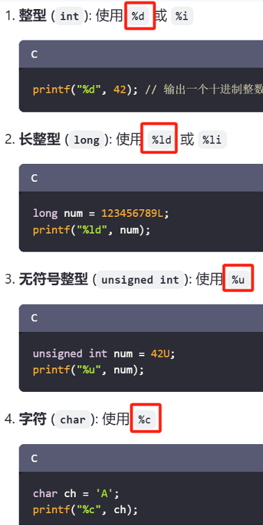
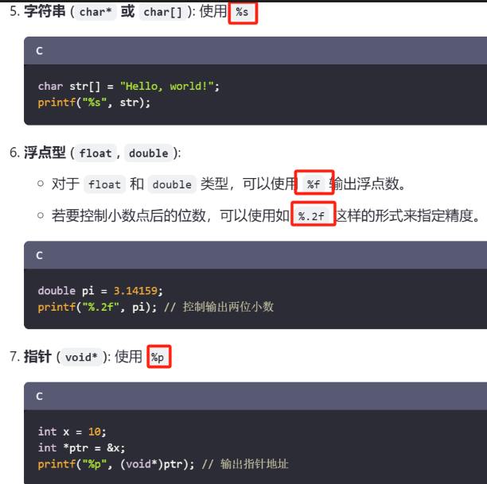
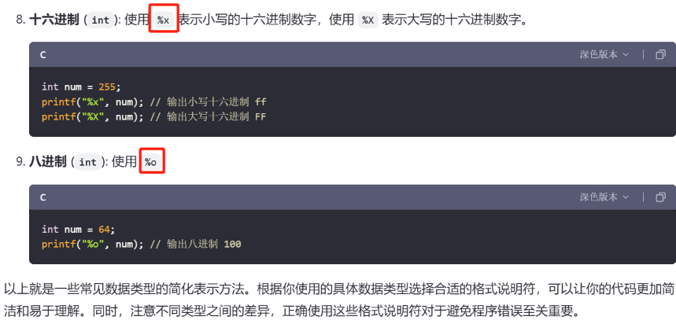
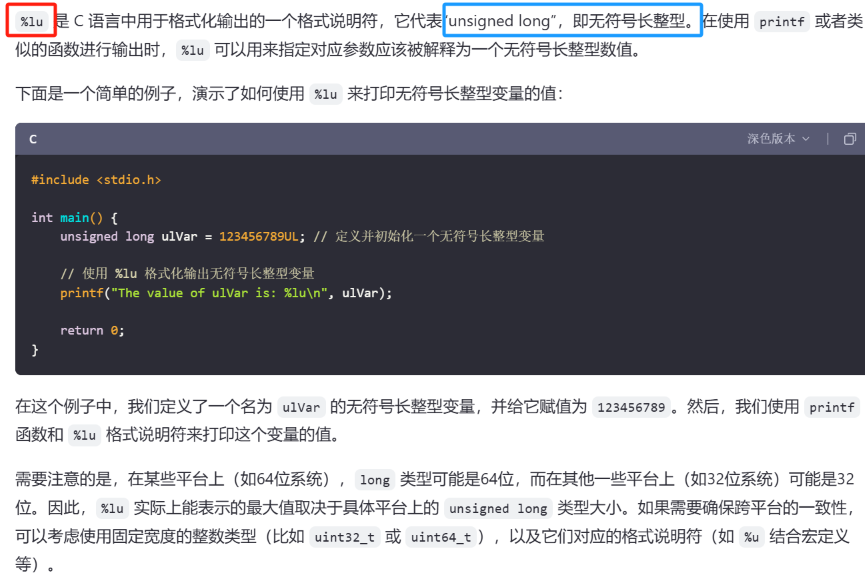
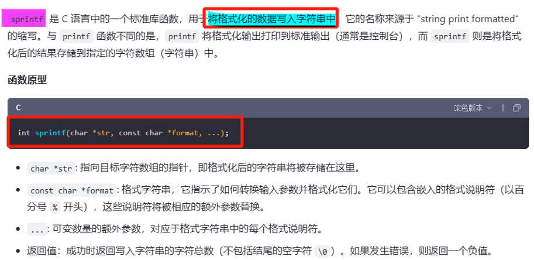
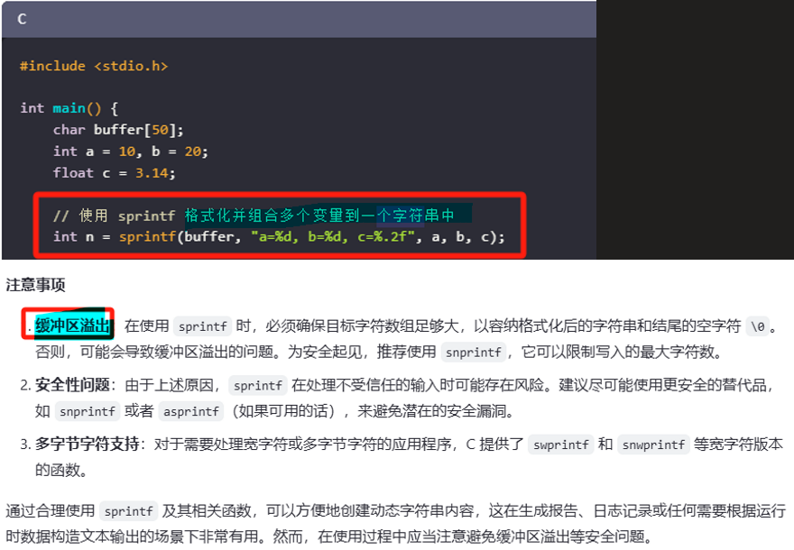
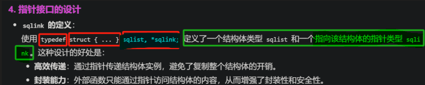
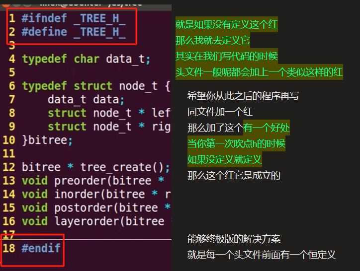
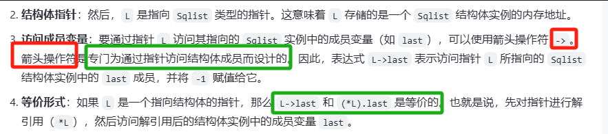

# extern 

<span style="background:#affad1">声明一个外部整型变量 riscv_is_pass，该变量是在另一个源文件中定义的。</span>
```
// 声明一个外部整型变量 riscv_is_pass，该变量是在另一个源文件中定义的。
// 使用 extern 关键字告诉编译器这个变量的存储位置在程序的其他地方，
// 这样可以在不包含其定义的情况下引用该变量。
extern int riscv_is_pass;
```


# printf参数（格式说明符）

- 1 %s后面跟的就是地址，如果这个地址是字符串的，那就显示字符串

[[嵌入式知识学习（通用扩展）/linux基础知识/assets/C语言扩展积累学习/file-20250810171433627.png|Open: Pasted image 20250708205943.png]]

[[嵌入式知识学习（通用扩展）/linux基础知识/assets/C语言扩展积累学习/file-20250810171433815.png|Open: Pasted image 20250708210004.png]]

[[嵌入式知识学习（通用扩展）/linux基础知识/assets/C语言扩展积累学习/file-20250810171433898.png|Open: Pasted image 20250708210019.png]]

[[嵌入式知识学习（通用扩展）/linux基础知识/assets/C语言扩展积累学习/file-20250810171433982.png|Open: Pasted image 20250708210035.png]]


## 使用位运算手动输出二进制
- 1 int   型变量
```c
void print_binary(int num) {
    int size = sizeof(num) * 8;
    for (int i = size - 1; i >= 0; i--) {
        printf("%d", (num >> i) & 1);
    }
    printf("\n");
}
```

- 1 char   型变量
```c
// 函数：输出字符的二进制表示
void print_binary_char(char c) {
    // 将字符转换为无符号类型，避免符号扩展问题
    unsigned char uc = (unsigned char)c;

    // 从最高位（第7位）到最低位（第0位）依次输出
    for (int i = 7; i >= 0; i--) {
        // 右移 i 位后与 1 按位与，判断该位是否为 1
        printf("%u", (uc >> i) & 1);
    }

    printf("\n");
}
```


# spintf函数
[[嵌入式知识学习（通用扩展）/linux基础知识/assets/C语言扩展积累学习/file-20250810171434063.png|Open: Pasted image 20250708150128.png]]

[[嵌入式知识学习（通用扩展）/linux基础知识/assets/C语言扩展积累学习/file-20250810171434157.png|Open: Pasted image 20250708150140.png]]



# typedef+结构体
[[嵌入式知识学习（通用扩展）/linux基础知识/assets/C语言扩展积累学习/file-20250810171434238.png|Open: Pasted image 20250708215942.png]]



# .h文件中预处理符号的作用（如果没定义就定义）
[[嵌入式知识学习（通用扩展）/linux基础知识/assets/C语言扩展积累学习/file-20250810171434321.png|Open: Pasted image 20250709200029.png]]



# 结构体指针L->last（箭头操作符）
[[嵌入式知识学习（通用扩展）/linux基础知识/assets/C语言扩展积累学习/file-20250810171434399.png|Open: Pasted image 20250709205330.png]]



# a=STR(h);
```c
#define STR(s) #s

char a;
a=STR(h);

```


```
main.c:75:6: warning: assignment to ‘char’ from ‘char *’ makes integer from pointer without a cast
```

> 这个警告的核心在于 **类型不匹配**：你试图将一个字符串（`char*` 类型）赋值给一个 `char` 类型的变量，导致指针被隐式转换为整数（即字符的 ASCII 值），这是不安全的操作。


# 


