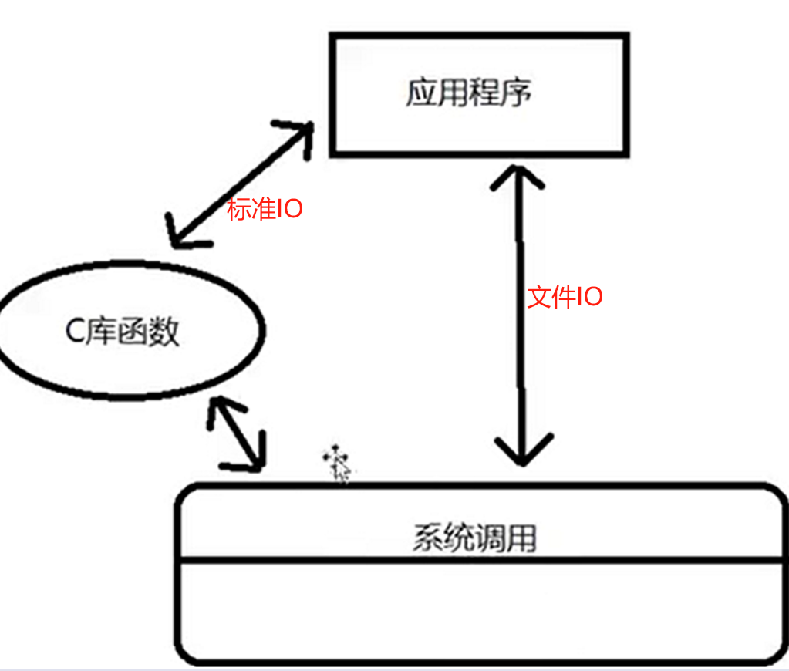

# 备注(声明)：

# 一、基础知识

## 什么是Linux系统编程
- 1 学习系统调用的接口，学习这些接口的功能以及相关的参数以及返回值

## Linux系统编程基本程序框架
### 1 、应用程序传参
[“Linux系统编程基本程序框架”页上的图片](onenote:https://d.docs.live.net/52d4b76bb0ffcf51/Documents/\(RK3568\)Linux驱动开发/Linux系统编程篇.one#Linux系统编程基本程序框架&section-id={21804FE8-FF4F-4E52-8E05-430F20ADA082}&page-id={978102BF-22F8-4E7E-887C-9B6DCF1FDF99}&object-id={BDAD9973-3D64-4209-B077-70542F0CA8D8}&2F)  ([Web 视图](https://onedrive.live.com/view.aspx?resid=52D4B76BB0FFCF51%21se8c325913f784bf694d429e5ee2ab2be&id=documents&wd=target%28Linux%E7%B3%BB%E7%BB%9F%E7%BC%96%E7%A8%8B%E7%AF%87.one%7C21804FE8-FF4F-4E52-8E05-430F20ADA082%2FLinux%E7%B3%BB%E7%BB%9F%E7%BC%96%E7%A8%8B%E5%9F%BA%E6%9C%AC%E7%A8%8B%E5%BA%8F%E6%A1%86%E6%9E%B6%7C978102BF-22F8-4E7E-887C-9B6DCF1FDF99%2F%29&wdpartid=%7b290182FD-4676-4EE0-834F-9E950AA9A106%7d%7b1%7d&wdsectionfileid=52D4B76BB0FFCF51!sa0ef9df122bf46a3b089fc67fa84876d))

### 2 、基本程序框架
[“Linux系统编程基本程序框架”页上的图片](onenote:https://d.docs.live.net/52d4b76bb0ffcf51/Documents/\(RK3568\)Linux驱动开发/Linux系统编程篇.one#Linux系统编程基本程序框架&section-id={21804FE8-FF4F-4E52-8E05-430F20ADA082}&page-id={978102BF-22F8-4E7E-887C-9B6DCF1FDF99}&object-id={BDAD9973-3D64-4209-B077-70542F0CA8D8}&2F)  ([Web 视图](https://onedrive.live.com/view.aspx?resid=52D4B76BB0FFCF51%21se8c325913f784bf694d429e5ee2ab2be&id=documents&wd=target%28Linux%E7%B3%BB%E7%BB%9F%E7%BC%96%E7%A8%8B%E7%AF%87.one%7C21804FE8-FF4F-4E52-8E05-430F20ADA082%2FLinux%E7%B3%BB%E7%BB%9F%E7%BC%96%E7%A8%8B%E5%9F%BA%E6%9C%AC%E7%A8%8B%E5%BA%8F%E6%A1%86%E6%9E%B6%7C978102BF-22F8-4E7E-887C-9B6DCF1FDF99%2F%29&wdpartid=%7b290182FD-4676-4EE0-834F-9E950AA9A106%7d%7b1%7d&wdsectionfileid=52D4B76BB0FFCF51!sa0ef9df122bf46a3b089fc67fa84876d))

### 3 、

# 二、标准IO、文件IO和目录IO

## 标准IO和文件IO
### 1 、标准IO和文件IO
[“标准IO和文件IO”页上的图片](onenote:https://d.docs.live.net/52d4b76bb0ffcf51/Documents/\(RK3568\)Linux驱动开发/Linux系统编程篇.one#标准IO和文件IO&section-id={21804FE8-FF4F-4E52-8E05-430F20ADA082}&page-id={6C849921-314D-45AB-89B5-6EFD9AC45FCE}&object-id={AF1BD5BB-8EA4-4311-AE5F-24C9FD68FB23}&18)  ([Web 视图](https://onedrive.live.com/view.aspx?resid=52D4B76BB0FFCF51%21se8c325913f784bf694d429e5ee2ab2be&id=documents&wd=target%28Linux%E7%B3%BB%E7%BB%9F%E7%BC%96%E7%A8%8B%E7%AF%87.one%7C21804FE8-FF4F-4E52-8E05-430F20ADA082%2F%E6%A0%87%E5%87%86IO%E5%92%8C%E6%96%87%E4%BB%B6IO%7C6C849921-314D-45AB-89B5-6EFD9AC45FCE%2F%29&wdpartid=%7b93CEB3F8-53B0-431F-B771-17778F9C2770%7d%7b1%7d&wdsectionfileid=52D4B76BB0FFCF51!sa0ef9df122bf46a3b089fc67fa84876d))

### 2 、标准IO和文件IO区别
[“标准IO和文件IO”页上的图片](onenote:https://d.docs.live.net/52d4b76bb0ffcf51/Documents/\(RK3568\)Linux驱动开发/Linux系统编程篇.one#标准IO和文件IO&section-id={21804FE8-FF4F-4E52-8E05-430F20ADA082}&page-id={6C849921-314D-45AB-89B5-6EFD9AC45FCE}&object-id={AF1BD5BB-8EA4-4311-AE5F-24C9FD68FB23}&27)  ([Web 视图](https://onedrive.live.com/view.aspx?resid=52D4B76BB0FFCF51%21se8c325913f784bf694d429e5ee2ab2be&id=documents&wd=target%28Linux%E7%B3%BB%E7%BB%9F%E7%BC%96%E7%A8%8B%E7%AF%87.one%7C21804FE8-FF4F-4E52-8E05-430F20ADA082%2F%E6%A0%87%E5%87%86IO%E5%92%8C%E6%96%87%E4%BB%B6IO%7C6C849921-314D-45AB-89B5-6EFD9AC45FCE%2F%29&wdpartid=%7b93CEB3F8-53B0-431F-B771-17778F9C2770%7d%7b1%7d&wdsectionfileid=52D4B76BB0FFCF51!sa0ef9df122bf46a3b089fc67fa84876d))

- 1 文件IO        unistd.h                依赖于linux操作系统
- 1 标准IO         stdio.h                 可以在任何操作系统
### 3 、

## 文件IO之open函数
### 1 、文件描述符
[“文件IO之open函数”页上的图片](onenote:https://d.docs.live.net/52d4b76bb0ffcf51/Documents/\(RK3568\)Linux驱动开发/Linux系统编程篇.one#文件IO之open函数&section-id={21804FE8-FF4F-4E52-8E05-430F20ADA082}&page-id={C9D811A7-7F46-4BCD-9ECC-37109B5C8893}&object-id={A8B1197D-CBBF-4004-9D53-07882E961CA7}&27)  ([Web 视图](https://onedrive.live.com/view.aspx?resid=52D4B76BB0FFCF51%21se8c325913f784bf694d429e5ee2ab2be&id=documents&wd=target%28Linux%E7%B3%BB%E7%BB%9F%E7%BC%96%E7%A8%8B%E7%AF%87.one%7C21804FE8-FF4F-4E52-8E05-430F20ADA082%2F%E6%96%87%E4%BB%B6IO%E4%B9%8Bopen%E5%87%BD%E6%95%B0%7CC9D811A7-7F46-4BCD-9ECC-37109B5C8893%2F%29&wdpartid=%7b5296215F-32A2-4A8B-B8B1-BB43AF9BD316%7d%7b1%7d&wdsectionfileid=52D4B76BB0FFCF51!sa0ef9df122bf46a3b089fc67fa84876d))

- 1 所有打开的文件，都有一个对应的文件描述符
- 1 0，1，2     分别对应标准输入，标准输出，标准出错
### 2 、文件的权限
|   |   |
|---|---|
|O_RDONLY|只读模式打开文件|
|O_WRONLY|只写模式打开文件|
|O_RDWR|可读可写模式打开文件|

- **副参数有很多**，可以使用“|”符号与主参数进行同时使用（副参数没有互斥关系，可以多个同时使用），副参数的具体用途如下图所示：
> [!PDF|yellow] [[RK3568（linux学习）/linux开发资料库/rk3568迅为开发pdf/16.开发板学习教程/linux系统编程/【北京迅为】itop-3568开发板系统编程手册（新）.pdf#page=28&selection=72,2,72,15&color=yellow|【北京迅为】itop-3568开发板系统编程手册（新）, p.28]]
> > 副参数的具体用途如下图所示
> 
> 

|   |   |
|---|---|
|标志|用途|
|O_CREAT|要打开的文件名不存在时自动创建改文件。|
|O_EXCL|要和 O_CREAT 一起使用才能生效， 如果文件存在则 open()调用失败。|
|O_APPEND|以追加模式打开文件|
|O_NONBLOCK|以非阻塞模式打开|
|O_DIRECT|直接 IO|
|O_SYNC|同步 IO|
|O_ASYNC|用于终端式套接字， 指定文件读写时产生的信号|
|O_TRUNC|若文件存在， 则将问长度截为 0|

### 3 、头文件和函数原型

> [!note] open()函数所使用的头文件和函数原型
> #include <sys/types.h>
> #include <sys/stat.h>
> #include <fcntl.h>
> 
> `int open(const char *pathname, int flags);`
> `int open(const char *pathname, int flags, mode_t mode);`

### 4 、参数讲解

> [!参数讲解]
> pathname 参数 用于标识需要打开或创建的文件路径和文件名
> flags 参数 用于指定文件打开方式， 可以使用按位或设置多个标志位。
> mode 参数 用于指定文件的访问权限， 即文件的读、 写、 执行权限等

mode: 权限掩码

### 5、代码举例
[“文件IO之open函数”页上的图片](onenote:https://d.docs.live.net/52d4b76bb0ffcf51/Documents/\(RK3568\)Linux驱动开发/Linux系统编程篇.one#文件IO之open函数&section-id={21804FE8-FF4F-4E52-8E05-430F20ADA082}&page-id={C9D811A7-7F46-4BCD-9ECC-37109B5C8893}&object-id={A8B1197D-CBBF-4004-9D53-07882E961CA7}&66)  ([Web 视图](https://onedrive.live.com/view.aspx?resid=52D4B76BB0FFCF51%21se8c325913f784bf694d429e5ee2ab2be&id=documents&wd=target%28Linux%E7%B3%BB%E7%BB%9F%E7%BC%96%E7%A8%8B%E7%AF%87.one%7C21804FE8-FF4F-4E52-8E05-430F20ADA082%2F%E6%96%87%E4%BB%B6IO%E4%B9%8Bopen%E5%87%BD%E6%95%B0%7CC9D811A7-7F46-4BCD-9ECC-37109B5C8893%2F%29&wdpartid=%7b5296215F-32A2-4A8B-B8B1-BB43AF9BD316%7d%7b1%7d&wdsectionfileid=52D4B76BB0FFCF51!sa0ef9df122bf46a3b089fc67fa84876d))

### 6、

## 文件IO之close函数
### 1 、头文件和函数原型
> [!note] 头文件和函数原型
> #include <unistd.h>
> 
>  int close(int fd);

- 1 close()函数执行成功时会返回 0， 出错时返回-1， 并设置 error 值

### 2 、代码举例
[“文件IO之close函数”页上的图片](onenote:https://d.docs.live.net/52d4b76bb0ffcf51/Documents/\(RK3568\)Linux驱动开发/Linux系统编程篇.one#文件IO之close函数&section-id={21804FE8-FF4F-4E52-8E05-430F20ADA082}&page-id={D01F68B2-6DAE-4C8C-B8AF-03682AD83ADF}&object-id={603B3168-A5BB-4FA2-8A51-16C4B3054BF0}&21)  ([Web 视图](https://onedrive.live.com/view.aspx?resid=52D4B76BB0FFCF51%21se8c325913f784bf694d429e5ee2ab2be&id=documents&wd=target%28Linux%E7%B3%BB%E7%BB%9F%E7%BC%96%E7%A8%8B%E7%AF%87.one%7C21804FE8-FF4F-4E52-8E05-430F20ADA082%2F%E6%96%87%E4%BB%B6IO%E4%B9%8Bclose%E5%87%BD%E6%95%B0%7CD01F68B2-6DAE-4C8C-B8AF-03682AD83ADF%2F%29&wdpartid=%7bAFCFEE79-0B89-4FF1-8FA5-92D6DA0606A0%7d%7b1%7d&wdsectionfileid=52D4B76BB0FFCF51!sa0ef9df122bf46a3b089fc67fa84876d))

### 3 、

## 文件IO之read函数
### 1 、函数讲解 - 对文件或者设备进行读取
> [!函数定义]
> #include <unistd.h>
> 
> ssize_t read(int fd, void *buf, size_t count);
> 

|      |          |            |
| ---- | -------- | ---------- |
| 参数名称 | 参数含义     |            |
| 1    | fd 参数    | 文件描述符      |
| 2    | buf 参数   | 存储读取数据的缓冲区 |
| 3    | count 参数 | 读取的字节数     |

- 1 返回值是实际读取的字节数，如果失败则返回-1，若已经读到文件的末尾，再继续读下去会反回0。
- 1 字符串数组会自动在末尾加/0
### 2 、代码举例
[“文件IO之read函数”页上的图片](onenote:https://d.docs.live.net/52d4b76bb0ffcf51/Documents/\(RK3568\)Linux驱动开发/Linux系统编程篇.one#文件IO之read函数&section-id={21804FE8-FF4F-4E52-8E05-430F20ADA082}&page-id={513557C1-8C7E-4330-9A8F-1735647127C8}&object-id={0B9BCCBA-FCF3-41B3-807B-093469CEB9A5}&48)  ([Web 视图](https://onedrive.live.com/view.aspx?resid=52D4B76BB0FFCF51%21se8c325913f784bf694d429e5ee2ab2be&id=documents&wd=target%28Linux%E7%B3%BB%E7%BB%9F%E7%BC%96%E7%A8%8B%E7%AF%87.one%7C21804FE8-FF4F-4E52-8E05-430F20ADA082%2F%E6%96%87%E4%BB%B6IO%E4%B9%8Bread%E5%87%BD%E6%95%B0%7C513557C1-8C7E-4330-9A8F-1735647127C8%2F%29&wdpartid=%7b82D05A5D-2B40-41F6-9324-338276C42FE1%7d%7b1%7d&wdsectionfileid=52D4B76BB0FFCF51!sa0ef9df122bf46a3b089fc67fa84876d))

### 3 、

## 文件IO之write函数
### 1 、函数讲解 - 对文件或者设备进行数据写入
> [!函数定义]
> #include <unistd.h> 
> 
> ssize_t write(int fd, const void *buf, size_t count);

|      |          |          |
| ---- | -------- | -------- |
| 参数名称 | 参数含义     |          |
| 1    | fd 参数    | 文件描述符    |
| 2    | buf 参数   | 写入数据的缓冲区 |
| 3    | count 参数 | 写入的字节数   |
### 2 、代码举例
[“文件IO之write函数”页上的图片](onenote:https://d.docs.live.net/52d4b76bb0ffcf51/Documents/\(RK3568\)Linux驱动开发/Linux系统编程篇.one#文件IO之write函数&section-id={21804FE8-FF4F-4E52-8E05-430F20ADA082}&page-id={A1E1F9BA-A30B-4148-BE62-EBB281A3DC53}&object-id={D79E0AFA-9392-4E8E-A11D-77CC20F30845}&35)  ([Web 视图](https://onedrive.live.com/view.aspx?resid=52D4B76BB0FFCF51%21se8c325913f784bf694d429e5ee2ab2be&id=documents&wd=target%28Linux%E7%B3%BB%E7%BB%9F%E7%BC%96%E7%A8%8B%E7%AF%87.one%7C21804FE8-FF4F-4E52-8E05-430F20ADA082%2F%E6%96%87%E4%BB%B6IO%E4%B9%8Bwrite%E5%87%BD%E6%95%B0%7CA1E1F9BA-A30B-4148-BE62-EBB281A3DC53%2F%29&wdpartid=%7b0A38E061-397D-4AEE-8B6D-430EFD97C790%7d%7b1%7d&wdsectionfileid=52D4B76BB0FFCF51!sa0ef9df122bf46a3b089fc67fa84876d))

- 1 标准输出的文件描述符为1，比如屏幕
- 1 注意在写时，对应的文件要可写才行，即要以可写的形式open打开
### 3 、

## 综合练习（一）

### 1 、代码编写
[“综合练习（一）”页上的图片](onenote:https://d.docs.live.net/52d4b76bb0ffcf51/Documents/\(RK3568\)Linux驱动开发/Linux系统编程篇.one#综合练习（一）&section-id={21804FE8-FF4F-4E52-8E05-430F20ADA082}&page-id={1CAAAB76-C5FF-41DC-BA8E-786D3C30273A}&object-id={33BECC7B-F319-48AD-91B6-F6B029269511}&25)  ([Web 视图](https://onedrive.live.com/view.aspx?resid=52D4B76BB0FFCF51%21se8c325913f784bf694d429e5ee2ab2be&id=documents&wd=target%28Linux%E7%B3%BB%E7%BB%9F%E7%BC%96%E7%A8%8B%E7%AF%87.one%7C21804FE8-FF4F-4E52-8E05-430F20ADA082%2F%E7%BB%BC%E5%90%88%E7%BB%83%E4%B9%A0%EF%BC%88%E4%B8%80%EF%BC%89%7C1CAAAB76-C5FF-41DC-BA8E-786D3C30273A%2F%29&wdpartid=%7b77801833-0CD4-42C2-BD0A-5B784CBFDA22%7d%7b1%7d&wdsectionfileid=52D4B76BB0FFCF51!sa0ef9df122bf46a3b089fc67fa84876d))

### 2 、代码保存
[#include <stdio.h>](onenote:https://d.docs.live.net/52d4b76bb0ffcf51/Documents/\(RK3568\)Linux驱动开发/Linux系统编程篇.one#综合练习（一）&section-id={21804FE8-FF4F-4E52-8E05-430F20ADA082}&page-id={1CAAAB76-C5FF-41DC-BA8E-786D3C30273A}&object-id={AE522689-0DA0-4211-ADDF-8F3A26ACAA28}&10)  ([Web 视图](https://onedrive.live.com/view.aspx?resid=52D4B76BB0FFCF51%21se8c325913f784bf694d429e5ee2ab2be&id=documents&wd=target%28Linux%E7%B3%BB%E7%BB%9F%E7%BC%96%E7%A8%8B%E7%AF%87.one%7C21804FE8-FF4F-4E52-8E05-430F20ADA082%2F%E7%BB%BC%E5%90%88%E7%BB%83%E4%B9%A0%EF%BC%88%E4%B8%80%EF%BC%89%7C1CAAAB76-C5FF-41DC-BA8E-786D3C30273A%2F%29&wdpartid=%7b77801833-0CD4-42C2-BD0A-5B784CBFDA22%7d%7b1%7d&wdsectionfileid=52D4B76BB0FFCF51!sa0ef9df122bf46a3b089fc67fa84876d))

### 3 、

## 文件IO之lseek函数
### 1 、函数讲解 - 设置文件指针位置

> [!note] 函数定义
> #include <sys/types.h>
> #include <unistd.h>
> 
> //lseek() 用于设置文件指针位置
> off_t lseek(int fd, off_t offset, int whence);

- 1 lseek()函数执行成功会返回当前位移大小， 失败返回-1， 并设置 error 值

|      |                 |                                                                                               |
| ---- | --------------- | --------------------------------------------------------------------------------------------- |
| 参数名称 | 参数含义            |                                                                                               |
| 1    | fd 参数           | 文件描述符                                                                                         |
| 2    | off_t offset 参数 | 偏移量， 单位是字节的数量， 可以正负， 如果是负值表示向前移动；   如果是正值， 表示向后移动                                          |
| 3    | whence 参数       | 当前位置的基点， 可以使用以下三组值:   SEEK_SET： 相对于文件开头   SEEK_CUR:相对于当前的文件读写指针位置   SEEK_END:相对于文件末尾 |

### 2 、应用场景
- 1 每次对文件进行读写操作时，指针的指向会发生改变，若是要从头开始读该文件，则要改变指针的指向，就可以用lseek函数

### 3 、代码举例
[“文件IO之lseek函数”页上的图片](onenote:https://d.docs.live.net/52d4b76bb0ffcf51/Documents/\(RK3568\)Linux驱动开发/Linux系统编程篇.one#文件IO之lseek函数&section-id={21804FE8-FF4F-4E52-8E05-430F20ADA082}&page-id={CFB6B7BA-8F01-4218-92BC-7C781BC1800C}&object-id={8490D78A-3447-4D67-BCC0-619B31A7D011}&5A)  ([Web 视图](https://onedrive.live.com/view.aspx?resid=52D4B76BB0FFCF51%21se8c325913f784bf694d429e5ee2ab2be&id=documents&wd=target%28Linux%E7%B3%BB%E7%BB%9F%E7%BC%96%E7%A8%8B%E7%AF%87.one%7C21804FE8-FF4F-4E52-8E05-430F20ADA082%2F%E6%96%87%E4%BB%B6IO%E4%B9%8Blseek%E5%87%BD%E6%95%B0%7CCFB6B7BA-8F01-4218-92BC-7C781BC1800C%2F%29&wdpartid=%7b05BFD682-0B35-4E08-99C7-06B5557CBAEE%7d%7b1%7d&wdsectionfileid=52D4B76BB0FFCF51!sa0ef9df122bf46a3b089fc67fa84876d))

### 4 、代码保存
[#include <stdio.h>](onenote:https://d.docs.live.net/52d4b76bb0ffcf51/Documents/\(RK3568\)Linux驱动开发/Linux系统编程篇.one#文件IO之lseek函数&section-id={21804FE8-FF4F-4E52-8E05-430F20ADA082}&page-id={CFB6B7BA-8F01-4218-92BC-7C781BC1800C}&object-id={3367F856-B041-4BC5-84CD-E9E8234F1F7E}&D)  ([Web 视图](https://onedrive.live.com/view.aspx?resid=52D4B76BB0FFCF51%21se8c325913f784bf694d429e5ee2ab2be&id=documents&wd=target%28Linux%E7%B3%BB%E7%BB%9F%E7%BC%96%E7%A8%8B%E7%AF%87.one%7C21804FE8-FF4F-4E52-8E05-430F20ADA082%2F%E6%96%87%E4%BB%B6IO%E4%B9%8Blseek%E5%87%BD%E6%95%B0%7CCFB6B7BA-8F01-4218-92BC-7C781BC1800C%2F%29&wdpartid=%7b05BFD682-0B35-4E08-99C7-06B5557CBAEE%7d%7b1%7d&wdsectionfileid=52D4B76BB0FFCF51!sa0ef9df122bf46a3b089fc67fa84876d))

### 5、

·
## 目录IO之mkdir函数
### 1 、文件I0和目录IO对比
[“目录IO之mkdir函数”页上的图片](onenote:https://d.docs.live.net/52d4b76bb0ffcf51/Documents/\(RK3568\)Linux驱动开发/Linux系统编程篇.one#目录IO之mkdir函数&section-id={21804FE8-FF4F-4E52-8E05-430F20ADA082}&page-id={8248691A-23FF-411B-B6DB-4A59CEA3150A}&object-id={49B1802C-2303-4CFE-9236-4D8EF0854ECB}&1B)  ([Web 视图](https://onedrive.live.com/view.aspx?resid=52D4B76BB0FFCF51%21se8c325913f784bf694d429e5ee2ab2be&id=documents&wd=target%28Linux%E7%B3%BB%E7%BB%9F%E7%BC%96%E7%A8%8B%E7%AF%87.one%7C21804FE8-FF4F-4E52-8E05-430F20ADA082%2F%E7%9B%AE%E5%BD%95IO%E4%B9%8Bmkdir%E5%87%BD%E6%95%B0%7C8248691A-23FF-411B-B6DB-4A59CEA3150A%2F%29&wdpartid=%7b5783B526-B4AE-4411-9514-4467959FA0D6%7d%7b1%7d&wdsectionfileid=52D4B76BB0FFCF51!sa0ef9df122bf46a3b089fc67fa84876d))

- 1 目录IO都是对目录的操作
### 2 、函数讲解 - 创建一个目录

> [!note] 函数定义
> #include <sys/stat.h>
> #include <sys/types.h>
>  
> //mkdir()用来创建一个目录
> int mkdir(const char *pathname, mode_t mode);

- 1 mkdir()执行成功会返回 0， 出错时返回-1。 并设置 error 值

|        |                                                    |        |
| ------ | -------------------------------------------------- | ------ |
| 参数名称   | 参数含义                                               |        |
| 1      | pathname                                           | 路径和文件名 |
| 2 mode | 权限掩码， 对不同用户和组设置可执行， 读， 写权限， 使用   八进制数表示， 此参数可不写 |        |

### 3 、代码举例
[“目录IO之mkdir函数”页上的图片](onenote:https://d.docs.live.net/52d4b76bb0ffcf51/Documents/\(RK3568\)Linux驱动开发/Linux系统编程篇.one#目录IO之mkdir函数&section-id={21804FE8-FF4F-4E52-8E05-430F20ADA082}&page-id={8248691A-23FF-411B-B6DB-4A59CEA3150A}&object-id={49B1802C-2303-4CFE-9236-4D8EF0854ECB}&5A)  ([Web 视图](https://onedrive.live.com/view.aspx?resid=52D4B76BB0FFCF51%21se8c325913f784bf694d429e5ee2ab2be&id=documents&wd=target%28Linux%E7%B3%BB%E7%BB%9F%E7%BC%96%E7%A8%8B%E7%AF%87.one%7C21804FE8-FF4F-4E52-8E05-430F20ADA082%2F%E7%9B%AE%E5%BD%95IO%E4%B9%8Bmkdir%E5%87%BD%E6%95%B0%7C8248691A-23FF-411B-B6DB-4A59CEA3150A%2F%29&wdpartid=%7b5783B526-B4AE-4411-9514-4467959FA0D6%7d%7b1%7d&wdsectionfileid=52D4B76BB0FFCF51!sa0ef9df122bf46a3b089fc67fa84876d))

### 4 、

## 目录I0之opendir和closedir函数
### 1 、opendir函数讲解 - 打开指定的目录
> [!函数定义]
> #include <sys/types.h>
> #include <dirent.h>
> 
> DIR *opendir(const char *name);

- 1 opendir 调成功返回打开的目录流指针，类似于文件函数的fd 。失败返回 NULL

|      |      |            |
| ---- | ---- | ---------- |
| 参数名称 | 参数含义 |            |
| 1    | name | 路径名字。      |

### 2 、closedir函数讲解- 关闭目录流

- 1 closedir 调用成功返回 0， 调用失败  返回-1，

> [!note] 函数定义
> #include <sys/types.h>
> #include <dirent.h>
> 
> int closedir(DIR *dirp);

|      |      |            |
| ---- | ---- | ---------- |
| 参数名称 | 参数含义 |            |
| 2    | dirp | 要关闭的目录流指针。 |

### 3 、代码举例
[“目录I0之opendir和closedir函数”页上的图片](onenote:https://d.docs.live.net/52d4b76bb0ffcf51/Documents/\(RK3568\)Linux驱动开发/Linux系统编程篇.one#目录I0之opendir和closedir函数&section-id={21804FE8-FF4F-4E52-8E05-430F20ADA082}&page-id={DA247FE4-0805-4AAF-8CAE-23BD18465A0A}&object-id={C48ADAE9-332D-4D81-8D82-DE6A07C6CE46}&5B)  ([Web 视图](https://onedrive.live.com/view.aspx?resid=52D4B76BB0FFCF51%21se8c325913f784bf694d429e5ee2ab2be&id=documents&wd=target%28Linux%E7%B3%BB%E7%BB%9F%E7%BC%96%E7%A8%8B%E7%AF%87.one%7C21804FE8-FF4F-4E52-8E05-430F20ADA082%2F%E7%9B%AE%E5%BD%95I0%E4%B9%8Bopendir%E5%92%8Cclosedir%E5%87%BD%E6%95%B0%7CDA247FE4-0805-4AAF-8CAE-23BD18465A0A%2F%29&wdpartid=%7bCEA219E9-276E-485F-AEE1-B469F5F85EED%7d%7b1%7d&wdsectionfileid=52D4B76BB0FFCF51!sa0ef9df122bf46a3b089fc67fa84876d))

[#include <stdio.h>](onenote:https://d.docs.live.net/52d4b76bb0ffcf51/Documents/\(RK3568\)Linux驱动开发/Linux系统编程篇.one#目录I0之opendir和closedir函数&section-id={21804FE8-FF4F-4E52-8E05-430F20ADA082}&page-id={DA247FE4-0805-4AAF-8CAE-23BD18465A0A}&object-id={47DA9159-A135-42E2-AFA3-4B5977F7B9F1}&13)  ([Web 视图](https://onedrive.live.com/view.aspx?resid=52D4B76BB0FFCF51%21se8c325913f784bf694d429e5ee2ab2be&id=documents&wd=target%28Linux%E7%B3%BB%E7%BB%9F%E7%BC%96%E7%A8%8B%E7%AF%87.one%7C21804FE8-FF4F-4E52-8E05-430F20ADA082%2F%E7%9B%AE%E5%BD%95I0%E4%B9%8Bopendir%E5%92%8Cclosedir%E5%87%BD%E6%95%B0%7CDA247FE4-0805-4AAF-8CAE-23BD18465A0A%2F%29&wdpartid=%7bCEA219E9-276E-485F-AEE1-B469F5F85EED%7d%7b1%7d&wdsectionfileid=52D4B76BB0FFCF51!sa0ef9df122bf46a3b089fc67fa84876d))
### 4 、

##  目录IO之readdir函数
### 1 、函数讲解 - 读取打开的目录中的文件和子目录
> [!note] 函数定义
> #include <dirent.h> 
> 
> struct dirent *readdir(DIR *dirp);

- 1 返回指向 dirent 类型结构体的指针， 该结构体包含了文件和子目录的信息， 如文件名、  文件类型等， 失败返回 NULL

|      |      |                                              |
| ---- | ---- | -------------------------------------------- |
| 参数名称 | 参数含义 |                                              |
| 1    | dirp | 即指向 DIR 类型结构体的指针 dirp， 该指针通常是由 opendir 函数返回的 |
### 2 、代码举例
[“目录IO之readdir函数”页上的图片](onenote:https://d.docs.live.net/52d4b76bb0ffcf51/Documents/\(RK3568\)Linux驱动开发/Linux系统编程篇.one#目录IO之readdir函数&section-id={21804FE8-FF4F-4E52-8E05-430F20ADA082}&page-id={9A4AEC84-E047-4400-835B-EDE6EEEA6920}&object-id={A7F814D3-3810-40D9-A23C-4BB5093F3FE3}&52)  ([Web 视图](https://onedrive.live.com/view.aspx?resid=52D4B76BB0FFCF51%21se8c325913f784bf694d429e5ee2ab2be&id=documents&wd=target%28Linux%E7%B3%BB%E7%BB%9F%E7%BC%96%E7%A8%8B%E7%AF%87.one%7C21804FE8-FF4F-4E52-8E05-430F20ADA082%2F%E7%9B%AE%E5%BD%95IO%E4%B9%8Breaddir%E5%87%BD%E6%95%B0%7C9A4AEC84-E047-4400-835B-EDE6EEEA6920%2F%29&wdpartid=%7bF09B76B7-E3D9-4F84-8F25-46D671719492%7d%7b1%7d&wdsectionfileid=52D4B76BB0FFCF51!sa0ef9df122bf46a3b089fc67fa84876d))

- 1 在内核中文件的存储一般都是链表，如果要读取每一个，一般都要用遍历
### 3 、

## 综合练习(二)
### 1 、要求：打印我们要拷贝的目录下的所有文件名，并拷贝我们需要的文作
[“综合练习(二)”页上的图片](onenote:https://d.docs.live.net/52d4b76bb0ffcf51/Documents/\(RK3568\)Linux驱动开发/Linux系统编程篇.one#综合练习\(二\)&section-id={21804FE8-FF4F-4E52-8E05-430F20ADA082}&page-id={7A9BD3C5-6F22-424B-B1F2-EC0614A165D1}&object-id={5563DA35-C505-4271-893D-345C3D1D0A56}&16)  ([Web 视图](https://onedrive.live.com/view.aspx?resid=52D4B76BB0FFCF51%21se8c325913f784bf694d429e5ee2ab2be&id=documents&wd=target%28Linux%E7%B3%BB%E7%BB%9F%E7%BC%96%E7%A8%8B%E7%AF%87.one%7C21804FE8-FF4F-4E52-8E05-430F20ADA082%2F%E7%BB%BC%E5%90%88%E7%BB%83%E4%B9%A0%28%E4%BA%8C%5C%29%7C7A9BD3C5-6F22-424B-B1F2-EC0614A165D1%2F%29&wdpartid=%7b8E7363B7-DE13-4871-91C3-9CEC2C053DB0%7d%7b1%7d&wdsectionfileid=52D4B76BB0FFCF51!sa0ef9df122bf46a3b089fc67fa84876d))

### 2 、代码编写
[“综合练习(二)”页上的图片](onenote:https://d.docs.live.net/52d4b76bb0ffcf51/Documents/\(RK3568\)Linux驱动开发/Linux系统编程篇.one#综合练习\(二\)&section-id={21804FE8-FF4F-4E52-8E05-430F20ADA082}&page-id={7A9BD3C5-6F22-424B-B1F2-EC0614A165D1}&object-id={5563DA35-C505-4271-893D-345C3D1D0A56}&2E)  ([Web 视图](https://onedrive.live.com/view.aspx?resid=52D4B76BB0FFCF51%21se8c325913f784bf694d429e5ee2ab2be&id=documents&wd=target%28Linux%E7%B3%BB%E7%BB%9F%E7%BC%96%E7%A8%8B%E7%AF%87.one%7C21804FE8-FF4F-4E52-8E05-430F20ADA082%2F%E7%BB%BC%E5%90%88%E7%BB%83%E4%B9%A0%28%E4%BA%8C%5C%29%7C7A9BD3C5-6F22-424B-B1F2-EC0614A165D1%2F%29&wdpartid=%7b8E7363B7-DE13-4871-91C3-9CEC2C053DB0%7d%7b1%7d&wdsectionfileid=52D4B76BB0FFCF51!sa0ef9df122bf46a3b089fc67fa84876d))

### 3 、

# 三、库（库不能有main函数）

## 库的基本概念 - 编译好的代码
### 1 、静态库（lib开头，.a结尾）
[“库的基本概念”页上的图片](onenote:https://d.docs.live.net/52d4b76bb0ffcf51/Documents/\(RK3568\)Linux驱动开发/Linux系统编程篇.one#库的基本概念&section-id={21804FE8-FF4F-4E52-8E05-430F20ADA082}&page-id={919835AD-A788-4AA1-AE77-E2C6FCD9D4D1}&object-id={1D197CE9-8CE9-4E84-9AA4-C912D0D231F4}&3C)  ([Web 视图](https://onedrive.live.com/view.aspx?resid=52D4B76BB0FFCF51%21se8c325913f784bf694d429e5ee2ab2be&id=documents&wd=target%28Linux%E7%B3%BB%E7%BB%9F%E7%BC%96%E7%A8%8B%E7%AF%87.one%7C21804FE8-FF4F-4E52-8E05-430F20ADA082%2F%E5%BA%93%E7%9A%84%E5%9F%BA%E6%9C%AC%E6%A6%82%E5%BF%B5%7C919835AD-A788-4AA1-AE77-E2C6FCD9D4D1%2F%29&wdpartid=%7bBC4B55D7-1BD9-4A21-881E-B14FB0735924%7d%7b1%7d&wdsectionfileid=52D4B76BB0FFCF51!sa0ef9df122bf46a3b089fc67fa84876d))

- 1 程序移植时可以用静态库
### 2 、动态库（共享库）（lib开头，.so结尾）
[“库的基本概念”页上的图片](onenote:https://d.docs.live.net/52d4b76bb0ffcf51/Documents/\(RK3568\)Linux驱动开发/Linux系统编程篇.one#库的基本概念&section-id={21804FE8-FF4F-4E52-8E05-430F20ADA082}&page-id={919835AD-A788-4AA1-AE77-E2C6FCD9D4D1}&object-id={1D197CE9-8CE9-4E84-9AA4-C912D0D231F4}&45)  ([Web 视图](https://onedrive.live.com/view.aspx?resid=52D4B76BB0FFCF51%21se8c325913f784bf694d429e5ee2ab2be&id=documents&wd=target%28Linux%E7%B3%BB%E7%BB%9F%E7%BC%96%E7%A8%8B%E7%AF%87.one%7C21804FE8-FF4F-4E52-8E05-430F20ADA082%2F%E5%BA%93%E7%9A%84%E5%9F%BA%E6%9C%AC%E6%A6%82%E5%BF%B5%7C919835AD-A788-4AA1-AE77-E2C6FCD9D4D1%2F%29&wdpartid=%7bBC4B55D7-1BD9-4A21-881E-B14FB0735924%7d%7b1%7d&wdsectionfileid=52D4B76BB0FFCF51!sa0ef9df122bf46a3b089fc67fa84876d))

- 1 在同一环境中多次用某个库，则可以用动态库
- 1 在程序运行的时候被载入的
### 3 、

## 静态库的制作与使用 - 相当于C语言中的模块化编程
### 1 、静态库的制作
[“静态库的制作与使用”页上的图片](onenote:https://d.docs.live.net/52d4b76bb0ffcf51/Documents/\(RK3568\)Linux驱动开发/Linux系统编程篇.one#静态库的制作与使用&section-id={21804FE8-FF4F-4E52-8E05-430F20ADA082}&page-id={427B0739-1CBB-4D5E-ACEA-972E5623DD96}&object-id={36C5B3F1-9B69-4AB5-BB4A-03E86ABFBF1A}&22)  ([Web 视图](https://onedrive.live.com/view.aspx?resid=52D4B76BB0FFCF51%21se8c325913f784bf694d429e5ee2ab2be&id=documents&wd=target%28Linux%E7%B3%BB%E7%BB%9F%E7%BC%96%E7%A8%8B%E7%AF%87.one%7C21804FE8-FF4F-4E52-8E05-430F20ADA082%2F%E9%9D%99%E6%80%81%E5%BA%93%E7%9A%84%E5%88%B6%E4%BD%9C%E4%B8%8E%E4%BD%BF%E7%94%A8%7C427B0739-1CBB-4D5E-ACEA-972E5623DD96%2F%29&wdpartid=%7bDD31722B-2738-4FE1-B1D1-FA2EA06B59A5%7d%7b1%7d&wdsectionfileid=52D4B76BB0FFCF51!sa0ef9df122bf46a3b089fc67fa84876d))

- 1 <1>编写或准备库的源代码
- 1 <2>将源码.c文件编译生成.o文件     gcc -c mylib.c 
- 1 <3>使用ar命令创建静态库               ar cr libmylib.a mylib.o

- 1 libmylib.a库文件名                   mylib:库名
### 2 、ar命令解析
[“静态库的制作与使用”页上的图片](onenote:https://d.docs.live.net/52d4b76bb0ffcf51/Documents/\(RK3568\)Linux驱动开发/Linux系统编程篇.one#静态库的制作与使用&section-id={21804FE8-FF4F-4E52-8E05-430F20ADA082}&page-id={427B0739-1CBB-4D5E-ACEA-972E5623DD96}&object-id={36C5B3F1-9B69-4AB5-BB4A-03E86ABFBF1A}&3A)  ([Web 视图](https://onedrive.live.com/view.aspx?resid=52D4B76BB0FFCF51%21se8c325913f784bf694d429e5ee2ab2be&id=documents&wd=target%28Linux%E7%B3%BB%E7%BB%9F%E7%BC%96%E7%A8%8B%E7%AF%87.one%7C21804FE8-FF4F-4E52-8E05-430F20ADA082%2F%E9%9D%99%E6%80%81%E5%BA%93%E7%9A%84%E5%88%B6%E4%BD%9C%E4%B8%8E%E4%BD%BF%E7%94%A8%7C427B0739-1CBB-4D5E-ACEA-972E5623DD96%2F%29&wdpartid=%7bDD31722B-2738-4FE1-B1D1-FA2EA06B59A5%7d%7b1%7d&wdsectionfileid=52D4B76BB0FFCF51!sa0ef9df122bf46a3b089fc67fa84876d))

- 1 ar cr 库文件名 所选文件名
### 3 、静态库的使用
[“静态库的制作与使用”页上的图片](onenote:https://d.docs.live.net/52d4b76bb0ffcf51/Documents/\(RK3568\)Linux驱动开发/Linux系统编程篇.one#静态库的制作与使用&section-id={21804FE8-FF4F-4E52-8E05-430F20ADA082}&page-id={427B0739-1CBB-4D5E-ACEA-972E5623DD96}&object-id={36C5B3F1-9B69-4AB5-BB4A-03E86ABFBF1A}&4C)  ([Web 视图](https://onedrive.live.com/view.aspx?resid=52D4B76BB0FFCF51%21se8c325913f784bf694d429e5ee2ab2be&id=documents&wd=target%28Linux%E7%B3%BB%E7%BB%9F%E7%BC%96%E7%A8%8B%E7%AF%87.one%7C21804FE8-FF4F-4E52-8E05-430F20ADA082%2F%E9%9D%99%E6%80%81%E5%BA%93%E7%9A%84%E5%88%B6%E4%BD%9C%E4%B8%8E%E4%BD%BF%E7%94%A8%7C427B0739-1CBB-4D5E-ACEA-972E5623DD96%2F%29&wdpartid=%7bDD31722B-2738-4FE1-B1D1-FA2EA06B59A5%7d%7b1%7d&wdsectionfileid=52D4B76BB0FFCF51!sa0ef9df122bf46a3b089fc67fa84876d))

- 1 <4>使用库文件                                gcc test.c -lmylib -L .
- 1 -l   指定静态库的库名                       -L   指定静态库的查找位置

###  （用静态库编译主程序）（主程序无需依赖库可直接执行）

##  动态库的制作与使用
### 1 、动态库的制作
[“动态库的制作与使用”页上的图片](onenote:https://d.docs.live.net/52d4b76bb0ffcf51/Documents/\(RK3568\)Linux驱动开发/Linux系统编程篇.one#动态库的制作与使用&section-id={21804FE8-FF4F-4E52-8E05-430F20ADA082}&page-id={8C16213E-75EF-4B71-8497-AE397C0269C4}&object-id={E5EA6045-4F63-4A7E-89D7-1426AB743725}&24)  ([Web 视图](https://onedrive.live.com/view.aspx?resid=52D4B76BB0FFCF51%21se8c325913f784bf694d429e5ee2ab2be&id=documents&wd=target%28Linux%E7%B3%BB%E7%BB%9F%E7%BC%96%E7%A8%8B%E7%AF%87.one%7C21804FE8-FF4F-4E52-8E05-430F20ADA082%2F%E5%8A%A8%E6%80%81%E5%BA%93%E7%9A%84%E5%88%B6%E4%BD%9C%E4%B8%8E%E4%BD%BF%E7%94%A8%7C8C16213E-75EF-4B71-8497-AE397C0269C4%2F%29&wdpartid=%7b074494F2-4D88-4043-B3CA-1AE701E43AE2%7d%7b1%7d&wdsectionfileid=52D4B76BB0FFCF51!sa0ef9df122bf46a3b089fc67fa84876d))

- 1 <1>编写或准备库的源代码
- 1 <2>将源码.c文件编译生成.o文       gcc -c -fpic mylib.c
- 1 <3>使用gcc命令创建动态库          gcc -shared -o libmylib.so mylib.o
[“动态库的制作与使用”页上的图片](onenote:https://d.docs.live.net/52d4b76bb0ffcf51/Documents/\(RK3568\)Linux驱动开发/Linux系统编程篇.one#动态库的制作与使用&section-id={21804FE8-FF4F-4E52-8E05-430F20ADA082}&page-id={8C16213E-75EF-4B71-8497-AE397C0269C4}&object-id={E5EA6045-4F63-4A7E-89D7-1426AB743725}&2D)  ([Web 视图](https://onedrive.live.com/view.aspx?resid=52D4B76BB0FFCF51%21se8c325913f784bf694d429e5ee2ab2be&id=documents&wd=target%28Linux%E7%B3%BB%E7%BB%9F%E7%BC%96%E7%A8%8B%E7%AF%87.one%7C21804FE8-FF4F-4E52-8E05-430F20ADA082%2F%E5%8A%A8%E6%80%81%E5%BA%93%E7%9A%84%E5%88%B6%E4%BD%9C%E4%B8%8E%E4%BD%BF%E7%94%A8%7C8C16213E-75EF-4B71-8497-AE397C0269C4%2F%29&wdpartid=%7b074494F2-4D88-4043-B3CA-1AE701E43AE2%7d%7b1%7d&wdsectionfileid=52D4B76BB0FFCF51!sa0ef9df122bf46a3b089fc67fa84876d))

### 2 、动态库的使用
- 1 我们在编译的时候需要链接库。系统默认会在/ib或者/usr/ib去找库文件。

#### 方法一：将生成的动态库拷贝到/lib或者/usr/lib里面去（不建议）
[“动态库的制作与使用”页上的图片](onenote:https://d.docs.live.net/52d4b76bb0ffcf51/Documents/\(RK3568\)Linux驱动开发/Linux系统编程篇.one#动态库的制作与使用&section-id={21804FE8-FF4F-4E52-8E05-430F20ADA082}&page-id={8C16213E-75EF-4B71-8497-AE397C0269C4}&object-id={E5EA6045-4F63-4A7E-89D7-1426AB743725}&5A)  ([Web 视图](https://onedrive.live.com/view.aspx?resid=52D4B76BB0FFCF51%21se8c325913f784bf694d429e5ee2ab2be&id=documents&wd=target%28Linux%E7%B3%BB%E7%BB%9F%E7%BC%96%E7%A8%8B%E7%AF%87.one%7C21804FE8-FF4F-4E52-8E05-430F20ADA082%2F%E5%8A%A8%E6%80%81%E5%BA%93%E7%9A%84%E5%88%B6%E4%BD%9C%E4%B8%8E%E4%BD%BF%E7%94%A8%7C8C16213E-75EF-4B71-8497-AE397C0269C4%2F%29&wdpartid=%7b074494F2-4D88-4043-B3CA-1AE701E43AE2%7d%7b1%7d&wdsectionfileid=52D4B76BB0FFCF51!sa0ef9df122bf46a3b089fc67fa84876d))

#### 方法二：动态库所在的路径加到环境变量里面去
[“动态库的制作与使用”页上的图片](onenote:https://d.docs.live.net/52d4b76bb0ffcf51/Documents/\(RK3568\)Linux驱动开发/Linux系统编程篇.one#动态库的制作与使用&section-id={21804FE8-FF4F-4E52-8E05-430F20ADA082}&page-id={8C16213E-75EF-4B71-8497-AE397C0269C4}&object-id={E5EA6045-4F63-4A7E-89D7-1426AB743725}&63)  ([Web 视图](https://onedrive.live.com/view.aspx?resid=52D4B76BB0FFCF51%21se8c325913f784bf694d429e5ee2ab2be&id=documents&wd=target%28Linux%E7%B3%BB%E7%BB%9F%E7%BC%96%E7%A8%8B%E7%AF%87.one%7C21804FE8-FF4F-4E52-8E05-430F20ADA082%2F%E5%8A%A8%E6%80%81%E5%BA%93%E7%9A%84%E5%88%B6%E4%BD%9C%E4%B8%8E%E4%BD%BF%E7%94%A8%7C8C16213E-75EF-4B71-8497-AE397C0269C4%2F%29&wdpartid=%7b074494F2-4D88-4043-B3CA-1AE701E43AE2%7d%7b1%7d&wdsectionfileid=52D4B76BB0FFCF51!sa0ef9df122bf46a3b089fc67fa84876d))

- 1 方法二是指对当前的终端有效，若重新开启一个终端则无效了。

#### 方法三：修改配置文件/etc/ld.so.conf,加入动态库位置
[“动态库的制作与使用”页上的图片](onenote:https://d.docs.live.net/52d4b76bb0ffcf51/Documents/\(RK3568\)Linux驱动开发/Linux系统编程篇.one#动态库的制作与使用&section-id={21804FE8-FF4F-4E52-8E05-430F20ADA082}&page-id={8C16213E-75EF-4B71-8497-AE397C0269C4}&object-id={E5EA6045-4F63-4A7E-89D7-1426AB743725}&75)  ([Web 视图](https://onedrive.live.com/view.aspx?resid=52D4B76BB0FFCF51%21se8c325913f784bf694d429e5ee2ab2be&id=documents&wd=target%28Linux%E7%B3%BB%E7%BB%9F%E7%BC%96%E7%A8%8B%E7%AF%87.one%7C21804FE8-FF4F-4E52-8E05-430F20ADA082%2F%E5%8A%A8%E6%80%81%E5%BA%93%E7%9A%84%E5%88%B6%E4%BD%9C%E4%B8%8E%E4%BD%BF%E7%94%A8%7C8C16213E-75EF-4B71-8497-AE397C0269C4%2F%29&wdpartid=%7b074494F2-4D88-4043-B3CA-1AE701E43AE2%7d%7b1%7d&wdsectionfileid=52D4B76BB0FFCF51!sa0ef9df122bf46a3b089fc67fa84876d))

- 1 vi /etc/ld.so.conf
- 1 ldconfig（更新目录）

### 3 、主程序需依赖库文件才能执行

## 编译好的文件能直接运行，那么编译⽣成动态库/静态库，有什么意义？（避免重复开发）
1. **避免重复开发​**​
    - 库将常用功能（如数学计算、文件操作）封装为独立模块，供多个程序调用，避免重复编写相同代码
    - ​**​示例​**​：标准 C 库（如 `libc.so`）提供基础函数（`printf`、`malloc`），无需每个程序重新实现。
2. ​**​模块化协作​**​
    - 大型项目中，不同团队可独立开发库（如图形库、网络库），再通过接口集成到主程序，提升开发效率

# 四、进程

## 进程基本知识

### 1 、进程 - 正在运行的程序
[“进程基本知识”页上的图片](onenote:https://d.docs.live.net/52d4b76bb0ffcf51/Documents/\(RK3568\)Linux驱动开发/Linux系统编程篇.one#进程基本知识&section-id={21804FE8-FF4F-4E52-8E05-430F20ADA082}&page-id={D922265C-64A1-4A29-8EBF-AFF0939D264C}&object-id={2DA35AB9-F664-4B3D-9D5A-30DF942F737D}&25)  ([Web 视图](https://onedrive.live.com/view.aspx?resid=52D4B76BB0FFCF51%21se8c325913f784bf694d429e5ee2ab2be&id=documents&wd=target%28Linux%E7%B3%BB%E7%BB%9F%E7%BC%96%E7%A8%8B%E7%AF%87.one%7C21804FE8-FF4F-4E52-8E05-430F20ADA082%2F%E8%BF%9B%E7%A8%8B%E5%9F%BA%E6%9C%AC%E7%9F%A5%E8%AF%86%7CD922265C-64A1-4A29-8EBF-AFF0939D264C%2F%29&wdpartid=%7bDF1360B3-FF4F-4AC1-96EB-3AB8AE27559E%7d%7b1%7d&wdsectionfileid=52D4B76BB0FFCF51!sa0ef9df122bf46a3b089fc67fa84876d))

- 1 进程就是程序的执行过程，是操作系统分配资源的最小单位
### 2 、进程ID - pid
[“进程基本知识”页上的图片](onenote:https://d.docs.live.net/52d4b76bb0ffcf51/Documents/\(RK3568\)Linux驱动开发/Linux系统编程篇.one#进程基本知识&section-id={21804FE8-FF4F-4E52-8E05-430F20ADA082}&page-id={D922265C-64A1-4A29-8EBF-AFF0939D264C}&object-id={2DA35AB9-F664-4B3D-9D5A-30DF942F737D}&25)  ([Web 视图](https://onedrive.live.com/view.aspx?resid=52D4B76BB0FFCF51%21se8c325913f784bf694d429e5ee2ab2be&id=documents&wd=target%28Linux%E7%B3%BB%E7%BB%9F%E7%BC%96%E7%A8%8B%E7%AF%87.one%7C21804FE8-FF4F-4E52-8E05-430F20ADA082%2F%E8%BF%9B%E7%A8%8B%E5%9F%BA%E6%9C%AC%E7%9F%A5%E8%AF%86%7CD922265C-64A1-4A29-8EBF-AFF0939D264C%2F%29&wdpartid=%7bDF1360B3-FF4F-4AC1-96EB-3AB8AE27559E%7d%7b1%7d&wdsectionfileid=52D4B76BB0FFCF51!sa0ef9df122bf46a3b089fc67fa84876d))

### 3 、进程间的通信的几种方法?
[“进程基本知识”页上的图片](onenote:https://d.docs.live.net/52d4b76bb0ffcf51/Documents/\(RK3568\)Linux驱动开发/Linux系统编程篇.one#进程基本知识&section-id={21804FE8-FF4F-4E52-8E05-430F20ADA082}&page-id={D922265C-64A1-4A29-8EBF-AFF0939D264C}&object-id={2DA35AB9-F664-4B3D-9D5A-30DF942F737D}&2E)  ([Web 视图](https://onedrive.live.com/view.aspx?resid=52D4B76BB0FFCF51%21se8c325913f784bf694d429e5ee2ab2be&id=documents&wd=target%28Linux%E7%B3%BB%E7%BB%9F%E7%BC%96%E7%A8%8B%E7%AF%87.one%7C21804FE8-FF4F-4E52-8E05-430F20ADA082%2F%E8%BF%9B%E7%A8%8B%E5%9F%BA%E6%9C%AC%E7%9F%A5%E8%AF%86%7CD922265C-64A1-4A29-8EBF-AFF0939D264C%2F%29&wdpartid=%7bDF1360B3-FF4F-4AC1-96EB-3AB8AE27559E%7d%7b1%7d&wdsectionfileid=52D4B76BB0FFCF51!sa0ef9df122bf46a3b089fc67fa84876d))

- 1 进程间的通信是要通过内核的，即使用文件io
### 4 、进程的三种基本状态以及转换
[“进程基本知识”页上的图片](onenote:https://d.docs.live.net/52d4b76bb0ffcf51/Documents/\(RK3568\)Linux驱动开发/Linux系统编程篇.one#进程基本知识&section-id={21804FE8-FF4F-4E52-8E05-430F20ADA082}&page-id={D922265C-64A1-4A29-8EBF-AFF0939D264C}&object-id={2DA35AB9-F664-4B3D-9D5A-30DF942F737D}&40)  ([Web 视图](https://onedrive.live.com/view.aspx?resid=52D4B76BB0FFCF51%21se8c325913f784bf694d429e5ee2ab2be&id=documents&wd=target%28Linux%E7%B3%BB%E7%BB%9F%E7%BC%96%E7%A8%8B%E7%AF%87.one%7C21804FE8-FF4F-4E52-8E05-430F20ADA082%2F%E8%BF%9B%E7%A8%8B%E5%9F%BA%E6%9C%AC%E7%9F%A5%E8%AF%86%7CD922265C-64A1-4A29-8EBF-AFF0939D264C%2F%29&wdpartid=%7bDF1360B3-FF4F-4AC1-96EB-3AB8AE27559E%7d%7b1%7d&wdsectionfileid=52D4B76BB0FFCF51!sa0ef9df122bf46a3b089fc67fa84876d))

### 5、

## 进程控制
### 1 、fork函数 - 创建进程函数
[“进程控制”页上的图片](onenote:https://d.docs.live.net/52d4b76bb0ffcf51/Documents/\(RK3568\)Linux驱动开发/Linux系统编程篇.one#进程控制&section-id={21804FE8-FF4F-4E52-8E05-430F20ADA082}&page-id={4D7ADC90-9773-4AAE-A15E-5ACE0D73BD82}&object-id={FBBC09CC-A22A-46CF-8925-A499541E025E}&16)  ([Web 视图](https://onedrive.live.com/view.aspx?resid=52D4B76BB0FFCF51%21se8c325913f784bf694d429e5ee2ab2be&id=documents&wd=target%28Linux%E7%B3%BB%E7%BB%9F%E7%BC%96%E7%A8%8B%E7%AF%87.one%7C21804FE8-FF4F-4E52-8E05-430F20ADA082%2F%E8%BF%9B%E7%A8%8B%E6%8E%A7%E5%88%B6%7C4D7ADC90-9773-4AAE-A15E-5ACE0D73BD82%2F%29&wdpartid=%7b54FD0F1D-A704-4450-871D-6C4C8DADC45F%7d%7b1%7d&wdsectionfileid=52D4B76BB0FFCF51!sa0ef9df122bf46a3b089fc67fa84876d))

> [!函数定义]
> #include <unistd.h> 
> 
> pid_t fork(void);
> 
> pid_t 类型表示进程 ID， fork() 函数的调用结果有三种情况：
> 如果返回值为 0， 则说明当前进程是子进程；
> 如果返回值大于 0， 则说明当前进程是父进程， 返回值为子进程的进程 ID；
> 如果返回值小于 0， 则说明 fork() 函数调用失败

- 1 新创建的为子进程，父进程和子进程的代码是一样的，但是PID号是不一样的。

- 1 子进程是从fork函数以后才开始执行的，父子进程的执行顺序是不确定的，是看谁先抢到CPU的资源
### 2 、getpid或getppid - 获得pid函数
[“进程控制”页上的图片](onenote:https://d.docs.live.net/52d4b76bb0ffcf51/Documents/\(RK3568\)Linux驱动开发/Linux系统编程篇.one#进程控制&section-id={21804FE8-FF4F-4E52-8E05-430F20ADA082}&page-id={4D7ADC90-9773-4AAE-A15E-5ACE0D73BD82}&object-id={FBBC09CC-A22A-46CF-8925-A499541E025E}&2E)  ([Web 视图](https://onedrive.live.com/view.aspx?resid=52D4B76BB0FFCF51%21se8c325913f784bf694d429e5ee2ab2be&id=documents&wd=target%28Linux%E7%B3%BB%E7%BB%9F%E7%BC%96%E7%A8%8B%E7%AF%87.one%7C21804FE8-FF4F-4E52-8E05-430F20ADA082%2F%E8%BF%9B%E7%A8%8B%E6%8E%A7%E5%88%B6%7C4D7ADC90-9773-4AAE-A15E-5ACE0D73BD82%2F%29&wdpartid=%7b54FD0F1D-A704-4450-871D-6C4C8DADC45F%7d%7b1%7d&wdsectionfileid=52D4B76BB0FFCF51!sa0ef9df122bf46a3b089fc67fa84876d))

### 3 、代码举例
[“进程控制”页上的图片](onenote:https://d.docs.live.net/52d4b76bb0ffcf51/Documents/\(RK3568\)Linux驱动开发/Linux系统编程篇.one#进程控制&section-id={21804FE8-FF4F-4E52-8E05-430F20ADA082}&page-id={4D7ADC90-9773-4AAE-A15E-5ACE0D73BD82}&object-id={FBBC09CC-A22A-46CF-8925-A499541E025E}&40)  ([Web 视图](https://onedrive.live.com/view.aspx?resid=52D4B76BB0FFCF51%21se8c325913f784bf694d429e5ee2ab2be&id=documents&wd=target%28Linux%E7%B3%BB%E7%BB%9F%E7%BC%96%E7%A8%8B%E7%AF%87.one%7C21804FE8-FF4F-4E52-8E05-430F20ADA082%2F%E8%BF%9B%E7%A8%8B%E6%8E%A7%E5%88%B6%7C4D7ADC90-9773-4AAE-A15E-5ACE0D73BD82%2F%29&wdpartid=%7b54FD0F1D-A704-4450-871D-6C4C8DADC45F%7d%7b1%7d&wdsectionfileid=52D4B76BB0FFCF51!sa0ef9df122bf46a3b089fc67fa84876d))

### 4 、

## exec函数族 - 重生（调用）另一个程序
### 1 、exec函数族原型
[“exec函数族”页上的图片](onenote:https://d.docs.live.net/52d4b76bb0ffcf51/Documents/\(RK3568\)Linux驱动开发/Linux系统编程篇.one#exec函数族&section-id={21804FE8-FF4F-4E52-8E05-430F20ADA082}&page-id={080C1794-B4A8-4CDC-8020-4E94CA677FD6}&object-id={5BBC6974-0458-4E9C-B605-04EE66669F88}&25)  ([Web 视图](https://onedrive.live.com/view.aspx?resid=52D4B76BB0FFCF51%21se8c325913f784bf694d429e5ee2ab2be&id=documents&wd=target%28Linux%E7%B3%BB%E7%BB%9F%E7%BC%96%E7%A8%8B%E7%AF%87.one%7C21804FE8-FF4F-4E52-8E05-430F20ADA082%2Fexec%E5%87%BD%E6%95%B0%E6%97%8F%7C080C1794-B4A8-4CDC-8020-4E94CA677FD6%2F%29&wdpartid=%7bC113B6AC-6A71-4608-AA98-E5BCF371FBEC%7d%7b1%7d&wdsectionfileid=52D4B76BB0FFCF51!sa0ef9df122bf46a3b089fc67fa84876d))

### 2 、exec函数族的使用场景
[“exec函数族”页上的图片](onenote:https://d.docs.live.net/52d4b76bb0ffcf51/Documents/\(RK3568\)Linux驱动开发/Linux系统编程篇.one#exec函数族&section-id={21804FE8-FF4F-4E52-8E05-430F20ADA082}&page-id={080C1794-B4A8-4CDC-8020-4E94CA677FD6}&object-id={5BBC6974-0458-4E9C-B605-04EE66669F88}&37)  ([Web 视图](https://onedrive.live.com/view.aspx?resid=52D4B76BB0FFCF51%21se8c325913f784bf694d429e5ee2ab2be&id=documents&wd=target%28Linux%E7%B3%BB%E7%BB%9F%E7%BC%96%E7%A8%8B%E7%AF%87.one%7C21804FE8-FF4F-4E52-8E05-430F20ADA082%2Fexec%E5%87%BD%E6%95%B0%E6%97%8F%7C080C1794-B4A8-4CDC-8020-4E94CA677FD6%2F%29&wdpartid=%7bC113B6AC-6A71-4608-AA98-E5BCF371FBEC%7d%7b1%7d&wdsectionfileid=52D4B76BB0FFCF51!sa0ef9df122bf46a3b089fc67fa84876d))

- 1 在子程序中重生（调用）另一个程序
### 3 、exec函数功能分析
[“exec函数族”页上的图片](onenote:https://d.docs.live.net/52d4b76bb0ffcf51/Documents/\(RK3568\)Linux驱动开发/Linux系统编程篇.one#exec函数族&section-id={21804FE8-FF4F-4E52-8E05-430F20ADA082}&page-id={080C1794-B4A8-4CDC-8020-4E94CA677FD6}&object-id={5BBC6974-0458-4E9C-B605-04EE66669F88}&52)  ([Web 视图](https://onedrive.live.com/view.aspx?resid=52D4B76BB0FFCF51%21se8c325913f784bf694d429e5ee2ab2be&id=documents&wd=target%28Linux%E7%B3%BB%E7%BB%9F%E7%BC%96%E7%A8%8B%E7%AF%87.one%7C21804FE8-FF4F-4E52-8E05-430F20ADA082%2Fexec%E5%87%BD%E6%95%B0%E6%97%8F%7C080C1794-B4A8-4CDC-8020-4E94CA677FD6%2F%29&wdpartid=%7bC113B6AC-6A71-4608-AA98-E5BCF371FBEC%7d%7b1%7d&wdsectionfileid=52D4B76BB0FFCF51!sa0ef9df122bf46a3b089fc67fa84876d))

### 4 、代码编写
[“exec函数族”页上的图片](onenote:https://d.docs.live.net/52d4b76bb0ffcf51/Documents/\(RK3568\)Linux驱动开发/Linux系统编程篇.one#exec函数族&section-id={21804FE8-FF4F-4E52-8E05-430F20ADA082}&page-id={080C1794-B4A8-4CDC-8020-4E94CA677FD6}&object-id={5BBC6974-0458-4E9C-B605-04EE66669F88}&49)  ([Web 视图](https://onedrive.live.com/view.aspx?resid=52D4B76BB0FFCF51%21se8c325913f784bf694d429e5ee2ab2be&id=documents&wd=target%28Linux%E7%B3%BB%E7%BB%9F%E7%BC%96%E7%A8%8B%E7%AF%87.one%7C21804FE8-FF4F-4E52-8E05-430F20ADA082%2Fexec%E5%87%BD%E6%95%B0%E6%97%8F%7C080C1794-B4A8-4CDC-8020-4E94CA677FD6%2F%29&wdpartid=%7bC113B6AC-6A71-4608-AA98-E5BCF371FBEC%7d%7b1%7d&wdsectionfileid=52D4B76BB0FFCF51!sa0ef9df122bf46a3b089fc67fa84876d))

### 5、

## 孤儿进程和僵尸进程
### 1 、孤儿进程 - 父进程结束以后，但子进程还未结束，
[“孤儿进程和僵尸进程”页上的图片](onenote:https://d.docs.live.net/52d4b76bb0ffcf51/Documents/\(RK3568\)Linux驱动开发/Linux系统编程篇.one#孤儿进程和僵尸进程&section-id={21804FE8-FF4F-4E52-8E05-430F20ADA082}&page-id={F6EF441C-E98F-42E1-9ACA-1AF313A14D3E}&object-id={CA6973F9-ABF5-4401-9798-137281D01E7F}&1A)  ([Web 视图](https://onedrive.live.com/view.aspx?resid=52D4B76BB0FFCF51%21se8c325913f784bf694d429e5ee2ab2be&id=documents&wd=target%28Linux%E7%B3%BB%E7%BB%9F%E7%BC%96%E7%A8%8B%E7%AF%87.one%7C21804FE8-FF4F-4E52-8E05-430F20ADA082%2F%E5%AD%A4%E5%84%BF%E8%BF%9B%E7%A8%8B%E5%92%8C%E5%83%B5%E5%B0%B8%E8%BF%9B%E7%A8%8B%7CF6EF441C-E98F-42E1-9ACA-1AF313A14D3E%2F%29&wdpartid=%7b17B7575A-8499-4545-9871-7E51E2937D5F%7d%7b1%7d&wdsectionfileid=52D4B76BB0FFCF51!sa0ef9df122bf46a3b089fc67fa84876d))

- 1 孤儿进程会被我们系统的init进程所领养，那么init进程就变成了孤儿进城的父进程，Init进程它的pid号为一，因为子进程的一些资源必须要由父进程来释放

- 1 但是在鲁班图系统中会默认upstart来领养孤儿进程其pid号为2260
### 2 、僵尸进程
[“孤儿进程和僵尸进程”页上的图片](onenote:https://d.docs.live.net/52d4b76bb0ffcf51/Documents/\(RK3568\)Linux驱动开发/Linux系统编程篇.one#孤儿进程和僵尸进程&section-id={21804FE8-FF4F-4E52-8E05-430F20ADA082}&page-id={F6EF441C-E98F-42E1-9ACA-1AF313A14D3E}&object-id={CA6973F9-ABF5-4401-9798-137281D01E7F}&20)  ([Web 视图](https://onedrive.live.com/view.aspx?resid=52D4B76BB0FFCF51%21se8c325913f784bf694d429e5ee2ab2be&id=documents&wd=target%28Linux%E7%B3%BB%E7%BB%9F%E7%BC%96%E7%A8%8B%E7%AF%87.one%7C21804FE8-FF4F-4E52-8E05-430F20ADA082%2F%E5%AD%A4%E5%84%BF%E8%BF%9B%E7%A8%8B%E5%92%8C%E5%83%B5%E5%B0%B8%E8%BF%9B%E7%A8%8B%7CF6EF441C-E98F-42E1-9ACA-1AF313A14D3E%2F%29&wdpartid=%7b17B7575A-8499-4545-9871-7E51E2937D5F%7d%7b1%7d&wdsectionfileid=52D4B76BB0FFCF51!sa0ef9df122bf46a3b089fc67fa84876d))

- 1 进程结束以后，进程还在运行，但是父进程不去释放进程控制块这个进程就叫做僵尸进程

- 1 Z+。表示僵尸状态
### 3 、

## wait函数 - 等待函数，等待回收完子进程
### 1 、wait函数作用分析
[它是一个阻塞函数。他就用一次只能回收一个进程。一旦父进程调用了这个函数。那么他就会立刻阻塞自己。那么wait函数就会主动的去分析当前的进程的某个子进程是不是已经退出了。如果他找到了这样的一个子进程。他就会去回收这个紫禁城的信息。并把它彻底销毁，然后返回PID号。如果没有找到这样的一个子进程，那么它的位置就会一直阻塞在这里。直到出现这样的一个现象为止。](onenote:https://d.docs.live.net/52d4b76bb0ffcf51/Documents/\(RK3568\)Linux驱动开发/Linux系统编程篇.one#wait函数&section-id={21804FE8-FF4F-4E52-8E05-430F20ADA082}&page-id={FFB2E5DD-F50A-4B98-83B8-2C745A94749A}&object-id={24DC9372-D6C3-4205-A8E4-209B46D83C47}&3D)  ([Web 视图](https://onedrive.live.com/view.aspx?resid=52D4B76BB0FFCF51%21se8c325913f784bf694d429e5ee2ab2be&id=documents&wd=target%28Linux%E7%B3%BB%E7%BB%9F%E7%BC%96%E7%A8%8B%E7%AF%87.one%7C21804FE8-FF4F-4E52-8E05-430F20ADA082%2Fwait%E5%87%BD%E6%95%B0%7CFFB2E5DD-F50A-4B98-83B8-2C745A94749A%2F%29&wdpartid=%7b4A4A0B23-57F9-4FE3-8A3A-BE92F6C6A141%7d%7b1%7d&wdsectionfileid=52D4B76BB0FFCF51!sa0ef9df122bf46a3b089fc67fa84876d))

### 2 、与wait函数有关的宏定义
[“wait函数”页上的图片](onenote:https://d.docs.live.net/52d4b76bb0ffcf51/Documents/\(RK3568\)Linux驱动开发/Linux系统编程篇.one#wait函数&section-id={21804FE8-FF4F-4E52-8E05-430F20ADA082}&page-id={FFB2E5DD-F50A-4B98-83B8-2C745A94749A}&object-id={24DC9372-D6C3-4205-A8E4-209B46D83C47}&21)  ([Web 视图](https://onedrive.live.com/view.aspx?resid=52D4B76BB0FFCF51%21se8c325913f784bf694d429e5ee2ab2be&id=documents&wd=target%28Linux%E7%B3%BB%E7%BB%9F%E7%BC%96%E7%A8%8B%E7%AF%87.one%7C21804FE8-FF4F-4E52-8E05-430F20ADA082%2Fwait%E5%87%BD%E6%95%B0%7CFFB2E5DD-F50A-4B98-83B8-2C745A94749A%2F%29&wdpartid=%7b4A4A0B23-57F9-4FE3-8A3A-BE92F6C6A141%7d%7b1%7d&wdsectionfileid=52D4B76BB0FFCF51!sa0ef9df122bf46a3b089fc67fa84876d))

### 3 、

## 守护进程
### 1 、 守护进程 - 运行在后台，不跟任何控制终端关联
[“守护进程”页上的图片](onenote:https://d.docs.live.net/52d4b76bb0ffcf51/Documents/\(RK3568\)Linux驱动开发/Linux系统编程篇.one#守护进程&section-id={21804FE8-FF4F-4E52-8E05-430F20ADA082}&page-id={8012A7B5-C78D-4592-B578-F7048FA9F8DA}&object-id={4F16029B-8974-46B4-9447-DD7702755CEB}&49)  ([Web 视图](https://onedrive.live.com/view.aspx?resid=52D4B76BB0FFCF51%21se8c325913f784bf694d429e5ee2ab2be&id=documents&wd=target%28Linux%E7%B3%BB%E7%BB%9F%E7%BC%96%E7%A8%8B%E7%AF%87.one%7C21804FE8-FF4F-4E52-8E05-430F20ADA082%2F%E5%AE%88%E6%8A%A4%E8%BF%9B%E7%A8%8B%7C8012A7B5-C78D-4592-B578-F7048FA9F8DA%2F%29&wdpartid=%7b9C083ABB-5FEA-4144-9DDF-C4E9928478B0%7d%7b1%7d&wdsectionfileid=52D4B76BB0FFCF51!sa0ef9df122bf46a3b089fc67fa84876d))

- 1 一个进程组里面可以有多个进程，一个会话里面可以有多个进程组
### 2 、创建一个守护进程
[“守护进程”页上的图片](onenote:https://d.docs.live.net/52d4b76bb0ffcf51/Documents/\(RK3568\)Linux驱动开发/Linux系统编程篇.one#守护进程&section-id={21804FE8-FF4F-4E52-8E05-430F20ADA082}&page-id={8012A7B5-C78D-4592-B578-F7048FA9F8DA}&object-id={4F16029B-8974-46B4-9447-DD7702755CEB}&16)  ([Web 视图](https://onedrive.live.com/view.aspx?resid=52D4B76BB0FFCF51%21se8c325913f784bf694d429e5ee2ab2be&id=documents&wd=target%28Linux%E7%B3%BB%E7%BB%9F%E7%BC%96%E7%A8%8B%E7%AF%87.one%7C21804FE8-FF4F-4E52-8E05-430F20ADA082%2F%E5%AE%88%E6%8A%A4%E8%BF%9B%E7%A8%8B%7C8012A7B5-C78D-4592-B578-F7048FA9F8DA%2F%29&wdpartid=%7b9C083ABB-5FEA-4144-9DDF-C4E9928478B0%7d%7b1%7d&wdsectionfileid=52D4B76BB0FFCF51!sa0ef9df122bf46a3b089fc67fa84876d))

- 1 步骤一加步骤二即可实现守护进程的创建。若是要更加规范，则可以继续进行后面的步骤
### 3 、创建一个守护进程 - 代码编写
[“守护进程”页上的图片](onenote:https://d.docs.live.net/52d4b76bb0ffcf51/Documents/\(RK3568\)Linux驱动开发/Linux系统编程篇.one#守护进程&section-id={21804FE8-FF4F-4E52-8E05-430F20ADA082}&page-id={8012A7B5-C78D-4592-B578-F7048FA9F8DA}&object-id={4F16029B-8974-46B4-9447-DD7702755CEB}&37)  ([Web 视图](https://onedrive.live.com/view.aspx?resid=52D4B76BB0FFCF51%21se8c325913f784bf694d429e5ee2ab2be&id=documents&wd=target%28Linux%E7%B3%BB%E7%BB%9F%E7%BC%96%E7%A8%8B%E7%AF%87.one%7C21804FE8-FF4F-4E52-8E05-430F20ADA082%2F%E5%AE%88%E6%8A%A4%E8%BF%9B%E7%A8%8B%7C8012A7B5-C78D-4592-B578-F7048FA9F8DA%2F%29&wdpartid=%7b9C083ABB-5FEA-4144-9DDF-C4E9928478B0%7d%7b1%7d&wdsectionfileid=52D4B76BB0FFCF51!sa0ef9df122bf46a3b089fc67fa84876d))

### 4 、

# 五、进程间通信

## 管道通信之无名管道
### 1 、pipe()函数 - 无名管道的创建
[“管道通信之无名管道”页上的图片](onenote:https://d.docs.live.net/52d4b76bb0ffcf51/Documents/\(RK3568\)Linux驱动开发/Linux系统编程篇.one#管道通信之无名管道&section-id={21804FE8-FF4F-4E52-8E05-430F20ADA082}&page-id={70E76318-8F7E-44E7-9BE2-FD221260F0FF}&object-id={0549A8FC-5A21-464A-8DFE-18DBE78D78DF}&18)  ([Web 视图](https://onedrive.live.com/view.aspx?resid=52D4B76BB0FFCF51%21se8c325913f784bf694d429e5ee2ab2be&id=documents&wd=target%28Linux%E7%B3%BB%E7%BB%9F%E7%BC%96%E7%A8%8B%E7%AF%87.one%7C21804FE8-FF4F-4E52-8E05-430F20ADA082%2F%E7%AE%A1%E9%81%93%E9%80%9A%E4%BF%A1%E4%B9%8B%E6%97%A0%E5%90%8D%E7%AE%A1%E9%81%93%7C70E76318-8F7E-44E7-9BE2-FD221260F0FF%2F%29&wdpartid=%7bF6993CF1-1202-43C0-8A5B-8382FD229780%7d%7b1%7d&wdsectionfileid=52D4B76BB0FFCF51!sa0ef9df122bf46a3b089fc67fa84876d))

> [!note] 函数定义
> #include <unistd.h> 
> 
> int pipe(int pipefd[2]);
> 
> 参数 pipefd， 是一个有两个元素的数组， 分别代表管道的读端和
> 写端。 
> pipefd[0]代表管道的读端， pipefd[1]代表管道的写端。
> 
> 调用 pipe()函数后， 系统会
> 自动创建一个无名管道， 并将读端和写端返回给调用进程。 如果成功创建管道， 返回 0； 否则
> 返回-1， 表示创建失败

- 1 只能实现有亲缘关系的进程之间的通信，比如父子进程
- 1 第一步，先创建一个管道，用pipe函数
- 1 创建完管道之后会生成两个文件描述符
- 1 若是管道里面没有数据，而你又用进程去读数据，则会造成该进程堵塞
- 1 管道是创建在内存里的，如果进程结束了，那么空间得到释放，管道也就不存在了，
- 1 管道里面的东西读完了之后就会删除了

- 1 也就是说参数是用来得到文件表示符的，而不是把里面传文件表示符

### 2 、图解
[“管道通信之无名管道”页上的图片](onenote:https://d.docs.live.net/52d4b76bb0ffcf51/Documents/\(RK3568\)Linux驱动开发/Linux系统编程篇.one#管道通信之无名管道&section-id={21804FE8-FF4F-4E52-8E05-430F20ADA082}&page-id={70E76318-8F7E-44E7-9BE2-FD221260F0FF}&object-id={0549A8FC-5A21-464A-8DFE-18DBE78D78DF}&2A)  ([Web 视图](https://onedrive.live.com/view.aspx?resid=52D4B76BB0FFCF51%21se8c325913f784bf694d429e5ee2ab2be&id=documents&wd=target%28Linux%E7%B3%BB%E7%BB%9F%E7%BC%96%E7%A8%8B%E7%AF%87.one%7C21804FE8-FF4F-4E52-8E05-430F20ADA082%2F%E7%AE%A1%E9%81%93%E9%80%9A%E4%BF%A1%E4%B9%8B%E6%97%A0%E5%90%8D%E7%AE%A1%E9%81%93%7C70E76318-8F7E-44E7-9BE2-FD221260F0FF%2F%29&wdpartid=%7bF6993CF1-1202-43C0-8A5B-8382FD229780%7d%7b1%7d&wdsectionfileid=52D4B76BB0FFCF51!sa0ef9df122bf46a3b089fc67fa84876d))

### 3 、代码编写
[“管道通信之无名管道”页上的图片](onenote:https://d.docs.live.net/52d4b76bb0ffcf51/Documents/\(RK3568\)Linux驱动开发/Linux系统编程篇.one#管道通信之无名管道&section-id={21804FE8-FF4F-4E52-8E05-430F20ADA082}&page-id={70E76318-8F7E-44E7-9BE2-FD221260F0FF}&object-id={0549A8FC-5A21-464A-8DFE-18DBE78D78DF}&45)  ([Web 视图](https://onedrive.live.com/view.aspx?resid=52D4B76BB0FFCF51%21se8c325913f784bf694d429e5ee2ab2be&id=documents&wd=target%28Linux%E7%B3%BB%E7%BB%9F%E7%BC%96%E7%A8%8B%E7%AF%87.one%7C21804FE8-FF4F-4E52-8E05-430F20ADA082%2F%E7%AE%A1%E9%81%93%E9%80%9A%E4%BF%A1%E4%B9%8B%E6%97%A0%E5%90%8D%E7%AE%A1%E9%81%93%7C70E76318-8F7E-44E7-9BE2-FD221260F0FF%2F%29&wdpartid=%7bF6993CF1-1202-43C0-8A5B-8382FD229780%7d%7b1%7d&wdsectionfileid=52D4B76BB0FFCF51!sa0ef9df122bf46a3b089fc67fa84876d))

### 4 、

## 管道通信之有名管道
### 1 、“mkfifo pipe_name” 命令创建有名管道

- 1 pipe_name 是有名管道的名称， 可以是任何有效的文件名
### 2 、mkfifo()函数 - 创建有名管道
[“管道通信之有名管道”页上的图片](onenote:https://d.docs.live.net/52d4b76bb0ffcf51/Documents/\(RK3568\)Linux驱动开发/Linux系统编程篇.one#管道通信之有名管道&section-id={21804FE8-FF4F-4E52-8E05-430F20ADA082}&page-id={2EAE6AC9-DB12-4C3C-9464-8F0BF628D654}&object-id={76954E8C-8FEE-4B86-B9D5-2C59EFEE964A}&1C)  ([Web 视图](https://onedrive.live.com/view.aspx?resid=52D4B76BB0FFCF51%21se8c325913f784bf694d429e5ee2ab2be&id=documents&wd=target%28Linux%E7%B3%BB%E7%BB%9F%E7%BC%96%E7%A8%8B%E7%AF%87.one%7C21804FE8-FF4F-4E52-8E05-430F20ADA082%2F%E7%AE%A1%E9%81%93%E9%80%9A%E4%BF%A1%E4%B9%8B%E6%9C%89%E5%90%8D%E7%AE%A1%E9%81%93%7C2EAE6AC9-DB12-4C3C-9464-8F0BF628D654%2F%29&wdpartid=%7b4F1E2B35-D73C-4448-BFA8-A79F6688570F%7d%7b1%7d&wdsectionfileid=52D4B76BB0FFCF51!sa0ef9df122bf46a3b089fc67fa84876d))

> [!note] 函数定义
> #include <sys/types.h>
> #include <sys/stat.h>
> 
> int mkfifo(const char *pathname, mode_t mode);
> 
> 创建完成之后， 和前面读写文件步骤相同
> 

- 1 创建的这个fifo文件的文件名                文件的权限
### 3 、有名管道的特点
[可以实现没有任何关系的进程之间的通信](onenote:https://d.docs.live.net/52d4b76bb0ffcf51/Documents/\(RK3568\)Linux驱动开发/Linux系统编程篇.one#管道通信之有名管道&section-id={21804FE8-FF4F-4E52-8E05-430F20ADA082}&page-id={2EAE6AC9-DB12-4C3C-9464-8F0BF628D654}&object-id={FD3A0256-8C57-4005-8CE4-1A8F1AFD9082}&30)  ([Web 视图](https://onedrive.live.com/view.aspx?resid=52D4B76BB0FFCF51%21se8c325913f784bf694d429e5ee2ab2be&id=documents&wd=target%28Linux%E7%B3%BB%E7%BB%9F%E7%BC%96%E7%A8%8B%E7%AF%87.one%7C21804FE8-FF4F-4E52-8E05-430F20ADA082%2F%E7%AE%A1%E9%81%93%E9%80%9A%E4%BF%A1%E4%B9%8B%E6%9C%89%E5%90%8D%E7%AE%A1%E9%81%93%7C2EAE6AC9-DB12-4C3C-9464-8F0BF628D654%2F%29&wdpartid=%7b4F1E2B35-D73C-4448-BFA8-A79F6688570F%7d%7b1%7d&wdsectionfileid=52D4B76BB0FFCF51!sa0ef9df122bf46a3b089fc67fa84876d))

- 1 可以实现没有任何关系的进程之间的通信
- 1 有名管道，是有文件名的，类型是管道类型。fifo文件它同块设备一样是不占用磁盘空间的

- 1 同无名管道一样，若管道里没有数据，还去读的话会阻塞。                    只要知道这个特殊的文件所在的路径在哪。我们就可以在我们的代码里面通过open和read来操作这个文件就可以来实行两个不相干的进程之间的通信
### 4 、代码编写
[“管道通信之有名管道”页上的图片](onenote:https://d.docs.live.net/52d4b76bb0ffcf51/Documents/\(RK3568\)Linux驱动开发/Linux系统编程篇.one#管道通信之有名管道&section-id={21804FE8-FF4F-4E52-8E05-430F20ADA082}&page-id={2EAE6AC9-DB12-4C3C-9464-8F0BF628D654}&object-id={76954E8C-8FEE-4B86-B9D5-2C59EFEE964A}&5B)  ([Web 视图](https://onedrive.live.com/view.aspx?resid=52D4B76BB0FFCF51%21se8c325913f784bf694d429e5ee2ab2be&id=documents&wd=target%28Linux%E7%B3%BB%E7%BB%9F%E7%BC%96%E7%A8%8B%E7%AF%87.one%7C21804FE8-FF4F-4E52-8E05-430F20ADA082%2F%E7%AE%A1%E9%81%93%E9%80%9A%E4%BF%A1%E4%B9%8B%E6%9C%89%E5%90%8D%E7%AE%A1%E9%81%93%7C2EAE6AC9-DB12-4C3C-9464-8F0BF628D654%2F%29&wdpartid=%7b4F1E2B35-D73C-4448-BFA8-A79F6688570F%7d%7b1%7d&wdsectionfileid=52D4B76BB0FFCF51!sa0ef9df122bf46a3b089fc67fa84876d))

### 5、

## 信号通信
### 1 、kill函数 - 信号发送函数
[“信号通信（一）”页上的图片](onenote:https://d.docs.live.net/52d4b76bb0ffcf51/Documents/\(RK3568\)Linux驱动开发/Linux系统编程篇.one#信号通信（一）&section-id={21804FE8-FF4F-4E52-8E05-430F20ADA082}&page-id={32D26E22-602F-4A71-B9EB-8A49CE2A96CE}&object-id={D44F3AF0-19BF-44AA-908A-C1238847AFBB}&1E)  ([Web 视图](https://onedrive.live.com/view.aspx?resid=52D4B76BB0FFCF51%21se8c325913f784bf694d429e5ee2ab2be&id=documents&wd=target%28Linux%E7%B3%BB%E7%BB%9F%E7%BC%96%E7%A8%8B%E7%AF%87.one%7C21804FE8-FF4F-4E52-8E05-430F20ADA082%2F%E4%BF%A1%E5%8F%B7%E9%80%9A%E4%BF%A1%EF%BC%88%E4%B8%80%EF%BC%89%7C32D26E22-602F-4A71-B9EB-8A49CE2A96CE%2F%29&wdpartid=%7bE76C749E-1079-4ECD-AF8E-8AAF34B5114B%7d%7b1%7d&wdsectionfileid=52D4B76BB0FFCF51!sa0ef9df122bf46a3b089fc67fa84876d))

### 2 、信号表 - 信号对应的操作
[“信号通信（一）”页上的图片](onenote:https://d.docs.live.net/52d4b76bb0ffcf51/Documents/\(RK3568\)Linux驱动开发/Linux系统编程篇.one#信号通信（一）&section-id={21804FE8-FF4F-4E52-8E05-430F20ADA082}&page-id={32D26E22-602F-4A71-B9EB-8A49CE2A96CE}&object-id={D44F3AF0-19BF-44AA-908A-C1238847AFBB}&5D)  ([Web 视图](https://onedrive.live.com/view.aspx?resid=52D4B76BB0FFCF51%21se8c325913f784bf694d429e5ee2ab2be&id=documents&wd=target%28Linux%E7%B3%BB%E7%BB%9F%E7%BC%96%E7%A8%8B%E7%AF%87.one%7C21804FE8-FF4F-4E52-8E05-430F20ADA082%2F%E4%BF%A1%E5%8F%B7%E9%80%9A%E4%BF%A1%EF%BC%88%E4%B8%80%EF%BC%89%7C32D26E22-602F-4A71-B9EB-8A49CE2A96CE%2F%29&wdpartid=%7bE76C749E-1079-4ECD-AF8E-8AAF34B5114B%7d%7b1%7d&wdsectionfileid=52D4B76BB0FFCF51!sa0ef9df122bf46a3b089fc67fa84876d))

### 3 、raise函数 - 自己给自己发信号
[“信号通信（一）”页上的图片](onenote:https://d.docs.live.net/52d4b76bb0ffcf51/Documents/\(RK3568\)Linux驱动开发/Linux系统编程篇.one#信号通信（一）&section-id={21804FE8-FF4F-4E52-8E05-430F20ADA082}&page-id={32D26E22-602F-4A71-B9EB-8A49CE2A96CE}&object-id={D44F3AF0-19BF-44AA-908A-C1238847AFBB}&27)  ([Web 视图](https://onedrive.live.com/view.aspx?resid=52D4B76BB0FFCF51%21se8c325913f784bf694d429e5ee2ab2be&id=documents&wd=target%28Linux%E7%B3%BB%E7%BB%9F%E7%BC%96%E7%A8%8B%E7%AF%87.one%7C21804FE8-FF4F-4E52-8E05-430F20ADA082%2F%E4%BF%A1%E5%8F%B7%E9%80%9A%E4%BF%A1%EF%BC%88%E4%B8%80%EF%BC%89%7C32D26E22-602F-4A71-B9EB-8A49CE2A96CE%2F%29&wdpartid=%7bE76C749E-1079-4ECD-AF8E-8AAF34B5114B%7d%7b1%7d&wdsectionfileid=52D4B76BB0FFCF51!sa0ef9df122bf46a3b089fc67fa84876d))

### 4 、alarm函数 - 设置一个时间值，类似于定时器
[“信号通信（一）”页上的图片](onenote:https://d.docs.live.net/52d4b76bb0ffcf51/Documents/\(RK3568\)Linux驱动开发/Linux系统编程篇.one#信号通信（一）&section-id={21804FE8-FF4F-4E52-8E05-430F20ADA082}&page-id={32D26E22-602F-4A71-B9EB-8A49CE2A96CE}&object-id={D44F3AF0-19BF-44AA-908A-C1238847AFBB}&4B)  ([Web 视图](https://onedrive.live.com/view.aspx?resid=52D4B76BB0FFCF51%21se8c325913f784bf694d429e5ee2ab2be&id=documents&wd=target%28Linux%E7%B3%BB%E7%BB%9F%E7%BC%96%E7%A8%8B%E7%AF%87.one%7C21804FE8-FF4F-4E52-8E05-430F20ADA082%2F%E4%BF%A1%E5%8F%B7%E9%80%9A%E4%BF%A1%EF%BC%88%E4%B8%80%EF%BC%89%7C32D26E22-602F-4A71-B9EB-8A49CE2A96CE%2F%29&wdpartid=%7bE76C749E-1079-4ECD-AF8E-8AAF34B5114B%7d%7b1%7d&wdsectionfileid=52D4B76BB0FFCF51!sa0ef9df122bf46a3b089fc67fa84876d))

### 5、代码举例
[“信号通信（一）”页上的图片](onenote:https://d.docs.live.net/52d4b76bb0ffcf51/Documents/\(RK3568\)Linux驱动开发/Linux系统编程篇.one#信号通信（一）&section-id={21804FE8-FF4F-4E52-8E05-430F20ADA082}&page-id={32D26E22-602F-4A71-B9EB-8A49CE2A96CE}&object-id={D44F3AF0-19BF-44AA-908A-C1238847AFBB}&54)  ([Web 视图](https://onedrive.live.com/view.aspx?resid=52D4B76BB0FFCF51%21se8c325913f784bf694d429e5ee2ab2be&id=documents&wd=target%28Linux%E7%B3%BB%E7%BB%9F%E7%BC%96%E7%A8%8B%E7%AF%87.one%7C21804FE8-FF4F-4E52-8E05-430F20ADA082%2F%E4%BF%A1%E5%8F%B7%E9%80%9A%E4%BF%A1%EF%BC%88%E4%B8%80%EF%BC%89%7C32D26E22-602F-4A71-B9EB-8A49CE2A96CE%2F%29&wdpartid=%7bE76C749E-1079-4ECD-AF8E-8AAF34B5114B%7d%7b1%7d&wdsectionfileid=52D4B76BB0FFCF51!sa0ef9df122bf46a3b089fc67fa84876d))

### 6、pause函数 - 令目前进程暂停(进入睡眠)直到被(signal)所中断
[“信号通信（二）”页上的图片](onenote:https://d.docs.live.net/52d4b76bb0ffcf51/Documents/\(RK3568\)Linux驱动开发/Linux系统编程篇.one#信号通信（二）&section-id={21804FE8-FF4F-4E52-8E05-430F20ADA082}&page-id={CB7B372B-7C50-4BBC-A508-850D8395E5D0}&object-id={712C4D27-A5F4-406F-90DC-294F4054A76A}&45)  ([Web 视图](https://onedrive.live.com/view.aspx?resid=52D4B76BB0FFCF51%21se8c325913f784bf694d429e5ee2ab2be&id=documents&wd=target%28Linux%E7%B3%BB%E7%BB%9F%E7%BC%96%E7%A8%8B%E7%AF%87.one%7C21804FE8-FF4F-4E52-8E05-430F20ADA082%2F%E4%BF%A1%E5%8F%B7%E9%80%9A%E4%BF%A1%EF%BC%88%E4%BA%8C%EF%BC%89%7CCB7B372B-7C50-4BBC-A508-850D8395E5D0%2F%29&wdpartid=%7bA77BC5C7-2E6E-4FD2-81FF-507EDB302D3F%7d%7b1%7d&wdsectionfileid=52D4B76BB0FFCF51!sa0ef9df122bf46a3b089fc67fa84876d))

### 7、代码举例
[“信号通信（二）”页上的图片](onenote:https://d.docs.live.net/52d4b76bb0ffcf51/Documents/\(RK3568\)Linux驱动开发/Linux系统编程篇.one#信号通信（二）&section-id={21804FE8-FF4F-4E52-8E05-430F20ADA082}&page-id={CB7B372B-7C50-4BBC-A508-850D8395E5D0}&object-id={712C4D27-A5F4-406F-90DC-294F4054A76A}&2A)  ([Web 视图](https://onedrive.live.com/view.aspx?resid=52D4B76BB0FFCF51%21se8c325913f784bf694d429e5ee2ab2be&id=documents&wd=target%28Linux%E7%B3%BB%E7%BB%9F%E7%BC%96%E7%A8%8B%E7%AF%87.one%7C21804FE8-FF4F-4E52-8E05-430F20ADA082%2F%E4%BF%A1%E5%8F%B7%E9%80%9A%E4%BF%A1%EF%BC%88%E4%BA%8C%EF%BC%89%7CCB7B372B-7C50-4BBC-A508-850D8395E5D0%2F%29&wdpartid=%7bA77BC5C7-2E6E-4FD2-81FF-507EDB302D3F%7d%7b1%7d&wdsectionfileid=52D4B76BB0FFCF51!sa0ef9df122bf46a3b089fc67fa84876d))

### 8、信号处理的三种方式 : 系统默认,忽略,捕获
[“信号通信（三）”页上的图片](onenote:https://d.docs.live.net/52d4b76bb0ffcf51/Documents/\(RK3568\)Linux驱动开发/Linux系统编程篇.one#信号通信（三）&section-id={21804FE8-FF4F-4E52-8E05-430F20ADA082}&page-id={60852C44-7F59-4A83-A5BE-446657D04AE8}&object-id={BB600556-4946-4D60-9218-68192A0CE55E}&40)  ([Web 视图](https://onedrive.live.com/view.aspx?resid=52D4B76BB0FFCF51%21se8c325913f784bf694d429e5ee2ab2be&id=documents&wd=target%28Linux%E7%B3%BB%E7%BB%9F%E7%BC%96%E7%A8%8B%E7%AF%87.one%7C21804FE8-FF4F-4E52-8E05-430F20ADA082%2F%E4%BF%A1%E5%8F%B7%E9%80%9A%E4%BF%A1%EF%BC%88%E4%B8%89%EF%BC%89%7C60852C44-7F59-4A83-A5BE-446657D04AE8%2F%29&wdpartid=%7b434DBB62-FEFF-4B35-A627-D55B1C8EC48C%7d%7b1%7d&wdsectionfileid=52D4B76BB0FFCF51!sa0ef9df122bf46a3b089fc67fa84876d))

### 9、signal函数 - 对信号处理
[“信号通信（三）”页上的图片](onenote:https://d.docs.live.net/52d4b76bb0ffcf51/Documents/\(RK3568\)Linux驱动开发/Linux系统编程篇.one#信号通信（三）&section-id={21804FE8-FF4F-4E52-8E05-430F20ADA082}&page-id={60852C44-7F59-4A83-A5BE-446657D04AE8}&object-id={BB600556-4946-4D60-9218-68192A0CE55E}&37)  ([Web 视图](https://onedrive.live.com/view.aspx?resid=52D4B76BB0FFCF51%21se8c325913f784bf694d429e5ee2ab2be&id=documents&wd=target%28Linux%E7%B3%BB%E7%BB%9F%E7%BC%96%E7%A8%8B%E7%AF%87.one%7C21804FE8-FF4F-4E52-8E05-430F20ADA082%2F%E4%BF%A1%E5%8F%B7%E9%80%9A%E4%BF%A1%EF%BC%88%E4%B8%89%EF%BC%89%7C60852C44-7F59-4A83-A5BE-446657D04AE8%2F%29&wdpartid=%7b434DBB62-FEFF-4B35-A627-D55B1C8EC48C%7d%7b1%7d&wdsectionfileid=52D4B76BB0FFCF51!sa0ef9df122bf46a3b089fc67fa84876d))

### 10、代码举例
[“信号通信（三）”页上的图片](onenote:https://d.docs.live.net/52d4b76bb0ffcf51/Documents/\(RK3568\)Linux驱动开发/Linux系统编程篇.one#信号通信（三）&section-id={21804FE8-FF4F-4E52-8E05-430F20ADA082}&page-id={60852C44-7F59-4A83-A5BE-446657D04AE8}&object-id={BB600556-4946-4D60-9218-68192A0CE55E}&49)  ([Web 视图](https://onedrive.live.com/view.aspx?resid=52D4B76BB0FFCF51%21se8c325913f784bf694d429e5ee2ab2be&id=documents&wd=target%28Linux%E7%B3%BB%E7%BB%9F%E7%BC%96%E7%A8%8B%E7%AF%87.one%7C21804FE8-FF4F-4E52-8E05-430F20ADA082%2F%E4%BF%A1%E5%8F%B7%E9%80%9A%E4%BF%A1%EF%BC%88%E4%B8%89%EF%BC%89%7C60852C44-7F59-4A83-A5BE-446657D04AE8%2F%29&wdpartid=%7b434DBB62-FEFF-4B35-A627-D55B1C8EC48C%7d%7b1%7d&wdsectionfileid=52D4B76BB0FFCF51!sa0ef9df122bf46a3b089fc67fa84876d))

### 11、

## 共享内存
### 1 、共享内存的使用步骤及所使用的函数
|     |                  |          |
| --- | ---------------- | -------- |
| 步骤  | 描述               | 所使用的函数   |
| 1   | 创建或获取一个 IPC key  | ftok()   |
| 2   | 创建共享内存           | shmget() |
| 3   | 将共享内存映射到进程的地址空间中 | shmat()  |
| 4   | 解除共享内存映射         | shmdt()  |
| 5   | 删除共享内存           | shmctl() |

### 2 、ftok() - 创建或获取一个 IPC key

- 1 ftok 函数需要指定一个文件路径和一个整数 ID， 它将根据这些参数生成一个唯一的 IPC key

### 3 、shmget 函数 - 创建共享内存

> [!note] 函数定义
> #include <sys/ipc.h>
> #include <sys/shm.h>
> 
> int shmget(key_t key, size_t size, int shmflg);
> 
> 返回值为共享内存标识符（shmid） ， 用于标识创建或获取的共享内存对
> 象。 如果出错， 则返回 -1 并设置 errno 错误码。

|      |        |                                                                                                                                                                                                                                                                                                                                                               |
| ---- | ------ | ------------------------------------------------------------------------------------------------------------------------------------------------------------------------------------------------------------------------------------------------------------------------------------------------------------------------------------------------------------- |
| 参数名称 | 参数含义   |                                                                                                                                                                                                                                                                                                                                                               |
| 1    | key    | 消息队列的关键字， 即使用 ftok()函数生成的 IPC key 值                                                                                                                                                                                                                                                                                                                           |
| 2    | size   | 共享内存大小， 以字节为单位。                                                                                                                                                                                                                                                                                                                                               |
| 3    | msgflg | 标志位参数， 用于指定创建或获取消息队列的方式和权限控制，   可以用\|符号组合多个标志位。 可选标志位如下：   （1） IPC_CREAT： 如果共享内存不存在则创建它。   （2） IPC_EXCL： 如果同时指定了 IPC_CREAT 和 IPC_EXCL， 并且   共享内存已经存在， 则创建共享内存失败并返回错误。   （ 3 ） IPC_NOWAIT ： 如 果 同 时 指 定 了 IPC_CREAT 和   IPC_NOWAIT， 并且共享内存已经存在， 则不等待直接返回错误。   （4） SHM_HUGETLB： 指定使用 huge page 来映射共享内存。   （5） SHM_NORESERVE： 指定不保留物理内存。 |

### 4 、shmat 函数  - 映射共享内存

> [!note] 函数定义
> #include <sys/types.h>
> #include <sys/shm.h>
> 
> void *shmat(int shmid, const void *shmaddr, int shmflg);
> 
> 函数返回值为共享内存段的首地址， 类型为 void *。 如果出错， 则返回 -1 并设置 errno 错
> 误码

|      |         |                                                                                                                                                                                            |
| ---- | ------- | ------------------------------------------------------------------------------------------------------------------------------------------------------------------------------------------ |
| 参数名称 | 参数含义    |                                                                                                                                                                                            |
| 1    | shmid   | 共享内存标识符， 通过 shmget() 函数创建或获取。                                                                                                                                                              |
| 2    | shmaddr | 指定共享内存段的连接地址， 通常设置为 NULL， 让系统自动选   择一个合适的地址。                                                                                                                                            |
| 3    | shmflg  | 连接共享内存的标志位， 可选值为以下几个：   （1） SHM_RDONLY： 以只读方式连接共享内存， 即不能修改共享内存中的数据。   （ 2） SHM_RND： 指定连接地址必须按页面大小（ 4096 字节）   的整数倍进行对齐。   （ 3） SHM_REMAP： 如果共享内存已经连接到其他进程， 则重新映射共享内存而不是创建新的映射。 |

### 5、shmdt 函数 - 解除共享内存映射

> [!note] 函数定义
> #include <sys/types.h>
> #include <sys/shm.h>
> 
> int shmdt(const void *shmaddr)
> 
> 函数返回值为 0 表示成功， 如果出错， 则返回-1 并设置 errno 错误码。
> 

|   |   |
|---|---|
|参数名称|参数含义|
|1|shmaddr|是指向共享内存段的首地址， 该地址是通过 shmat()函数连接到当前进程的|

### 6、shmctl 函数 - 删除共享内存

> [!note] 函数定义
> #include <sys/ipc.h>
> #include <sys/shm.h>
> 
> int shmctl(int shmid, int cmd, struct shmid_ds *buf);
> 
> 函数调用成功之后返回值为 0， 否则表示执行失败

|      |       |                                                                                                                                                                                                                   |
| ---- | ----- | ----------------------------------------------------------------------------------------------------------------------------------------------------------------------------------------------------------------- |
| 参数名称 | 参数含义  |                                                                                                                                                                                                                   |
| 1    | shmid | 共享内存标识符， 通过 shmget() 函数创建或获取。                                                                                                                                                                                     |
| 2    | cmd   | 控制命令， 可选值为以下几个：   IPC_STAT： 获取共享内存的状态信息， 将共享内存的信息保存到 buf 结   构体中。   IPC_SET： 设置共享内存的状态信息， 将 buf 结构体中的信息设置到共   享内存中。   IPC_RMID： 销毁共享内存。   SHM_LOCK： 锁定共享内存， 防止被换出到磁盘上。   SHM_UNLOCK： 解锁共享内存。 |
| 3    | buf   | 指向 shmid_ds 结构体的指针， 用于存储共享内存的状态信息。 如果cmd 为 IPC_STAT 或 IPC_SET， 则需要传递该参数， 否则可以设置为 NULL。                                                                                                                            |

### 7、代码编写
[“共享内存”页上的图片](onenote:https://d.docs.live.net/52d4b76bb0ffcf51/Documents/\(RK3568\)Linux驱动开发/Linux系统编程篇.one#共享内存&section-id={21804FE8-FF4F-4E52-8E05-430F20ADA082}&page-id={0B825F0C-2E74-4763-8F22-B35057059980}&object-id={F08FB893-8001-4DEC-939A-3A18BEA9DD76}&F0)  ([Web 视图](https://onedrive.live.com/view.aspx?resid=52D4B76BB0FFCF51%21se8c325913f784bf694d429e5ee2ab2be&id=documents&wd=target%28Linux%E7%B3%BB%E7%BB%9F%E7%BC%96%E7%A8%8B%E7%AF%87.one%7C21804FE8-FF4F-4E52-8E05-430F20ADA082%2F%E5%85%B1%E4%BA%AB%E5%86%85%E5%AD%98%7C0B825F0C-2E74-4763-8F22-B35057059980%2F%29&wdpartid=%7b32FF5B41-9489-45F7-9097-3796B2141BC0%7d%7b1%7d&wdsectionfileid=52D4B76BB0FFCF51!sa0ef9df122bf46a3b089fc67fa84876d))

### 8、

## 消息队列

- 1 先进先出的消息缓冲区， 用于在多个进程之间传递消息。
### 1 、消息队列的使用步骤及所使用的函数
|     |                 |          |
| --- | --------------- | -------- |
| 步骤  | 描述              | 所使用的函数   |
| 1.  | 创建或获取一个 IPC key | ftok()   |
| 2.  | 创建或打开一个消息队列     | msgget() |
| 3.  | 进程通过消息队列发送消息    | msgsnd() |
| 4.  | 进程通过消息队列接收消息    | msgrcv() |
| 5.  | 删除消息队列          | msgctl() |

### 2 、msgget 函数 - 创建或打开消息队列

> [!note] 函数定义
> #include <sys/types.h>
> #include <sys/ipc.h>
> #include <sys/msg.h>
> 
> int msgget(key_t key, int msgflg);
> 
> 函数调用成功， 会返回一个非负整数表示消息队列的标识符（即消息队列的唯一标识） ，调用失败返回-1， 并设置 errno。
> 

|      |        |                                                   |
| ---- | ------ | ------------------------------------------------- |
| 参数名称 | 参数含义   |                                                   |
| 1    | key    | 消息队列的关键字， 即使用 ftok()函数生成的 IPC key 值               |
| 2    | msgflg | 标志位参数， 用于指定创建或获取消息队列的方式和权限控制，   可以用\|符号组合多个标志位 |

### 3 、msgsnd 函数 - 发送消息

> [!note] 函数定义
> #include <sys/types.h>
> #include <sys/ipc.h>
> #include <sys/msg.h>
> 
> int msgsnd(int msqid, const void *msgp, size_t msgsz,int msgflg);
> 
> 函数调用成功返回 0。 函数调用失败， 则返回 -1 并设置 errno 来指示错误类型。

|      |        |                                                                                                                                                                                            |
| ---- | ------ | ------------------------------------------------------------------------------------------------------------------------------------------------------------------------------------------ |
| 参数名称 | 参数含义   |                                                                                                                                                                                            |
| 1    | msqid  | 消息队列的标识符                                                                                                                                                                                   |
| 2    | msgp   | 指向要发送的消息的指针                                                                                                                                                                                |
| 3    | msgsz  | 要发送的消息的大小， 不能超过消息队列的最大容量                                                                                                                                                                   |
| 4    | msgflg | 用于指定函数的操作方式和阻塞行为。 可以使用多个标志位，   用按位或运算符 \| 进行组合。 以下是可能的标志位：   IPC_NOWAIT： 如果消息队列已满或无法立即接收消息， 则不阻塞进程， 而是立即返回 -1 并设置 errno 为 EAGAIN。   MSG_NOERROR： 如果消息大小超过了消息队列的最大容量， 将截断消息而不是返回错误 |

### 4 、msgrcv 函数 - 接收消息

> [!note] 函数定义
> #include <sys/types.h>
> #include <sys/ipc.h>
> #include <sys/msg.h>
> 
> ssize_t msgrcv(int msqid, void *msgp, size_t msgsz, long msgtyp,int msgflg);
> 
> 函数调用成功， 会返回一个非负整数表示消息队列的标识符（即消息队列的唯一标识） ，
> 调用失败返回-1， 并设置 errno。
> 

|      |        |                                                                                                                                                                                                                                                                                                                                                   |
| ---- | ------ | ------------------------------------------------------------------------------------------------------------------------------------------------------------------------------------------------------------------------------------------------------------------------------------------------------------------------------------------------- |
| 参数名称 | 参数含义   |                                                                                                                                                                                                                                                                                                                                                   |
| 1    | msqid  | 消息队列的标识符                                                                                                                                                                                                                                                                                                                                          |
| 2    | msgp   | 指向接收消息的缓冲区的指针                                                                                                                                                                                                                                                                                                                                     |
| 3    | msgsz  | 接收消息缓冲区的大小， 一般设置为消息数据部分的大小                                                                                                                                                                                                                                                                                                                        |
| 4    | msgtyp | 指定接收消息的类型， 如果指定为 0， 则表示接收队列中第一条消息                                                                                                                                                                                                                                                                                                                 |
| 5    | msgflg | 接收消息的标志， 可以是以下值之一：   （1） 0： 阻塞模式， 如果队列中没有消息， 则一直等待， 直到有消息到来。   （2） PC_NOWAIT： 非阻塞模式， 如果队列中没有消息， 则立即返回-1， 并设   置 errno 为 ENOMSG。   （3） MSG_EXCEPT： 在接收消息时， 接收消息队列中第一个类型字段不等于   msgtyp 的消息。   （4） MSG_NOERROR： 若消息的长度大于 msgsz 字段的长度， 则消息会被截   断。   （5） MSG_COPY： 消息从内核中拷贝到用户空间， 如果消息队列中的数据是   静态分配的内存， 使用这个标志位将导致系统性能降低。 |

### 5、msgctl 函数 - 删除消息队列

> [!note] 函数定义
> #include <sys/types.h>
> #include <sys/ipc.h>
> #include <sys/msg.h>
> 
> int msgctl(int msqid, int cmd, struct msqid_ds *buf);
> 
> 函数调用成功之后返回值为 0， 否则表示执行失败

|      |       |                                                                                                                                             |
| ---- | ----- | ------------------------------------------------------------------------------------------------------------------------------------------- |
| 参数名称 | 参数含义  |                                                                                                                                             |
| 1    | msqid | 要操作的消息队列的标识符。                                                                                                                               |
| 2    | cmd   | 要执行的操作， cmd 参数有以下几个可选值：   IPC_STAT： 获取消息队列的属性信息， 将信息存储在 buf 指向的结构体中。   IPC_SET： 设置消息队列的属性信息， 通过 buf 指向的结构体来设置。   IPC_RMID： 删除消息队列。 |
| 3    | buf   | 一个指向 msqid_ds 结构体的指针， 用于传递消息队列的属性信息                                                                                                         |
### 6、代码编写 - 写函数
[“消息队列”页上的图片](onenote:https://d.docs.live.net/52d4b76bb0ffcf51/Documents/\(RK3568\)Linux驱动开发/Linux系统编程篇.one#消息队列&section-id={21804FE8-FF4F-4E52-8E05-430F20ADA082}&page-id={D98E6437-A361-405B-A747-FFE33AAA1891}&object-id={B412DB88-D25C-4204-B809-8E99989A4E0E}&B1)  ([Web 视图](https://onedrive.live.com/view.aspx?resid=52D4B76BB0FFCF51%21se8c325913f784bf694d429e5ee2ab2be&id=documents&wd=target%28Linux%E7%B3%BB%E7%BB%9F%E7%BC%96%E7%A8%8B%E7%AF%87.one%7C21804FE8-FF4F-4E52-8E05-430F20ADA082%2F%E6%B6%88%E6%81%AF%E9%98%9F%E5%88%97%7CD98E6437-A361-405B-A747-FFE33AAA1891%2F%29&wdpartid=%7b42AC0F18-3A10-4733-A1D0-8A6BBCB23AE7%7d%7b1%7d&wdsectionfileid=52D4B76BB0FFCF51!sa0ef9df122bf46a3b089fc67fa84876d))

### 7、代码编写- 读函数
[“消息队列”页上的图片](onenote:https://d.docs.live.net/52d4b76bb0ffcf51/Documents/\(RK3568\)Linux驱动开发/Linux系统编程篇.one#消息队列&section-id={21804FE8-FF4F-4E52-8E05-430F20ADA082}&page-id={D98E6437-A361-405B-A747-FFE33AAA1891}&object-id={B412DB88-D25C-4204-B809-8E99989A4E0E}&BA)  ([Web 视图](https://onedrive.live.com/view.aspx?resid=52D4B76BB0FFCF51%21se8c325913f784bf694d429e5ee2ab2be&id=documents&wd=target%28Linux%E7%B3%BB%E7%BB%9F%E7%BC%96%E7%A8%8B%E7%AF%87.one%7C21804FE8-FF4F-4E52-8E05-430F20ADA082%2F%E6%B6%88%E6%81%AF%E9%98%9F%E5%88%97%7CD98E6437-A361-405B-A747-FFE33AAA1891%2F%29&wdpartid=%7b42AC0F18-3A10-4733-A1D0-8A6BBCB23AE7%7d%7b1%7d&wdsectionfileid=52D4B76BB0FFCF51!sa0ef9df122bf46a3b089fc67fa84876d))

### 8、代码编写- 创建消息队列
[“消息队列”页上的图片](onenote:https://d.docs.live.net/52d4b76bb0ffcf51/Documents/\(RK3568\)Linux驱动开发/Linux系统编程篇.one#消息队列&section-id={21804FE8-FF4F-4E52-8E05-430F20ADA082}&page-id={D98E6437-A361-405B-A747-FFE33AAA1891}&object-id={B412DB88-D25C-4204-B809-8E99989A4E0E}&69)  ([Web 视图](https://onedrive.live.com/view.aspx?resid=52D4B76BB0FFCF51%21se8c325913f784bf694d429e5ee2ab2be&id=documents&wd=target%28Linux%E7%B3%BB%E7%BB%9F%E7%BC%96%E7%A8%8B%E7%AF%87.one%7C21804FE8-FF4F-4E52-8E05-430F20ADA082%2F%E6%B6%88%E6%81%AF%E9%98%9F%E5%88%97%7CD98E6437-A361-405B-A747-FFE33AAA1891%2F%29&wdpartid=%7b42AC0F18-3A10-4733-A1D0-8A6BBCB23AE7%7d%7b1%7d&wdsectionfileid=52D4B76BB0FFCF51!sa0ef9df122bf46a3b089fc67fa84876d))

## 信号量
### 1 、信号量的使用步骤及所使用的函数

|     |                     |          |
| --- | ------------------- | -------- |
| 步骤  | 描述                  | 所使用的函数   |
| 1   | 创建或获取一个 IPC key     | ftok()   |
| 2   | 创建或获取信号量            | semget() |
| 3   | 初始化信号量              | semctl() |
| 4   | P 操作（等待） / V 操作（释放） | semop()  |
| 5   | 删除信号量               | semctl() |

### 2 、信号量的作用
- 1 保证多个进程之间的同步和互斥， 避免出现数据不一致或竞争条件等问题

- 1 信号量是一种计数器， 用于对多个进程共享的资源进行计数和控制。 它是一种 IPC 对象，通常用于进程间互斥和同步， 确保多个进程对共享资源的访问顺序和正确性。

- 1 保护共享资源，信号量的本质就是一个计数器
### 3 、semget 函数 - 创建或获取信号量

> [!note] 函数定义
> #include <sys/types.h>
> #include <sys/ipc.h>
> #include <sys/sem.h>
> 
> int semget(key_t key, int nsems, int semflg);
> 
> 函数调用成功， 返回值为获取或创建的信号量集的标识符。 如果出错， 则返回 -1 并设置errno 错误码。

|      |        |                                                                                                                                                                                      |
| ---- | ------ | ------------------------------------------------------------------------------------------------------------------------------------------------------------------------------------ |
| 参数名称 | 参数含义   |                                                                                                                                                                                      |
| 1    | key    | 标识信号量集的关键字， 它必须与其他进程共享， 因此通常是通过 ftok   函数生成的。                                                                                                                                     |
| 2    | nsems  | 信号量集中包含的信号量数目。                                                                                                                                                                       |
| 3    | semflg | 标志位， 用于指定函数的行为。 它可以是 0， 也可以是以下标志的按位   或运算结果：   IPC_CREAT： 如果关键字对应的信号量集不存在， 则创建一个新的信号量集， 并返回标识符。 如果已经存在， 则返回其标识符。   IPC_EXCL： 如果关键字对应的信号量集已经存在， 则返回一个错误。 它只能和 IPC_CREAT 一起使用 |

### 4 、semctl 函数 - 初始化/删除/获取信号量
> [!note] 函数定义
> #include <sys/sem.h> 
> 
> int semctl(int semid, int semnum, int cmd, union semun arg);

|      |                        |                                                                                                                                                                                                                                                                                                                               |
| ---- | ---------------------- | ----------------------------------------------------------------------------------------------------------------------------------------------------------------------------------------------------------------------------------------------------------------------------------------------------------------------------- |
| 参数名称 | 参数含义                   |                                                                                                                                                                                                                                                                                                                               |
| 1    | semid                  | 信号量集的标识符                                                                                                                                                                                                                                                                                                                      |
| 2    | semnum                 | 要操作的信号量编号                                                                                                                                                                                                                                                                                                                     |
| 3    | cmd                    | 是要执行的命令 semctl 函数的命令参数 cmd 主要有以下几种：   （ 1） IPC_STAT： 获取信号量的信息， 并将其保存在 arg 中的   semid_ds 结构体中。   （ 2） IPC_SET： 设置信号量的信息， 使用 arg 中的 semid_ds 结   构体中的信息进行设置。   （ 3） IPC_RMID： 删除信号量集， 此时 arg 必须是一个空指针。   （ 4） GETVAL： 获取信号量的当前值， 并将其保存在 arg 中的   整型变量中。   （ 5） SETVAL： 设置信号量的值， 使用 arg 中的整型变量进行设   置 |
| arg  | 是一个联合体参数， 用于传递不同类型的参数值 |                                                                                                                                                                                                                                                                                                                               |
### 5、semop 函数 - 对信号量进行加、 减等操作
> [!note] 函数定义
> #include <sys/types.h>
> #include <sys/ipc.h>
> #include <sys/sem.h>
> 
> int semop(int semid, struct sembuf *sops, size_t nsops);

|      |       |                                          |
| ---- | ----- | ---------------------------------------- |
| 参数名称 | 参数含义  |                                          |
| 1    | semid | 信号量集的标识符。                                |
| 2    | sops  | 指向一组 sembuf 结构的指针， 每个 sembuf 结构用于描述一个操作。 |
| 3    | nsops | 需要执行的操作数                                 |
### 6、sembuf 结构体 - 用于描述一个操作
> [!note] 定义
> 定义在头文件 <sys/sem.h> 中
> 
> struct sembuf {
> unsigned short sem_num; // 信号量在信号量集中的编号
> short sem_op; // 对信号量的操作： 增加、 减少、 等于 0
> short sem_flg; // 操作标记： 0 或 IPC_NOWAIT
> };

|      |          |                                                                                                                                                     |
| ---- | -------- | --------------------------------------------------------------------------------------------------------------------------------------------------- |
| 参数名称 | 参数含义     |                                                                                                                                                     |
| 1    | sem_num  | 信号量在信号量集中的编号， 从 0 开始计数。                                                                                                                             |
| 2    | sem_op   | 对信号量进行的操作。 如果 sem_op 的值为正数， 则表示要增加信号量   值， 如果为负数， 则表示要减少信号量值， 如果为 0， 则表示要检查信号量值   是否为 0。 如果检查到信号量值不为 0， 则 semop() 函数会阻塞调用进程，   直到信号量的值变为 0 |
| 3    | sem_flg： | 操作标记， 取值为 0 或 IPC_NOWAIT。 如果 sem_flg 的值为 0， 则表示   进程要等待操作完成后再返回。 如果 sem_flg 的值为 IPC_NOWAIT， 则表示进   程不等待操作完成就立即返回                              |
|      |          |                                                                                                                                                     |

### 7、代码编写 - 实现子进程先运行，父进程后运行
[“信号量”页上的图片](onenote:https://d.docs.live.net/52d4b76bb0ffcf51/Documents/\(RK3568\)Linux驱动开发/Linux系统编程篇.one#信号量&section-id={21804FE8-FF4F-4E52-8E05-430F20ADA082}&page-id={0846B528-0595-4099-9DC7-4944527B7266}&object-id={AA657D1F-0443-4E2D-A8BE-43698825137B}&60)  ([Web 视图](https://onedrive.live.com/view.aspx?resid=52D4B76BB0FFCF51%21se8c325913f784bf694d429e5ee2ab2be&id=documents&wd=target%28Linux%E7%B3%BB%E7%BB%9F%E7%BC%96%E7%A8%8B%E7%AF%87.one%7C21804FE8-FF4F-4E52-8E05-430F20ADA082%2F%E4%BF%A1%E5%8F%B7%E9%87%8F%7C0846B528-0595-4099-9DC7-4944527B7266%2F%29&wdpartid=%7b240F590A-CBC9-4F73-8B07-026ED65FFFAA%7d%7b1%7d&wdsectionfileid=52D4B76BB0FFCF51!sa0ef9df122bf46a3b089fc67fa84876d))

### 8、

# 六、注意（补充）

## 
### 1 、
- 1 在samba目录下执行操作文件的命令时，一定要在前面加上sudo，因为大部分都是要管理员权限

- 1 函数之类的一般都在手册的第二页
### 2 、

- 1 Ctrl加c可以用来结束终端上显示的进程  即终止进程
- 
- 1 7.在英文输入法下的标号一般都是紫色的
- 1 8.写一般中文标号比较大，占空间
### 3 、

# 七、手册指导（itop-3568开发板系统编程手册）
## 1、什么是系统编程（第 1 部分系统编程初探）
> [!PDF|red] [[RK3568（linux学习）/linux开发资料库/rk3568迅为开发pdf/16.开发板学习教程/linux系统编程/【北京迅为】itop-3568开发板系统编程手册（新）.pdf#page=17&selection=49,1,51,7&color=red|【北京迅为】itop-3568开发板系统编程手册（新）, p.17]]
> > .1 什么是系统编程
> 
> 

### 

### 

### 

## 2、系统编程的作用
> [!PDF|red] [[RK3568（linux学习）/linux开发资料库/rk3568迅为开发pdf/16.开发板学习教程/linux系统编程/【北京迅为】itop-3568开发板系统编程手册（新）.pdf#page=18&selection=35,1,36,7&color=red|【北京迅为】itop-3568开发板系统编程手册（新）, p.18]]
> > 系统编程的作用
> 
> 

### 

### 

### 

## 3、系统调用和 C 语言库函数

> [!PDF|red] [[RK3568（linux学习）/linux开发资料库/rk3568迅为开发pdf/16.开发板学习教程/linux系统编程/【北京迅为】itop-3568开发板系统编程手册（新）.pdf#page=18&selection=100,0,104,5&color=red|【北京迅为】itop-3568开发板系统编程手册（新）, p.18]]
> > 系统调用和 C 语言库函数
> 
> 
### 

### 

### 

## 4、POSIX 标准
> [!PDF|red] [[RK3568（linux学习）/linux开发资料库/rk3568迅为开发pdf/16.开发板学习教程/linux系统编程/【北京迅为】itop-3568开发板系统编程手册（新）.pdf#page=20&selection=76,1,80,2&color=red|【北京迅为】itop-3568开发板系统编程手册（新）, p.20]]
> > .4 POSIX 标准
> 
> 
### 

### 

### 

## 5、 man 命令
> [!PDF|red] [[RK3568（linux学习）/linux开发资料库/rk3568迅为开发pdf/16.开发板学习教程/linux系统编程/【北京迅为】itop-3568开发板系统编程手册（新）.pdf#page=21&selection=31,0,35,2&color=red|【北京迅为】itop-3568开发板系统编程手册（新）, p.21]]
> > 1.5 man 命令
> 
> 
### 

### 

### 

## 7、 main 函数传参

> [!PDF|red] [[RK3568（linux学习）/linux开发资料库/rk3568迅为开发pdf/16.开发板学习教程/linux系统编程/【北京迅为】itop-3568开发板系统编程手册（新）.pdf#page=23&selection=34,0,38,4&color=red|【北京迅为】itop-3568开发板系统编程手册（新）, p.23]]
> > 1.6 main 函数传参
> 
> 

### 

### 

### 

## 8、文件 IO（第 2 部分系统编程基础）
> [!PDF|red] [[RK3568（linux学习）/linux开发资料库/rk3568迅为开发pdf/16.开发板学习教程/linux系统编程/【北京迅为】itop-3568开发板系统编程手册（新）.pdf#page=26&selection=20,0,28,2&color=red|【北京迅为】itop-3568开发板系统编程手册（新）, p.26]]
> > 第 2 章文件 IO
> 
> 
### 

### 

### 

## 9、标准 IO
> [!PDF|red] [[RK3568（linux学习）/linux开发资料库/rk3568迅为开发pdf/16.开发板学习教程/linux系统编程/【北京迅为】itop-3568开发板系统编程手册（新）.pdf#page=44&selection=20,0,28,2&color=red|【北京迅为】itop-3568开发板系统编程手册（新）, p.44]]
> > 第 3 章标准 IO
> 
> 
### 

### 

### 

## 10、目录 IO 和文件属性
> [!PDF|red] [[RK3568（linux学习）/linux开发资料库/rk3568迅为开发pdf/16.开发板学习教程/linux系统编程/【北京迅为】itop-3568开发板系统编程手册（新）.pdf#page=63&selection=20,0,30,5&color=red|【北京迅为】itop-3568开发板系统编程手册（新）, p.63]]
> > 第 4 章目录 IO 和文件属性
> 
> 

### 

### 

### 

## 11、文件 IO 缓存
> [!PDF|red] [[RK3568（linux学习）/linux开发资料库/rk3568迅为开发pdf/16.开发板学习教程/linux系统编程/【北京迅为】itop-3568开发板系统编程手册（新）.pdf#page=95&selection=20,0,30,2&color=red|【北京迅为】itop-3568开发板系统编程手册（新）, p.95]]
> > 第 5 章文件 IO 缓存
> 
> 

### 

### 

### 

## 12、进程-Linux 系统分配的基本单位
> [!PDF|red] [[RK3568（linux学习）/linux开发资料库/rk3568迅为开发pdf/16.开发板学习教程/linux系统编程/【北京迅为】itop-3568开发板系统编程手册（新）.pdf#page=110&selection=20,0,29,9&color=red|【北京迅为】itop-3568开发板系统编程手册（新）, p.110]]
> > 第 6 章进程-Linux 系统分配的基本单位
> 
> 

### 

### 

### 

## 13、Linux 终端会话和进程管理
> [!PDF|red] [[RK3568（linux学习）/linux开发资料库/rk3568迅为开发pdf/16.开发板学习教程/linux系统编程/【北京迅为】itop-3568开发板系统编程手册（新）.pdf#page=137&selection=20,0,28,9&color=red|【北京迅为】itop-3568开发板系统编程手册（新）, p.137]]
> > 第 7 章 Linux 终端会话和进程管理
> 
> 

### 

### 

### 

## 14、进程间通信
> [!PDF|red] [[RK3568（linux学习）/linux开发资料库/rk3568迅为开发pdf/16.开发板学习教程/linux系统编程/【北京迅为】itop-3568开发板系统编程手册（新）.pdf#page=158&selection=20,0,26,5&color=red|【北京迅为】itop-3568开发板系统编程手册（新）, p.158]]
> > 第 8 章进程间通信
> 
> 

### 

### 

### 

## 15、线程
> [!PDF|red] [[RK3568（linux学习）/linux开发资料库/rk3568迅为开发pdf/16.开发板学习教程/linux系统编程/【北京迅为】itop-3568开发板系统编程手册（新）.pdf#page=192&selection=20,0,26,2&color=red|【北京迅为】itop-3568开发板系统编程手册（新）, p.192]]
> > 第 9 章线程
> 
> 

### 

### 

### 

## 16、存储映射 I/O
> [!PDF|red] [[RK3568（linux学习）/linux开发资料库/rk3568迅为开发pdf/16.开发板学习教程/linux系统编程/【北京迅为】itop-3568开发板系统编程手册（新）.pdf#page=211&selection=20,0,28,3&color=red|【北京迅为】itop-3568开发板系统编程手册（新）, p.211]]
> > 第 10 章存储映射 I/O
> 
> 

### 

### 

### 

## 17、 IO 操作（第 3 部分系统编程实战）
> [!PDF|red] [[RK3568（linux学习）/linux开发资料库/rk3568迅为开发pdf/16.开发板学习教程/linux系统编程/【北京迅为】itop-3568开发板系统编程手册（新）.pdf#page=225&selection=20,0,28,2&color=red|【北京迅为】itop-3568开发板系统编程手册（新）, p.225]]
> > 第 11 章 IO 操作
> 
> 

### 

### 

### 

## 18、环境设置和文件系统说明
> [!PDF|red] [[RK3568（linux学习）/linux开发资料库/rk3568迅为开发pdf/16.开发板学习教程/linux系统编程/【北京迅为】itop-3568开发板系统编程手册（新）.pdf#page=241&selection=0,3,26,11&color=red|【北京迅为】itop-3568开发板系统编程手册（新）, p.241]]
> > 为电子有限公司 iTOP-RK3568 开发板 C 应用编程手册日期：2022-2-13 www.topeetboard.com241 第 12 章环境设置和文件系统说明
> 
> 

### 

### 

### 

## 19、 LED 应用编程
> [!PDF|red] [[RK3568（linux学习）/linux开发资料库/rk3568迅为开发pdf/16.开发板学习教程/linux系统编程/【北京迅为】itop-3568开发板系统编程手册（新）.pdf#page=247&selection=20,0,28,4&color=red|【北京迅为】itop-3568开发板系统编程手册（新）, p.247]]
> > 第 13 章 LED 应用编程
> 
> 

### 

### 

### 

## 20、GPIO 应用编程
> [!PDF|red] [[RK3568（linux学习）/linux开发资料库/rk3568迅为开发pdf/16.开发板学习教程/linux系统编程/【北京迅为】itop-3568开发板系统编程手册（新）.pdf#page=254&selection=20,0,28,4&color=red|【北京迅为】itop-3568开发板系统编程手册（新）, p.254]]
> > 第 14 章 GPIO 应用编程
> 
> 

### 

### 

### 

## 21、看门狗应用编程
> [!PDF|red] [[RK3568（linux学习）/linux开发资料库/rk3568迅为开发pdf/16.开发板学习教程/linux系统编程/【北京迅为】itop-3568开发板系统编程手册（新）.pdf#page=270&selection=20,0,26,7&color=red|【北京迅为】itop-3568开发板系统编程手册（新）, p.270]]
> > 第 15 章看门狗应用编程
> 
> 

### 

### 

### 

## 22、串口应用编程
> [!PDF|red] [[RK3568（linux学习）/linux开发资料库/rk3568迅为开发pdf/16.开发板学习教程/linux系统编程/【北京迅为】itop-3568开发板系统编程手册（新）.pdf#page=276&selection=20,0,27,6&color=red|【北京迅为】itop-3568开发板系统编程手册（新）, p.276]]
> > 第 16 章串口应用编程
> 
> 

### 

### 

### 

## 23、 PWM 应用编程
> [!PDF|red] [[RK3568（linux学习）/linux开发资料库/rk3568迅为开发pdf/16.开发板学习教程/linux系统编程/【北京迅为】itop-3568开发板系统编程手册（新）.pdf#page=293&selection=0,6,29,4&color=red|【北京迅为】itop-3568开发板系统编程手册（新）, p.293]]
> > 有限公司 iTOP-RK3568 开发板 C 应用编程手册日期：2022-2-13 www.topeetboard.com293 第 17 章 PWM 应用编程
> 
> 

### 

### 

### 

## 24、输入设备应用编程
> [!PDF|red] [[RK3568（linux学习）/linux开发资料库/rk3568迅为开发pdf/16.开发板学习教程/linux系统编程/【北京迅为】itop-3568开发板系统编程手册（新）.pdf#page=300&selection=20,0,26,8&color=red|【北京迅为】itop-3568开发板系统编程手册（新）, p.300]]
> > 第 18 章输入设备应用编程
> 
> 

### 

### 

### 

## 25、FrameBuffer 应用编程
> [!PDF|red] [[RK3568（linux学习）/linux开发资料库/rk3568迅为开发pdf/16.开发板学习教程/linux系统编程/【北京迅为】itop-3568开发板系统编程手册（新）.pdf#page=308&selection=20,0,28,4&color=red|【北京迅为】itop-3568开发板系统编程手册（新）, p.308]]
> > 第 19 章 FrameBuffer 应用编程
> 
> 

### 

### 

### 

## 26、V4L2 摄像头应用编程
> [!PDF|red] [[RK3568（linux学习）/linux开发资料库/rk3568迅为开发pdf/16.开发板学习教程/linux系统编程/【北京迅为】itop-3568开发板系统编程手册（新）.pdf#page=324&selection=20,0,29,7&color=red|【北京迅为】itop-3568开发板系统编程手册（新）, p.324]]
> > 第 20 章 V4L2 摄像头应用编程
> 
> 
### 

### 

### 

## 27、socket 应用编程
> [!PDF|red] [[RK3568（linux学习）/linux开发资料库/rk3568迅为开发pdf/16.开发板学习教程/linux系统编程/【北京迅为】itop-3568开发板系统编程手册（新）.pdf#page=345&selection=0,5,29,4&color=red|【北京迅为】itop-3568开发板系统编程手册（新）, p.345]]
> > 子有限公司 iTOP-RK3568 开发板 C 应用编程手册日期：2022-2-13 www.topeetboard.com345 第 21 章 socket 应用编程
> 
> 
### 

### 

### 

