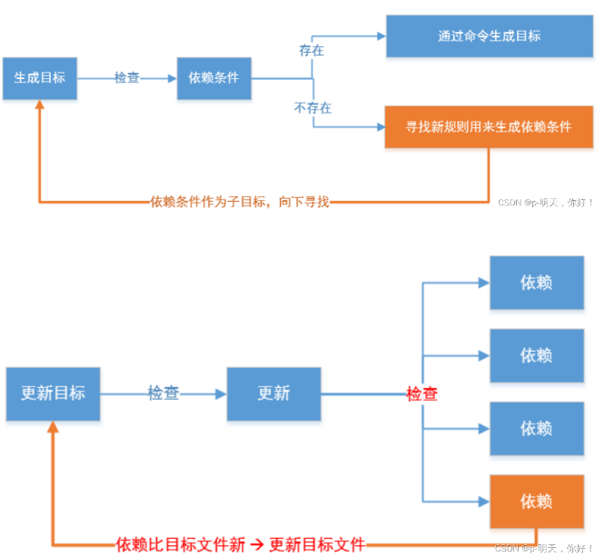
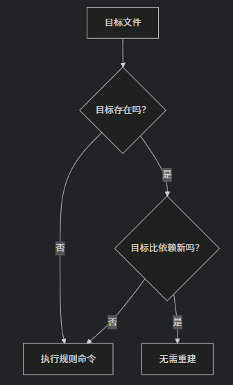

# 备注(声明)：
- 1 符号前后加空格，和shell语法区分。


# 一、初入Makefile


## Makefile的基本规则
### 1 、基本语法（⽬标、依赖、命令）
- 1 # 代表着注释，这个是不会被编译进去

```makefile
⽬标⽂件：依赖⽂件
[TAB]指令
```

- 2 越是接近⽬标⽂件的命令，就越是要写在前⾯。因为程序是按照递归的⽅式进⾏依赖⽂件查找的，看到第⼀⾏有⼀个没⻅过的依赖⽂件，就往下⼀⾏进⾏查找

```
//编译过程
c--->i--->s---->o
  -E   -S   -c     -o
```
```bash
app:app.o
	gcc app.o -o app

app.o:app.s
	gcc -c app.s -o app.o

app.s:app.i
	gcc -S app.i -o app.s

app.i:app.c
	gcc -E app.c -o app.i	

```
- 1 在实际使用时一般c--->o就可


### 2 、伪⽬标（.PHONY:）

```
ALL : a.out

hello.o : hello.c
	gcc -c hello.c -o hello.o -I ./

add.o : add.c
	gcc -c add.c -o add.o

sub.o : sub.c
	gcc -c sub.c -o sub.o

mul.o : mul.c
	gcc -c mul.c -o mul.o

div.o : div.c
	gcc -c div.c -o div.o

a.out : $(obj)
	gcc $(obj) -o a.out


clear:
	-rm -rf *.o a.out

.PHONY:clear ALL

```

- 1 make ALL
- 1 make clear

### 3 、多文件链接举例

```bash
test:app.o app1.o app2.o
	gcc app.o app1.o app2.o -o test

app.o:app.c
	gcc -c app.c -o app.o

app1.o:app1.c
	gcc -c app1.c -o app1.o

app2.o:app2.c
	gcc -c app2.c -o app2.o

.PHONY:
clear:
	rm -rf app.o app1.o app2.o
```

### 4 、makefile文件的命名
- 1 Makefile 就是⽤来管理项⽬的。
- 2  xxx.mk ⽂件或者 Makefile 都统称为 Makefile 脚本⽂件
- 2 命名只能为 makefile 或者是 Makefile ，因为只有这两种命名⽅式才能被 make 命令识别


### 5、Makefile⼯作原理图解
[[嵌入式知识学习（通用扩展）/linux基础知识/assets/Makefile语法学习/file-20250810171624367.png|Open: Pasted image 20250723200246.png]]



### 6、时间戳驱动（目标的时间必须晚于依赖条件的时间，否则更新目标）
[[嵌入式知识学习（通用扩展）/linux基础知识/assets/Makefile语法学习/file-20250810171624744.png|Open: Pasted image 20250723201258.png]]


> (base) topeet@ubuntu:~/test/Makefile$ `make
> gcc -c hello.c -o hello.o -I ./
> gcc -c add.c -o add.o
> gcc -c sub.c -o sub.o
> gcc -c mul.c -o mul.o
> gcc -c div.c -o div.o
> gcc hello.o add.o sub.o mul.o div.o -o a.out 
> (base) topeet@ubuntu:~/test/Makefile$ `make
> `make: “a.out”已是最新`。
> (base) topeet@ubuntu:~/test/Makefile$ `vi add.c`
(base) topeet@ubuntu:~/test/Makefile$ `make`
`gcc -c add.c -o add.o`
gcc hello.o add.o sub.o mul.o div.o -o a.out 
- 1 再次重构时，没更改的文件不会再编译。
- 2 可以看到，只重新编译了修改过的 add.c 和最终⽬标

```bash
a.out : hello.o add.o sub.o mul.o div.o
	gcc hello.o add.o sub.o mul.o div.o -o a.out 

hello.o : hello.c
	gcc -c hello.c -o hello.o -I ./

add.o : add.c
	gcc -c add.c -o add.o

sub.o : sub.c
	gcc -c sub.c -o sub.o

mul.o : mul.c
	gcc -c mul.c -o mul.o

div.o : div.c
	gcc -c div.c -o div.o
```
- 2 makefile 检测原理：修改文件后，文件的修改时间发生变化，会出现目标文件的时间早于作为依赖材料的时间，出现这种情况的文件会重新编

### 7、 makefile 指定⽬标
- 1 makefile 默认第⼀个⽬标⽂件为终极⽬标，⽣成就跑路
```
hello.o : hello.c
	gcc -c hello.c -o hello.o -I ./

add.o : add.c
	gcc -c add.c -o add.o

sub.o : sub.c
	gcc -c sub.c -o sub.o

mul.o : mul.c
	gcc -c mul.c -o mul.o

div.o : div.c
	gcc -c div.c -o div.o


a.out : hello.o add.o sub.o mul.o div.o
	gcc hello.o add.o sub.o mul.o div.o -o a.out 
```
> (base) topeet@ubuntu:~/test/Makefile$ make
make: `“hello.o”已是最新。`
(base) topeet@ubuntu:~/test/Makefile$ 

#### ⽤ ALL 来指定终极⽬标。（ALL：）
```
ALL:a.out

hello.o : hello.c
	gcc -c hello.c -o hello.o -I ./

add.o : add.c
	gcc -c add.c -o add.o

sub.o : sub.c
	gcc -c sub.c -o sub.o

mul.o : mul.c
	gcc -c mul.c -o mul.o

div.o : div.c
	gcc -c div.c -o div.o


a.out : hello.o add.o sub.o mul.o div.o
	gcc hello.o add.o sub.o mul.o div.o -o a.out 
```

> (base) topeet@ubuntu:~/test/Makefile$ make
gcc -c add.c -o add.o
gcc hello.o add.o sub.o mul.o div.o -o `a.out `

### 8、 静态模式规则
- **目标集合**：`$(obj)` = `hello.o add.o sub.o mul.o div.o`
- **目标模式**：`%.o`（匹配集合中的每个目标）
- **依赖模式**：`%.c`（根据目标名推导依赖）
- **执行命令**：为每个目标单独执行
```
$(obj) : %.o : %.c
    gcc -c $< -o $@
```

- 1 **精准控制目标集合**
- 1 **避免模式规则冲突**

```c
# 源文件自动发现
src = $(wildcard *.c)          # 获取所有.c文件
obj = $(patsubst %.c, %.o, $(src)) # 转换为目标文件列表

# 默认目标
ALL: a.out

# 静态模式规则：为obj集合中的每个.o文件指定构建规则
$(obj): %.o: %.c
	gcc -c $< -o $@          # 关键：使用$@而非%@

# 链接可执行文件
a.out: $(obj)
	gcc $^ -o $@

# 清理规则
clean:
	-rm -rf $(obj) a.out     # -前缀忽略错误

.PHONY:clean ALL

```

> (base) topeet@ubuntu:~/test/Makefile$ `make ALL
gcc -c mul.c -o mul.o          # 关键：使用mul.o而非%@
gcc -c hello.c -o hello.o          # 关键：使用hello.o而非%@
gcc -c add.c -o add.o          # 关键：使用add.o而非%@
gcc -c div.c -o div.o          # 关键：使用div.o而非%@
gcc -c sub.c -o sub.o          # 关键：使用sub.o而非%@
gcc mul.o hello.o add.o div.o sub.o -o a.out
(base) topeet@ubuntu:~/test/Makefile$ `make clean
rm -rf  mul.o  hello.o  add.o  div.o  sub.o  a.out     # -前缀忽略错误
(base) topeet@ubuntu:~/test/Makefile$ 


## 特殊字符
### 1 、`% 和 *`

| 符号   | 含义        |
| ---- | --------- |
| %.o  | `任意`的.o文件 |
| \*.o | `所有`的.o文件 |
|      |           |
|      |           |


### 2 、`$^ 、 $@ 、 $< 、 $?、 $*`（⾃动变量）

| 符号   | 含义               |                 |
| ---- | ---------------- | --------------- |
| $^   | 所有`依赖`文件         |                 |
| $@   | 所有目标文件 表示`目标文件名` |                 |
| $<   | 所有依赖文件的`第一个文件`   |                 |
| `$?` | `更新的依赖文件`        | 修改过的源文件         |
| `$*` | `不包含扩展名的名`       | `app` (从 app.c) |
|      |                  |                 |
- 2 $^   表示所有依赖条件。组成一个列表，以空格隔开，如果这个列表中有重复项，则去重


#### 举例 - 模式规则
```bash
# TAR代表test
TAR = test
# 写gcc的地⽅全部可以⽤CC代
CC = gcc
# 代替中间文件的变量
OBJ = app.o app1.o app2.o

$(TAR):$(OBJ)
	$(CC) $(OBJ) -o $(TAR)

%.o:%.c
	$(CC) -c $< -o $@

.PHONY:
clear:
	rm *.o 


(base) topeet@ubuntu:~/test/Makefile$ make
gcc -c app.c -o app.o
gcc -c app1.c -o app1.o
gcc -c app2.c -o app2.o
gcc app.o app1.o app2.o -o test
```

- 1 **`%` 是 Makefile 模式规则的特殊字符**，不能在命令中直接使用
- 2 Shell 会将 `%.c` 解释为字面文件名（包含 `%` 字符），而不是通配符


#### 常见错误用法 vs 正确写法

|错误写法|正确写法|原因说明|
|---|---|---|
|`gcc -c %.c -o %.o`|`gcc -c $< -o $@`|`%` 不能在命令中使用|
|`gcc -c *.c`|`gcc -c $^`|通配符应在依赖中定义|
|`gcc -c app.c -o app1.o`|`gcc -c $< -o $@`|保持目标/依赖一致性|


### 3、` - `（出错依然执行）
```
.PHONY: 
clear:
	-rm -rf *.o a.out
```
- 2 比如，待删除文件集合是 5 个，已经手动删除了 1 个，就只剩下 4 个，然而删除命令里面还是 5 个的集合，就会有删除不存在文件的问题，不加这 - ，就会报错，告诉你有一个文件找不到。加了-就不会因为这个报错。


### 4、即时变量（:= ）、延时变量（=）
- 即时变量（简单变量）
	- `A := xxx # A 的值即刻确定，在定义时即确定`
- 延时变量
	- `B = xxx # B 的值使用到时才确定`

#### 举例
```bash
A := $(C)
B = $(C)
#C = abc

all :
	@echo A = $(A)
	@echo B = $(B)

C = abc
```
> (base) topeet@ubuntu:~/test/Makefile$ make
`A =
B = abc


### 5、+=（附加赋值）
```bash
A := $(C)
B = $(C)
C = abc

all :
	@echo A = $(A)
	@echo B = $(B)

C += abc
```
> (base) topeet@ubuntu:~/test/Makefile$ make
A =
`B = abc abc


- 2 他是即时变量还是延时变量取决于前面的定义
### 6、?= （变量已定义则忽略）
- 1 延时变量，如果是第 1 次定义才起效，如果在前面该变量已定义则忽略

```bash
A := $(C)
B = $(C)
C = abc
D = 11111
D ?= lfjsdljlfjl

all :
	@echo A = $(A)
	@echo B = $(B)
	@echo D = $(D)
C += abc

```
> (base) topeet@ubuntu:~/test/Makefile$ make
A =
B = abc abc
`D = 11111


### 7、`@​` （抑制命令回显）


- 1 在命令前添加`@`，Make会​**​隐藏该命令本身​**​，仅显示其执行结果。
- 2 执行Makefile时，每条命令会先回显（打印到终端），再执行其输出结果。（默认）
- 2 添加`@`，确保输出简洁
### 8、`+` （强制执行（即使`make -n`））
```bash
A := $(C)
B = $(C)
C = abc
D = 11111
D ?= lfjsdljlfjl

all :
	@echo A = $(A)
	@echo B = $(B)
	@echo D = $(D)
	+@rm app.c
C += abc
```
> (base) topeet@ubuntu:~/test/Makefile$ touch app.c
	(base) topeet@ubuntu:~/test/Makefile$ `make -n
echo A = 
echo B = abc abc
echo D = 11111
rm app.c
(base) topeet@ubuntu:~/test/Makefile$ ls app.c
`ls: 无法访问 'app.c': 没有那个文件或目录


## 参数

### 1、编译参数详解
#### ⚙️ 参数作用说明：（-Wall、-g）

| 参数          | 作用             | 适用阶段  |
| ----------- | -------------- | ----- |
| `-Wall`     | `启用所有警告`       | 编译/链接 |
| `-g`        | `生成调试信息` (GDB) | 编译/链接 |
| `-O2`       | 优化级别2          | 编译    |
| `-Iinclude` | 添加头文件路径        | 编译    |
| `-Llib`     | 添加库文件路径        | 链接    |
| `-lm`       | 链接数学库          | 链接    |
|             |                |       |
#### 举例
```
# 源文件管理
src = $(wildcard *.c)          # 获取所有.c文件
obj = $(patsubst %.c, %.o, $(src)) # 转换为.o文件名

# 编译参数配置
myArgs = -Wall -g              # 调试+全警告

ALL: a.out                     # 默认目标

# 静态模式规则：编译每个.c文件
$(obj): %.o: %.c
	gcc -c $< -o $@ $(myArgs)  # 关键：必须用Tab缩进

# 链接可执行文件
a.out: $(obj)
	gcc $^ -o $@ $(myArgs)

clean:
	-rm -rf $(obj) a.out      # -前缀忽略错误

.PHONY: clean ALL             # 伪目标声明
```

> (base) topeet@ubuntu:~/test/Makefile$ `make ALL`
gcc -c mul.c -o mul.o -Wall -g                # 关键：必须用Tab缩进
gcc -c hello.c -o hello.o -Wall -g                # 关键：必须用Tab缩进
gcc -c add.c -o add.o -Wall -g                # 关键：必须用Tab缩进
gcc -c div.c -o div.o -Wall -g                # 关键：必须用Tab缩进
gcc -c sub.c -o sub.o -Wall -g                # 关键：必须用Tab缩进
gcc mul.o hello.o add.o div.o sub.o -o a.out -Wall -g   


### 2 、`make` 命令参数详解

#### 🧪 `-n` / `--dry-run` (模拟执行)
```bash
make -n        # 显示构建命令但不执行
make -n clean  # 显示清理命令
```

> (base) topeet@ubuntu:~/test/Makefile$ `make -n clean
rm -rf  mul.o  hello.o  add.o  div.o  sub.o  a.out      # -前缀忽略错误


#### 📂 `-f` / `--file` (指定Makefile)
```bash
make -f m6         # 使用 m6 文件作为 Makefile
make -f build.mk clean  # 指定文件执行 clean
```

> (base) topeet@ubuntu:~/test/Makefile$ `make -f make.mk clean
rm -rf  mul.o  hello.o  add.o  div.o  sub.o  a.out      # -前缀忽略错误

##### **使用场景**：

| 文件命名                  | 调用方式                   | 适用场景     |
| --------------------- | ---------------------- | -------- |
| `Makefile`/`makefile` | `make`                 | 标准项目     |
| `.makefile`           | `make -f .makefile`    | `隐藏配置文件` |
| `build.mk`            | `make -f build.mk`     | `多构建系统`  |
| `win_build.mk`        | `make -f win_build.mk` | `平台特定构建` |

```txt
project/
├── src/
│   ├── main.c
│   └── utils.c
├── include/
│   └── utils.h
└── build.mk   # 自定义Makefile
```


#### 🔍 其他实用参数：

| 参数                           | 作用           | 示例                                |
| ---------------------------- | ------------ | --------------------------------- |
| `-j N`                       | 并行编译 (N=线程数) | `make -j4`                        |
| `-B`                         | 强制全部重建       | `make -B`                         |
| `-C dir`                     | 切换到目录执行      | `make -C src/`                    |
| `--warn-undefined-variables` | 未定义变量警告      | `make --warn-undefined-variables` |
|                              |              |                                   |

> (base) topeet@ubuntu:~/test/Makefile$ `make
make: 对“ALL”无需做任何事。
(base) topeet@ubuntu:~/test/Makefile$ `make -B     强制全部重建
gcc -c mul.c -o mul.o -Wall -g                # 关键：必须用Tab缩进
gcc -c hello.c -o hello.o -Wall -g                # 关键：必须用Tab缩进
gcc -c add.c -o add.o -Wall -g                # 关键：必须用Tab缩进
gcc -c div.c -o div.o -Wall -g                # 关键：必须用Tab缩进
gcc -c sub.c -o sub.o -Wall -g                # 关键：必须用Tab缩进
gcc mul.o hello.o add.o div.o sub.o -o a.out -Wall -g              
(base) topeet@ubuntu:~/test/Makefile$ 
(base) topeet@ubuntu:~/test/Makefile$ `make -C test1   切换到指定目录执行
make: `进入目录“/home/topeet/test/Makefile/test1”
make: *** 没有指明目标并且找不到 makefile。 停止。
make: 离开目录“/home/topeet/test/Makefile/test1”


### 3 、


### 4 、


### 5、


### 6、


### 7、


### 8、


## Makefile与shell语法有什么关系
### 1 、核心关系：Makefile 使用 Shell 执行命令
- 1 Makefile 规则中的**每行命令**都由 Shell 解释器（默认 `/bin/sh`）执行

### 2. 语法相似点

| 特性       | Makefile         | Shell            | 示例                           |
| -------- | ---------------- | ---------------- | ---------------------------- |
| **变量定义** | `VAR = value`    | `VAR=value`      | `CC := gcc`                  |
| **条件判断** | `ifeq`/`ifneq`   | `if`/`then`/`fi` | `if [ -f file ]; then`       |
| **循环**   | `$(foreach ...)` | `for`/`while`    | `for f in *.c; do`           |
| **注释**   | `# Comment`      | `# Comment`      | `# 这是注释`                     |
| **续行符**  | `\`              | `\`              | `command1 \`  <br>`command2` |

### 3 、关键区别
#### a) 变量作用域
```bash
# Makefile 变量 (构建时展开)
TARGET = app
CFLAGS = -O2

build:
	# Shell 变量 (命令执行时生效)
	@OBJ=main.o; \
	echo "Make: $(TARGET), Shell: $$OBJ"


(base) topeet@ubuntu:~/test/Makefile$ make
# Shell 变量 (命令执行时生效)
Make: app, Shell: main.o
```
- 1  Makefile 变量 (构建时展开)，Shell 变量 (命令执行时生效)

#### b) 特殊字符处理

| 字符  | Makefile | Shell       |
| --- | -------- | ----------- |
| `$` | `$$` 转义  | `$VAR` 直接使用 |
| `@` | 隐藏命令输出   | 无特殊含义       |
| `-` | 忽略命令错误   | 无特殊含义       |
|     |          |             |

#### c) 执行模型（基于依赖的声明式）

```bash

# Makefile (基于依赖的声明式)
app: main.o utils.o   # ← 声明依赖关系
	$(CC) $^ -o $@    # ← 执行命令

# Shell (过程式脚本)
# 必须手动写编译顺序
gcc -c main.c
gcc -c utils.c
gcc main.o utils.o -o app
```


### 4 、 核心结论
- 1 Makefile是**构建描述语言**，通过 Shell 执行具体操作命令，同时拥有自己的语法体系（变量、函数、依赖规则）

[[嵌入式知识学习（通用扩展）/linux基础知识/assets/Makefile语法学习/file-20250810171625011.png|Open: Pasted image 20250723165733.png]]


### 5、


### 6、


### 7、


### 8、


# 二、Makefile提升

## ⼯程源码优化
### 1 、源码目录优化方法
> (base) topeet@ubuntu:~/test/Makefile$ `tree
> .
> ├── a.out
> ├── app
> ├── `inc
> │   └── head.h
> ├── Makefile
> ├── make.mk
> ├── `obj
> │   ├── add.o
> │   ├── div.o
> │   ├── hello.o
> │   ├── mul.o
> │   └── sub.o
> └── `src
>     ├── add.c
>     ├── div.c
>     ├── hello.c
>     ├── mul.c
>     └── sub.c
> 
> 3 directories, 15 files

- 2 .c ⽂件都放到 src ⽬录中，.h ⽂件都放在 inc ⽬录中，所⽣成的.o ⽂件产物都放在 obj ⽬录中


### 2 、代码举例
```bash
src = $(wildcard ./src/*.c)          # 获取所有.c文件

obj= $(patsubst ./src/%.c, ./obj/%.o, $(src)) # 转换为目标文件列表

inc_path=./inc

myArgs=-Wall -g

ALL:a.out

$(obj):./obj/%.o:./src/%.c
	gcc -c $< -o $@ $(myArgs) -I $(inc_path) # 编译每个.c文件

a.out: $(obj)
	gcc $^ -o $@ $(myArgs) 

clean:
	-rm -rf $(obj) a.out     # -前缀忽略错误
	
.PHONY: clean ALL             # 伪目标声明
```
> (base) topeet@ubuntu:~/test/Makefile$ `make clean
rm -rf  ./obj/mul.o  ./obj/hello.o  ./obj/add.o  ./obj/div.o  ./obj/sub.o  a.out     # -前缀忽略错误
(base) topeet@ubuntu:~/test/Makefile$ `make
gcc -c src/mul.c -o obj/mul.o -Wall -g -I ./inc # 编译每个.c文件
gcc -c src/hello.c -o obj/hello.o -Wall -g -I ./inc # 编译每个.c文件
gcc -c src/add.c -o obj/add.o -Wall -g -I ./inc # 编译每个.c文件
gcc -c src/div.c -o obj/div.o -Wall -g -I ./inc # 编译每个.c文件
gcc -c src/sub.c -o obj/sub.o -Wall -g -I ./inc # 编译每个.c文件
gcc obj/mul.o obj/hello.o obj/add.o obj/div.o obj/sub.o -o a.out -Wall -g 


### 3 、


## Makefile 函数
### 1 、wildcard（ 匹配文件）
```bash
src = $(wildcard ./*.c) 
```
- 2 匹配当前工作目录下的所有.c 文件。将文件名组成列表，赋值给变量 src。 src = add.c sub.c mul.c div1.c

### 2 、patsubst（模式字符串替换函数）

```bash
$(patsubst <pattern>,<replacement>,<text>)
```
> - ​**​`<pattern>`​**​：`匹配模式`，含通配符 `%`（匹配任意长度字符串）。
> - ​**​`<replacement>`​**​：`替换内容`，可通过 `%` 引用匹配到的子串。
> - ​**​`<text>`​**​：待处理的`字符串列表`（以空格分隔单词）

#### 执行流程​​
1. 将 `<text>` 按空格拆分为多个单词。
2. 对每个单词检查是否匹配 `<pattern>`：
    - 若匹配，将 `%` 对应的子串插入 `<replacement>` 中的 `%` 位置；
    - 若不匹配，保留原单词。
3. 所有结果以空格连接返回

- 2 将参数 3 中，包含参数 1 的部分，替换为参数 2。 obj = add.o sub.o mul.c div1.o
### 3 、wildcard和patsubst举例
```
src = $(wildcard ./*.c) # 匹配当前工作目录下的所有.c 文件。将文件名组成列表，赋值给变量 src。 src = add.c sub.c mul.c div1.c

obj = $(patsubst %.c, %.o, $(src)) # 将参数 3 中，包含参数 1 的部分，替换为参数 2。 obj = add.o sub.o mul.c div1.o


ALL : a.out

hello.o : hello.c
	gcc -c hello.c -o hello.o -I ./

add.o : add.c
	gcc -c add.c -o add.o

sub.o : sub.c
	gcc -c sub.c -o sub.o

mul.o : mul.c
	gcc -c mul.c -o mul.o

div.o : div.c
	gcc -c div.c -o div.o

a.out : $(obj)
	gcc $(obj) -o a.out


.PHONY: 
clear:
	rm -rf *.o a.out
```

> (base) topeet@ubuntu:~/test/Makefile$ `make
gcc -c mul.c -o mul.o
gcc -c hello.c -o hello.o -I ./
gcc -c add.c -o add.o
gcc -c div.c -o div.o
gcc -c sub.c -o sub.o
gcc  ./mul.o  ./hello.o  ./add.o  ./div.o  ./sub.o  -o a.out
(base) topeet@ubuntu:~/test/Makefile$ `./a.out
10+5=15
10-5=5
10/5=2
10x5=50


### 4 、函数使用格式总结（`$( )`或`${ }`）
```
$(<function> <arguments>)

${<function> <arguments>}
```

- 1 参数间以逗号分隔
- 1 函数名和参数之间以“空格”分隔
- 2 函数调⽤以 $ 开头，以圆括号或花括号把函数名和参数括起。


### 5、foreach 函数（循环）
```
$(foreach <var>, <list>, <text>)
```
> - ​**​`<var>`​**​：临时变量，表示 **当前迭代的元素**。
> - ​**​`<list>`​**​​**​：空格分隔的待遍历列表（如变量、文件名集合）。
> - ​**​`<text>`​**​：对每个元素执行的操作表达式，​**​需引用 `<var>` 才有意义​**​。

- 1 执行流程
- 2 1. 从 `<list>` 中依次取出每个单词赋值给 `<var>`。
- 2 2. 执行 `<text>` 表达式，生成一个字符串结果。
- 2 3. 所有迭代结果​**​以空格连接​**​，形成 `foreach` 的最终返回值

#### 举例
```bash
names := a b c d

files := $(foreach n,$(names),$(n).o)

ALL:
	@echo $(files)
```
> (base) topeet@ubuntu:~/test/Makefile$ make
`a.o b.o c.o d.o


### 6、filter（过滤函数） 和 filter-out（反过滤函数）
```makefile
# 保留符合 <pattern> 的单词
$(filter <pattern1> <pattern2>..., <text>)

# 移除符合 <pattern> 的单词
$(filter-out <pattern1> <pattern2>..., <text>)
```

- 1 `<pattern>` 过滤规则
- 1 `<text> `    要过滤的文本表

#### 🔍 核心功能对比

| ​**​函数​**​   | ​**​作用​**​ | ​**​返回值​**​ | ​**​典型场景​**​     |
| ------------ | ---------- | ----------- | ---------------- |
| `filter`     | 保留符合模式的单词  | 匹配模式的字符串    | 筛选特定类型文件（如 `.c`） |
| `filter-out` | 移除符合模式的单词  | 不匹配模式的字符串   | 排除特定文件（如临时文件）    |
|              |            |             |                  |

#### 举例
```bash
C = a b b d/

D = $(filter %/, $(C))
E = $(filter-out %/, $(C))

ALL:
	@echo D = $(D)
	@echo E = $(E)

```
> (base) topeet@ubuntu:~/test/Makefile$ make
`D = d/
`E = a b b


### 7、


### 8、


## 
### 1 、


### 2 、


### 3 、

### 4 、
### 5、


### 6、


### 7、


### 8、


## 
### 1 、


### 2 、


### 3 、

### 4 、

### 5、


### 6、


### 7、


### 8、


# 三、

## 
### 1 、


### 2 、


### 3 、

### 4 、

### 5、


### 6、


### 7、


### 8、


## 
### 1 、


### 2 、


### 3 、

### 4 、
### 5、


### 6、


### 7、


### 8、


## 
### 1 、


### 2 、


### 3 、

### 4 、

### 5、


### 6、


### 7、


### 8、


# 四、

## 
### 1 、


### 2 、


### 3 、

### 4 、

### 5、


### 6、


### 7、


### 8、


## 
### 1 、


### 2 、


### 3 、

### 4 、
### 5、


### 6、


### 7、


### 8、


## 
### 1 、


### 2 、


### 3 、

### 4 、

### 5、


### 6、


### 7、


### 8、


# 五、

## 
### 1 、


### 2 、


### 3 、

### 4 、

### 5、


### 6、


### 7、


### 8、


## 
### 1 、


### 2 、


### 3 、

### 4 、
### 5、


### 6、


### 7、


### 8、


## 
### 1 、


### 2 、


### 3 、

### 4 、

### 5、


### 6、


### 7、


### 8、


