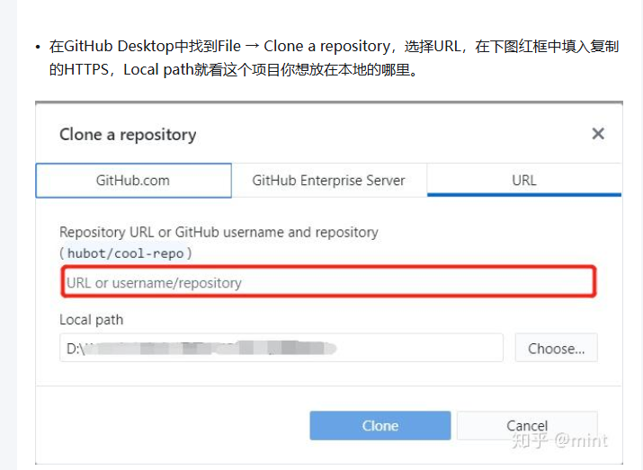
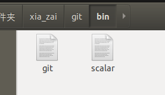
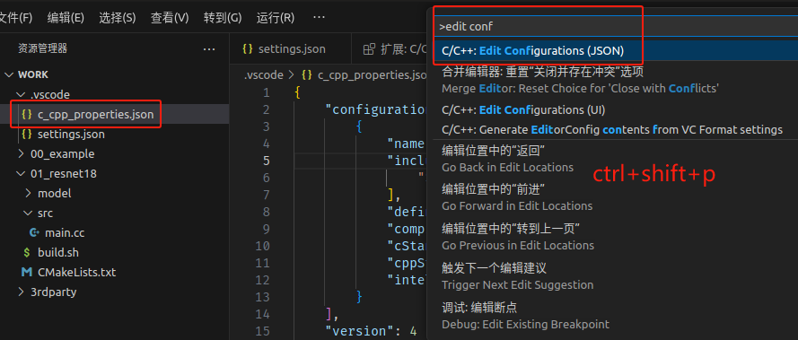
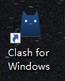
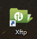
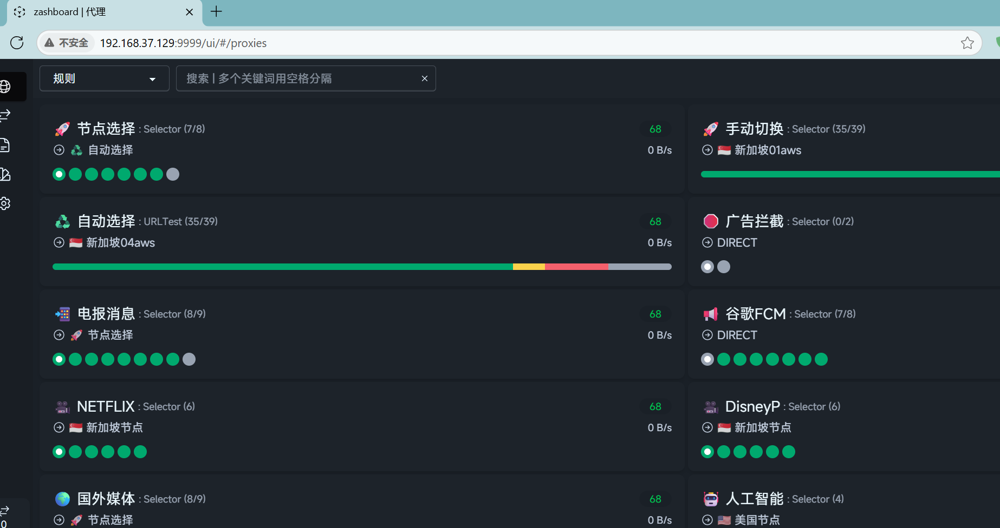

# 1、github desktop


## 下载

```cardlink
url: https://github.com/shiftkey/desktop/releases
title: "Releases · shiftkey/desktop"
description: "Fork of GitHub Desktop to support various Linux distributions - shiftkey/desktop"
host: github.com
favicon: https://github.githubassets.com/favicons/favicon.svg
image: https://opengraph.githubassets.com/767e3650d44e0747c220ba2fc2ac5cee23c9368c72bd064945e69d2cf70fa930/shiftkey/desktop
```

- 1 sudo dpkg -i GitHubDesktop-linux-amd64-3.4.13-linux1.deb

[Release 3.4.9 Linux RC1 · shiftkey/desktop · GitHub](https://github.com/shiftkey/desktop/releases/tag/release-3.4.9-linux1)

> [!note] Linux汉化GithubDesktop
> Linux汉化
> 将Linux文件夹下的main.js和renderer.js复制替换 本地GithubDesktop的资源目录
> 
> 本地GithubDesktop资源目录一般为：/usr/lib/github-desktop/resources/app
> 
> E:\xia_zai\github_desktop\GithubDesktop

> mingyuan@mingyuan-virtual-machine:~/app$ `sudo cp ./main.js /usr/lib/github-desktop/resources/app/
mingyuan@mingyuan-virtual-machine:~/app$ `sudo cp ./renderer.js /usr/lib/github-desktop/resources/app/


[Release GithubDesktop汉化工具 3.4.13 · robotze/GithubDesktopZhTool · GitHub](https://github.com/robotze/GithubDesktopZhTool/releases/tag/3.4.13)

[GitHub - awslabs/amazon-kinesis-video-streams-webrtc-sdk-c: Amazon Kinesis Video Streams Webrtc SDK is for developers to install and customize realtime communication between devices and enable secure streaming of video, audio to Kinesis Video Streams.](https://github.com/awslabs/amazon-kinesis-video-streams-webrtc-sdk-c)

## Github Desktop 纯萌新入门教程
[Site Unreachable](https://zhuanlan.zhihu.com/p/419092209)

[Ubuntu 更新软件的命令_ubuntu更新软件命令-CSDN博客](https://blog.csdn.net/qq_326324545/article/details/88955605)


[Fetching Data#i4bq](https://zhuanlan.zhihu.com/p/81697702)

## 其他

## ubuntu18.04安装github-desktop - 使用静态链接 Git 替换 GitHub Desktop 内置 Git
### 报错
- 1 /usr/lib/github-desktop/resources/app/git/bin/git: /lib/x86_64-linux-gnu/libc.so.6: version `GLlBc_2.28' notfound (required by /usr/lib/github-desktop/resources/app/git/bin/git)
- 1 `/usr/lib/github-desktop/resources/app/git/bin/git` 报错 `GLIBC_2.28` 未找到的问题，您需要将系统的 `glibc`（GNU C Library）升级到至少 2.28 版本。由于 Ubuntu 18.04 默认使用的是 `glibc 2.27`，因此需要手动升级或使用兼容性方案。

### 下载Git 官方或发行版提供的静态编译版
- 1 [Fetching Title#3tq6](https://mirrors.edge.kernel.org/pub/software/scm/git/git-2.40.1.tar.gz)
- 2 **注意**：选择版本时需确保 ≥ 2.30.0（您提到的 2.30.0 是可行的，但建议用更新的稳定版）

### 编译Git静态版-生成git可执行程序
 - 1 sudo apt update
- 1 sudo apt install build-essential libssl-dev libcurl4-gnutls-dev libexpat1-dev gettext zlib1g-dev          安装依赖工具
- 1 cd ~/xia_zai/git-2.40.1
- 1 make prefix=/usr/local all     编译


### 创建bin文件夹并把git文件放到里面（要重命名git-2.40.1为git）
[[嵌入式知识学习（通用扩展）/linux基础知识/assets/linux开发工具软件/file-20250810171434622.png|Open: Pasted image 20250629233658.png]]

- 2 scalar文件来自/usr/lib/github-desktop/resources/app/git/bin/

### 替换 GitHub Desktop 内置 Git
> topeet@ubuntu:/usr/lib/github-desktop/resources/app$ `sudo rm -rf git`
[sudo] topeet 的密码： 
topeet@ubuntu:~/xia_zai$ `sudo cp ./git /usr/lib/github-desktop/resources/app/ -r`
topeet@ubuntu:~/xia_zai$ 

## 初始化大文件夹为git仓库的方法 - 用git命令提交
2、将该文件夹初始化成一个git仓库：`$ git init`  
3、将该文件夹下的文件（即工作区内容）添加到git缓冲区：`$ git add .`  
4、将git缓冲区提交到刚刚初始化的git仓库里：`$ git commit -m "本次提交说明"`

## 只将有用文件提交git管理的方法

- **单个文件**：`git add <file>` 将指定的单个文件添加到暂存区。
- **多个文件**：`git add <file1> <file2>` 将多个文件添加到暂存区。
- **目录**：`git add <directory>` 将指定目录下的所有文件添加到暂存区。
- **通配符**：`git add *` 将当前目录下的所有文件添加到暂存区。


```cardlink
url: https://www.oryoy.com/news/zhang-wo-git-zhi-ti-jiao-bi-yao-de-wen-jian-gao-xiao-guan-li-ni-de-dai-ma-cang-ku.html
title: "掌握Git：只提交必要的文件，高效管理你的代码仓库 - 云原生实践"
description: "引言 Git，作为现代软件开发中不可或缺的版本控制系统，它强大的功能使得开发者能够高效地管理代码变更。然而，在享受Git带来的便利的同时，如何只提交必要的文件，避免提交无关文件，成为了一个提高工作效率的关键点。本文将详细介绍如何利用Git的命令和技巧，实现只提交必要的文件，从而高效管理你的代码仓库。 一、理解Git的工作流程 在深入探讨如何只提交必要的文件之前，首先需要了解Git的工作流程"
host: www.oryoy.com
```

## 解决-初始化好git仓库为什么github-desktop会显示找不到
### 原因 - 要无文件要提交才能用github-desktop打开
> topeet@ubuntu:~/Linux/rk356x_linux/buildroot$ git status
位于分支 master
未跟踪的文件:
  （使用 "git add <文件>..." 以包含要提交的内容）
	.gitignore
提交为空，<span style="background:#affad1">但是存在尚未跟踪的文件</span>（使用 "git add" 建立跟踪）

### 解决 - 添加 `.gitignore` 文件（忽略不提交的文件夹）
- 1 只保留 .c/.h、配置文件 和 编译脚本”，保留所有的设备树文件，保留所有的.config文件和所有的configs文件夹。

- 1 也可以用安卓源码的git规则。
> topeet@ubuntu:~/Linux/rk356x_linux/buildroot$ `touch .gitignore`
```c
# 1. 忽略所有文件（包括隐藏）
*
.*

# 2. 解开目录忽略，允许进入子目录
!*/

# 3. 放行所有 C/C++ 源文件
!*.c
!*.h

# 4. 放行所有以 .config 结尾的文件（包括 .config、.config.old、linux-*.config）
!*.config

# 5. 放行隐藏的 .config 和 .config.old 文件
!.config
!.config.old

# 6. 放行设备树文件
!*.dts
!*.dtsi

# 7. 放行构建脚本
!Makefile
!makefile
!*.mk
!*.sh

# 8. 放行 configs 文件夹及其所有内容
!configs/
!configs/**

# 9. 忽略构建产物、临时文件等
*.o
*.ko
*.elf
*.bin
*.out
*.a
*.so
*.log
*.tmp
*.bak

```

- 1 补充一些文件添加到git
```bash
git add .config -f
git add .config.old -f


```


```bash
git init
git add .gitignore -f

# 查看将被添加的文件（确保只有你想要的文件）
git status --untracked-files=all > test.txt


# 添加所有符合规则的文件
git add -A

# 检查暂存区内容
git ls-files

git commit -m "编译完整的buildroot系统"

```

git commit -m "obsidian"

> topeet@ubuntu:~/Linux/rk356x_linux/buildroot$ `git status`
位于分支 master
`无文件要提交，干净的工作区`

我要在linux源码下初始化一个git仓库，帮我写一个.gitignore文件。
我只要.c和.h和配置文件和编译脚本，其他文件夹和文件都忽略。


# 2、cursor
## 下载 配置
[Cursor太贵？分享三个免费AI编程方案+海量编程技巧【如何看待AI编程】\_哔哩哔哩\_bilibili](https://www.bilibili.com/video/BV1b5AeeGEFc/?spm_id_from=333.337.search-card.all.click&vd_source=83485b71343f442522d28357f4bb93eb)


## 入门教程
[[未整理(其他)/CursorAI编程]]


## 免费API
[OpenRouter](https://openrouter.ai/)
当成openai来用。

- deepseek/deepseek-chat-v3-0324:free
<span style="background:#b1ffff">deepseekv3</span>
ming
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

`https://openrouter.ai/api/v1`

- google/gemini-2.5-pro-exp-03-25:free

- 1 # Qwen：Qwen3 4B（免费）阿里云
- 2 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

- 1 


# 3、vscode
## 下载 配置

### vscode 的安装和使用
> [!PDF|important] [[RK3568（linux学习）/linux开发资料库/rk3568迅为开发pdf/3.开发环境搭建/20_【北京迅为】itop-3568开发板linux代码编写查看环境搭建手册【底板1.7版】 v1.0.pdf#page=21&selection=78,0,82,6&color=important|20_【北京迅为】itop-3568开发板linux代码编写查看环境搭建手册【底板1.7版】 v1.0, p.21]]
> > 1.3 vscode 的安装和使用
> 
> 


## 入门教程



## 插件
<span style="background:#b1ffff">roo code</span>
免费API
[OpenRouter](https://openrouter.ai/)
当成openai来用。
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
通义零码

[6.vscode的学习](onenote:https://d.docs.live.net/52d4b76bb0ffcf51/Documents/\(RK3568\)Linux驱动开发/记录.one#6.vscode的学习&section-id={85D26C6C-8708-43BD-A8E6-E3731284E01F}&page-id={DAFE97CC-2E9E-4215-B337-A7FCD98D4809}&end)  ([Web 视图](https://onedrive.live.com/view.aspx?resid=52D4B76BB0FFCF51%21se8c325913f784bf694d429e5ee2ab2be&id=documents&wd=target%28%E8%AE%B0%E5%BD%95.one%7C85D26C6C-8708-43BD-A8E6-E3731284E01F%2F6.vscode%E7%9A%84%E5%AD%A6%E4%B9%A0%7CDAFE97CC-2E9E-4215-B337-A7FCD98D4809%2F%29&wdpartid=%7bAA87B5C9-E83D-4E2F-BF8A-42AD40C5CD56%7d%7b1%7d&wdsectionfileid=52D4B76BB0FFCF51!sda50f1e3d4314bd7a8b6469de58efa8f))
- **vscode注释插件**


## 其他编辑代码软件
### 1 、安装 ctags 与 cscope 插件
> [!PDF|important] [[RK3568（linux学习）/linux开发资料库/rk3568迅为开发pdf/3.开发环境搭建/20_【北京迅为】itop-3568开发板linux代码编写查看环境搭建手册【底板1.7版】 v1.0.pdf#page=9&selection=40,0,50,2&color=important|20_【北京迅为】itop-3568开发板linux代码编写查看环境搭建手册【底板1.7版】 v1.0, p.9]]
> > 1.1 安装 ctags 与 cscope 插件
> 
> 

### 2 、vim+ctags+cscope 的使用
> [!PDF|important] [[RK3568（linux学习）/linux开发资料库/rk3568迅为开发pdf/3.开发环境搭建/20_【北京迅为】itop-3568开发板linux代码编写查看环境搭建手册【底板1.7版】 v1.0.pdf#page=14&selection=39,0,43,3&color=important|20_【北京迅为】itop-3568开发板linux代码编写查看环境搭建手册【底板1.7版】 v1.0, p.14]]
> > 1.2 vim+ctags+cscope 的使用
> 
> 


### 3 、Eclipse 的安装和使用
> [!PDF|important] [[RK3568（linux学习）/linux开发资料库/rk3568迅为开发pdf/3.开发环境搭建/20_【北京迅为】itop-3568开发板linux代码编写查看环境搭建手册【底板1.7版】 v1.0.pdf#page=42&selection=18,0,22,6&color=important|20_【北京迅为】itop-3568开发板linux代码编写查看环境搭建手册【底板1.7版】 v1.0, p.42]]
> > 1.4 Eclipse 的安装和使用
> 
> 


# 4、Allegro PCB    Cadence

## 下载 配置


## 入门教程


## 其他


# 5、FlashFXP(ssh)

## 下载 配置


## 入门教程


## 其他

# 6、Xshell(串口终端)

## 下载 配置
[Site Unreachable](https://zhuanlan.zhihu.com/p/49325642623)

## 入门教程


## 其他


# 7、clash for windos

## 下载 配置 - 飞鸟云
[飞鸟云](https://feiniaoyun.top/#/dashboard)

- 1 订阅链接
- 2 `https://f1.fnxx.cc/api/v1/client/subscribe?token=811b1319f35aab976a94f1124d3733d3

## 入门教程


## 其他

# 8、uedit(二进制)

## 下载 配置


## 入门教程


## 其他

# 9、Xftp(ssh)

## 下载 配置


## 入门教程


## 其他

# 10、搜狗linux
## 下载 配置

```cardlink
url: https://shurufa.sogou.com/linux/guide
title: "搜狗输入法linux-安装指导"
description: "搜狗输入法for linux—支持全拼、简拼、模糊音、云输入、皮肤、中英混输"
host: shurufa.sogou.com
favicon: https://ife.gtimg.com/build/client/fromcc/official-website/assets/favicon_8dbb2ea.ico
```

[Ubuntu 22.04安装搜狗输入法\_ubuntu22.04安装搜狗输入法-CSDN博客](https://blog.csdn.net/mr_sudo/article/details/124874239)


- 1 E:\V3s\tool
## 入门教程


## 其他


# 11、ubuntu翻墙（用飞鸟云）（速度正常可用）
- 1 不要用一元机场，不行

## 视频教程
[Release Linux科学上网教程，shellclash linux使用教程，Debian/Ubuntu安装clash linux server vpn · kjfx/vpn · GitHub](https://github.com/kjfx/vpn/releases/tag/linux)

[Release Linux科学上网教程，shellclash linux使用教程，Debian/Ubuntu安装clash linux server vpn · kjfx/vpn · GitHub](https://github.com/kjfx/vpn/releases/tag/linux)

- 1 配置好后clash就可打开
- 2 sudo -i
- 2 clash


## 网站管理配置界面
[飞鸟云](https://feiniaoyun.top/#/dashboard)
- 1 Clash管理地址（将IP替换成自己服务器IP）：ifconfig中的IPV4地址
- 2 主机地址也要换

[自己ubuntu22的Clash管理网站](http://192.168.37.129:9999/ui/#/proxies)
[[嵌入式知识学习（通用扩展）/linux基础知识/assets/linux开发工具软件/file-20250810171435482.png|Open: Pasted image 20250711201404.png]]


## 实际操作（切换到root用户）

### 安装环境：

```
sudo apt update
sudo apt install bzip2 tar
sudo apt-get install curl
```


### 安装ShellCrash：
- 1 sudo -i # 切换到root用户

```
export url='https://fastly.jsdelivr.net/gh/juewuy/ShellCrash@master' && wget -q --no-check-certificate -O /tmp/install.sh $url/install.sh  && bash /tmp/install.sh && source /etc/profile &> /dev/null
```
备用安装源：
```
export url='https://gh.jwsc.eu.org/master' && bash -c "$(curl -kfsSl $url/install.sh)" && source /etc/profile &> /dev/null
```

### 安装clash
> root@mingyuan-virtual-machine:~# `export url='https://fastly.jsdelivr.net/gh/juewuy/ShellCrash@master' && wget -q --no-check-certificate -O /tmp/install.sh $url/install.sh  && bash /tmp/install.sh && source /etc/profile &> /dev/null
> 
> 请选择想要安装的版本：
 1 公测版(推荐)
 2 稳定版
 3 开发版
请输入相应数字 > `1
> 
> 注意：安装ShellCrash至少需要预留约1MB的磁盘空间
>  1 在/etc目录下安装(适合root用户)
>  2 在/usr/share目录下安装(适合Linux系统)
>  3 在当前用户目录下安装(适合非root用户)
>  4 在外置存储中安装
>  5 手动设置安装目录
>  0 退出安装
> 
> 请输入相应数字 > `1
> 目标目录/etc空间剩余：6.5G
> 确认安装？(1/0) >` 1

### 配置启动clash

> root@mingyuan-virtual-machine:~# `clash
> 
>  1 路由设备配置局域网透明代理
>  2 Linux设备仅配置本机代理
> 
> 请输入对应数字 > `2
> 
> 是否开启公网访问Dashboard面板及socks服务？
> 注意当前设备必须有公网IP才能从公网正常访问
> 此功能会增加暴露风险请谨慎使用！
> vps设备可能还需要额外在服务商后台开启相关端口
> 现在开启？(1/0) > `1
> 请先设置面板访问秘钥 > `clash
> 请先修改Socks服务端口(1-65535) > `777
> 请先设置Socks服务密码(账号默认为crash) >` clash
> 请输入你的公网IP地址 > `157.122.74.148
> 
> 启用推荐的自动任务配置？这包括：
> 
> 每隔10分钟自动保存面板配置
> 服务启动后自动同步ntp时间
> 在每周3的3点整更新订阅并重启服务
> 
> 是否启用？(1/0) > `1


> 是否导入配置文件？(这是运行前的最后一步)
你必须拥有一份配置文件才能运行服务！
> 
现在开始导入？(1/0) > `1
>  ShellCrash配置文件管理
> 
>  1 在线生成配置文件
>  2 在线获取完整配置文件
>  3 本地生成providers配置文件
>  4 本地上传完整配置文件
>  5 设置自动更新
>  6 自定义配置文件
>  7 更新配置文件
>  8 还原配置文件
> 
> 请输入对应数字 > `1
> 
> 
> 请直接输入第1个链接或对应数字选项 >`https://f1.fnxx.cc/api/v1/client/subscribe?token=811b1319f35aab976a94f1124d3733d3`   <span style="background:#affad1">（节点订阅链接）</span>
> 
>  1 开始生成配置文件（原文件将被备份）
>  2 设置节点过滤关键字 
>  3 设置节点筛选关键字 
>  4 选取在线配置规则模版
>  5 选取在线生成服务器
>  0 撤销输入并返回上级菜单
> 请直接输入第2个链接或对应数字选项 > `1
> 
> 1 在线生成配置文件
>  2 在线获取完整配置文件
>  3 本地生成providers配置文件
>  4 本地上传完整配置文件
>  5 设置自动更新
>  6 自定义配置文件
>  7 更新配置文件
>  8 还原配置文件
> 
> 请输入对应数字 > `1
> 
>  1 开始生成配置文件（原文件将被备份）
>  2 设置节点过滤关键字 
>  3 设置节点筛选关键字 
>  4 选取在线配置规则模版
>  5 选取在线生成服务器
>  0 撤销输入并返回上级菜单
> 请直接输入第2个链接或对应数字选项 > `1
> 
> 
> 
> 很好！现在只需要执行启动就可以愉快的使用了！
> 立即启动服务？(1/0) > `1

>  1 启动/重启服务
>  2 内核功能设置
>  3 停止内核服务
>  4 内核启动设置
>  5 配置自动任务
>  6 导入配置文件
>  7 内核进阶设置
>  8 其他工具
>  9 更新/卸载
> 
>  0 退出脚本
> 请输入对应数字 > `9
> 
>  1 更新管理脚本    1.9.2beta4 > 1.9.2beta4 
 2 切换内核文件     > 
 3 更新数据库文件	> 20250707
 4 安装本地Dashboard面板
 5 安装/更新本地根证书文件
 6 查看PAC自动代理配置
>  7 切换安装源及安装版本
>  8 配置自动更新
>  9 卸载ShellCrash
> 
> 99 鸣谢！
> 
>  0 返回上级菜单
> 
> 请输入对应数字 > `4
> 
> 请选择面板安装类型：
> 
 1 安装Yacd面板(约1.1mb)
 2 安装Yacd-Meta魔改面板(约1.5mb)
 3 安装MetaXD面板(约1.5mb)
 4 安装zashboard面板(约1.2mb)
 5 安装基础面板(约500kb)
 6 安装Meta基础面板(约800kb)
 9 卸载本地面板
 0 返回上级菜单
请输入对应数字 > `4
> 
>  0 返回上级菜单
> 请输入对应数字 > `0
> 
> 
> >  1 启动/重启服务
>  2 内核功能设置
>  3 停止内核服务
>  4 内核启动设置
>  5 配置自动任务
>  6 导入配置文件
>  7 内核进阶设置
>  8 其他工具
>  9 更新/卸载
> 
>  0 退出脚本
> 请输入对应数字 > `1


### 更新或更改订阅链接方法

>  root@mingyuan-virtual-machine:~# `clash
>  
>   1 启动/重启服务
 2 内核功能设置
 3 停止内核服务
 4 内核启动设置
 5 配置自动任务
 6 导入配置文件
 7 内核进阶设置
 8 其他工具
 9 更新/卸载
> 
 0 退出脚本
请输入对应数字 > `6
> 
>  1 在线生成配置文件
>  2 在线获取完整配置文件
>  3 本地生成providers配置文件
>  4 本地上传完整配置文件
>  5 设置自动更新
>  6 自定义配置文件
>  7 更新配置文件
>  8 还原配置文件
> 
>  0 返回上级菜单
> 请输入对应数字 > `1
> 检测到已记录的链接内容：
> https://s1.byte33.com/api/v1/client/subscribe?token=98eda08f127b3277575d888f7d03e28a
> 清空链接/追加导入？[1/0] > `1
> 
> 请直接输入第1个链接或对应数字选项 > `https://f1.fnxx.cc/api/v1/client/subscribe?token=811b1319f35aab976a94f1124d3733d3
> 
>  1 开始生成配置文件（原文件将被备份）
 2 设置节点过滤关键字 
 3 设置节点筛选关键字 
 4 选取在线配置规则模版
 5 选取在线生成服务器
>  0 撤销输入并返回上级菜单
> 
> 请直接输入第2个链接或对应数字选项 > `1
> 
> 
> 


### 查看公网IP命令
> </html>mingyuan@mingyuan-virtual-machine:~$ `curl -s ipinfo.io/ip
157.122.74.148mingyuan@mingyuan-virtual-machine:~


# 12、ubuntu22.04虚拟机安装

## 基于 Ubuntu22.04 安装 SSH 服务
[ubuntu22.04 怎么开启SSH服务\_ubuntu22.04 ssh服务开启-CSDN博客](https://blog.csdn.net/sunyuhua_keyboard/article/details/134860142#:~:text=%E6%9C%AC%E6%96%87%E8%AF%A6%E7%BB%86%E6%8C%87%E5%AF%BC%E5%A6%82%E4%BD%95%E5%9C%A8Ubuntu22.04LTS%E4%B8%AD%E6%89%8B%E5%8A%A8%E5%AE%89%E8%A3%85SSH%E6%9C%8D%E5%8A%A1%E5%99%A8%EF%BC%8C%E5%8C%85%E6%8B%AC%E6%9B%B4%E6%96%B0%E8%BD%AF%E4%BB%B6%E5%8C%85%E3%80%81%E9%85%8D%E7%BD%AE%E9%98%B2%E7%81%AB%E5%A2%99%E3%80%81%E5%BC%80%E6%94%BE%E7%AB%AF%E5%8F%A3%E3%80%81%E6%A3%80%E6%9F%A5%E6%9C%8D%E5%8A%A1%E7%8A%B6%E6%80%81%E5%8F%8A%E8%BF%9B%E8%A1%8C%E9%A2%9D%E5%A4%96%E9%85%8D%E7%BD%AE%EF%BC%8C%E7%A1%AE%E4%BF%9DSSH%E8%BF%9E%E6%8E%A5%E7%9A%84%E6%AD%A3%E5%B8%B8%E5%B7%A5%E4%BD%9C%E3%80%82%20%E6%91%98%E8%A6%81%E7%94%9F%E6%88%90%E4%BA%8E%20C%E7%9F%A5%E9%81%93%20%EF%BC%8C%E7%94%B1%20DeepSeek-R1%20%E6%BB%A1%E8%A1%80%E7%89%88%E6%94%AF%E6%8C%81%EF%BC%8C%20%E5%89%8D%E5%BE%80%E4%BD%93%E9%AA%8C,%3E%20%E5%9C%A8%20Ubuntu%2022.04%20LTS%20%E4%B8%AD%EF%BC%8C%E9%BB%98%E8%AE%A4%E6%83%85%E5%86%B5%E4%B8%8B%E4%B8%8D%E4%BC%9A%E8%87%AA%E5%8A%A8%E5%90%AF%E5%8A%A8%20SSH%20%E6%9C%8D%E5%8A%A1%E3%80%82)


# 13、vmware虚拟机

## vmware虚拟机扩大硬盘
[Fetching Title#o0xh](https://blog.csdn.net/haohao121096/article/details/137586536?utm_medium=distribute.pc_relevant.none-task-blog-2~default~baidujs_baidulandingword~default-2-137586536-blog-145017308.235^v43^pc_blog_bottom_relevance_base8&spm=1001.2101.3001.4242.1&utm_relevant_index=4)


> mingyuan@mingyuan-virtual-machine:~$ df -h
> 文件系统        大小  已用  可用 已用% 挂载点
> tmpfs           387M  2.1M  385M    1% /run
> `/dev/sda3        98G   18G   77G   19% /
- 1 象这种情况，不用执行下面两步        
- 2 sudo lvextend -l +100%FREE /dev/mapper/ubuntu--vg-ubuntu--lv
- 2 sudo resize2fs /dev/mapper/ubuntu--vg-ubuntu--lv


# 14、ubuntu18.04虚拟机安装与配置
### 1 、安装虚拟机 VM 软件
> [!PDF|important] [[RK3568（linux学习）/linux开发资料库/rk3568迅为开发pdf/3.开发环境搭建/11_【北京迅为】itop-3568开发板从零搭建ubuntu开发环境手册【底板V1.7版】v1.0.pdf#page=10&selection=21,0,31,2&color=important|11_【北京迅为】itop-3568开发板从零搭建ubuntu开发环境手册【底板V1.7版】v1.0, p.10]]
> > 第 1 章安装虚拟机 VM 软件
> 
> 

### 2 、获取并安装 Ubuntu 操作系统
> [!PDF|important] [[RK3568（linux学习）/linux开发资料库/rk3568迅为开发pdf/3.开发环境搭建/11_【北京迅为】itop-3568开发板从零搭建ubuntu开发环境手册【底板V1.7版】v1.0.pdf#page=16&selection=21,0,31,4&color=important|11_【北京迅为】itop-3568开发板从零搭建ubuntu开发环境手册【底板V1.7版】v1.0, p.16]]
> > 第 2 章获取并安装 Ubuntu 操作系统
> 
> 

### 3 、Ubuntu18.04 系统设置
> [!PDF|important] [[RK3568（linux学习）/linux开发资料库/rk3568迅为开发pdf/3.开发环境搭建/11_【北京迅为】itop-3568开发板从零搭建ubuntu开发环境手册【底板V1.7版】v1.0.pdf#page=27&selection=21,0,29,4&color=important|11_【北京迅为】itop-3568开发板从零搭建ubuntu开发环境手册【底板V1.7版】v1.0, p.27]]
> > 第 3 章 Ubuntu18.04 系统设置
> 
> 

### 4 、Ubuntu18.04 支持中文
> [!PDF|important] [[RK3568（linux学习）/linux开发资料库/rk3568迅为开发pdf/3.开发环境搭建/11_【北京迅为】itop-3568开发板从零搭建ubuntu开发环境手册【底板V1.7版】v1.0.pdf#page=50&selection=21,0,29,4&color=important|11_【北京迅为】itop-3568开发板从零搭建ubuntu开发环境手册【底板V1.7版】v1.0, p.50]]
> > 第 4 章 Ubuntu18.04 支持中文
> 
> 

### 5、安装 SSH
> [!PDF|important] [[RK3568（linux学习）/linux开发资料库/rk3568迅为开发pdf/3.开发环境搭建/11_【北京迅为】itop-3568开发板从零搭建ubuntu开发环境手册【底板V1.7版】v1.0.pdf#page=60&selection=21,0,29,3&color=important|11_【北京迅为】itop-3568开发板从零搭建ubuntu开发环境手册【底板V1.7版】v1.0, p.60]]
> > 第 5 章安装 SSH
> 
> 

### 6、安装 Samba
> [!PDF|important] [[RK3568（linux学习）/linux开发资料库/rk3568迅为开发pdf/3.开发环境搭建/11_【北京迅为】itop-3568开发板从零搭建ubuntu开发环境手册【底板V1.7版】v1.0.pdf#page=62&selection=21,0,29,5&color=important|11_【北京迅为】itop-3568开发板从零搭建ubuntu开发环境手册【底板V1.7版】v1.0, p.62]]
> > 第 6 章安装 Samba
> 
> 

### 7、安装 VMwareTools
> [!PDF|important] [[RK3568（linux学习）/linux开发资料库/rk3568迅为开发pdf/3.开发环境搭建/11_【北京迅为】itop-3568开发板从零搭建ubuntu开发环境手册【底板V1.7版】v1.0.pdf#page=65&selection=21,0,29,11&color=important|11_【北京迅为】itop-3568开发板从零搭建ubuntu开发环境手册【底板V1.7版】v1.0, p.65]]
> > 第 7 章安装 VMwareTools
> 
> 


