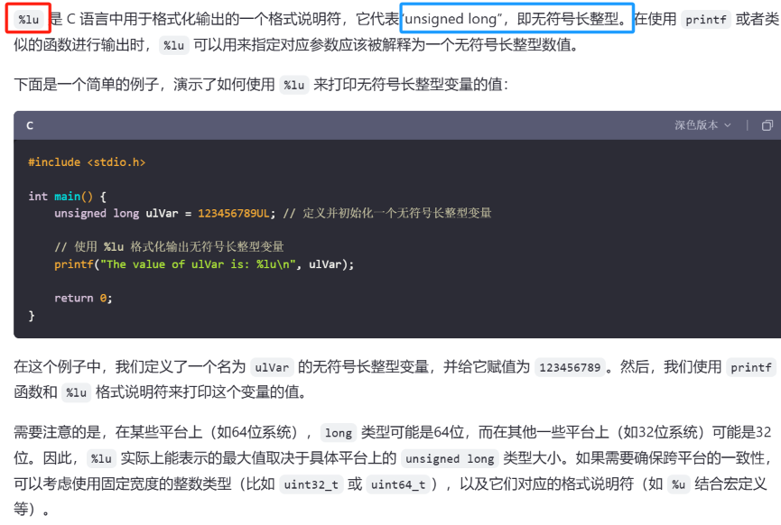

# extern 

<span style="background:#affad1">声明一个外部整型变量 riscv_is_pass，该变量是在另一个源文件中定义的。</span>
```
// 声明一个外部整型变量 riscv_is_pass，该变量是在另一个源文件中定义的。
// 使用 extern 关键字告诉编译器这个变量的存储位置在程序的其他地方，
// 这样可以在不包含其定义的情况下引用该变量。
extern int riscv_is_pass;
```


# printf参数（格式说明符）

- 1 %s后面跟的就是地址，如果这个地址是字符串的，那就显示字符串

[[嵌入式知识学习（通用扩展）（未）/边开发边积累/assets/C语言扩展积累学习/file-20250810171433627.png|Open: Pasted image 20250708205943.png]]

[[嵌入式知识学习（通用扩展）（未）/边开发边积累/assets/C语言扩展积累学习/file-20250810171433815.png|Open: Pasted image 20250708210004.png]]

[[嵌入式知识学习（通用扩展）（未）/边开发边积累/assets/C语言扩展积累学习/file-20250810171433898.png|Open: Pasted image 20250708210019.png]]

[[嵌入式知识学习（通用扩展）（未）/边开发边积累/assets/C语言扩展积累学习/file-20250810171433982.png|Open: Pasted image 20250708210035.png]]



# spintf函数
[[嵌入式知识学习（通用扩展）（未）/边开发边积累/assets/C语言扩展积累学习/file-20250810171434063.png|Open: Pasted image 20250708150128.png]]

[[嵌入式知识学习（通用扩展）（未）/边开发边积累/assets/C语言扩展积累学习/file-20250810171434157.png|Open: Pasted image 20250708150140.png]]


# typedef+结构体
[[嵌入式知识学习（通用扩展）（未）/边开发边积累/assets/C语言扩展积累学习/file-20250810171434238.png|Open: Pasted image 20250708215942.png]]


# .h文件中预处理符号的作用（如果没定义就定义）
[[嵌入式知识学习（通用扩展）（未）/边开发边积累/assets/C语言扩展积累学习/file-20250810171434321.png|Open: Pasted image 20250709200029.png]]


# 结构体指针L->last（箭头操作符）
[[嵌入式知识学习（通用扩展）（未）/边开发边积累/assets/C语言扩展积累学习/file-20250810171434399.png|Open: Pasted image 20250709205330.png]]


# 


# 


