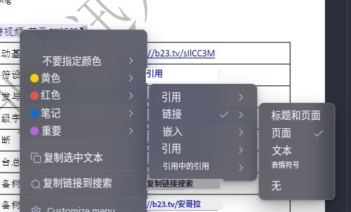
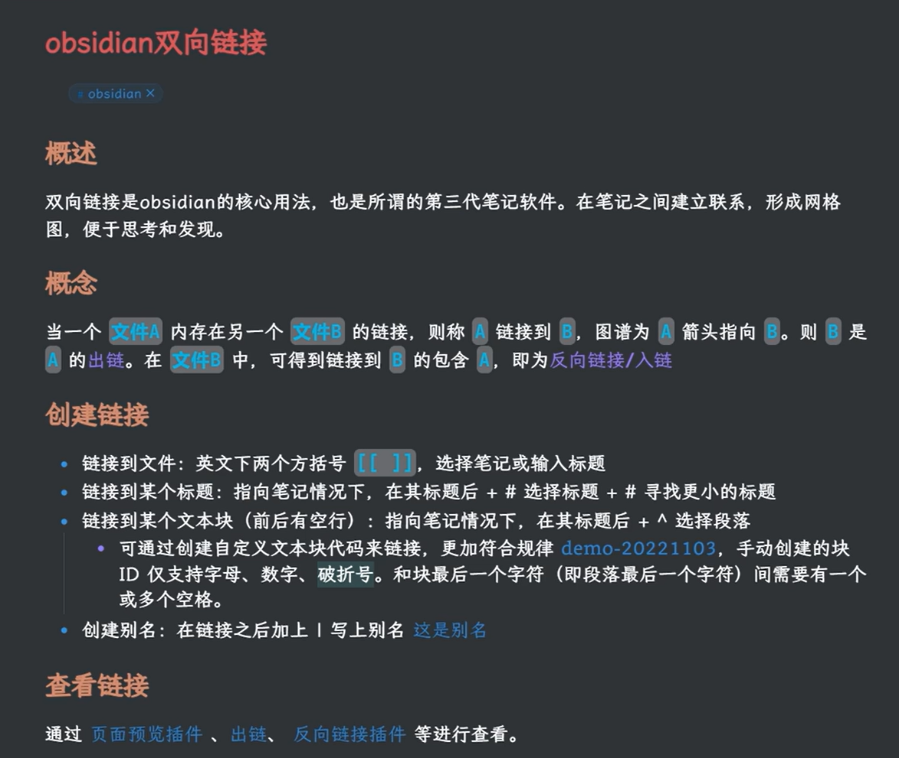
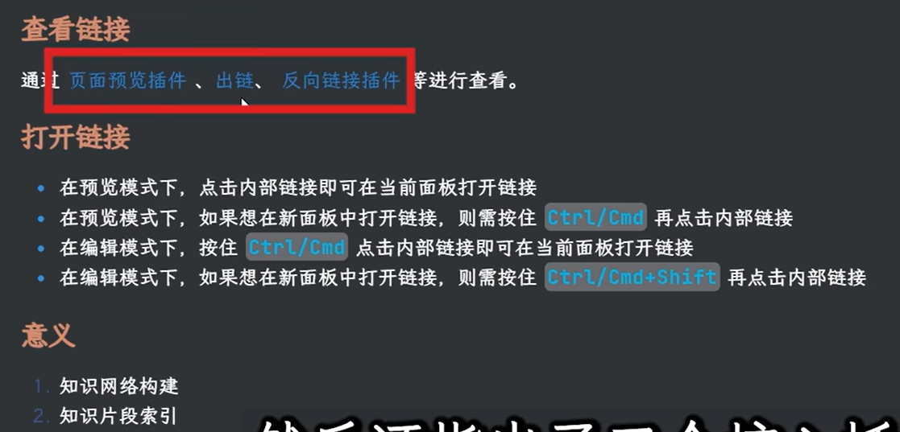
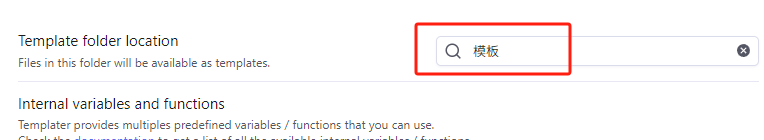
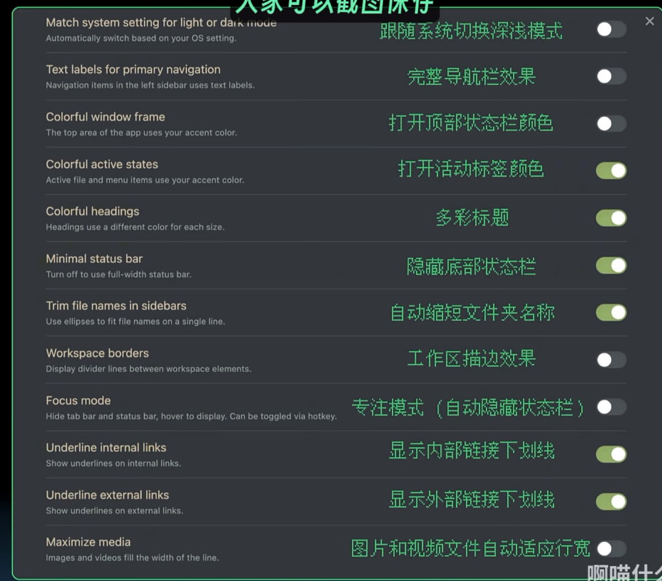
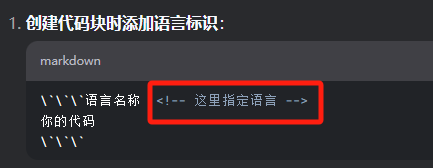
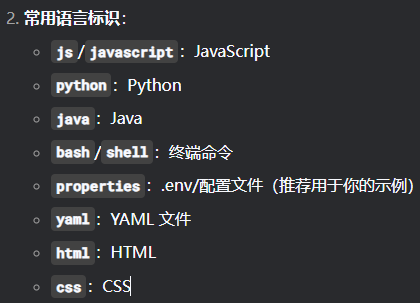

ctrl+o  进入搜索界面 


---  进入笔记属性

ctrl+p 进入命令名板
还是建议大家去掌握了解一下markdown语言

==给你的这个笔记当中去添加一些标题==
那其实很简单
<span style="background:#b1ffff">就是一个井号空格</span>

那两个型号就代表二级标题
三个就代表三级标题
然后的话它最多可以添加到六级标题

[可能是B站最详细的Obsidian Markdown使用保姆级教程_哔哩哔哩_bilibili](https://www.bilibili.com/video/BV1Hj411E7ra/?vd_source=83485b71343f442522d28357f4bb93eb)


- 一个横线加一个空格
	这个其实就可以给你添加一个小点[[ylgjlxfcjldsfjld]]
	- 


```cardlink
url: https://www.bilibili.com/video/BV1FC4y117Yv/?vd_source=83485b71343f442522d28357f4bb93eb
title: "Obsidian白板：笔记新维度，释放创意潜力！后半段很精彩！一定要看，不要叛逆！_哔哩哔哩_bilibili"
description: "本期视频和大家分享了白板插件（canvas）的基本使用方法和一些使用场景，并且和大家展示了我自己是如何使用白板插件在obsidian中进行自下而上的笔记写作。希望本期视频会对大家有所启发，如果视频中有任何错误，或者你有任何疑问都欢迎在评论区进行讨论。本期视频我提到的插件：- 核心插件：白板（Canvas），书签（Bookmark）- 第三方插件：Excalidraw，Projects，Kanban, 视频播放量 29408、弹幕量 179、点赞数 1193、投硬币枚数 980、收藏人数 1563、转发人数 199, 视频作者 Chris就是Chris, 作者简介 Obsidian重度使用者。本频道完全是我笔记输出的产物。，相关视频：用 Obsidian Canvas 实现逐层分解目标管理，Excalidraw增强插件 | 最强大的白板插件 | Obsidian笔记插件 | 比导图更强大，Obsidian 最强思维导图 v3 版本，markmind 增加缩略图和节点形状功能，obsidian不就是个记笔记的软件吗，Obsidian思维导图插件 | 强大的脑图 | 帮你梳理知识体系，Obsidian，一键思维导图，一键Mermaid图，快捷方便，【强强联手】效率翻倍！Obsidian配置DeepSeek指南！，Obsidian | 人生苦短， 插件我用 Components【演示篇】，obsidian之dataview插件教程（全网最简单教程），Obsidian 最强导图插件 Markmind 3.0.6 版本 Rich 模式终于支持了 Obsidian 图谱功能"
host: www.bilibili.com
image: https://i1.hdslb.com/bfs/archive/1bda5fdc1c9c488f2964a98919eb81ba7daaf27d.jpg@100w_100h_1c.png
```


[【强强联手】效率翻倍！Obsidian配置DeepSeek指南！_哔哩哔哩_bilibili](https://www.bilibili.com/video/BV1EbKjeSExS?spm_id_from=333.788.recommend_more_video.14&vd_source=83485b71343f442522d28357f4bb93eb)


[两款 Obsidian 链接增强插件，在笔记中
```cardlink
url: https://utgd.net/article/20630
title: "两款 Obsidian 链接增强插件，在笔记中插入美观的链接卡片"
description: "这两款插件都能够自动从链接中抓取元数据，并分别以卡片和 Markdown 格式展示，让你的笔记看起来更加整洁美观。"
host: utgd.net
favicon: https://cdn.utgd.net/assets/img/untag_favicon.ico
```
插入美观的链接卡片 | #UNTAG](https://utgd.net/article/20630)


> ([[【北京迅为】RK3588驱动指南资料docx.pdf#page=2&selection=13,0,16,3&color=red|【北京迅为】RK3588驱动指南资料docx, p.2]])
> 第十二期_GPIO 子系统

> [!PDF|red] [[【北京迅为】RK3588驱动指南资料docx.pdf#page=2&selection=6,0,9,2&color=red|【北京迅为】RK3588驱动指南资料docx, p.2]]
> > 第十一期_pinctrl 子系
> 
> 


> [!PDF|note] [[【北京迅为】RK3588驱动指南资料docx.pdf#page=2&selection=0,3,2,3&color=note|【北京迅为】RK3588驱动指南资料docx, p.2]]
> 第十期_热插拔


```cardlink
url: https://github.com/xiaokatech/obsidian-notes
title: "GitHub - xiaokatech/obsidian-notes"
description: "Contribute to xiaokatech/obsidian-notes development by creating an account on GitHub."
host: github.com
favicon: https://github.githubassets.com/favicons/favicon.svg
image: https://opengraph.githubassets.com/7d4b3f0295c8c78400ddc9e07440c277ee95b09fad9427ed82d216e4a9a20ebb/xiaokatech/obsidian-notes
```







# clurp
[通过obsidian web clipper打造自己的全语言知识库\_哔哩哔哩\_bilibili](https://www.bilibili.com/video/BV13XNUe8Eqz/?spm_id_from=333.337.search-card.all.click&vd_source=83485b71343f442522d28357f4bb93eb)


# obsidian设置点击链接跳转位置
#### **强制在新标签页打开链接**

<span style="background:#b1ffff">- 按住 `Ctrl/Cmd` 点击链接，会在新标签页打开。</span>
    
- 或通过插件实现自动新标签页跳转（如安装插件 [Linked Pages](https://obsidian.md/plugins?id=linked-data-helper)）。

### **3. 使用插件增强跳转**

以下插件可优化链接跳转体验：

1. **Hover Editor**
    
    - <span style="background:#affad1">悬停预览链接内容，无需跳转页面。</span>
        `按住 Ctrl 悬停在链接上
        
    - 安装后启用悬停功能：鼠标悬停在链接上即可查看内容。
        
2. **Remember Cursor Position**
    
    - 自动记住每个文件的光标位置，返回时还原位置。
        
    - 适合频繁跳转后需要回到原位置的场景。
        
3. **Zoom**
    
    - 通过 `Ctrl/Cmd` 点击内部链接直接进入“聚焦模式”（类似思维导图展开）。


# 在canvas中使用editing toolbar


# obsidian插件Templater——强大的模板插件，文档可自动分类



<span style="background:#affad1">ctrl+P选择对应的模板</span>


```


```


# excalidraw的学习


# outliner

<span style="background:#affad1">ctrl + L  代办事项</span>


# Another Quick Switcher


你现在用什么笔记软件？Obsidian会不会成为你的终生笔记？

20:08

如何安装obsidian，及其插件

14:45

# 一键装修Obsidian，让你的OB比谁都漂亮——好用又美观
[一键装修Obsidian，让你的OB比谁都漂亮——好用又美观\_哔哩哔哩\_bilibili](https://www.bilibili.com/video/BV1oe411T75f?spm_id_from=333.788.videopod.sections&vd_source=83485b71343f442522d28357f4bb93eb)
09:07

obsidian插件jupyter——在OB中写python代码，一键加载运行

05:24

obsidian与简悦联动，网页批注并导入OB，原来这么简单

24:08

obsidian插件annotation——PDF文档直接标注，保存为MD

08:56

obsidian插件Templater——强大的模板插件，文档可自动分类

07:43

obsidian插件Excalibrain——脑图，关系图谱，写小说神器

15:10

obsidian插件mind map——标题和列表均可生成思维导图

07:54

obsidian插件dataview——强大的数据视图插件，以数据库索引呈现

11:10

obsidian插件advanced tables——强大的表格插件

03:25

obsidian插件calendar——快捷创建日记和周记

05:13

Obsidian插件Cmenu——菜单工具，也能像语雀一样用工具栏

04:40

Obsidian插件PicGo——一键上传，自动创建图床

21:19

obsidian插件Remotely Save——实现多平台同步，类似同步云

10:28

obsidian插件weread——微信读书标记笔记自动导入

08:46

obsidian插件excalidraw——强大的自由绘图，以及library

07:12

obsidian插件pandoc——导出各种类型的文档，以word为例

17:56

Obsidian增强编辑插件的安装和使用——一键双链和增加或去除空行

17:22

Obsidian日记的基本使用——随意创建文档，但却井井有条

08:50

怎么打开和使用obsidian关系图谱——文件再乱也没关系

11:33

obsidian的基本设置和使用

15:45

在OB中创建按钮，一键抵达——obsidian插件buttons

06:15

OB内打开网页，与微信读书wolai语雀等联动——Custom Frames

05:54

OB可视化表格，以悬浮形式增加——table enhancer

05:59

OB可视化增加表格，并支持多种类型——Notion-Like Tables

05:29

obsidian与思源笔记联动，实现功能互补

12:26

OB图表插件，一键生成各种图表——obsidian插件charts

06:16

悬浮编辑器，多窗口打开OB文档——OB插件Hover Editor

05:03

Excalidraw一键画折线图，柱状图——obsidian插件Excalidraw

02:45

obsidian强大的搜索，结合块引用，写作从未如此丝滑

15:32

一键发布到WordPress，自建站轻松发布——obsidian插件WordPress

06:33

一键发布到网上，自由分享——obsidian插件obsius

04:57

强大的幻灯片插件，简单设置一键生成——ob插件Advanced Slides

14:00

自动各种补全，智能全文搜索输入——ob插件Various Complements

05:09

全能搜索，OB搜索的补充——obsidian插件Omnisearch

04:19

OB打开bili视频，并用时间戳做笔记——obsidian插件media

10:12

OB同步插件Remotely Save，图床插件picgo——保存到COS

10:19

OB图表插件，及对比各种图表插件——obsidian插件Charts View

08:28

直接OB上安装社区插件市场未上架的插件——插件Obsidian42-BRAT

07:43

OB中直接打开网址，直接浏览网站——obsidian插件Web Browser

05:36

解决OB无法加载社区插件和主题的方法——更改DNS

04:50

Obsidian 插件全集，好用的三十多个插件

07:43:32

在OB中打开文档书籍，并批注和做笔记——obsidian插件booknote

10:29

如何在 obsidian 中增加数学公式？可借助网络编辑器

07:03

被笔记耽误的浏览器？ob访问网页——obsidian插件Web Browser

09:04

自定义字典，自动补全更智能——OB 插件Various Complements

17:24

更快的切换文件，快捷资源管理器——obsidian插件Quick Explorer

03:22

word一样的编辑工具栏——obsidian插件Editing Toolbar

04:19

看板提醒任务提醒，避免错过重要事项——obsidian插件Reminder

08:41

带搜索的大纲，安静的大纲——obsidian插件Quiet Outline

06:29

快捷打开最近文件，找文件更快——obsidian插件Recent Files

03:34

快捷呼出表情，一键输入表情——obsidian插件Emoji Toolbar

02:47

核心搜索助手，内容视图预览——obsidian插件Search Assistant

03:47

视频网页稍后读，复制一键加载到OB——obsidian插件ReadltLater

04:30

OB中创建加密文件，给一段文字加密——Obsidian插件Meld Encrypt

08:44

快速创建备忘录，即时记下灵感——Obsidian插件Memos

03:59

快捷创建流程图表，关系图随意拖——Obsidian插件Diagrams

05:48

比自带更好用，更智能的搜索——Obsidian插件Omnisearch

05:13

生成notion一样的数据库——obsidian插件Database folder

09:42

一键生成文件概述，文件导航——OB插件Folder Note和Waypoint

10:27

Obsidian 插件 Templater 创建模板不成功？还是源代码？

05:10

自动同步 todoist，多端管理任务——obsidian 插件 todoist

08:01

obsidian的jupyter插件，输入中文乱码，解决jupyter中文乱码

02:52

Reminder结合Templater，快捷创建日期任务

12:46

Callout标注的使用，打造更美的笔记——obsidoan主题

11:45

网页联动，网摘一键加到特定笔记中，obsidian插件Local REST API

12:45

文案工作者会失业吗？Open AI写作——Obsidian插件TextGenerator

12:27

ChatGPT到底有多强大？开干，obsidian插件Text Generator的补充

13:13

强大的AI写作和编程，OpenAI的ChatGPT——OB插件GPT-3 Notes

09:48

调取OpenAI请求免费吗？被请求的成本是多少？ChatGPT

13:28

状态栏、侧边栏、下边栏自定义——obsidian 插件 Commander

04:24

快速查询翻译，卡片式学习英语——obsidian插件language learner

06:17

obsidian被忽略的，自带的强大画布canvas，实现视觉笔记

07:27

在OB中一键运行代码，例如python——Obsidian插件Execute Code

03:15

OB插件Remotely Save，用对象存储怎么选？

05:28

在OB中使用番茄时钟，记录创建的笔记Status Bar Pomodoro Timer

02:47

OB浏览器，支持右键搜索，支持书签——obsidian插件surfing

08:35

Open AI+smart connections搭建知识库，将笔记转换为交互式对话

12:24

文字生成图片，designer，delle-2，还是秘塔？测试生成图片

05:49

text generator模板的使用，头脑风暴，标题标签生成，校对内容等

11:21

OB插件Github Publisher，将OB内容同步到github的库中

05:01

Ollama 模型仓库+OB插件Copilot构建本地的大语言模型

05:32

跨平台协作：Obsidian 和 Notion 的完美融合

05:41

OB插件yuhanbo-ai：快速生成、插入或替换内容

07:45

升级Obsidian AI 插件 yuhanbo-ai：多模型支持，一键生成你的创意文本

05:43

OB插件yuhanbo-python：在笔记中直接运行 Python 代码，提升学习工作效率！

04:21

Obsidian插件Excel，在OB中创建表格，使用公式函数


# 主题美化



# [程序员是如何用 Obsidian 记笔记的\_哔哩哔哩\_bilibili](https://www.bilibili.com/video/BV1J19jYRE6E/?spm_id_from=333.337.search-card.all.click&vd_source=83485b71343f442522d28357f4bb93eb)


# [标注 - Obsidian 中文帮助 - Obsidian Publish](https://publish.obsidian.md/help-zh/%E7%BC%96%E8%BE%91%E4%B8%8E%E6%A0%BC%E5%BC%8F%E5%8C%96/%E6%A0%87%E6%B3%A8)


# 移动文件要在obsian中，而不是在文件管理器。不然会丢失链接


# obsidian如何设置代码块有颜色
[[未整理(其他)/assets/学习obsidian/file-20250810171445454.png|Open: Pasted image 20250710113632.png]]

[[未整理(其他)/assets/学习obsidian/file-20250810171445539.png|Open: Pasted image 20250710113643.png]]



# obsidian代码块遇到自定义格式显示特殊颜色。(不行)
[CodeblockCustomizer 插件使用教程-CSDN博客](https://blog.csdn.net/gitblog_01179/article/details/142840714)


# 选中在Clippings内容更完整


