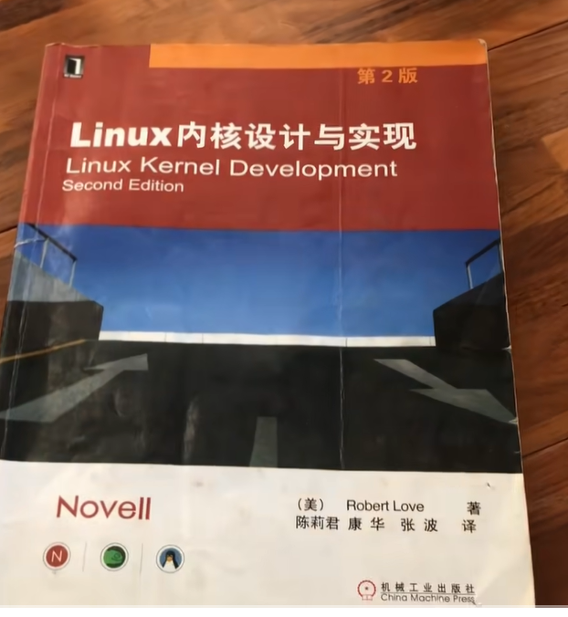
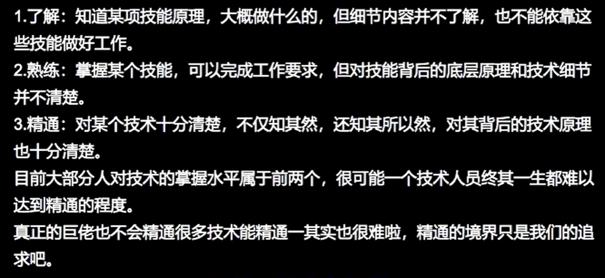

# 备注(声明)：

# 补充：

# 1.linux开源网站（linux内核和linux驱动的开源论坛和开源项目）

- **JustLinux 论坛**  
    综合型社区，支持各类硬件驱动和系统相关技术深度讨论 。
[Newbies Corner](https://forums.justlinux.com/forumdisplay.php?57-Newbies-Corner&s=6d7f3cc4267719789f7468a989c776ae)

# 2.内核驱动书籍
- 1 想深入linux内核驱动，推荐学什么书籍
[[未来规划（实习、英语）/assets/未来规划（技术）/file-20250810171443892.png|Open: Pasted image 20250713165625.png]]

- 2 视频里是第二版，大家记得买最新版啊
- 2 孔夫子旧书网卖10块钱

# 3.
[[未来规划（实习、英语）/assets/未来规划（技术）/file-20250810171443966.png|Open: Pasted image 20250720212105.png]]

# 4.

# 5.迷茫时看的视频（linux方向）
[内核驱动学习 方向千万别走偏了\_哔哩哔哩\_bilibili](https://www.bilibili.com/video/BV1jr4y1b7Bm?spm_id_from=333.788.recommend_more_video.-1&vd_source=83485b71343f442522d28357f4bb93eb)

[学Linux驱动 有什么要求 对应届毕业生\_哔哩哔哩\_bilibili](https://www.bilibili.com/video/BV1iEKMesEnk/?spm_id_from=333.1387.homepage.video_card.click&vd_source=83485b71343f442522d28357f4bb93eb)

# 6.b站up主（linux内核驱动）
[易化AI的个人空间-易化AI个人主页-哔哩哔哩视频](https://space.bilibili.com/293794109?spm_id_from=333.788.upinfo.head.click)

[【搞Linux的旺仔】:资深Linux内核工程师告诉大家正确开发Linux驱动的方式方法！喜欢就点赞并关注吧\_哔哩哔哩\_bilibili](https://www.bilibili.com/video/BV18YoTYXEF5/?spm_id_from=333.337.search-card.all.click&vd_source=83485b71343f442522d28357f4bb93eb)

[宅学部落的个人空间-宅学部落个人主页-哔哩哔哩视频](https://space.bilibili.com/382223675/upload/video)

# 7.现阶段的决定
- 1 收集驱动内核方向必备书集。和开源论坛和开源项目。

- 1 开发rk3568，从迅为的开发文档出发。然后看可以做什么项目

- 1 边开发边看自己欠缺什么记录下来，后面找时间补回来。

# 8、未整理的视频教习

- 1 [比啃书强100倍！为了彻底掌握Linux内核实战，教你从0用汇编和C语言手写个操作系统，从此彻底掌握计算机底层的秘密\_哔哩哔哩\_bilibili](https://www.bilibili.com/video/BV1HTojYaEdM?spm_id_from=333.788.recommend_more_video.19&vd_source=83485b71343f442522d28357f4bb93eb)

